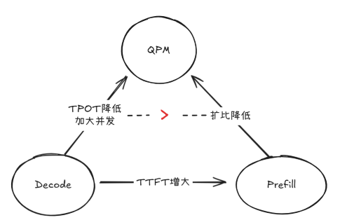
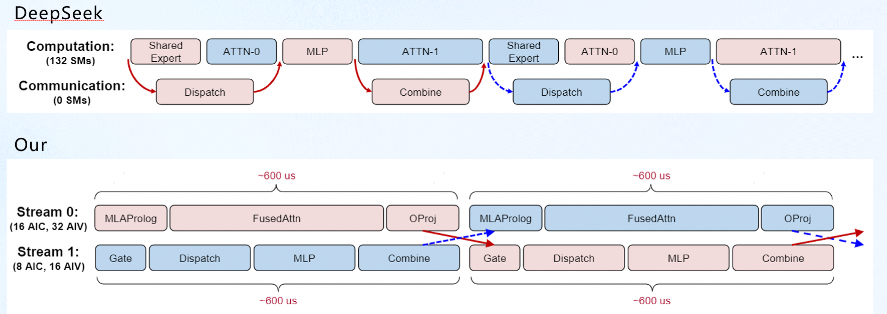
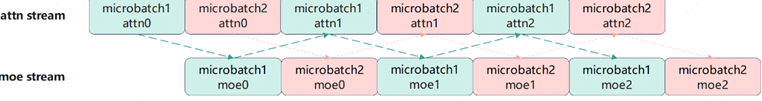
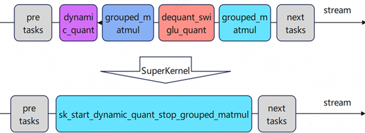
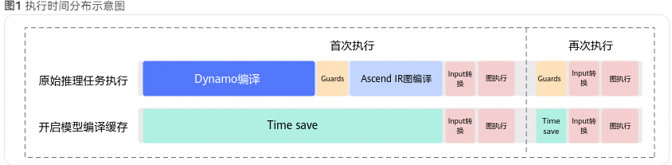

# 基于Atlas 900 A3 SuperPoD推理部署Deepseek-R1性能优化实践

### 一．背景介绍

本次实践以DeepSeek-R1模型在Atlas 900 A3 SuperPoD的高吞吐推理为目标，以"TTFT＜2s、TPOT＜50ms"为核心SLA约束，通过Omni-Infer框架优化特性为牵引，协同CANN全栈优化完成多层级迭代，在3000条数据集(最大输入16k，平均输入3.5k;最大输出32k，平均输出1.2k)、11节点（7P8-1D32）集群环境中，达成608QPM高吞吐，充分验证了上层套件Omni-Infer与底层软件CANN协同优化的突出效果。

### 二．Omni-Infer 套件侧优化

#### **2.1 MoE专家负载均衡(OmniPlacement)+稀疏注意力加速(OmniAttn)**

Omni-Infer是一套专为昇腾硬件平台定制的强大推理加速套件，完全兼容业界目前主流的开源大模型推理框架（比如vLLM等），旨在提供高性能、企业级推理能力。

在大规模LLM推理中，稀疏计算引入了独特的性能瓶颈：不均匀的专家激活导致MoE模型中严重的负载不平衡，而密集的注意力会导致过多的KV缓存和计算开销。为了解决这些问题，Omni-Infer集成了两个互补的加速模块------用于自适应专家调度的OmniPlacement和用于注意力稀疏化的OmniAttn，共同提升吞吐量和延迟。

(1)OmniPlacement利用专家冗余和轻量级调度机制，快速适应波动的工作负载模式。保持专家利用率的持续平衡，从而显著提升MoE的推理性能。涉及的核心机制如下：

- 静态初始布局：基于历史激活数据计算负载矩阵，通过堆排序贪心策略分配专家副本，最小化负载不均衡比；
- 动态调整：实时监控专家激活（滑动窗口平均过滤噪声），预测未来工作负载，触发非阻塞式权重迁移；
- 层级冗余部署：不均衡程度高的层分配更多冗余专家，平衡内存开销与负载均衡。

(2)OmniAttn是一种KV缓存压缩算法，它采用基于进化算法的快速模式搜索方法在不显著影响生成质量的前提下，有原则地减少KV缓存大小和注意力计算成本。其主要核心机制如下：

- 层级压缩：以 Transformer 层为最小压缩单元，避免张量并行（TP）下的同步延迟；
- 模式搜索：采用进化算法（遗传算法）发现最优压缩模式，以仅推理的成本高效且全面地探索配置空间

#### **2.2 OmniProxy**

OmniProxy是一个全局的、具有解聚感知能力的调度层，它利用性能预测、推理周期性以及自动前缀缓存（APC）感知的缓存协调，在动态工作负载下联合优化预填充和解码阶段。

核心机制：
 ①统一请求生命周期（8 个阶段：分词、APC 匹配、预填充等待 / 调度 / 运行、解码等待 / 调度 / 运行）；
 ②实时指标收集：请求级（提示长度、前缀匹配分数等）和实例级（队列长度、吞吐量等）指标；
 ③延迟提交与重排序：结合上游批处理周期，优化请求分组和负载均衡；
 ④Omni自适应调度（OAS）算法：预填充侧采用缓存感知负载均衡调度，解码侧采用最长处理时间优先（LPT）调度。

#### **2.3 调整Decode与Prefill的平衡**

要提升整体吞吐量，主要是两大核心：(1)持续降低TPOT(decode阶段优化)；(2)增大并发。

但是TPOT越低，并发越高，也会导致Prefill压力增大，此时需要增加Prefill节点或者提升Prefill的并发与调度能力。三者关系如下图：

在5P1D的配比下QPM可以达到517，根据4P1D到5P1D的QPM提升量来看，将配比调整到6P1D即可实现600 QPM的目标。

| xPyD | 并发数 | BatchSize/Die | QPM |
| --- | --- | --- | --- |
| 4P8-1D32 | 1536 | 24 | 411 |
| 5P8-1D32 | 2048 | 32 | 517 |
| 6P8-1D32 | 3072 | 48 | 613.2 |

实际测试中6P1D的配比下QPM虽然达到了613.2，但是TTFT耗时仍然较高达到了5s，因此需要进一步增加P节点数量增大Prefill 并发降低 TTFT 延迟。最终调整配比将当前的6P1D扩展为7P1D，并增大并发数为3168，TTFT显著降低达到了1.93s。由于扩展为7P1D，导致Decode需要降低TPOT，弥补扩比造成的QPM平摊。因此针对Decode侧，主要使用CANN底层优化，将TPOT从50ms降低到47ms。

### **三. CANN 底层优化**

#### **3.1 Micro-Batch双流水线优化**

在LLM推理的Prefill阶段，计算任务密集，通信开销也较为显著。由于计算与通信由不同硬件单元处理，若能实现两者的并行执行，可显著提升该阶段性能。理想情况下，通信耗时能被完全掩盖，从而大幅提高计算效率。
 为此，一种优化策略是将输入序列划分为两个microbatch，并设计双流水线机制。通过定制流水线调度，使计算与通信操作重叠，以充分释放Prefill阶段的性能潜力。

原生DeepSeek的Micro-Batch是通过ROCE并行方式，几乎不占用SM核，在通信和计算算子重叠时，对算子性能基本没有影响。而在昇腾由于通信所用的dispatch/combine算子会使用大量AICore，硬件资源占用高，对其它流有较大干扰，导致重叠处的算子性能明显下降。此外，将单batch切成两个microbatch后，所有的矩阵乘都会拆成两次进行计算，访存量会翻倍，导致算子计算时延也会上涨。因此通过对流进行分核，以解决两个流间核竞争的问题。主要考虑两种分核策略：（1）长序列：考虑到attn侧计算量大，attn流按16:32的比例分AIC核与AIV核，MoE则使用8:16的比例分核（2）短序列：由于attn算子时延明显下降，故将attn流分到的核数降为了一半，以平衡attn和MoE的计算时延。

例如当某个请求，在进入moe层后，将输入batch分为两个microbatch，然后在主流上开始microbatch1的attn0计算，此时未进行分核。在计算完microbatch1的attn0后，创建一个新的流进行moe计算，并对主流和MoE流进行分核操作。此时同一个microbatch的算子则会在两条流上交替执行，达到计算和通信相互掩盖的效果。当microbatch2的最后一个moe计算完成后，此时将两个microbatch的结果concat到一起，后续流程就与正常流程完全相同了。

#### **3.2 SuperKernel**

SuperKernel主要是根据计算图，利用JIT的编译能力，将标记范围内算子的Kernel代码重新编译为新的算子，如下所示：

它与在源代码层级进行融合的传统方法不同，该技术专注于内核调度层面的二进制代码优化。其核心思想是将多个已编译的内核函数，集成为一个单一的"超级内核"函数（简称SuperKernel），通过内部调用子函数的方式，串行执行原有的多个算子，从而实现优化计算流程、提升执行效率与硬件资源利用率的目标。
 相较于逐个下发独立算子的模式，SuperKernel能够有效减少两个Task任务之间的调度开销；且在每个Task任务结束后执行Cache Flush，将所有修改的Cache内容刷新，节省一定的栈空间；优化算子调度后的核启动时间。

当前已经支持将DeepSeek-R1模型61层网络中的58层融合为1个SuperKernel算子，整网收益平均10~20%左右。

#### **3.3 TorchAir图缓存策略**

torch.compile是一种即时编译器（Just-In-Time compiler），其成图的首次编译时间通常较长，而大模型推理场景对时延敏感，因此有必要优化首次编译时长。在推理服务、弹性扩容等业务场景，使用编译缓存可有效缩短服务启动后首次推理时延。
 成图编译通常包括两段耗时，一段是Dynamo的编译耗时，一段是Ascend IR计算图的编译耗时。TorchAir提供了一种模型编译缓存方案（通过[cache_compile](https://www.hiascend.com/document/detail/zh/Pytorch/710/modthirdparty/torchairuseguide/torchair_00081.html)接口），可将首次编译结果落盘，以加速torch.compile图模式的启动时间。实践中对于Decode阶段采用缓存编译方式，将TPOT提升2ms左右。

### **总结：Omni-Infer与CANN协同优化价值及开源成果**

本次DeepSeek-R1模型在Atlas 900 A3 SuperPoD的性能突破实践，核心是构建了"Omni-Infer框架主导+CANN全栈支撑"的协同优化体系，精准解决了大规模集群推理中的通信瓶颈、调度不均、启动时延高、计算冗余等痛点，最终达到608QPM的突出成果。实践充分验证了Omni-Infer套件对于大模型调度的管理能力以及CANN作为底层软件栈对于大模型推理的优化能力，形成了一套高效的Ascend平台大模型推理优化方案。

当前算子代码都已在CANN社区开源：[https://gitcode.com/cann](https://gitcode.com/cann)

Omni-Infer代码已开源：[https://gitee.com/omniai/omniinfer](https://gitee.com/omniai/omniinfer)

TorchAir代码已开源：[https://gitcode.com/Ascend/torchair](https://gitcode.com/Ascend/torchair)
