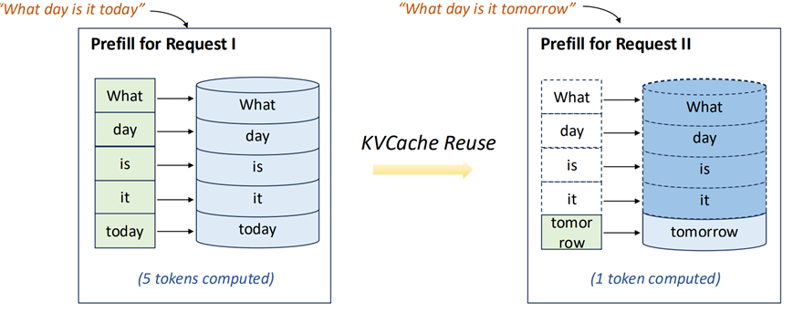
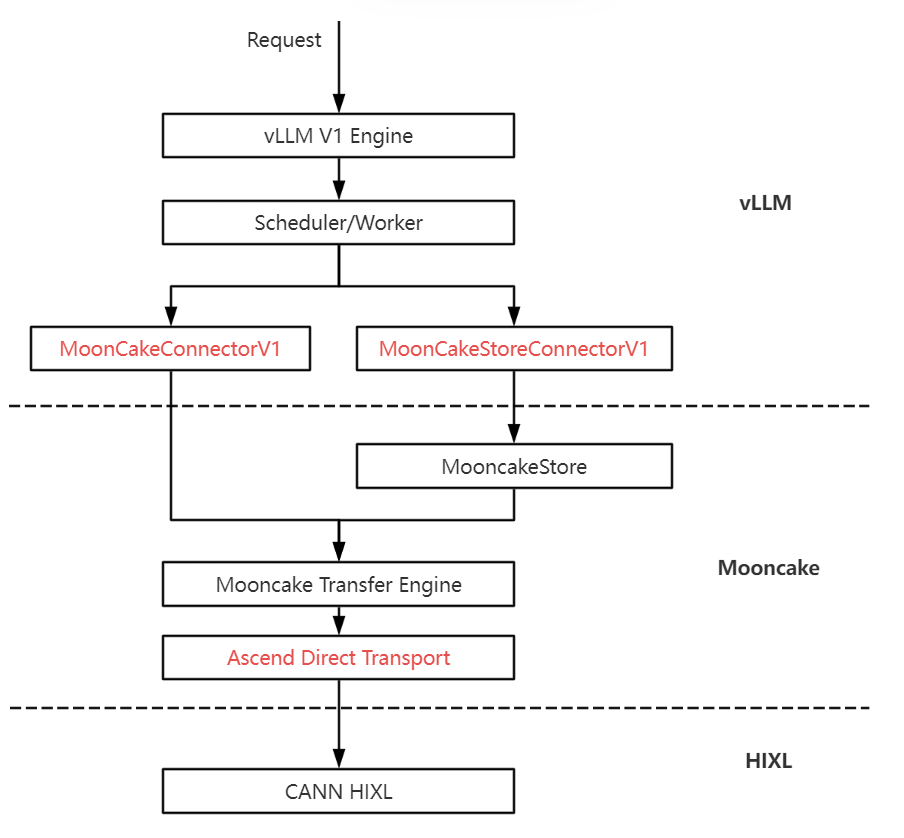

# HIXL、Mooncake与vLLM的KV Cache池化与传输

### 背景

Prefix Caching是大语言模型（LLM）推理中的一项重要功能，不同Request复用Prompt公共前缀，减少Prefill所需计算Token数，减少TTFT（Time To First Token）耗时。在长序列、长System Prompt、多轮对话、垂直领域业务等场景下，收益显著。提高Prefix Cache命中率成为集群推理收益关键点。

然而，仅依靠单个设备上的高带宽内存存储 KV Cache，其缓存空间受限。于是，业内提出KV Cache 池化方案：通过整合高带宽内存、DRAM（动态随机存取内存）、SSD等多种存储介质，构建 KV Cache存储池，同时让请求的前缀在所有节点间共享可见，从而提升所有请求的缓存命中率。

   在大集群推理场景下，通过KV Cache池化来提高Prefix Cache命中率，是减少大模型推理成本的一个关键点。池化的有效性依赖于高性能传输，因此，也必须要确保KV Cache的高性能传输（H2H以及D2D），保证满足传输时延小于计算时延。

   昇腾CANN 的全面开源开放为亲和昇腾硬件的 KV Cache 池化与传输方案落地提供了有力的支持，通过开源CANN  HIXL（昇腾单边通信组件），开发者获得了PD 分离传输中KV Cache在Prefill节点和Decode节点快速传输的关键能力，结合Mooncake和vLLM的框架能力，快速实现了大集群推理场景下KV Cache池化与高性能传输方案。

### 整体方案

HIXL（ Huawei Xfer Library ）是CANN通信库中提供点对点数据传输能力的单边通信库，面向集群场景提供简易、可靠、高效的点对点数据传输。依托Mooncake开源组件Transfer Engine（传输引擎）和Mooncake Store（存储组件）为大模型推理引擎vLLM提供亲和昇腾的高效KV Cache传输与池化存储能力，优化推理性能。

- vLLM 对接 Mooncake，实现缓存共享与传输
  在 vLLM 的 V1 Engine 中，通过新增两种 Connector 原生接入 Mooncake：
  MooncakeConnectorV1
  ：低延迟传输场景下，通过MooncakeConnectorV1组件直接调用Mooncake TransferEngine接口，将推理过程中生成的KV Cache通过P2P通道实时传输，减少中间转发开销。
  MooncakeStoreConnectorV1
  ：KV Cache池化复用场景下，通过MooncakeStoreConnectorV1组件对接Mooncake Store，配置KV Cache池化策略，将非实时复用的KV数据写入Store进行集中管理，实现跨节点缓存共享。
- Mooncake 传输引擎集成 HIXL，提升传输效率
  Mooncake Transfer Engine 基于 HIXL 封装出亲和昇腾NPU的Ascend Direct Transport 后端，让用户只需指定目标节点与内存信息，即可自动完成建链、内存注册等底层操作，实现设备内存之间的高效数据传输，解决 Mooncake 默认主机内存传输的性能瓶颈，通过中转传输模式，实现设备内存间的高效数据流转。(参考https://github.com/kvcache-ai/Mooncake/pull/740)
- 优化存储接口，适配昇腾高吞吐特性
  为 Mooncake Store 新增了 batch_put_from_multi_buffers 与 batch_get_into_multi_buffers 接口，优化 Mooncake 的传输调度逻辑，将多次小数据操作合并为批量任务，更契合昇腾硬件的高吞吐特性，从而提升整体调度效率。(参考https://github.com/kvcache-ai/Mooncake/pull/929)

### 总结

HIXL秉持极简易用的设计原则，具备高度可集成性，并积极融入主流生态社区。此次 HIXL 顺利与 Mooncake、vLLM 实现集成，正是 CANN 开源价值的具体体现：开源发布后，借助社区的力量，对接业界常用的KV池化和传输库Mooncake，进一步打通了 vLLM + Mooncake + HIXL 的技术链路，使该方案成为 Ascend 上池化方案的首选。并以此为依托，和用户完成联创将大模型推理的 TTFT 提升了 40%。

   此外，HIXL 也为 Mooncake 社区贡献了昇腾硬件后端 Ascend Direct Transport，为 vLLM-Ascend 生态贡献了 Mooncake Connector，形成了开发者、开源社区与CANN生态之间的良性互动。同时CANN的最新特性可以通过开源社区第一时间获取并自由改造也为本次方案的快速打通提供了有力的支撑。

   我们期待，随着昇腾 CANN 开源组件的持续完善，更多开发者能够在此基础上，自由探索并构建出服务于千行百业的 AI 应用。

**HIXL开源仓库链接：https://gitcode.com/cann/hixl**
