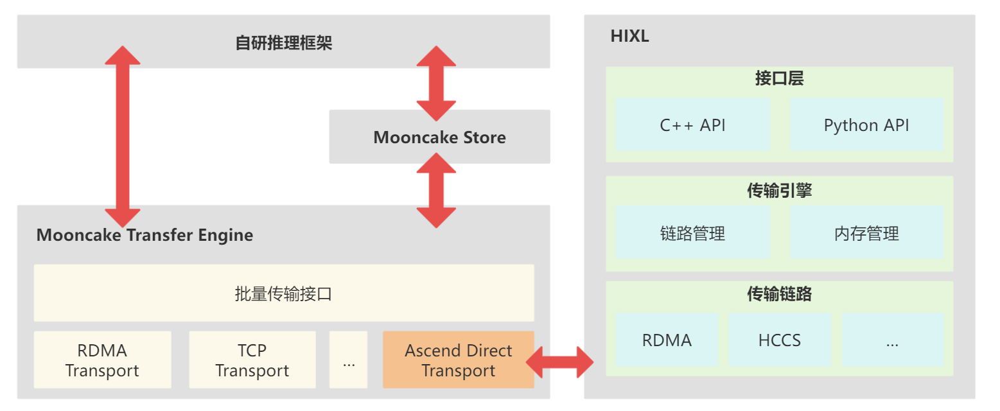

# HIXL在RL推理中的长尾时延优化

昇腾CANN的全面开源开放，正为开发者构建起更开放、更灵活的AI原生开发生态。作为昇腾CANN核心组件之一的单边通信库HIXL，现已正式加入开源阵营，凭借其解耦化设计与高效传输能力，让开发者能够自主快速构建大模型PD分离、RL后训练参数切换、模型参数缓存等多样化业务场景，为AI技术在实际业务中的应用提供底层支持。

#### HIXL在RL推理场景中的实践：实现自研PD分离方案与集群效率提升

在AI技术深度落地的当下，强化学习RL作为关键技术方向，正被越来越多企业应用于实际业务中。某客户在自研的强化学习任务中，将业务流程明确划分为训练与推理两部分。在推理阶段，遇到了典型的长尾问题------这种负载不均衡不仅导致推理效率降低，更造成了千卡集群中部分算力的浪费。

为解决这一问题，该客户基于昇腾CANN开源生态，构建了一套贴合自身需求的解决方案：通过自研推理框架对接Mooncake，再结合HIXL完成数据传输，实现推理阶段的自研PD分离方案部署。在这一架构中，HIXL负责KV Cache池化后的底层数据传输。HIXL在单边通信场景中的高效性能，保障了KV Cache数据在分布式节点间的快速流转，从而缓解长尾问题带来的算力浪费，提升千卡集群资源利用率，优化了RL推理环节的执行效率。
 

- **Mooncake Store**（主流分布式KV缓存存储引擎）：将可复用的KV缓存存储在推理集群的不同位置，提供KV缓存管理能力。
- **Mooncake Transfer Engine**（高性能数据传输引擎）：兼容多种通信后端，通过Ascend Direct Transport对接HIXL。
- **HIXL**（昇腾开源单边通信组件）：提供高性能、零拷贝的点对点数据传输能力，提供PD分离场景KV缓存在Prefill节点和Decode节点间相互传输的底层能力。

#### 开源开放核心价值：从依赖发布到自主迭代

在昇腾CANN未开源之前，开发者在使用相关组件时，一旦遇到新的业务需求或使用中的问题，只能等待新版本发布，而这个周期通常比较长，可能影响项目进度。HIXL全面开源后，这一局面得到改变：

- 问题修复闭环效率提升：开发者可通过开源社区快速定位并修复问题，无需长期等待官方更新；
- 定制化开发更灵活：针对特定业务场景，开发者能够基于开源代码自主优化，加速功能落地；
- 社区共建逐渐形成：开发者可以将业务实践中积累的优化方案贡献至开源社区，推动组件功能更贴近真实应用需求。

#### 持续开源：与开发者共同构建更实用的AI基础软件生态

HIXL的开源开放反映了昇腾CANN在推进底层软件开放上的持续投入。开放代码不仅降低了使用门槛，也让开发者能更深入地参与到工具链的优化中。未来，CANN将继续推进核心组件的开源，通过HIXL这类高可适配的组件，为开发者提供自主构建和优化的基础，共同推进AI技术在实际业务中的高效落地。

#### **更多学习资源**

HIXL社区：
 [https://gitcode.com/cann/hixl](https://gitcode.com/cann/hixl)

HIXL 适配Mooncake对接示例：

[https://gitcode.com/cann/hixl/blob/master/examples/third_parties/mooncake_store/python/README.md](https://gitcode.com/cann/hixl/blob/master/examples/third_parties/mooncake_store/python/README.md)

Mooncake社区：

[https://github.com/kvcache-ai/mooncake](https://github.com/kvcache-ai/mooncake)
