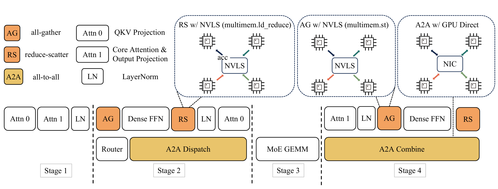
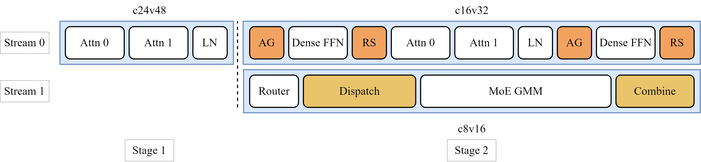
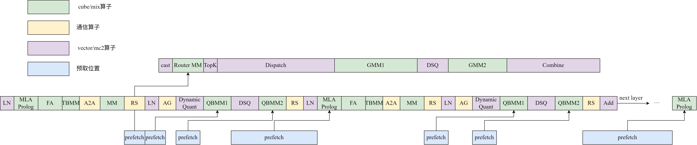

# 基于Atlas 900 A3 SuperPoD的LongCat-Flash模型推理性能优化实践

### 背景介绍

LongCat-Flash是一款功能强大且高效的混合专家（MoE）架构开源大模型，具有560B参数量。LongCat-Flash模型采用了两项创新设计：

 （1）**零计算专家机制（Zero-computation Experts）**，支持动态分配计算资源，可根据上下文需求为每个词元激活18.6B~31.3B参数（平均27B参数），实现资源优化利用。
 
 （2）**快捷连接混合专家机制（Shortcut-connected MoE）**，扩大计算与通信的重叠窗口，将MoE通信时间与计算相互掩盖，使得模型相较于其他同规模模型，在推理效率和吞吐量方面表现出显著优势。
 
 LongCat-Flash在当前主流大模型中表现出极强的竞争力，尤其在智能体任务中优势突出。此次模型在昇腾完成推理适配并对性能深度优化，TPOT（Time Per Output Token，首Token后的输出Token平均延时）达到10ms，表现优异。本文将分享LongCat-Flash模型的关键优化措施，这些优化措施显著提升了模型的推理性能。

### 模型关键优化措施介绍

#### 优化措施一：昇腾多流并发和CV控核

在昇腾设备的大模型推理场景下，对于一些可并行的场景，可以**划分多个stream做并行计算**，多个stream上的计算形成overlap，从而降低整体计算耗时。多流场景下，会出现所有核（Core）都被一条流占用的情况，导致算子执行并行度降低，因此需要**把核分给不同的流用**，从而保证算子并行执行收益。
 LongCat-Flash模型原始方案中采用了单批次重叠（Single-Batch Overlap，SBO）的流水线架构，使用了四阶段的流水线策略：
 

在昇腾设备的适配实践中发现通过多流并发和CV控核可以进一步提升并行计算效率，具体方案如下：

将第二段attention和FFN专家提前执行，并通过控制多流上的ai core和vector core核数，使得双流的计算时间接近，无明显拖尾，提升了性能。其中stage1不做控核，默认占用全部的ai core和vector core核数，stage2里的stream0采用c16v32控核方案，stream1采用c8v16方案。
 

#### 优化措施二：SuperKernel

SuperKernel是一种算子二进制融合技术，它聚焦于内核函数（Kernel）的二进制调度方案优化，在已编译的二进制代码基础上融合创建一个超级Kernel函数（简称SuperKernel），以调用子函数的方式调用多个其它内核函数，达到优化计算任务、提升性能和资源利用率目的。相对于单算子下发，SuperKernel技术可以优化任务调度的等待时间和调度开销，同时利用task间隙资源进一步优化算子头开销。
 通过使能SuperKernel特性，可以提升LongCat-Flash模型的整网性能。由于在不同流上采取了不同的分核策略，按照分核、分流的范围标定各SuperKernel scope的范围即可。下图为针对Longcat-Flash模型标定的SuperKernel范围：

#### 优化措施三：权重预取

昇腾npu_prefetch接口提供网络weight预取功能，在算子计算的同时，利用空闲的带宽，提前将一些访存bound算子的权重搬运到L2 Cache中，提升算子性能。
 通过使能权重预取功能，对QuantBatchMatmul（QBMM）、MLA_Prolog、Router Matmul进行权重预取，并提前预取QBMM算子的权重，为访存密集的算子如MLA_Prolog提供了更大的预取空间，可以大幅提升LongCat-Flash模型中的算子性能。预取流程如下：
 

#### 优化措施四：MTP

Multi-Token Prediction（MTP）机制通过增加MTP Module的方式允许在一次主模型推理过程中同时输出多个Token，与输出单个Token相比数据搬运量相似，但进行了更多的计算，充分地利用了芯片的算力，提升模型的等效时延和吞吐。
 基于LongCat-Flash模型开源的MTP1方案（增加1个MTP Module），昇腾平台上进一步支持了MTP2（增加2个MTP Module）。在低时延场景下，使能MTP2额外增加1个MTP Module可以在保持单步推理时延增长较少的同时预期输出更多的token，达到更高的算力利用率，获取更佳的端到端性能。

#### 优化措施五：静态图编译和缓存

模型推理时存在静态图和动态图的概念。静态图需要在模型推理前对整个模型网络进行编译优化，得到完整的计算图，之后再整图下发推理。动态图则是在推理过程中动态构建计算图，支持动态的输入形状和计算图结构。二者相比之下，静态图可以在推理时获得更好的推理性能，动态图则是更加灵活，并且省去了编译的耗时。
 通过使能静态图的推理方案，可以优化LongCat-Flash模型中算子Host侧的Tiling计算以及调度时间，使整网推理性能得以提升。同时为了降低编译阶段的耗时，使用了编译缓存的技术，将编译出的静态图存储到磁盘上，达到了程序只需编译一次静态图便可以反复加载利用的效果，同时可以优化图启动的开销，加速端到端性能。

### 总结

除了上述介绍的关键措施外，在昇腾平台上还采用了一些其他的手段例如融合算子替换、cos&sin优化、kv_cache固定大小等优化LongCat-Flash模型，所有代码都已开源在CANN社区，大家可以访问[[https://gitcode.com/cann/cann-recipes-infer/tree/master/docs/models/longcat-flash/longcat_flash_optimization.md](https://gitcode.com/cann/cann-recipes-infer/tree/master/docs/models/longcat-flash/longcat_flash_optimization.md)]查看完整的优化流程和代码。同时此次方案采用的优化措施中SuperKernel和多流并发控核是CANN新推出的功能特性，大家在使用过程中如果发现了问题或者有优化建议也可以反馈到社区中帮助CANN改进，促进生态的良好循环。
 LongCat-Flash模型在昇腾平台的开源适配取得了TPOT 10ms的优异性能表现，带来了商业上的实际收益。同时受益于开源，开发者们都可以了解详细的模型适配优化过程，将相关经验运用在其他MoE大模型应用中，为社区提供了优秀的MoE大模型优化实践样例。
