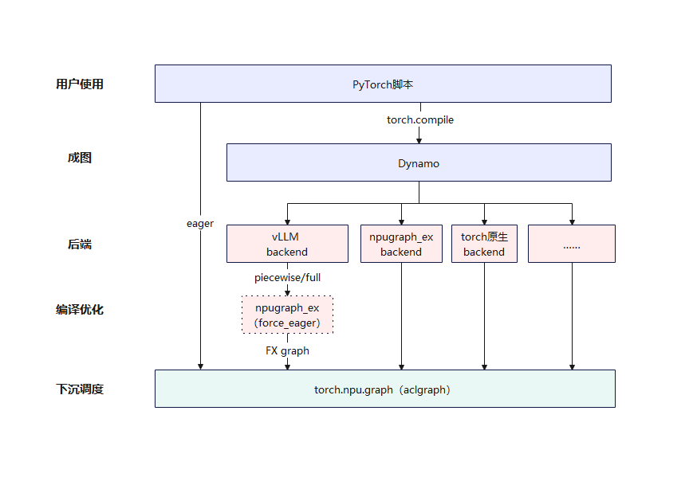
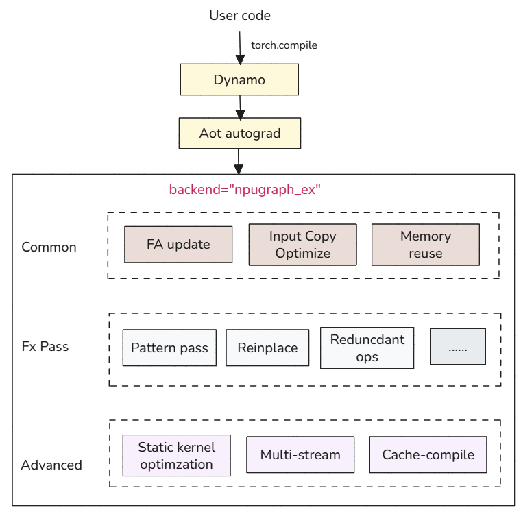
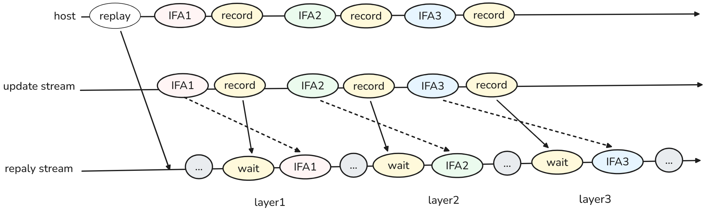
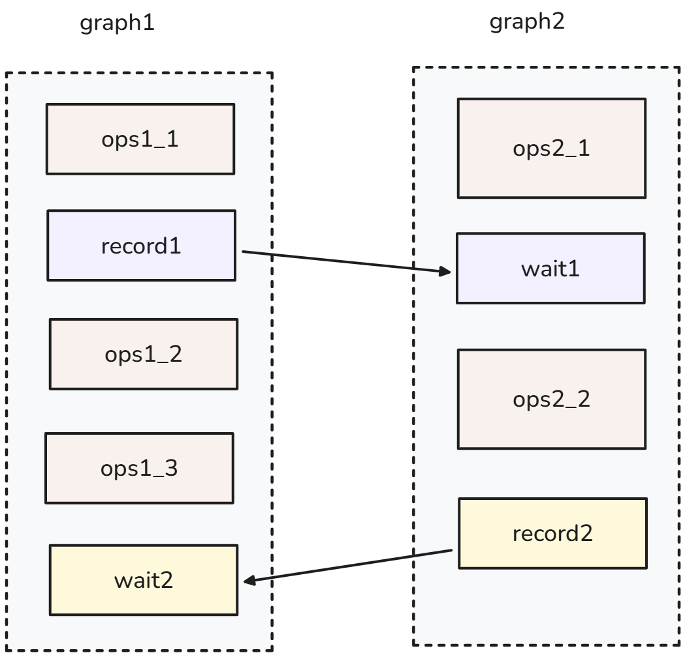

# CANN npugraph_ex图模式优化

**前言：**

随着人工智能的飞速发展，大模型推理场景的“低时延，高吞吐”诉求推动了PyTorch图模式的快速发展。torch.compile是PyTorch 2.0推出的核心特性，通过即时编译（JIT）将PyTorch代码转换为计算图，支持inductor等多种后端编译器，并利用图捕获和重放能力减少Host下发头开销，以优化大模型推理时延。为此CANN提供了具备图捕获和重放能力的aclGraph技术，并基于torch.compile提供高性能的图后端npugraph_ex，融合了aclGraph的调度能力和亲和NPU的图优化能力，以满足大模型推理场景下的性能加速需求。

**HighLights：**

* 快速接入：CANN提供aclGraph，有效的消除了算子调度时延，并已经集成在PyTorch中，可快速使能；
* 高性能：在复用原有aclGraph调度能力前提下，借助于PyTorch的FX图，进一步叠加NPU亲和的优化；
* 可集成：面向大模型推理的服务化框架，可以做到快速集成，无缝对接到vLLM/SGLang等服务化框架中。

### **1. 快速接入：基于aclGraph的调度加速能力**

aclGraph是CANN推出的一种基于图下发的优化机制，核心目标是降低任务提交的开销。aclGraph提供了图捕获及重放能力的C接口，为方便用户使用，在Pytorch层也封装了对等的接口（torch.npu.graph），开发者可以使用相关的接口平滑的迁移到NPU上，极大简化了使用成本，将现有PyTorch中的使用代码仅改造接口调用部分的代码，即可享受NPU加速带来的性能提升。这种开箱即用的设计，大大减少了开发难度和时间成本。
***使用示例*** ：

```python
  # capture
  g = torch.npu.NPUGraph()
  with torch.npu.graph(g, stream=s):
      static_output = model(static_input)

  # ...data preparation...

  # replay
  g.replay()
```

***aclGraph的接口文档：*** <https://www.hiascend.com/document/detail/zh/CANNCommunityEdition/850alpha001/appdevg/acldevg/aclcppdevg_000519.html>

aclGraph所取得的收益来自于调度层收益，基于此前CANN图模式在NPU优化上的经验积累，面向PyTorch框架下的大模型训推场景，提供了轻量化、高性能、可集成的PyTorch FX图优化器***npugraph_ex***。

### **2.** **高性能：NPU图优化样板间--npugraph_ex**

在不增加开发者使用成本的前提下，基于aclGraph，为了更充分的发挥NPU的图模式性能，以torch.compile为入口，我们提供了基于FX图的NPU优化组件npugraph_ex，我们将其定位为一个基于CANN的图模式样板间，并开源了相关代码（https://gitcode.com/Ascend/torchair ），以方便开发者复用或者参考构建自己的图优化器，整体逻辑架构如下图所示：


在保持开发者行为一致的前提下，npugraph_ex通过多项创新优化，充分利用CANN的能力，挖掘了NPU潜能，构建了其在图计算方面独特的优势。


</br>

整体优化内容分为三个层次：

* Common类：主要是能力增强相关优化，内存复用，FA刷新，输入copy优化等；
* 融合pass类：基于图算子的一些融合优化，部分复用inductor的基础pass能力；
* NPU高阶优化：面向性能的NPU特有优化，静态化Kernel、多流等；

相关优化特性介绍如下：

**2.1** **Common类：Host tilling参数刷新**

aclGraph支持在Replay前刷新内核（kernels）的功能，能够在类FIA算子执行前，根据实际计算出的actual_seq_len值动态更新分块（tiling）结果，从而确保此类算子能够被aclGraph成功捕获并消除tiling计算所带来的调度间隙。
如下图所示，主要通过以下两个阶段实现：

1. Capture阶段：通过update接口，在capture阶段记录需要更新参数的算子，并插入event wait，控制更新时的时序；
2. Replay阶段：replay接口调用后，下发需要更新参数的算子，并插入event record，保证参数更新后，算子执行。




**2.2** **Common类：内存复用**
nupgraph_ex采用静态下沉执行模式，在图捕获（capture）阶段固化图相关的内存地址，因此，当存在多个 aclGraph实例时，将导致多份独立的内存分配，造成资源浪费。为解决多图场景下的内存重复占用问题，我们提供了内存复用能力，帮助用户在多个 aclGraph之间高效共享内存资源，显著降低整体内存开销。
npugraph_ex提供了2种内存复用机制：

* 单张FX图之间共享内存池的内存复用：默认开启，一般是在dynamic为True时产生效果，每次出现新的shape就会触发一次新的aclGraph的捕获，同一张动态的FX图捕获的多张aclGraph之间可进行内存复用；
* 由于动态shape变化产生多张FX图——capture多张aclGraph场景的内存池复用：默认关闭，需要用户在确认无内存踩踏的情况下开启。通过为不同的FX图之间指定相同的内存池达成内存复用，一般在dynamic=False时使用。

**2.3** **FX pass 优化**
npugraph_ex内置了多种常用的优化Pass，如**pattern pass**、**冗余算子消除**、**reinplace优化**和**自定义pass**等。通过这些优化能有效减少计算图中的冗余计算，降低内存占用，提高计算吞吐量。

* **pattern pass**：开发者可以自定义算子替换规则，使用融合算子替换FX图中多个算子，有效减少部分场景下不必要的下发开销，提高模型执行效率；通过`register_replacement`接口实现，默认开启。
* **冗余算子消除**：自动识别并消除计算图中不影响程序逻辑或数据计算的冗余操作，减少非必要的计算开销；通过`config.experimental_config.remove_noop_ops = True`配置方式实现，默认开启。
* **reinplace优化**：通过优化FX图，安全地把out-place+copy_算子替换回脚本的in-place算子提升性能；对于中间节点的reinplace，直接调用原生FX实现；对于原地修改输入的reinplace，参考inductor实现逻辑增加输入原地修改reinplace的实现。
* **自定义pass**：开发者能够使用PyTorch FX的图变换能力，实现算子替换、子图重构、多流并行等通用优化。通过开放特有的API，支持开发者在FX Graph中直接表达原生框架所不具备的多流并行与流间执行时序控制等硬件级优化；这使多流并行的实现得以自动化、结构化，显著降低了适配成本与代码冗余。

**2.4** **NPU高阶优化：静态化编译**
单个算子在使能静态Kernel编译后，其在 Device上的执行时间显著缩短。这一性能提升主要源于：基于静态shape编译之后，算子Kernel内部的计算逻辑基于静态数值得到了化简，从而消除运行时判断与动态计算开销，实现更高效执行。静态编译通过编译期确定tensor shape、适配硬件优化、标量预计算标量数据和消除冗余计算，实现内存高效利用、针对性能提升及并行指令流优化。

**2.5** **NPU高阶优化：多流并行**
大模型推理场景下，为了提高硬件利用率，从而提升推理性能，对于一些可以并行的场景，在图模式下做分流并行操作，可以提升端到端性能，从而提升图模式竞争力。在aclGraph中，通过Event机制可以实现多流并行捕获与执行。
具体而言，在单图多流场景下，利用aclGraph的Event推导能力，可以在不同Stream之间建立同步关系：当在Stream1中下发Record Event，并在Stream2中下发对应的Wait Event时，能够将Stream2上的任务一并捕获到模型运行时实例中，从而实现多流并发执行。




为了确保多流捕获的正确性，加入捕获状态的Stream最终需要通过直接或间接的Record Event回到主流，否则在结束捕获阶段可能会触发错误。这种机制使得多个异步执行流可以在满足依赖关系的前提下协同工作，提高硬件资源利用率。
此外，Event机制不仅用于控制执行顺序，还用于内存管理中的多流复用，确保在Device侧计算完成后再进行内存复用，避免数据竞争和错误。

### **3. 可集成性：拥抱主流社区生态**

热门推理框架如vLLM/SGLang等提供了其默认的图模式后端，以加速大模型推理性能，npugraph_ex同样可以无缝集成到用户现有的工作流中，以加速服务化框架在NPU上的执行性能，当前相关代码已经合入至对应社区。

* vLLM Ascend社区接入示例：<https://github.com/vllm-project/vllm-ascend/pull/4700>
* SGLang 社区接入示例：<https://github.com/sgl-project/sglang/pull/13410>

### **4.** **性能表现 & 使用体验**

与其他图编译器后端相比，npugraph_ex的性能优势非常明显,能够提供更低的延迟和更高的吞吐量，特别是在处理复杂图计算任务时，表现尤为突出。以下是decode阶段执行耗时集成到vLLM框架后的性能提升效果：

| 模型         |  eager   | fullgraph | fullgraph+npugraph_ex(force_eager) |
| ------------ | :------: | :-------: | :--------------------------------: |
| Qwen3-30B    | 150.33ms |  21.9ms   |               20.2ms               |
| DeepSeekV3.1 | 185.6ms  |  45.0ms   |               41.2ms               |

**实测数据表明**

- 在Qwen3-30B模型上，npugraph_ex相较fullgraph实现 <font color="green"> **7.8%** </font>的性能提升；
- 在DeepSeekV3.1模型，npugraph_ex进一步达到 <font color="green"> **8.5%** </font>的优化幅度；

借助于其性能与易用性的均衡，npugraph_ex已经被来自多个头部模型厂商的开发者所借鉴，并以其生态一致和易集成的特点被开发者所青睐，开发者自主完成自建图模式的快速迭代。

### **5.** **未来路标**

在保持易用性与可集成性的前提下，持续进行性能的优化：

* **图内设置AI Core和Vector Core核数**：多流场景下，会出现所有核（Core）都被一个流占用的情况，导致算子执行并行度降低，因此需要把核分给不同的流用，从而保证算子并行执行收益；
* **Super Kernel**：提供可集成的Super-Kernel特性，插件化接入npugraph_ex中，减少核启动开销，降低执行时延；
* **Graph-Autofusion**：集成graph-autofusion，实现更加智能的自动融合，结合硬件特性自动优化计算任务，进一步提高图计算的性能。
