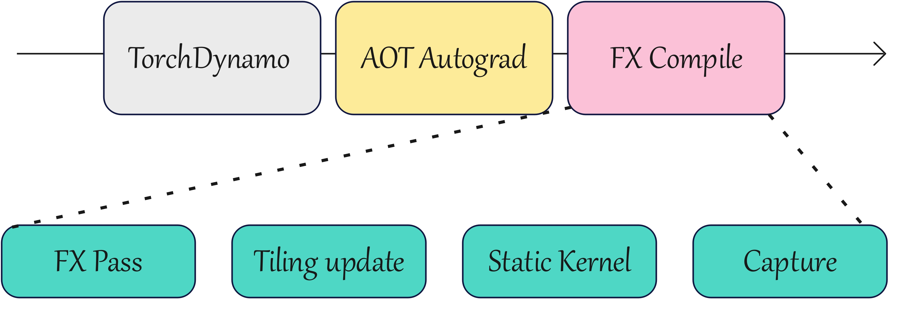

## 前置文章

《[npugraph_ex：CANN aclGraph的图模式样板间](https://mp.weixin.qq.com/s/SZgGlvASIq0T6p_H_yK_xw)》

## 1 背景介绍	

**npugraph_ex**融合了ACLGraph的调度能力和亲和NPU的图优化能力，在大模型推理场景下有效的消除了算子调度时延，显著提升了大模型的推理表现。然而使能npugraph_ex由于需要对模型进行编译优化会引入较长的冷启动时间，此时便需要使用编译缓存功能，将编译优化后的产物保存到磁盘以便下次运行直接加载，节省编译耗时。当前npugraph_ex不仅支持了第三方框架对于模型性能优化的集成，也支持了编译缓存功能的集成，端到端的降低模型推理耗时。


## 2 原理介绍

现在主流的AI框架都会支持作为torch.compile的后端进行模型图模式优化，当直接使用npugraph_ex作为后端时，torch.compile主要分为以下三个阶段：

**1.TorchDynamo**：也称为图捕获（Grapph Capture）阶段，将Python模型代码进行跟踪记录，转换成FX图（Pytorch图存储格式）。

**2.AOT AutoGrad**：通过TorchDynamo捕获的FX图生成前向和反向的FX图。

**3.FX Compile**：对FX图进行编译优化。


而**FX Compile**这个阶段就是npugraph_ex使能的关键，其中也分为了四个阶段的优化：

**1.FX Pass优化**：在FX图上执行特定变换操作优化图执行，例如算子融合、常量折叠、内存优化、ReInplace优化等。

**2.Tiling Update**：Tiling的动态刷新，部分算子如FlashAttention Tiling随输入prompt长度变化，需要在执行阶段动态刷新算子的Tiling信息。

**3.Static Kernel**：算子的静态编译，提前将aclnn kernel编译缓存，节省算子编译耗时。

**4.aclgraph capture**：推理时先将模型的执行任务全部捕获，之后再统一下发并随着推理循环多次执行，节省任务的下发调度耗时。



对于第三方框架作为后端而言，通常**TorchDynamo**这个阶段是一致的，不同之处在于得到FX图后框架对于FX图的优化流程和方法，因此第三方框架集成npugraph_ex的推理加速能力就是在输入FX图的前提下使能npugraph_ex FX Compile的四个阶段优化。npugraph_ex提供了`_NpuCompiler`类，给定FX图和输入Tensor后便可以实现FX Compile阶段的优化，并提供各个阶段编译产物的缓存功能，加速程序二次运行的冷启动耗时。


## 3 功能使用介绍

### 3.1 torch.compile自定义后端集成npugraph_ex

`torch.compile`支持自定义后端，要求后端函数具有`(gm: torch.fx.GraphModule, example_inputs: List[torch.Tensor]) -> Callable` 的约定,返回的就是自定义后端利用输入FX图编译优化后的可执行对象，要求`(*args: torch.Tensor) -> List[torch.Tensor]`。

TorchAir提供了`get_compiler`接口返回`_NpuFxCompiler`实例：

```python
def get_compiler(compiler_config: CompilerConfig = None):
    """
    Retrieves the NPU compiler instance.

    Args:
        compiler_config (CompilerConfig, optional): Compiler configuration. Defaults to None.

    Returns:
        _NpuFxCompiler: NPU compiler instance.
    """
    if compiler_config is None:
        compiler_config = CompilerConfig()
    return _NpuFxCompiler(compiler_config)
```

而`_NpuFxCompiler`实例可以利用后端函数的输入`gm`和`example_inputs`生成`_CompiledFxGraph`对象，也就是`npugraph_ex`根据FX图编译优化后的NPU图可执行对象：

```Python
class _NpuFxCompiler:
    """
    Main compiler class for converting FX graphs to NPU-compatible graphs.
    """

    def __init__(self, compiler_config: CompilerConfig) -> None:
        self.config = compiler_config

    @pretty_error_msg
    def __call__(self, gm: torch.fx.GraphModule, example_inputs: List[torch.Tensor]):
        """
        Compiles the FX graph into an NPU-compatible graph.

        Args:
            gm (torch.fx.GraphModule): The FX graph module to compile.
            example_inputs (List[torch.Tensor]): Example inputs for compilation.

        Returns:
            _CompiledFxGraph: Runner wrapping the compiled graph.
        """

        return self._get_compiled_gm(gm, example_inputs)
     ......
```

`_CompiledFxGraph`满足了torch.compile后端函数返回对象的要求，符合`(*args: torch.Tensor) -> List[torch.Tensor]`。因此，自定义后端既可以自行对TorchDynamo跟踪输出的FX图优化处理成新的FX图（要求与AotAutoGrad处理后的FX图格式相同），再通过`get_compiler`返回的`_NpuFxCompiler`实例生成`_CompiledFxGraph`可执行图实现后端函数；也可以直接将`_NpuFxCompiler`实例作为AOTAutoGrad的参数输入完成后端函数实现，以下给出后者的简易示例：

```python
import os
import torch
from torch._functorch.aot_autograd import aot_module_simplified
import torch_npu
import torchair
from torchair.configs.compiler_config import CompilerConfig

class MM(torch.nn.Module):
    def __init__(self):
        super().__init__()
    def forward(self, x, y):
        x = x + y
        return x
def custom_backend(gm: torch.fx.GraphModule, example_inputs):
    compiler_config = CompilerConfig()
    compiler_config.mode = "reduce-overhead"
    compiler = torchair.get_compiler(compiler_config)
    return aot_module_simplified(gm, example_inputs, fw_compiler=compiler)
                        
torch.npu.set_device(0)
x = torch.ones([2, 2], dtype=torch.int32).npu()
y = torch.ones([2, 2], dtype=torch.int32).npu()
model = torch.compile(MM().npu(), backend=custom_backend, dynamic=False)
ret = model(x, y)
print(ret)
```

参考资料：

1.`get_compiler`、`_NpuFxCompiler`和`_CompiledFxGraph`定义参考TorchAir开源仓:https://gitcode.com/Ascend/torchair/blob/master/python/torchair/npu_fx_compiler.py

2.`torch.compile`自定义后端接入详情参考Pytorch官网手册：https://docs.pytorch.ac.cn/docs/stable/torch.compiler_custom_backends.html

### 3.2 编译缓存

`_CompiledFxGraph`提供了`dump_artifacts`和`load_artifacts`方法共同实现编译产物的缓存落盘功能：在模型首次编译时使用`dump_artifacts`方法获取内存中的编译产物，并写入到磁盘指定路径中。模型二次编译时检测磁盘指定路径是否存在编译产物的落盘文件，存在便读入内存使用`load_artifacts`方法加载直接生成编译优化后的图。

示例如下，程序首次执行将缓存编译产物到磁盘，二次执行直接加载磁盘编译产物节省编译耗时：

```python
import os
import pickle
import torch
import torch_npu
import torchair
from torch._functorch.aot_autograd import aot_module_simplified
from torchair.configs.compiler_config import CompilerConfig

class MM(torch.nn.Module):
    def __init__(self):
        super().__init__()

    def forward(self, x, y):
        x = x + y
        return x

def custom_compiler(gm: torch.fx.GraphModule, example_inputs):
    cache_file = "./compiled_model.pkl"
    # 尝试从缓存加载
    if os.path.exists(cache_file):
        print("发现缓存，正在加载...")
        with open(cache_file, 'rb') as f:
            artifacts = pickle.load(f)
        # 使用 load_artifacts 重建编译图
        from torchair.npu_fx_compiler import _CompiledFxGraph
        compiled_graph = _CompiledFxGraph.load_artifacts(artifacts)
        print("从缓存加载成功")
        return compiled_graph
    
    # 缓存未命中，执行编译
    print("缓存未命中，开始编译...")
    compiler_config = CompilerConfig()
    compiler_config.mode = "reduce-overhead"  # 必须设置为支持 codegen 的模式
    compiler = torchair.get_compiler(compiler_config)
    
    # 直接调用编译器获取 _CompiledFxGraph 实例
    compiled_graph = compiler(gm, example_inputs)
    print(type(compiled_graph))
    # 保存到缓存
    print("正在保存编译产物...")
    artifacts = compiled_graph.dump_artifacts()
    with open(cache_file, 'wb') as f:
        pickle.dump(artifacts, f)
    print(f"编译产物已保存到 {cache_file}")
    return compiled_graph

def custom_backend(gm: torch.fx.GraphModule, example_inputs):
    return aot_module_simplified(gm, example_inputs, fw_compiler=custom_compiler)

def main():
    torch.npu.set_device(0)
    # 准备数据
    x = torch.ones([2, 2], dtype=torch.int32).npu()
    y = torch.ones([2, 2], dtype=torch.int32).npu()
    # 编译并执行
    model = torch.compile(MM().npu(), backend=custom_backend, dynamic=False, fullgraph=True)
    ret = model(x, y)
    print(f"结果: {ret}\n")

if __name__ == "__main__":
    main()
```

### 4 第三方框架集成npugraph_ex实例——XPU_GRAPH

#### 4.1 XPU_GRAPH介绍

XPU_GRAPH是一个支持多种设备的自定义图编译器，基于Pytorch FX图和Aten IR进行图编译优化，通过集成npugraph_ex支持了昇腾设备，存在以下特点：

- **通用图优化：** 公共子表达式消除（CSE），死代码消除（DCE），算子折叠，常量折叠以及更激进的常量传播。
- **厂商自定义算子转换**：将效率较低（通常会引发大量内存访问）的算子，转换为定制化融合算子。
- **结构化模式匹配**：XPU_GRAPH 对常见结构模式进行抽象，支持用户实现对应目标结构，并将指定模式转换为用户定义的格式。
- **后端编译器集成**：XPU_GRAPH 采用 “FX 图输入–FX 图输出” 设计，因此可与 Inductor、GE 等其他 FX 图编译器兼容。
- **同时支持推理与训练场景**。

#### 4.2 XPU_GRAPH集成npugraph_ex

XPU_GRAPH在`backends/__init__.py`中定义了`vendor_compile`方法，为自定义图编译器提供了统一的入口：

```python
def vendor_compiler(
    gm: torch.fx.GraphModule,
    fake_inputs: list,
    target: Target,
    *,
    is_inference: bool = False,
    is_backward: bool = False,
    **config_dict: Dict[str, Any],
) -> Callable:
    try:
        target_mod = importlib.import_module(f".{target.value}", __package__)
    except Exception:
        logger.warning(f"{target.value}_compiler not found, return gm")
        return gm

    compile_fn = getattr(target_mod, f"{target.value}_compile")
    logger.info(f"{target.value}_compile start...")
    xpu_compiled = compile_fn(gm, fake_inputs, is_inference=is_inference, is_backward=is_backward, **config_dict)
    logger.info(f"{target.value}_compile complete")
    return xpu_compiled
```

`compile_fn`便是不同的图编译器函数，名称为`***_compile`，返回编译优化后的图可执行对象，这也正好方便了上层接入`torch.compile`。npugraph_ex对应的编译器函数是`npu_compile`，定义在`backends/npu.py`中：

```python
def npu_compile(
    module: torch.nn.Module,
    inputs,
    *,
    is_inference: bool = False,
    is_backward: bool = False,
    **config_dict: Dict,
) -> torch.nn.Module:
    compiler = config_dict.get("compiler", "ge")
    if compiler == "ge":
        assert is_inference, "Currently, we use ge only for inference."
        return ge_compiler(module, inputs, **config_dict)
    elif compiler == "device_graph":
        assert is_inference, "Device graph capture/replay is intended for inference-style execution."
        return device_graph.device_graph_compiler(module, inputs, target="npu", **config_dict)
    else:
        return inductor_compiler(module, inputs, is_inference=is_inference, is_backward=is_backward, **config_dict)
```

当使能`npugraph_ex`时，会走到`ge_compiler`,其也定义在`npu.py`中：

```python
def ge_compiler(module: torch.nn.Module, example_inputs, **config_dict: Dict) -> torch.nn.Module:
    import torch.fx as fx
    import torch_npu

    torch.npu.set_compile_mode(jit_compile=False)

    import torchair as tng
    import torchair.ge_concrete_graph.ge_converter.experimental.patch_for_hcom_allreduce
    from torchair.configs.compiler_config import CompilerConfig

    config = CompilerConfig()
    recursive_set_obj(config_dict, config)
    if (
        mode := config_dict.get(
            "mode",
            (
                "max-autotune" if "compiler" in config_dict else "reduce-overhead"
            ),  # NOTE(liuyuan): If user specify the compiler, then we should consider it as GE instead of AclGraph.
        )
    ) == "reduce-overhead":
        config.mode = mode
        from torch import SymInt

        for ele in example_inputs:
            if isinstance(ele, SymInt):
                raise TypeError("ACL Graph does not support dynamic shape!!")

        if mempool := config_dict.get("use_custom_pool", None):
            config.aclgraph_config.use_custom_pool = mempool

    npu_backend = tng.get_compiler(compiler_config=config)

    from torchair._utils import get_npu_default_decompositions

    module = make_fx(
        module,
        decomposition_table=get_npu_default_decompositions(),
        tracing_mode="fake",
        record_module_stack=True,
    )(*example_inputs)

    compiled_module = npu_backend(module, example_inputs)

    if not has_triton_kernel(module):
        compiled_module = NpuSerializableArtifact(compiled_module)

    return compiled_module
```

代码中也是将`config.mode`设置为`reduce-overhead`,通过TorchAir的`get_compiler`接口获取NPU图编译器`npu_backend`，并将模型（`torch.nn.Module`)转换处理后的FX图通过`npu_backend`使能npugraph_ex的编译优化，得到编译优化后的可执行图对象`compiled_module`。

同时，在不含有Triton算子时支持了编译产物的缓存功能，将可执行图对象直接包装进`NpuSerializableArtifact`，继承自`SerializableArtifact`（不同编译器编译产物序列化的抽象基类）：

```python

class SerializableArtifact(ABC):
    def __init__(self, artifact):
        if isinstance(artifact, SerializableArtifact):
            return
        super().__init__()
        assert callable(artifact), f"artifact must be callable, but got {type(artifact)}"
        self._artifact = artifact
        if getattr(artifact, "_boxed_call", False):
            self._boxed_call = True

    def __call__(self, *args, **kwargs):
        return self._artifact(*args, **kwargs)

    # NOTE(liuyuan): allow implicit no-conversion between subclasses of Serializable.
    def __new__(cls, artifact):
        if isinstance(artifact, SerializableArtifact):
            return artifact
        else:
            return super().__new__(cls)

    @property
    def artifact(self):
        return self._artifact

    def __reduce__(self):
        return self.rebuild_from_bytes, (self.convert_to_bytes(),)

    @abstractmethod
    def convert_to_bytes(self) -> bytes:
        # TODO(liuyuan): For performance, try to make it as a zero copy byte strings.
        """
        Convert artifact to bytes. The return value should be artifact_bytes,
        which can rebuild the artifact via rebuild_from_bytes.
        """
        ...

    @staticmethod
    @abstractmethod
    def rebuild_from_bytes(byte_s: bytes):
        """
        Rebuild artifact from bytes. The input is the artifact_bytes from convert_to_bytes.
        """
        ...
```

可以看到通过定义`__call__`方法继承`SerializableArtifact`的实例可以直接作为可调用对象执行编译优化后的图，因此在`ge_compiler`中虽然根据是否存在Triton算子返回了不同的类型对象，但是作为调用对象功能是一致的,不需要再做额外的区分处理。同时子类通过实现`convert_to_bytes`和`rebuild_from_bytes`完成编译产物的缓存和加载功能，`NpuSerializableArtifact`中的实现如下：

```python
class NpuSerializableArtifact(SerializableArtifact):
    def __init__(self, artifact):
        assert hasattr(artifact, "dump_artifacts")
        super().__init__(artifact)

    def convert_to_bytes(self):
        # NOTE(liuyuan): Since tng_backend does not save any tenosr, would it be necessary?
        with temp_disable_tracing_envs():
            return pickle.dumps(self._artifact.dump_artifacts())

    @staticmethod
    def rebuild_from_bytes(bytes):
        from torchair.npu_fx_compiler import _CompiledFxGraph

        # NOTE(liuyuan): Since tng_backend does not save any tenosr, would it be necessary?
        with temp_disable_tracing_envs():
            return __class__(_CompiledFxGraph.load_artifacts(pickle.loads(bytes)))
```

分别通过**3.2**中介绍的`dump_artifact`和`load_artifacts`方法简单实现了缓存和加载的抽象方法，使得XPU_GRAPH既能使能npugraph_ex在NPU设备进行模型推理的编译优化，也可以通过缓存功能加速冷启动时间。

**参考链接：**

XPU_GRAPH仓链接：https://github.com/XPU-Forces/xpu_graph/

npugraph_ex接入PR链接：https://github.com/XPU-Forces/xpu_graph/pull/442

### 5.总结

npugraph_ex提供了出色的模型推理加速功能，在torch_npu和TorchAir开源的帮助下更进一步，支持了第三方生态的接入，XPU_GRAPH的成功集成便是其中的优秀典范。npugraph_ex也会持续地完善功能、优化性能并降低使用以及接入的难度，开发者们可以关注TorchAir开源仓查看相关的最新技术动态。

TorchAir仓链接：https://gitcode.com/Ascend/torchair
推理的编译优化，也可以通过缓存功能加速冷启动时间。

**参考链接：**

XPU_GRAPH仓链接：https://github.com/XPU-Forces/xpu_graph/

npugraph_ex接入PR链接：https://github.com/XPU-Forces/xpu_graph/pull/442

### 5.总结

npugraph_ex提供了出色的模型推理加速功能，在torch_npu和TorchAir开源的帮助下更进一步，支持了第三方生态的接入，XPU_GRAPH的成功集成便是其中的优秀典范。npugraph_ex也会持续地完善功能、优化性能并降低使用以及接入的难度，开发者们可以关注TorchAir开源仓查看相关的最新技术动态。

TorchAir仓链接：https://gitcode.com/Ascend/torchair
