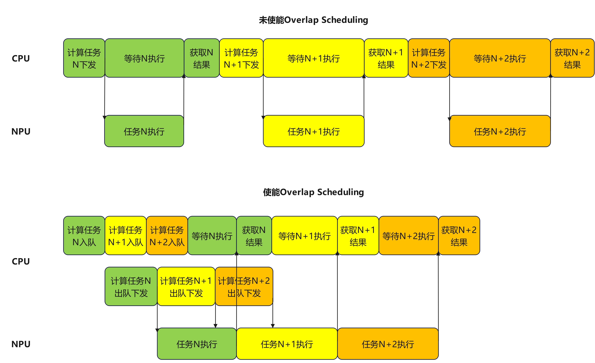
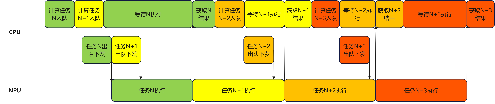
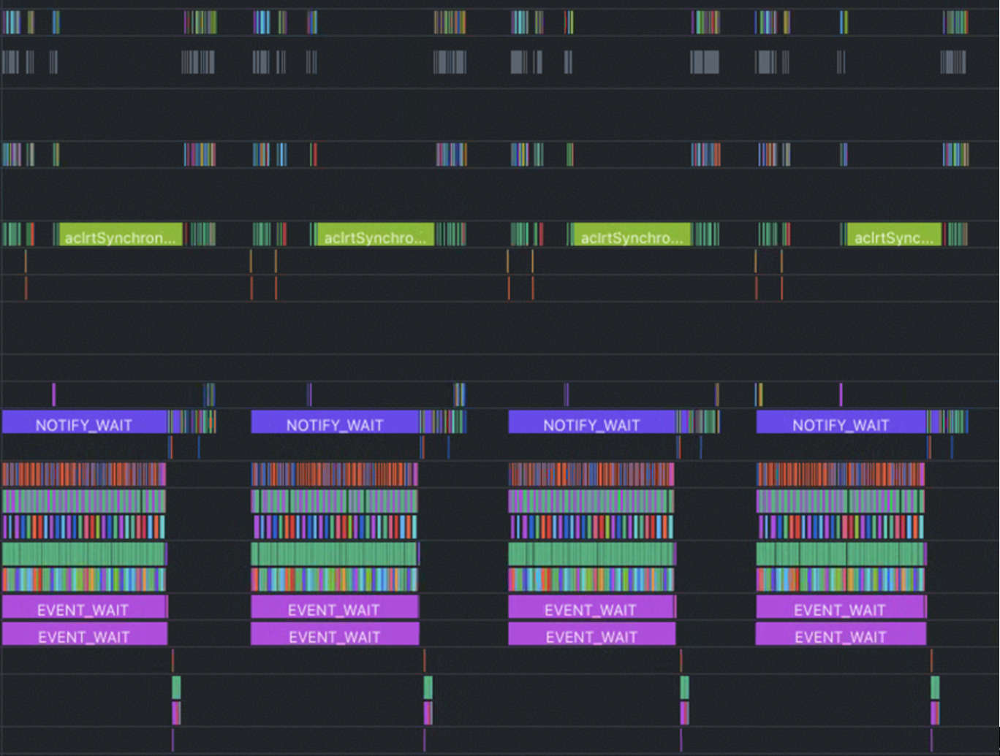

## Overlap Scheduling吞吐优化
### 一、 背景介绍
当前AI模型部署设备通常采用CPU与算力卡组成的异构架构。在AI推理业务中，CPU主要负责任务调度，算力卡负责执行大量计算任务。由于算力卡成本远高于CPU，其计算执行又依赖CPU的任务下发，一旦CPU调度不及时，算力卡便会陷入空闲等待，造成高成本算力资源被低成本CPU拖累的局面。Overlap Scheduling是解决这一问题的通用优化手段——它将CPU的任务调度过程与算力设备的计算执行过程并行推进，从而**隐藏CPU调度延迟，提升算力设备利用率与系统吞吐量**。本文将详细介绍Overlap Scheduling在昇腾设备上的实现原理与应用方式。

### 二、Overlap Scheduling实现原理
在未使能Overlap Scheduling时，CPU 与 NPU 以严格的串行方式协作：CPU完成一批任务的调度下发后，NPU 才开始执行计算；NPU 执行完毕后，CPU 再调度下一批任务。
Overlap Scheduling 的核心思路是提前下发：在 NPU 执行当前批次计算任务的同时，CPU
并行完成下一批次的任务调度与下发，使两者的执行时间窗口相互重叠。具体实现上，通常借助任务队列与异步下发机制—— CPU 将调度好的任务预先写入队列，NPU 从队列中持续取任务执行，从而解耦两者的时序依赖。

上图便给出了使能Overlap Scheduling前后的示意图，可以看到使能Overlap Scheduling前NPU存在大量空泡等待时间，在使能Overlap Scheduling后，消除了NPU的等待空泡，整体耗时缩短，提升了吞吐量。

### 三、Overlap Scheduling昇腾使用实例：SGLang的Overlap Scheduling实现介绍
#### 3.1 背景介绍

SGLang是一个高性能的大语言模型（LLM）和视觉-语言模型（VLM）服务框架，支持从单卡到大规模分布式集群的多种部署场景，提供低延迟、高吞吐的推理服务。SGLang已适配昇腾NPU设备，并通过Overlap Scheduling方案显著提升了大模型在NPU上的吞吐性能。

#### 3.2 实现架构

SGLang采用双线程异步架构实现Overlap Scheduling，通过任务队列解耦请求处理和NPU执行：

##### 线程1（调度线程）：

- 接收推理请求，组装成batch后提交到任务队列（`input_queue`）
- 从输出队列（`output_queue`）获取推理结果并返回

##### 线程2（执行线程）：

- 从任务队列获取batch任务
- 下发到NPU执行并将结果放入输出队列

#### 3.3 执行流程

| 步骤 | 线程1（调度线程）                                          | 线程2（执行线程）                              | 说明                         |
| ---- | ---------------------------------------------------------- | ---------------------------------------------- | ---------------------------- |
| 1    | 接收请求，组装batch1和batch2提交到任务队列，等待batch1结果 | -                                              | 初始化阶段，预先提交2个batch |
| 2    | 等待中                                                     | 执行batch1，将结果放入输出队列，开始执行batch2 |        /          |
| 3    | 获取batch1结果，提交batch3，等待batch2结果                 | 执行batch2中                                   | CPU处理结果与NPU执行并行     |
| 4    | 等待中                                                     | 完成batch2，将结果放入输出队列，开始执行batch3 |        /          |
| 5+   | 获取batch2结果，提交batch4，等待batch3结果...              | 完成batch3，开始batch4...                      | 循环往复                     |

**关键设计：**

- **预提交机制**：启动时预先提交2个batch，避免NPU后续需要等待任务下发。
- **流水线并行**：线程1处理结果和组装新batch的同时，线程2下发任务到NPU上执行计算
- **队列解耦**：通过任务队列和输出队列实现线程间的异步通信，避免相互阻塞

通过这种设计，SGLang实现了CPU侧的请求处理与NPU侧的模型推理的充分重叠，最大化设备利用率。
完成后方案的调度耗时示意图如下：

由于任务调度以及结果获取步骤的耗时通常都显著低于NPU任务执行耗时，因此在首次下发两个任务，之后每次下发单个任务的循环中可以保持NPU始终有任务执行，并且首个任务的结果输出也不会过于滞后。
完整的代码调用栈示意图如下：

开发者们也可以访问SGLang社区查看具体的代码实现：https://github.com/sgl-project/sglang

#### 3.4 模型效果实测
实测**LongCat-Flash**模型（560B参数量）初期优化时在batch 8，输入长度4k的场景下使能Overlap Scheduling技术前后吞吐提升**1.7x**倍：
| batch | 输入长度 | overlap | 端到端时间（ms） | TPS    |
|-------|----------|---------|-----------------|--------|
| 8     | 4k       | 否      | 79              | 101.27 |
| 8     | 4k       | 是      | 45              | 177.78 |

### 四、Overlap Scheduling常见问题及解决方案
#### 4.1 问题描述
在昇腾设备上实现Overlap Scheduling后，如果模型中存在Tiling依赖输入值的算子，会导致任务下发阻塞，进而影响CPU和NPU的并行执行，降低整体吞吐性能。

##### Tiling机制说明
Tiling是指将算子的输入数据切分到NPU的多个核上并行执行的逻辑。Tiling的计算通常在CPU侧完成，且大多数情况下只依赖输入的Shape信息。但部分特殊算子的Tiling需要依赖具体的输入值。
典型例子： ReduceSum算子用于沿指定维度对Tensor的所有元素求和，包含两个输入：
- axes：指定求和的维度
- x：待求和的Tensor

该算子的Tiling必须知道axes的具体值，才能根据x的Shape确定该维度的元素数量，进而完成切分策略的计算。

##### 性能瓶颈分析

当算子的Tiling依赖具体输入值时，会因以下流程导致吞吐下降：

1. 数据传输：算子的输入数据存储在NPU侧，而Tiling计算在CPU侧执行，因此需要将依赖的输入数据从NPU拷贝到CPU
2. 同步阻塞：CPU侧调用aclrtSynchronizeStream接口同步等待数据拷贝完成，该同步操作会阻塞当前线程
3. 调度停滞：由于调度线程被阻塞，后续的任务无法及时下发，破坏了CPU和NPU的执行重叠，导致整体吞吐下降

被打断的流水图如下：

图中可以看到由于插入多个aclrtSynchronizeStream，调度线程任务下发阻塞，进而NPU的空闲等待时间也增长。

#### 4.2 问题解决方案

问题的核心矛盾在于：Tiling计算在CPU侧执行，但依赖的数据存储在NPU侧。因此，最直接的优化思路是将Tiling计算迁移到NPU侧执行，避免跨设备的数据同步。目前有以下两种实现方式：

##### 方案一：Kernel内部计算Tiling
在算子的Kernel实现中直接完成Tiling计算。由于Tiling主要涉及标量运算，可以利用NPU的标量计算单元在Kernel内部完成。例如对于ReduceSum算子，可在Kernel实现中通过GetValue接口获取axes的具体值，然后基于该值和输入Shape计算数据切分策略，整个过程在NPU侧完成，无需CPU参与。

##### 方案二：Tiling下沉到AICPU
利用昇腾NPU的Tiling下沉功能，将Tiling计算任务调度到NPU侧的AICPU执行，避免CPU与NPU之间的数据传输和同步。
使用详情参考文档：
https://www.hiascend.com/document/detail/zh/canncommercial/850/opdevg/Ascendcopdevg/atlas_ascendc_10_00014.html

### 五.总结
Overlap Scheduling是提升昇腾设备吞吐性能的重要优化方式，开发者们可以尝试将此方案应用到更多的AI框架中，不仅能从实践中更深入地掌握这一技术特性，也有机会将自己的代码贡献到优秀的开源项目中，成为自身能力的优秀证明。

 

 

 
