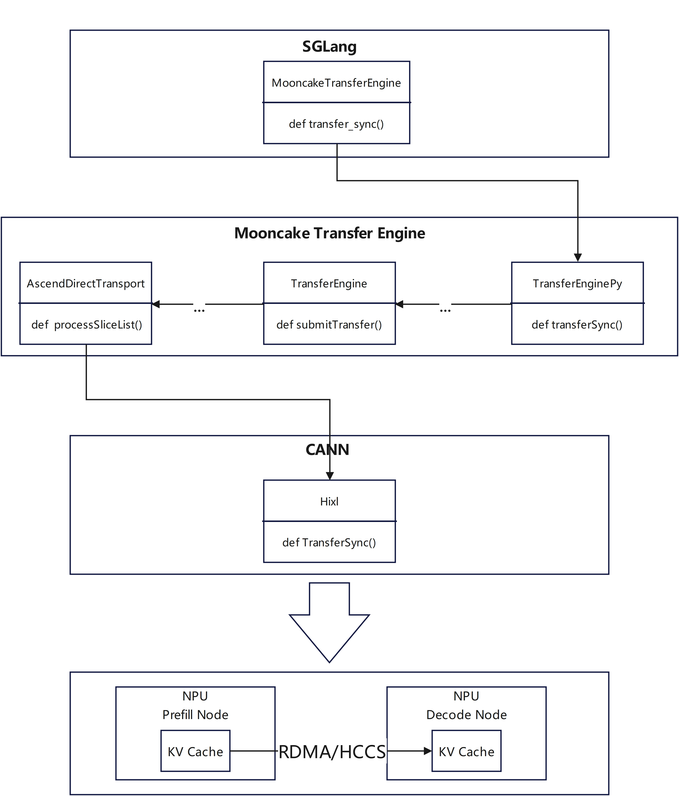

# SGLang、Mooncake与CANN HIXL的PD分离D2D部署

**一、CANN开源破壁垒：大模型PD分离部署D2D特性快速落地**

在大模型推理场景中，预填充（Prefill）与解码（Decode）阶段的计算特性差异显著：Prefill 阶段需处理长序列输入，对算力需求集中；Decode 阶段则以 token-by-token 生成为主，存在频繁的数据交互开销。传统部署方案将两者绑定在同一硬件节点，Prefill和Decode阶段共享硬件资源，且存在资源冗余现象，因此Prefill阶段和Decode阶段分离部署在不同资源节点成为了大模型推理性能提升的关键解决方案。

昇腾 CANN 的全面开源开放成为了PD分离方案快速落地的强力支撑。通过CANN HIXL(Huawei Xfer Library，昇腾单边通信组件)的开源，开发者获得了PD分离部署中KVCache在Prefill节点和Decode节点快速传输的关键能力，结合SGLang和Mooncake的框架能力，迅速打通了PD分离部署D2D同构特性。

在CANN开源开放之前，新的功能特性需要随着新版本的CANN发布才能让开发者体验，而商用版本的发布周期通常在3个月左右。现在，随着CANN各个组件的开源，任何特性的更新，开发者都可以通过开源组件仓编译部署的方式立即使用，甚至还能对代码进行魔改，在原有基础上开发适合自己场景的定制化特性。这不仅大大缩短了开发者和客户的项目落地速度，也提升了项目的功能自由度和性能上限。

**二、核心方案：三大技术的协同创新**

本方案通过 SGLang 实现 PD 分离架构落地，Mooncake 提供传输适配层，CANN 开源的 HIXL 组件则突破通信瓶颈，三者协同实现 “架构解耦 + 高效通信” 的双重价值：

- **SGLang**：提供成熟的 PD 分离部署框架，支持 Prefill 与 Decode 节点独立调度，通过disaggregation-mode等参数实现灵活配置。

- **Mooncake**：作为传输引擎中间层，兼容多种通信后端，为 HIXL 与 SGLang 的对接提供适配能力。

- **CANN HIXL**：昇腾开源的单边通信组件，提供高性能、零拷贝的点对点数据传输能力，并通过简易API开放给客户。提供了PD分离中KV Cache在Prefill节点和Decode节点相互传输的底层能力。

**三、关键技术解析：HIXL 功能介绍**

**3.1 HIXL 核心功能接口**

HIXL 作为 CANN 开源生态的重要组件，现已在GitCode社区开源，提供了简洁易用的单边通信接口，开发者可直接调用实现设备间高效数据传输：

| **接口名称** | **功能介绍** |
| --- | --- |
| Initialize() | Hixl资源初始化，Hixl其他操作都需要在初始化的基础上执行 |
| Finalize() | Hixl去初始化释放资源 |
| RegisterMem() | 注册发送数据或接收数据的内存地址 |
| DeregisterMem() | 解注册内存地址 |
| Connect() | 与远端Hixl建立连接 |
| Disconnect() | 与远端Hixl断开连接 |
| TransferSync() | 与远端Hixl进行内存传输 |

**3.2 如何基于HIXL接口完成节点间的高性能数据传输**

假设当前存在两个npu节点Client和Server节点，Client节点需要获取Server节点的数据或将自身的数据发送给Server节点（例如PD分离方案中Prefill节点将KV Cache传输给Decode节点），整体流程可以拆解如下：

**Client节点：**

1. Initialize：进行Client节点Hixl初始化

2. RegisterMem：注册接收/发送数据的内存地址

3. Connect：建立和Server节点Hixl的单向链接，此步骤需要在Server节点完成第一步Initialize后执行

4. TransferSync：拉取Server节点数据/发送数据给Server节点，此步骤需要在Server节点完成第二步RegisterMem后执行

5. Disconnect：断开与Server节点Hixl的单向链接

6. DeregisterMem：解注册接收/发送数据的内存地址

7. Finalize：进行Client节点Hixl的去初始化和资源释放

**Server节点**：

1. Initialize：进行Server节点Hixl初始化

2. RegisterMem：注册接收/发送数据的内存地址

3. DeregisterMem：解注册接收/发送数据的内存地址，此步骤需要在Client节点完成第四步TransferSync后执行

4. Finalize：进行Client节点Hixl的去初始化和资源释放

具体的代码实现可以参考[HIXL样例](https://gitcode.com/cann/hixl/tree/master/examples/cpp)

**四、总结与展望**

CANN 的全面开源开放为开发者提供了直达硬件能力的 “快车道”，本案例中 HIXL 组件的快速集成正是最佳佐证。通过 SGLang、Mooncake 与 HIXL 的协同，开发者不仅实现了 PD 分离部署的高效落地，更验证了开源生态在技术创新中的核心价值。

未来，随着昇腾 CANN 开源生态的持续完善，开发者可以充分发挥自己的灵感创意，在昇腾硬件的土壤上培育出各行各业的AI应用森林。
