# SuperKernel技术综述

## 1. 背景介绍

2025年初，随着DeepSeekV3/R1网络模型的开源，大模型推理迈入了一个全新阶段。该模型基于MoE（Mixture of Experts）混合专家结构，实现了参数的稀疏激活，拥有庞大的参数容量，但计算量却极低（每Token仅激活约5%的参数）。在低计算量的前提下，如何进一步提升模型性能成为关键。目前，模型部署中已开始采用PD分离部署，通过资源整合进行优化，为性能提升打下基础。

基于用户体验视角，模型的流畅体验主要取决于两个关键指标：（1）从请求发出到首个Token回显的时间（TTFT）；（2）从首个回显Token到最后一个Token完成的时间（TPOT）。其中，TTFT的瓶颈主要在Prefill阶段，而TPOT则受限于Decode阶段。尤其是在复杂任务或超长上下文的场景中，Decode阶段成为显著的计算瓶颈。为了提升这两个指标优化用户体验，我们引入了一种名为SuperKernel的执行优化方法。该方法将整个网络模型重新编译为一个大算子，从而减少硬件调度开销并优化了Cache和同地址访问，在现有网络优化基础上提升整网性能10-20个百分点。

## 2. DeepSeek网络模型解析

DeepSeekV3网络模型是一个多层网络，共包含61层。每一层有20+算子，基本结构如下所示：

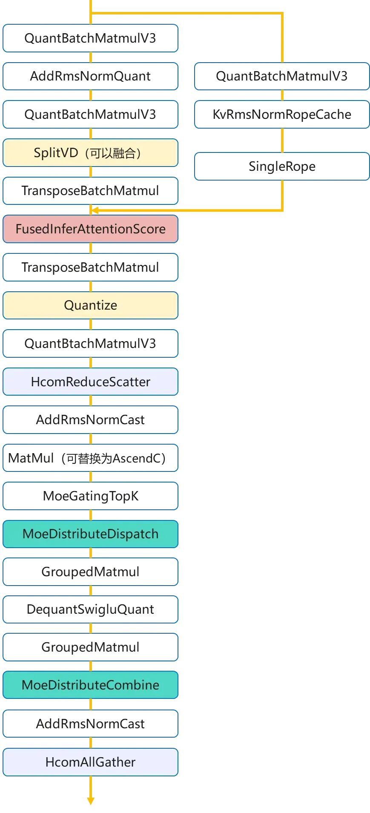

图1.DeepSeekV3网络模型结构示意图

### 2.1 模型优化手段

在深度学习模型的优化过程中，为了提升模型性能和效率，通常会采用多种优化手段，包括算子级优化和网络执行优化。这些手段可以显著减少计算时间和资源消耗，提高运行效率。然而，即使应用了这些优化手段，模型调度层面仍有进一步提升性能的空间。以下将详细介绍这些优化手段及其进一步优化的可能性。

### 2.1.1 传统的算子级优化

算子级优化是提升模型计算效率的基础手段，其核心在于使计算更适配底层硬件架构，以减少开销、提升资源利用率。主要包括以下几种方式：

（1）算子融合：减少计算过程中的内存访问次数和Kernel启动开销。将多个连续的小算子合并为一个复合算子，使中间结果保留在高速缓存中，从而显著提升计算效率。

（2）通信-计算重叠：隐藏分布式训练或推理中的通信延迟。通过流水线技术，将计算任务的数据通信（如：AllReduce）与另一个计算任务的计算过程在时间上重叠执行，将通信时间“隐藏”在计算时间内，以克服网络通信瓶颈。

（3）动态Shape优化：高效处理输入数据形状动态变化的场景。根据输入张量的实际形状，动态调整算子的执行策略或内存分配，避免因形状固定而导致的内存浪费或计算低效。

（4）Weight预取：减少计算单元因等待数据而从慢速全局内存中读取的延迟。在计算开始前，预先将模型权重等关键数据从全局内存加载到速度更快的L2缓存中，使计算单元能够快速获取数据，提高计算速度。

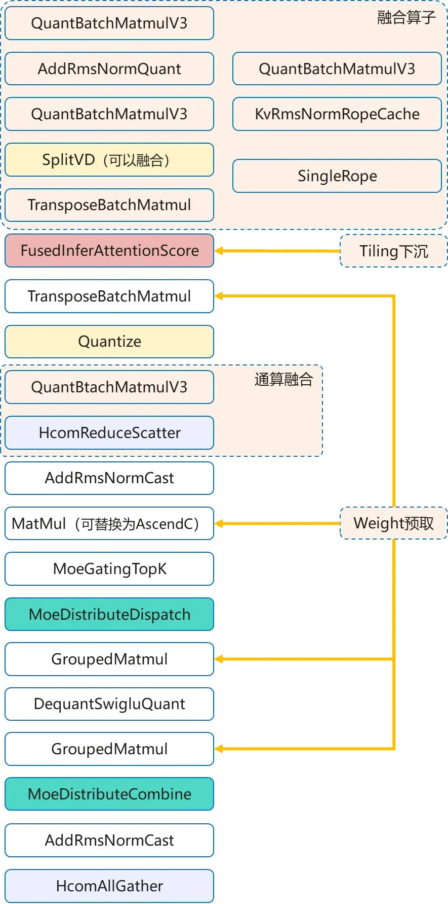

图2. 传统的算子级优化示例

### 2.1.2网络执行优化

网络执行优化主要通过整合多种并行与流水线技术来提升硬件资源利用率和任务执行效率。其核心手段可归纳为以下三类：（1）多Batch并行：提升计算吞吐量，通过同时处理多个Batch的数据，充分利用计算资源，提高计算效率；（2）多流并行：通过多流并行技术，使得多个计算任务可以并行执行，减少计算延迟；（3）相互掩盖：通过任务之间的相互掩盖，减少任务之间的等待时间，提高计算效率。

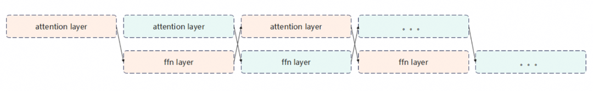

图3. 网络执行优化示例

尽管上述优化手段可以显著提升了模型的性能，但在实际应用中，仍然存在进一步优化的空间。特别是在模型的调度层面，通过优化任务调度，减少计算过程中的等待时间，提高模型的运行效率。

以DeepSeekV3网络中的一层为例，根据Profiling数据分析发现，网络上肉眼可见的Task等待调度开销较为明显。在BatchSize大小为96、Sequence长度3K的场景下，平均每层的Task平均等待的开销约为18us左右。按照61层网络计算，总的调度等待开销在1.1ms左右。这些开销基本是绝对开销，在大的Batch场景下还会进一步扩大。

为了进一步减少这些调度等待开销，我们采用SuperKernel技术。SuperKernel技术通过将多个任务合并为一个超级任务，减少任务调度的开销，提高模型的运行效率。

## 3. SuperKernel技术原理

根据计算图，利用JIT的编译能力，将标记范围内算子的Kernel代码重新编译为新的算子，如下所示：

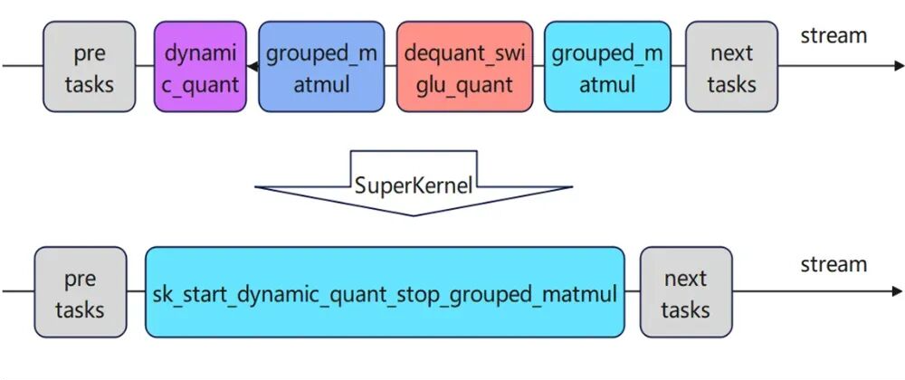

图4. Superkernel技术原理示例

```
__global__ __aicore__ void sk_start_xxx_stop_yyy(...)
```

通过详细评估和调试，SuperKernel技术优化后的基本收益模型可以分为以下三部分：首先是两个Task之间的调度开销降低；其次是每个Task结束后会执行Cache Flush操作，将所有修改的Cache内容刷新出去，其中包含一些不必要的栈空间；最后是算子调度后的核启动时间，包括同地址访问的排队延迟、Scalar执行初始化等环节。

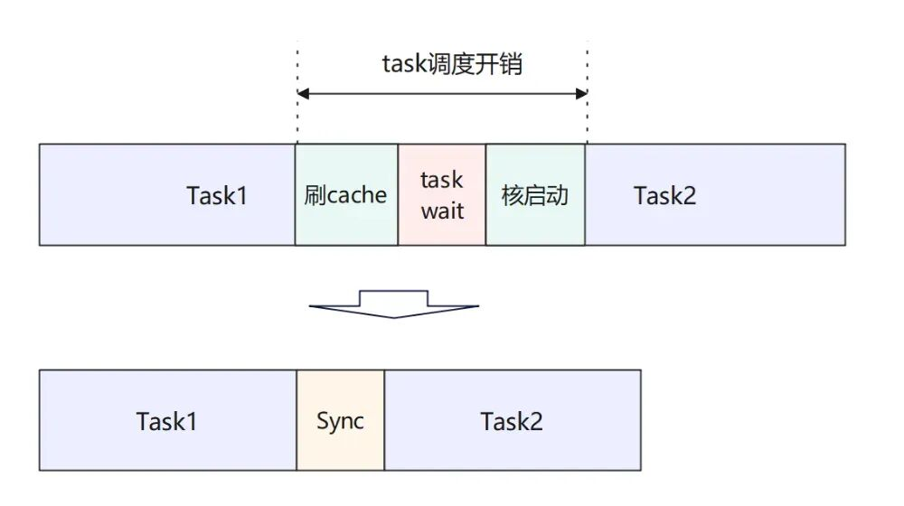

图5. 收益模型图

当前已经支持将DeepSeekV3模型61层网络中的58层融合为1个SuperKernel算子，整网收益平均10-20%左右，远超前面的任务调度分析的开销部分。

### 3.1 SuperKernel执行流程

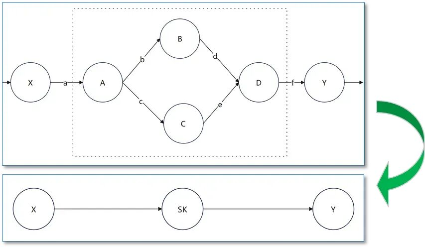

图6. SuperKernel执行示例

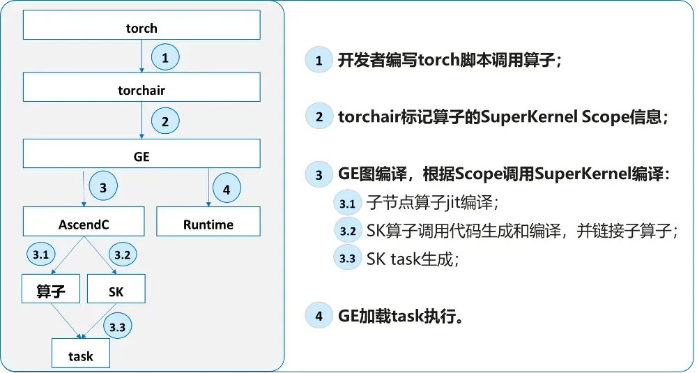

图7. CANN SuperKernel的基本流程

### 3.2 SuperKernel编译流程

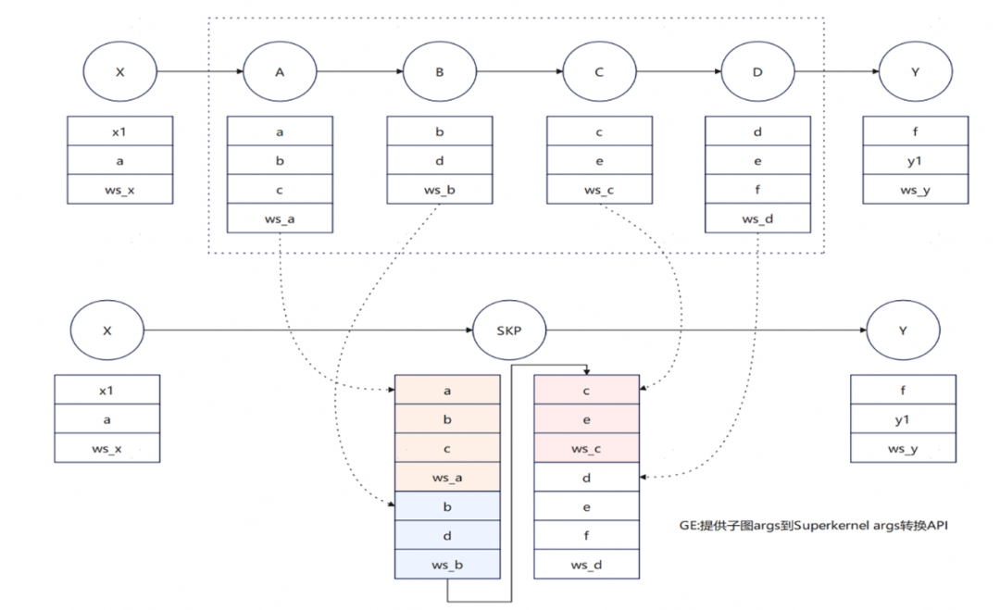

图8. SuperKernel简易调试过程

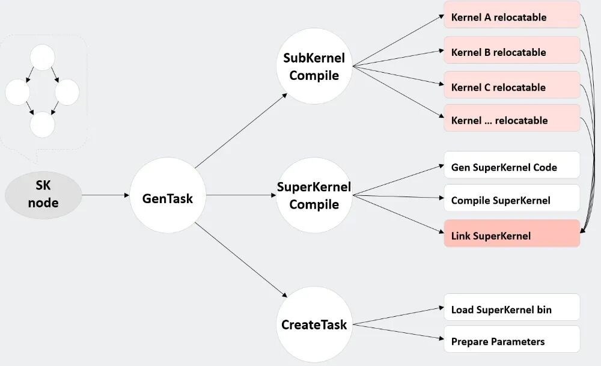

图9. SuperKernel编译流程

要点解释如下：

relocatbale: 基于function，参数通寄存器或者栈传递；

executable: 参数通过SPR传递，初始化栈基址；

SuperKernel代码生成：根据子Kernel的依赖和执行顺序生成调用代码，并自动插入同步。

### 3.3 SuperKernel优化手段

在基于简易SK模型的调试过程中，虽然调度开销被成功消除，但引入了Kernel间同步开销，并且模型执行行为与预期存在偏差，优化效果未达预期。为此，我们从算子级和网络级两个层面进行了针对性优化。

#### 3.3.1算子级优化

**1）ICache Preload优化**

在SuperKernel执行过程中，由于运行时系统通常仅预取其入口点的指令，子Kernel的代码段往往无法被硬件预取机制有效捕获，导致指令缓存（ICache）未命中率增高。

为解决此问题，可采用针对子Kernel的主动ICache预加载技术。该技术在当前子Kernel执行完毕前，以2KB对齐的方式，提前将下一个即将执行的子Kernel代码段预取到ICache中。这种“提前一个Kernel”的流水线式预加载策略，能够有效将指令加载的延迟隐藏在当前Kernel的计算时间内，从而显著减少因ICache Miss引起的性能损失。

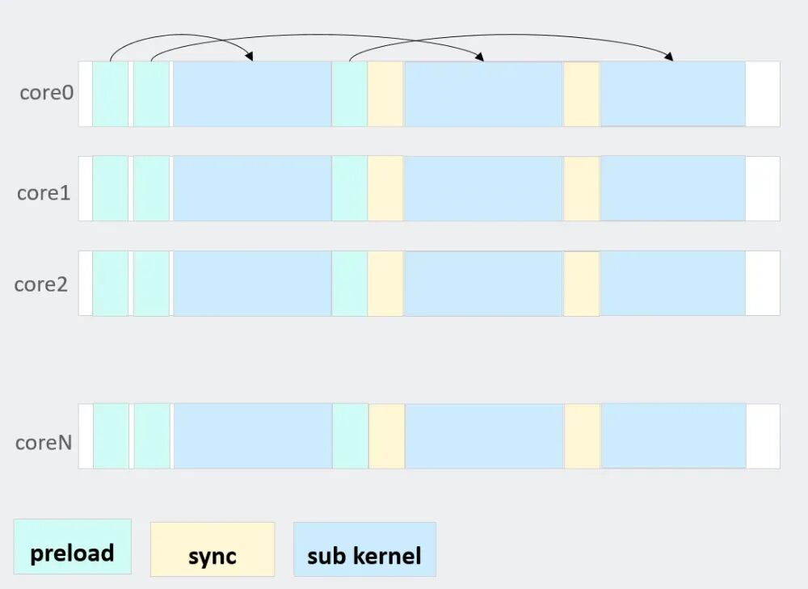

图10. ICache Preload优化

**2）同地址访存优化和亲和部署**

在多核处理器系统中，当多个计算核心同时执行同一个内核函数时，它们会访问内存中完全相同的指令地址（Text段）。这种对同一地址的并发访问会在共享的L2缓存层面形成一个串行化的访问队列，导致多个核心的请求发生争用，即使数据已缓存在L2中，也会因队列拥堵产生访问延迟，显著削弱多核并行带来的性能提升。

为解决该问题，可将子内核的代码段复制为多份副本，使不同核通过核ID映射到不同的物理地址执行。该方法既缓解了多核对同一缓存地址的争用，又使各核能在后续执行时充分利用已加载的缓存指令，提升整体执行效率。

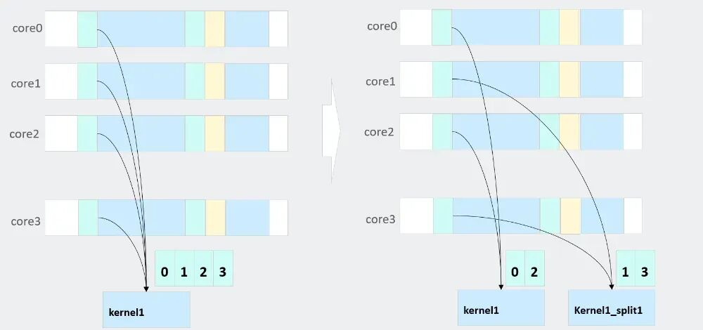

图11. 同地址访存和亲和优化

**3）Early-start优化**

在常规的Task调度机制或SK内部同步前后两个算子之间，系统通常需要等待所有硬件线程完成当前操作后才启动下一个算子。但实际上，大多数算子在启动初期会先进行 Scalar计算，随后才执行数据搬入和搬出操作。这种固定的同步机制可能会造成流水线空闲，影响整体性能。优化思路是利用算子执行初期的Scalar阶段，与前一个Kernel中MTE3搬出线程之间的执行间隙，实现更早地启动下个Kernel。首先，在前一个Kernel的MTE3搬出阶段，设置线程级的同步点（set）；其次，在下一个Kernel的MTE2搬入阶段前，仅对数据依赖部分进行同步等待（wait）； 然后，在Scalar阶段无需等待前一个Kernel完成，可直接启动，从而实现两个Kernel之间的“早启动”流水线重叠。

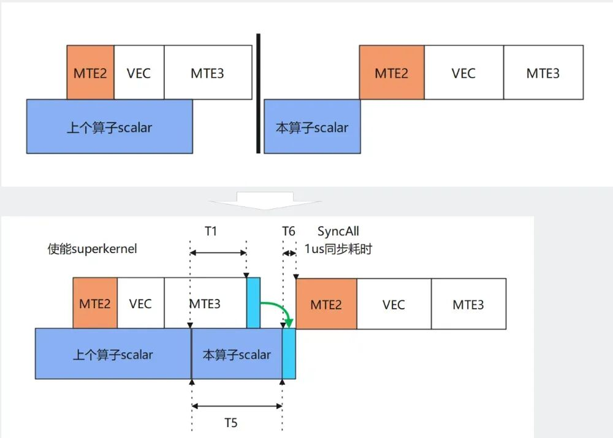

图12.  Early-start优化

**4）算子间同步优化**

在SK中的两个Kernel之间，为了解决数据依赖关系而插入同步操作后，同步的开销较大，影响了整体性能。为此，在SK代码生成阶段，可根据前后两个依赖算子的类型，动态选择并插入不同粒度的同步模式，从而有效降低同步开销，提升执行效率。

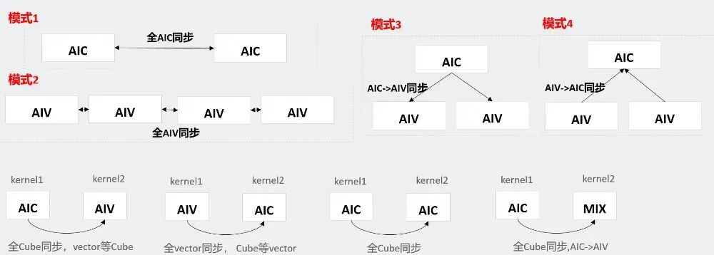

图13. 算子间同步优化

#### 3.3.2网络级优化

**1）支持Tiling下沉和Weight预取**

在实际优化过程中，Tiling下沉算子是一个重要的优化点，它依赖于设备内的内存状况。此类算子通过将Tiling值加载到AICPU执行，并在Tiling完成后通知AICore执行Kernel。此过程通过同步事件完成。此外，在算子执行前触发的Weight预加载机制，会借助CMO任务调用SDMA硬件，将GM内存的数据加载至L2 Cache中，以优化加载效率。

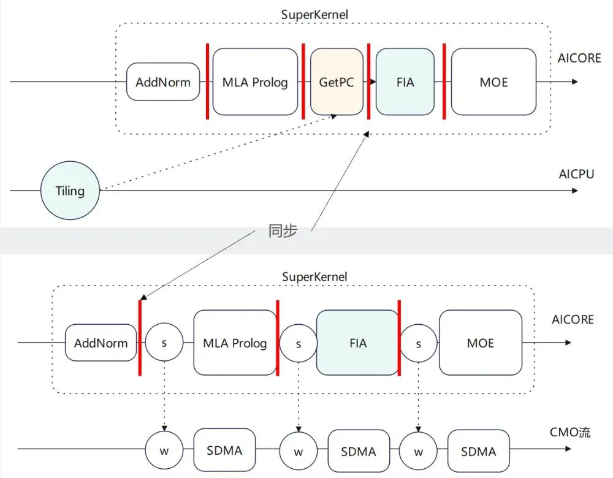

图14. Tiling下沉和Weight预取示例

为了进一步提升效率，当前需要将这两种机制中使用的SK内部事件发送与接收功能替换为基于内存操作的Notify-Wait机制，以此减少对Event的依赖，提高整体执行效率。

**2）支持双流并发融合**

通过多流实现Cube/Vector并发场景后，在简单转换为SK时，如果不感知依赖关系，仅依据执行顺序进行处理，SK内部的执行将退化为串行，导致整体性能相比融合前有所下降。

为了解决这一问题，可以将算子按类型进行分类，并在SK内部根据Cube和Vector的不同特性分配执行队列；同时，结合流的属性和Event事件，精准插入同步点，从而实现Cube与Vector的高效并发执行。

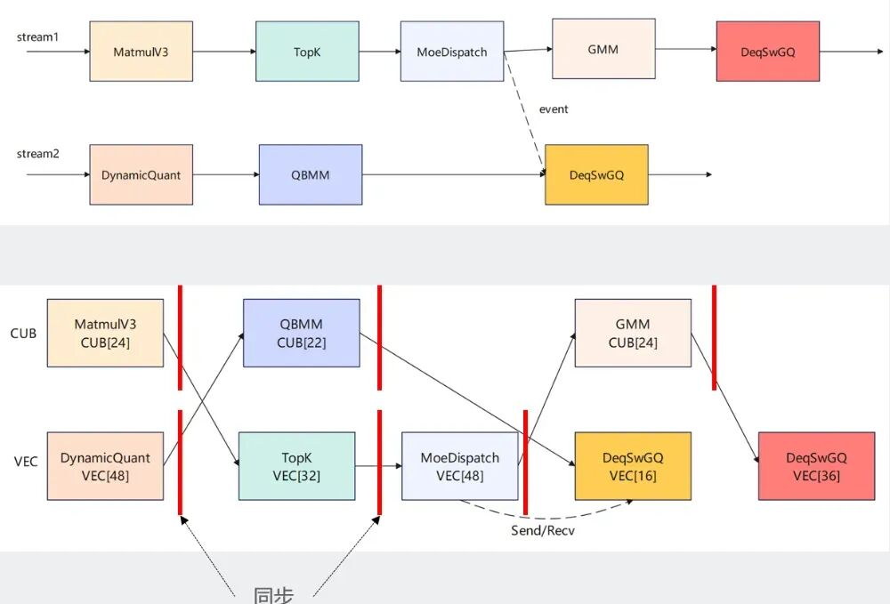

图15. 双流并发融合

## 4. 收益情况

通过对多个实际应用场景中的性能数据分析，验证了所采用的SuperKernel优化策略的有效性。这些优化在系统响应速度、模型运行效率及用户体验等方面均带来了显著提升。

具体来看，在某平台通过启用混合专家（MoE）功能并对涉及的多个算子进行优化，整体网络延迟降低了1.7毫秒，显著提升了系统响应速度。在某客户集群设备上，通过采用特定的Batch数，实现了4.8毫秒的性能提升，优化了大规模数据批处理的效率。

在模型架构层面，将注意力（ATTN）模块与前馈网络（FFN）模块进行分离的优化措施，带来了4毫秒的显著性能改进，大幅提升了模型运行时的计算效率。

在某客户的实地验证中，结合CANN提供的优化算子和客户自定义开发的优化算子，成功将解码阶段的延迟降低了6ms，有效改善了终端用户的使用体验。此外，针对MMoE（Multi-gate Mixture-of-Experts）推荐网络，通过基于SuperKernel对TBE算子进行扩展，实现了整网性能10%至20%的提升，进一步增强了系统在处理复杂推荐任务时的竞争力。

综上所述，各项优化措施在不同应用场景下均取得了明确的性能收益，为系统整体效率与响应能力的提升提供了有力支撑。

## 5. SuperKernel使用方法

SuperKernel是一种算子的二进制融合技术，它通过在内核函数级别进行深度优化，将多个子内核函数融合为一个统一的SuperKernel函数，显著减少任务调度等待时间和调度开销，并优化算子头开销。以下为相关使用方法与限制。

### 5.1 开启方法

使用torch.compile启用SuperKernel功能时，核心前提是确保计算图为静态图，即图中所有张量的形状（Shape）均为已知。

```
class RunModel(nn.Module):
```

具体提供以下两种配置方式：

| 关键参数 | 操作步骤 | 适用场景 |
| --- | --- | --- |
| dynamic=True | 1. 在编译模型时设置 dynamic=True。<br/> 2. 必须使用 torch._dynamo.mark_static()将模型输入张量显式标记为静态。<br/> 3. 执行模型。 | 适用于需要动态性控制的场景，可对特定输入进行静态化处理。 |
| dynamic=False | 1. 在编译模型时直接设置 dynamic=False。<br/> 2. 无需手动标记静态张量，直接执行模型即可。 | 适用于输入形状固定的典型静态图场景，操作更为简便。 |

### 5.2 使用限制

当前SuperKernel技术在实际应用中存在以下限制，需予以关注：

算子和硬件引擎支持范围有限：目前支持AscendC开发的算子，对于TBE算子SuperKernel特性会自动跳过，不予融合

自定义算子需支持入图：开发者自定义的算子必须实现相应的接口，确保能够被计算图正确识别和捕获，否则无法参与SuperKernel的融合过程。

特定执行模式需要适配：对于设计上原本AIC和AIV配比为1:1的算子，需要对其进行适配，使其能够在AIC和AIV配比为1:2的模式下正确执行，以满足SuperKernel的调度要求。

仅支持静态图模式：当前SuperKernel特性仅支持静态图模式运行。这要求模型在编译前，所有中间张量的形状必须是可推断的、确定的。不支持动态图运行。

请注意，接口支持和限制可能随版本更新而变化，建议及时关注最新版本说明。开发者们可以访问Gitcode开源社区和文档获取SuperKernel的最新动态。

## 6. 维测和问题定位

### 6.1 如何确认图是否是静态图

最终需要确保Torch转换为GE的图为静态图，否则无法开启SuperKernel，动态图的识别方法，最直接的方式开启GE图的Dump：

```
export DUMP_GE_GRAPH=3
export DUMP_GRAPH_LEVEL=3
```

在运行目录下找到 ge_**_Build.txt/pbtxt 文件。

使用Netron工具打开查看 “_unknow” 结尾子图节点，或者搜索 “unknow” 子图节点。

```
node {
    name: "graph_2_sub_2_unknow"
	op_type: "subgraph"
}
```

或者查看Node对应算子 “_is_unknown_shape” 属性是否为1。

```
node {
    name: ""
    op_type: ""
    attribute {
      name: "_is_unknown_shape"
      i: 1
      type: INT
}
```

### 6.2 SuperKernel执行卡死定位

打开环境变量保留SuperKernel生成的中间代码：

```
export ASCEND_OP_COMPILE_SAVE_KERNEL_META=1
```

打开SuperKernel调试选项，多个SK的选项用冒号分割，比如：

stream-fusion=1:compile-options=-g​​​​​​​

```
torchair.scope.super_kernel('layers', 'compile-options=-g') 
# 多个compile-option用逗号分割，如compile-options=-g,-O3
```

重新执行模型查看日志：

```
The error from device(chipId:4, dieId:0), serial number is 16, there is an exception
of fftgplusaivector error, core id is 0, error code = 0, dump info:pc start:0x12c0c02421ec, current:0x12c0c0244260, vec error info: 0b5690606674,............
Aicore kernel execute failed, device_id=4, stream_id=64, report_stream_id=2,task_id=8,ftp_name,fault kernel_name=re_superkernel_9402ca1fea128689963df1b334led1b238c4c478452ba49888085161254686b36b364036c466c455473752c080186c816b8d_static_bin,fault kernel_info te_superkernel_9402ca1fea123485884b41b334led1b238c4c478452ba4988
```


几个关键点的解释如下：

- fftgplusaivector error：vector核，如果是cube核则打印的是fftgplusaicore error；
- pc start: 0x12c0c02421ec, current: 0x12c0c0244260: PC偏移0x2074；
- te_superkernel_9402ca1fea123485884b41b334led1b238c4c478452ba4988: 出问题的object文件为：

te_superkernel_9402ca1fea123485884b41b334led1b238c4c478452ba4988.o。使用反汇编工具llvm-objdump(CANN包路径)查看代码行，例如：

```
llvm-objdump -S -l 
te_superkernel_9402ca1fea123485884b41b334led1b238c4c478452ba4988.o
```

查看偏移对应的代码行。注意，如果是aivector error则pc start对应的是

```
te_superkernel_xxx_mix_aiv 符号地址，如果是aicore error，pc start对应的是te_superkernel_xxx_mix_aic。
```

### 6.3 精度调试

通过Cache和同步排查，对应的SK选项如下：

```
torchair.scope.super_kernel('layers', 'debug-dcci-all=1') # 自动为每个算子结束后插入cache强制刷新，每算子约2-3us耗时，仅做排查问题使用
torchair.scope.super_kernel('layers', 'debug-sync-all=1') # 算子之间强制使用饱和同步模式，针对双流下性能对比不开sk可能劣化，仅做排查问题使用
```

如果使用debug-dcci-all=1排除问题，则需要排查算子代码中Cache刷新部分；

如果使用debug-sync-all=1排除问题，则需要排查SuperKernel生成的代码中同步是否正确，通过Review生成的代码或者联系SK研发处理。

### 6.4 SuperKernel下的算子开发注意事项

#### 6.4.1 使用Ascend C提供的API，SuperKernel在部分API中做了适配

```
block_idx/get_block_idx() -> AscendC::GetBlockIdx() // 获取当前核索引，sk内部做了1:1/1:2下的区分
block_num/get_block_num() -> AscendC::GetBlockNum() // 获取当前核数，sk内部做了固定核数的适配
get_task_ration() -> AscendC::GetTaskRation() // 获取运行时vector/cube比例，sk未来可能会做适配
```

GM地址使用Scalar读写时依赖API的Cache刷新，例如：

【错误写法】

```
*(__gm__ int32_t)xGm = 1;
auto scale = *(__gm__ float *)scaleGm;
```

【正确写法】

【方式一】使用AscendC提供的API

SuperKernel编译时会在GlobalTensor的GetValue/SetValue/operator()中增加Cache刷新的指令:

```
auto xGlobal = GlobalTensor<int32_t>(...);
xGlobal.SetVale(0, 1);
auto scaleGlobal = GlobalTensor<float>(...);
auto scale = scaleGlobal.GetValue(0); // 或 scaleGlobal(0)
```

【方式二】自行刷新Cache

（不推荐）DCCI非标准API可能存在跨代兼容问题：

```
*(__gm__ int32_t)xGm = 1;
dcci(xGm, 0, 2); // 写入后刷新，xGm地址所在cache行(cache一行64字节，64对齐)
// ...
dcci(scaleGm, 0, 2); // 读取前刷新
auto scale = *(__gm__ float *)scaleGm;
```

#### 6.4.2 MIX 1:1算子，当前依赖算子在运行时支持1:2

```
if (AscendC::GetSubBlockIdx() != 0) {
  // NotifyEvent/WaitEvent 适配，不做数据搬运和Vector计算
}
```

## 7. 总结

SuperKernel技术通过将多个算子融合成一个大算子，显著减少了任务调度开销。它还在算子级和网络级层面进行了多项优化，进一步提升了模型的运行效率，成为了大模型推理加速的有效解决方案。
