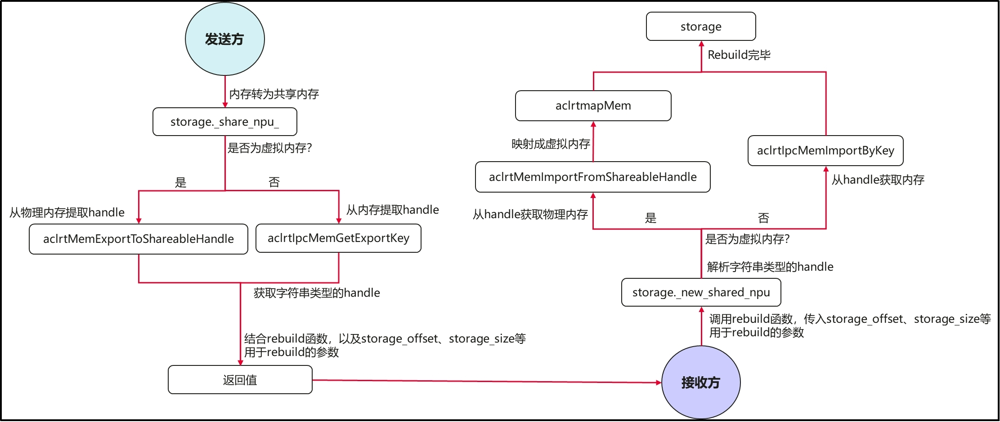
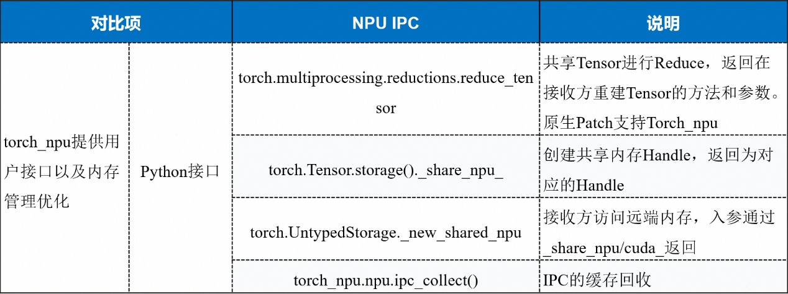
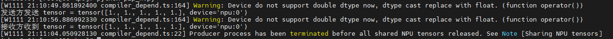
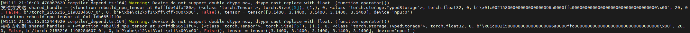
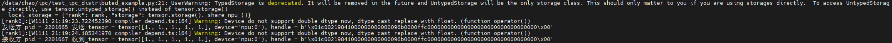

## 1 背景介绍

IPC（Inter-Process Communication，进程间通信）允许不同进程之间直接访问共享的设备内存，而无需进行显式的内存拷贝操作，从而显著提升通信效率。昇腾当前已基于Ascend Extension for PyTorch（昇腾NPU适配PyTorch框架的插件，也称为torch_npu）提供了IPC特性的原子能力，使开发者在分布式训练、强化学习等需要多进程大规模数据通信场景可以自主开发优化，提升数据传输性能并节省设备内存消耗。目前已经在强化学习实践中验证，通过使能IPC特性，可以省去训练进程向推理进程拷贝权重数据的过程，推理进程通过共享内存直接获取权重数据，大幅降低了推理进程的内存消耗。本文将详细介绍IPC的原理以及使用方法。

## 2 torch_npu的IPC特性解析

### 2.1 torch_npu的IPC设计原理

torch_npu的IPC设计整体逻辑主要包括以下两个步骤：
1.  **发送方操作**
	
    将张量（Tensor）和存储（Storage）的内存信息封装为一个句柄（Handle），并结合存储大小（Storage_Size）、存储偏移量（Storage_Offset）等关键信息，以及用于重构的函数一并打包返回，供接收方使用；

2.  **接收方操作**

 	接收到这些信息后，利用重构函数和Handle等参数，恢复到原来的Tensor和Storage对象，实现跨进程的数据共享。




<center>图1. torch_npu IPC通信流程图</center>

以reduce_tensor为例，其具体流程如下:


<center>图2. reduce_tensor流程示例</center>

**发送方流程：**

1.  统一的reduce化入口：无论采用multiprocessing传参、还是直接调用reduce_tensor进行reduce化操作，最终都会通过storage.\_share_npu_接口对内存进行reduce化处理;

2.  内存Handle生成：storage.\_share_npu_的C++实现会判断虚拟内存是否启用，并调用相应的acl接口。这一过程生成一个字符串形式的内存句柄（Handle），并与storage_offset等辅助参数打包后返回；

3.  参数传递到用户层：上层Python获取到打包后的参数后，结合rebuild函数返回完整的数据，供用户进一步使用并发送给接收方。

**接收方流程：**

1.  参数获取与rebuild启动：接收方接收发送方传来的全部参数，并调用rebuild函数将参数传入，从而触发NPU内存的重建，通过storage.\_new_shared_npu接口实现。

2.  建内存解析：storage.\_new_shared_npu的C++实现会根据虚拟内存配置的不同调用相应acl接口。此步骤会解析出内存Handle并获取到实际的内存指针。在启用虚拟内存的场景中，还需额外进行从物理内存到虚拟内存的映射操作。

3.  返回完整storage对象：接口内部将内存指针与storage_offset等参数封装为完整的storage对象，最终交由上层Python返回，完成共享内存的传递过程。

### 2.2 torch_npu IPC版本约束​

**1.  HDK多进程支持限制**

由于HCCP的多进程功能在HDK 25.0.RC1版本中才首次实现，因此若要使用该功能，必须升级至HDK 25.0.RC1或更高版本。

**2.  HDK多次Import支持限制**

HDK 25.3.RC1版本修复了多次调用aclrtMemImportFromShareableHandle接口时无法成功导入的问题。为适配这一改进，torch_npu 7.2.0版本移除了与多次导入不兼容的内存映射机制。因此，若需使用多次导入功能，需使用HDK 25.3.RC1或更高版本。

**3.  CANN 白名单与 P2P 支持限制**

CANN 8.3.0版本开始支持去除白名单限制和EnableP2P功能。torch_npu 7.2.0对此进行了相应适配，不再需要手动控制白名单。因此，若想使用这些功能，需使用CANN 8.3.RC1或更高版本。

**4.  torch_npu功能适配限制**

torch_npu对HDK与CANN的相关改进进行了适配。为确保功能正常运行，建议使用torch_npu 7.2.0或更高版本。

**5.  节点内共享限制**

当前仅支持在**同一节点内部**进行内存共享，跨节点共享暂不支持。

**6.  内存格式限制**

torch_npu目前仅支持ND格式的内存共享。若通过IPC（进程间通信）共享Storage，必须使用ND格式，不支持私有内存格式的共享。

### 2.3 IPC接口列表





### 2.4 跨卡内存映射

在处理reduce_tensor操作时，接收方可以通过将接收到的Tensor直接映射到其他NPU设备上，实现跨设备共享。例如：

```python
# 接收方获取参数

func, list_args = list(args)

# 修改目标设备号（示例映射到卡1）

list_args[6] = 1  

# 重建tensor到目标设备

tensor2 = func(*list_args)
```

### 2.5 rebuild_npu_tensor参数详解

rebuild_npu_tensor的作用是重新构建一个指向共享内存存储设备的Tensor。该函数支持跨设备Tensor映射和恢复，其详细定义如下：

```python
def rebuild_npu_tensor(

    tensor_cls,           # tensor类型 (通过type(tensor)获取)

    tensor_size,          # tensor尺寸

    tensor_stride,        # tensor步长

    tensor_offset,        # tensor偏移量

    storage_cls,          # storage类型 (通过type(storage)获取)

    dtype,                # 数据类型

    storage_device,       # storage设备 (修改此参数实现跨卡映射)

    storage_handle,       # 内存handle (接收方解析获取)

    storage_size_bytes,   # storage字节大小

    storage_offset_bytes, # storage字节偏移

    requires_grad,        # 是否需要梯度

    ref_counter_handle,   # 引用计数管理handle (禁止修改)

    ref_counter_offset,   # 引用计数偏移量 (禁止修改)

    event_handle,         # 事件handle (当前版本不支持)

    event_sync_required   # 事件同步标记 (当前版本恒为False)

)
```

【注意】事件同步机制说明：（1）PTA当前不支持Event序列化传输，创建Event并序列化将触发错误。（2）发送方在创建IPC共享内存之前，会执行一次流同步。

### 2.6 底层共享接口说明

#### 2.6.1 核心接口详解

```python
# 发送方：创建共享内存handle

storage_handle = tensor.storage()._share_npu_()

# 接收方：从handle重建storage

storage = torch.UntypedStorage._new_shared_npu(*handle_args)
```

#### 2.6.2 _new_shared_npu参数详解

```python
def _new_shared_npu(

    storage_device,       # storage设备 (修改此参数实现跨卡映射)

    storage_handle,       # 内存handle (接收方解析获取)

    storage_size_bytes,   # storage字节大小

    storage_offset_bytes, # storage字节偏移

    ref_counter_handle,   # 引用计数管理handle (禁止修改)

    ref_counter_offset,   # 引用计数偏移量 (禁止修改)

    event_handle,         # 事件handle (当前版本不支持)

    event_sync_required   # 事件同步标记 (当前版本恒为False)

) -> torch.UntypedStorage
```


## 3 完整示例代码

### 3.1 多进程之间直接传递Tensor

以下示例展示了如何在多进程中直接传递Tensor：

```python
import torch

import torch_npu

import torch.multiprocessing as mp

from multiprocessing import Queue

def worker(tensor):

    print(f"接收方收到 tensor = {tensor}")

if __name__ == '__main__':

    # 必须使用spawn方法

    mp.set_start_method('spawn')

    tensor = torch.full((5,), float(1.0), device='npu:0')

    print(f"发送方发送 tensor = {tensor}")

    # torch.npu.synchronize()

    p = mp.Process(target=worker, args=(tensor,))

    p.start()

    p.join()
```

执行结果：




### 3.2 通过multiprocessing.Queue传递Tensor

以下示例展示了如何利用multiprocessing.Queue进行Tensor的传输：

```python
import torch

import torch_npu

import torch.multiprocessing as mp

from multiprocessing import Queue

def worker(tensor_queue):

    tensor = tensor_queue.get()

    print(f"接收方收到 tensor = {tensor}")

if __name__ == '__main__':

    # 必须使用spawn方法

    mp.set_start_method('spawn')

    tensor_queue = Queue()

    p = mp.Process(target=worker, args=(tensor_queue,))

    p.start()

    tensor = torch.full((5,), float(1.0), device='npu:0')

    tensor_queue.put(tensor)

    print(f"发送方发送 tensor = {tensor}")

    p.join()
```

执行结果：


### 3.3 通过reduce_tensor传递Tensor

接收方可以通过修改Tensor的Device信息实现跨设备映射：

```python
import torch

import torch_npu

import torch.multiprocessing as mp

from torch.multiprocessing.reductions import reduce_tensor

from multiprocessing import Queue

def worker(tensor_queue):

    shared_handles = tensor_queue.get()

    func, args = shared_handles

    print(func)

    list_args = list(args)

    # 修改目标设备为卡1

    list_args[6] = 1

    tensor = func(*list_args)

    print(f"接收方收到 shared_handles = {shared_handles}, tensor = {tensor}")

if __name__ == '__main__':

    mp.set_start_method('spawn')

    tensor_queue = Queue()

    p = mp.Process(target=worker, args=(tensor_queue,))

    p.start()

    tensor = torch.full((5, ), float(3.14), device=f"npu:0")

    shared_handle = reduce_tensor(tensor)

    tensor_queue.put(shared_handle)

    print(f"发送方发送 shared_handle = {shared_handle}, tensor = {tensor}")

    p.join()
```

执行结果：




### 3.4 通过_share_npu_传递Tensor (集合通信方式)

该方法适合在分布式框架中处理跨进程内存共享，示例如下：

```python
import

import torch

import torch_npu

import torch.distributed as dist

import torch.multiprocessing as mp

def worker(rank, world_size):

    """分布式工作进程"""

    #  初始化分布式环境

    os.environ['MASTER_ADDR'] = 'localhost'

    os.environ['MASTER_PORT'] = '12355'

    torch.npu.set_device(rank)

    dist.init_process_group(backend="hccl", rank=rank, world_size=world_size)

    pid = os.getpid()

    #  进程0：创建共享内存

    if rank == 0:

        tensor = torch.full((5,), float(1.0), device='npu:0')

        #  创建共享内存handle

        local_storage = {"rank": rank, "storage": tensor.storage()._share_npu_()}

        print(f"发送方 pid = {pid} 发送 tensor = {tensor}, handle = {local_storage['storage'][1]}")

    else:

        local_storage = {"rank": rank, "storage": None}

    #  广播共享内存handle

    gather_storage_list = [None] * world_size

    dist.all_gather_object(gather_storage_list, local_storage)

    #  进程1：接收并重建tensor

    if rank == 1:

        tensor = torch.zeros((5,), device='npu:0')

        #  获取进程0发送的handle

        send_storage = gather_storage_list[0]['storage']

        #  重建storage对象

        storage = torch.UntypedStorage._new_shared_npu(*send_storage)

        #  设置tensor存储

        tensor.set_(storage)

        print(f"接收方 pid = {pid} 收到 tensor = {tensor}, handle = {send_storage[1]}")

if __name__ == "__main__":

    mp.set_start_method('spawn')

    world_size = 2

    processes = []

    #  启动工作进程

    for rank in range(world_size):

        p = mp.Process(target=worker, args=(rank, world_size))

        p.start()

        processes.append(p)

    #  等待所有进程结束

    for p in processes:

        p.join()
```

执行结果：




## 相关链接

[1] Ascend Extension for PyTorch/PyTorch框架特性指南/内存资源优化/内存共享（IPC）：<https://www.hiascend.com/document/detail/zh/Pytorch/720/ptmoddevg/Frameworkfeatures/featuresguide_00031.html>

[2] Ascend/pytorch代码仓：<https://gitcode.com/ascend/pytorch/tree/master/torch_npu/csrc/ipc>


