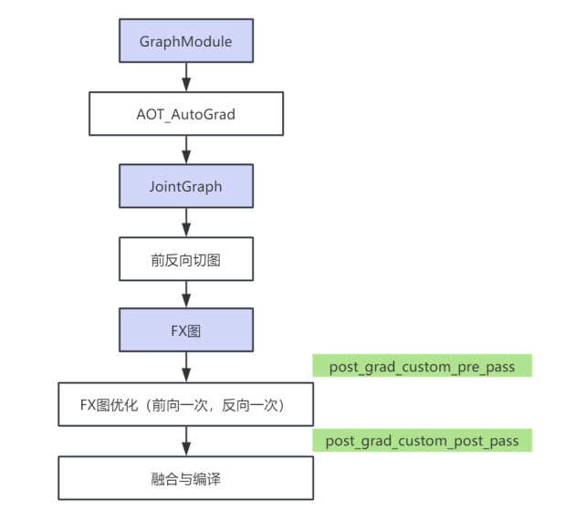
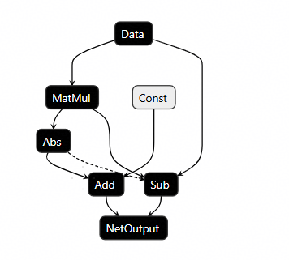
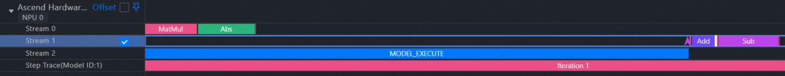

# TorchAir自定义FX Pass

在昇腾NPU上利用PyTorch图模式进行大模型推理时，为充分挖掘硬件性能，开发者常需实现多流并行等优化手段。然而，此前实现多流并行的方式存在一定局限：开发者需在模型脚本中手动给流打标签。这种方式虽然可行，但随着vLLM等推理框架对多流并行模式的需求日趋稳定和通用，此类手动适配不仅繁琐，更引入了大量重复代码，成为开发效率的瓶颈。

本实战指南介绍如何通过TorchAir的自定义FX Pass功能，将多流并行等优化方法自动化。开发者仅需通过三个步骤，即可将优化逻辑从"手动硬编码"转变为"声明式图变换"，从而显著提升开发效率与代码质量。

## **什么是FX Pass？**

在PyTorch的图编译体系中，FX Pass指对已捕获的计算图（torch.fx.Graph）进行遍历、分析和转换的系列操作。它类似于传统编译器中的优化步骤，允许在不修改模型源代码的前提下，实现算子融合、常量折叠等高级变换。TorchAir通过开放此能力，使得开发者不仅能在FX Graph中直接定义并执行算子替换、子图重构等通用优化，还能调用TorchAir特有的API，在FX Graph中直接表达原生框架所不具备的多流并行与流间执行时序控制等硬件级优化。这使多流并行的实现得以自动化、结构化，显著降低了适配成本与代码冗余。

## **基于自定义FX Pass的图变换**

为了解决图模式表达多流执行语义场景下需要在模型脚本中手动打流标签的问题，TorchAir扩展了编译流程，开发者可以将多流并行等优化逻辑编写为独立的**自定义Pass**，该Pass会在TorchAir编译过程中被自动调用，并应用于计算图上，从而将多流并行的实现逻辑从模型脚本中解耦出来。

编译过程中涉及的主要图优化阶段如下图所示，可以看到TorchAir本身在FX图优化阶段内置了部分FX图优化Pass，开发者注册的自定义Pass将融入此流程：若注册到**post_grad_custom_pre_pass**阶段，它将在TorchAir内置的FX图优化Pass之前执行；若注册到**post_grad_custom_post_pass**阶段，则在TorchAir内置的FX图优化Pass之后执行。




## **核心机制**

技术规范上，一个有效的自定义FX Pass需遵循以下函数签名与约定，接收经AOT（预先编译）转换后的GraphModule对象gm，通过gm.graph访问其内部FX计算图并进行修改。example_inputs作为FakeTensor类型的示例输入。config供Pass感知完整的编译选项：

```python
def your_pass_name(gm, example_inputs, config: torchair.CompilerConfig) -> None:
# 访问gm.graph，在此进行图变换
```

在该函数中，开发者可以使用FX Graph与TorchAir提供的工具方法：

- **识别特定结构模式**：定位需要优化的目标算子或者特定的计算子图模式（pattern）。

- **修改图结构**：执行节点的插入、删除、替换操作或调整边的连接。

- **实现流控制**：将一系列算子调度到独立的计算流上执行，需要在其起始与结束位置分别插入流进入标记(torch.ops.air.scope_enter.default)与退出标记(torch.ops.air.scope_exit.default)。当不同流上的算子存在先后依赖时，则可通过torchair.ops.record与torchair.ops.wait接口在图中插入对应的事件记录与等待节点，以确立正确的同步关系。

- **实施通用优化**：进行任意基于规则的图等价变换。

> 通过遵循此约定，开发者能够将各类优化逻辑封装为可为一个复用、可维护的独立模块，与模型主干代码清晰解耦。

## **接入流程**

开发者只需三个步骤即可完成自定义FX Pass的集成：

**1.编写FX Pass函数**：定义FX图变换逻辑，识别目标模式并实施相应变换（如插入流控制、替换算子等）。

**2.注册Pass至编译配置**：通过torchair.CompilerConfig将自定义FX Pass注册到TorchAir编译流程中。

**3.执行编译与运行**：原有模型脚本无需改动，编译时自动应用注册的Pass，生成优化后的昇腾IR图。

## **完整使用案例：以多流并行为例**

以下通过一个具体示例，展示如何使用自定义FX Pass实现多流并行。假设原始模型如下：

```python
class Model(torch.nn.Module):
    def __init__(self):
        super().__init__()

    def forward(self, x):
        mm = torch.mm(x, x)   # 矩阵乘法
        abs = torch.abs(mm)   # 绝对值
        add = torch.add(abs, 1) # 加法
        sub = torch.sub(x, mm)  # 减法
        return add, sub
```

优化目标是：将mm和abs算子调度到一个新的独立流（stream_1）上执行，同时控制执行时序，确保sub算子必须在abs算子完成后才能开始执行。

 **步骤一：实现自定义Pass函数**

编写一个FX Pass，在编译阶段自动修改计算图，插入流控制和同步节点。

```python
def _custom_pre_pass(gm, example_inputs, config: torchair.CompilerConfig):
    fx_graph = gm.graph
    for node in fx_graph.nodes:
        # 1.在`mm`算子前插入流进入标记节点torch.ops.air.scope_enter.default，其后的算子将默认在`stream_1`上执行
        if node.op == "call_function" and node.target == torch.ops.aten.mm.default:
            with fx_graph.inserting_before(node):
                fx_graph.call_function(torch.ops.air.scope_enter.default,args=(["_user_stream_label"], ["stream_1"]))

        # 2.在`abs`算子后插入记录事件节点torch.ops.air.record.default，并退出`stream_1`流
        if node.op == "call_function" and node.target ==torch.ops.aten.abs.default:
            with fx_graph.inserting_after(node):
                record_node = fx_graph.call_function(torch.ops.air.record.default, args=())
            with fx_graph.inserting_after(record_node):
                fx_graph.call_function(torch.ops.air.scope_exit.default,args=())
                
        # 3.在`sub`算子前插入等待事件节点torch.ops.air.wait.default，确保它等待torch.ops.air.record.default前的节点执行完成     
        if node.op == "call_function" and node.target == torch.ops.aten.sub.Tensor:
            with fx_graph.inserting_before(node):
                fx_graph.call_function(torch.ops.air.wait.default, args=([record_node],))
```

该Pass的核心操作是：为指定算子包裹流范围（scope_enter/exit），并在需要同步的边界插入record/wait事件对。

**步骤二：注册Pass并执行编译**

接下来，将编写好的Pass注册到编译配置中，并用torch.compile触发优化流程。

```python
import torch
import torchair

config = torchair.CompilerConfig()
# 配置_custom_pre_pass在TorchAir内置的FX图优化Pass前执行
config.post_grad_custom_pre_pass = _custom_pre_pass
# 获取集成了自定义Pass的昇腾后端
npu_backend = torchair.get_npu_backend(compiler_config=config)
model = Model().npu()# 启动图模式编译，自定义Pass将在编译过程中自动生效
opt_model = torch.compile(model, backend=npu_backend)
# 执行模型
x = torch.randn([3, 3]).npu()
opt_model(x)
```

通过以上配置，原始的 Model.forward 函数在执行时，其内部计算图将被自动重构，无需对模型源码做任何手动修改。

**步骤三：效果验证与调试**

max-autotune模式下，可以dump图结构来观察图上对应的算子是否有控制边（图中虚线为控制边，用来控制时序）：


也可以通过打印Profiling文件来观测结果，在Profiling结果中，可以清晰看到mm和abs在stream_1上执行，而sub在等待相关事件完成后才在主流上开始执行：



## **案例价值**

以MoE结构多流优化为例，其多个专家（Expert）间的计算相互独立，适合多流并行。在过去，开发者需要为每个专家模块手动包裹流切换代码。而现在，只需编写一个通用的FX Pass，识别所有专家子图，自动为每个专家分配独立流，并在必要时插入同步操作。

这一Pass可复用于所有具有类似MoE结构的模型，实现"一次编写，多处使用"，极大减少了模型适配时的冗余工作。

## **总结与展望**

通过提供自定义FX Pass能力，昇腾平台在支持PyTorch图模式方面更进一步，将图优化如多流并行、算子执行时序控制等从"手动硬编码"转变为"声明式图变换"。不仅降低了开发者的接入门槛，也提升了代码的可复用性与可维护性。该机制进一步强化了PyTorch图模式在昇腾平台上的表达能力和优化空间，为复杂模型的高效推理提供了更灵活的支撑。开发者可以聚焦于算法与模型结构本身，而非底层流控细节。

未来，我们将继续丰富TorchAir的图优化能力，并探索与AI框架生态的更深度集成，助力开发者在昇腾平台上更轻松地实现高性能推理。

[TorchAir开源仓](https://gitcode.com/Ascend/torchair)

[TorchAir图模式使用指南](https://www.hiascend.com/document/detail/zh/Pytorch/720/modthirdparty/torchairuseguide/torchair_00003.html)
