# vLLM-Ascend推理优化

大模型有望从根本上改变各行业对人工智能的应用方式。然而，实际部署这些模型面临诸多挑战，即便在昂贵的硬件上，其运行速度也可能出人意料地缓慢。在大模型应用日益广泛的今天，如何高效、低成本地进行模型推理成为了一个关键问题。

vLLM作为一个出色的开源推理引擎，因其高效的内存管理机制而受到关注。昇腾已经通过vLLM-Ascend开源项目完成了对vLLM的适配。本文将带大家了解vLLM和vLLM-Ascend，并分享基于vLLM-Ascend优化大模型推理的实践经验。

**1. 推理加速引擎vLLM**

vLLM是一个为大模型提供高吞吐量和内存高效推理服务的开源引擎，它使用PagedAttention技术高效实现KV Cache的内存管理，并支持多种推理特性。

1.1 **传统推理的内存困境**

在常规的推理过程中，当处理一个序列(比如一个用户的提问)时，系统需要为这个序列生成过程中产生的所有中间计算结果(即注意力机制中的键值缓存，KV Cache)分配连续的内存空间。由于序列长度可变且难以预测，这容易导致内存碎片化，使得即使有剩余内存，也无法被有效利用，从而限制了同时处理的请求数量(吞吐量)。因此，高效管理KV Cache成为一项重大挑战。

1.2 **PagedAttention 的解决方案**

与传统注意力算法不同，PagedAttention允许将连续的键值张量存储在非连续的内存空间中。具体来说，PagedAttention将每个序列的 KV Cache划分为多个块，每个块包含固定数量令牌对应的键和值。在注意力计算过程中，PagedAttention内核会高效识别并调取这些块。

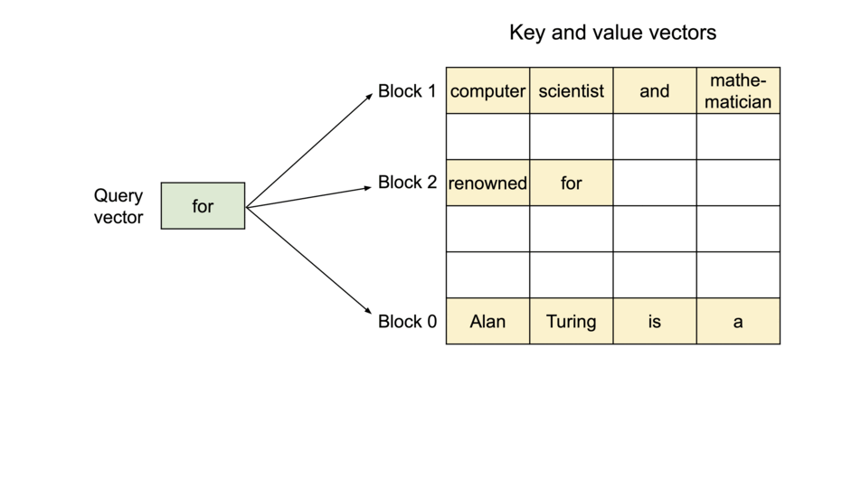

这样一来：

- 非连续物理存储：一个序列的 KV Cache可以分散在物理上不连续的多个内存块中。
- 消除内存碎片：管理器可以高效地分配和回收这些固定大小的块，极大地减少了内存浪费。
- 高效共享：在并行处理多个提示(Prompt)相似或存在公共前缀的请求时，不同的请求可以共享这些内存块，从而避免重复计算，节省大量内存和计算资源。

正是通过这种精细化的内存管理，vLLM在同等硬件条件下，能够显著提升服务的吞吐量。

**2. vLLM-Ascend：适配昇腾芯片的推理优化方案**
 **2.1 它是什么？**

vLLM-Ascend 是基于 vLLM架构扩展的开源项目，专门针对昇腾芯片进行了适配与优化。其目标是在昇腾芯片上实现与大模型推理相关的高效计算与内存管理。

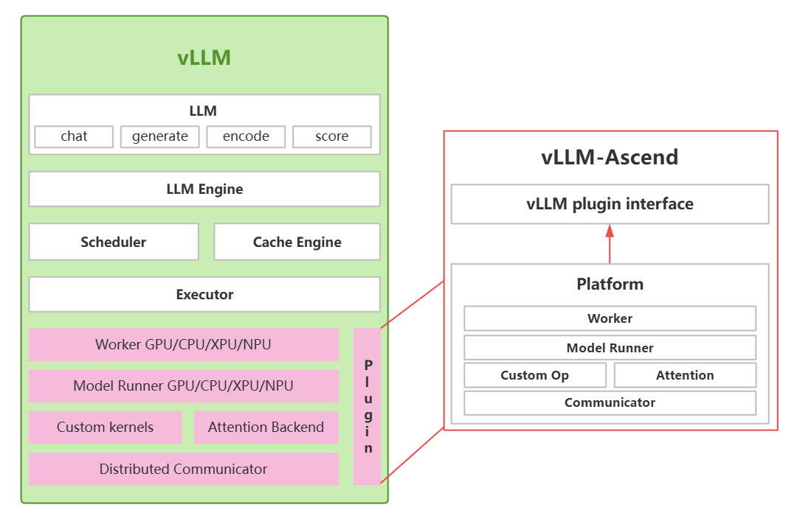

**2.2 为什么要选择vLLM-Ascend？**

vLLM-Ascend通过硬件插件化机制解耦了框架与硬件依赖，在保留 PagedAttention等核心机制的基础上，对算子和内存调度进行了硬件适配，使其能够充分利用昇腾芯片的计算特性，为大模型提供极致性能优化。目前vLLM-Ascend已经支持vLLM的V1模式，支持在昇腾平台上高效运行稠密大模型、混合专家模型等多类型开源大模型。对用户而言，使用vLLM-Ascend的体验与使用原生vLLM 的体验几乎没有差别，用户只需在安装了vLLM-Ascend的环境中运行vLLM，即可自动启用NPU进行推理，代码完全开源，且新特性适配也在持续进行。vLLM-Ascend的存在极大地降低了开发者在昇腾生态部署和优化主流大模型的门槛。

**2.3 基于vLLM-Ascend的大模型推理性能优化实践**

在实际优化过程中，采用了多项技术，本节将针对其中收益贡献较大的TorchAir整图下沉使能、MoE/MLA多流并行、零冗余TP转EP通信优化、大EP场景下Transpose与Cumsum消除等优化手段做逐一介绍。

**2.3.1 基于TorchAir图编译优化消除调度开销，实现推理吞吐翻倍**

PyTorch的Eager模式可以通过Ascend Extension for PyTorch（torch_npu）无缝对接昇腾芯片，但推理总耗时易受算子下发调度开销影响，出现调度Bound现象，从而显著影响性能。以DeepSeek-V3的MLA结构为例，下图展示了PyTorch在Eager模式下的调度开销情况：NPU在大部分时间处于空闲状态，CPU侧算子调度开销成为推理耗时的关键因素。

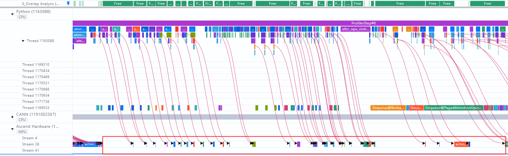

针对该问题，PyTorch 2.0引入了torch.compile特性，基于TorchDynamo实现了基于CPU/GPU的原生图模式能力，支持将网络中算子合并为统一调度的图结构，从而消除Decode推理过程中的调度时延。TorchAir（Torch Ascend Intermediate Representation）作为昇腾适配TorchDynamo至Ascend IR的中间件，为PyTorch在NPU环境下的图模式提供了基础支持。通过在vLLM中启用TorchAir图模式([https://github.com/vllm-project/vllm-ascend/pull/789](https://github.com/vllm-project/vllm-ascend/pull/789))，有效消除了rollout阶段推理Decode部分的算子下发开销。

开启TorchAir图模式后单层模型对应Profiling如下图所示，可见其中的调度开销被完全消除：

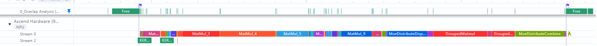

实测结果显示，在双层Dense + MoE网络中，图模式下的推理耗时优化达9.5毫秒，在671B全参数整网中Decode吞吐实现翻倍提升。

**2.3.2 基于多流并行优化MoE与MLA计算，实现吞吐持续提升**

TorchAir图模式支持在网络脚本中表达算子多流执行的语义([PyTorch图模式使用(TorchAir)-Ascend Extension for PyTorch7.0.0-昇腾社区](https://www.hiascend.com/document/detail/zh/Pytorch/700/modthirdparty/torchairuseguide/torchair_0033.html))，基于这一功能，结合DeepSeek-V3网络结构特点，可将部分算子做多流并发执行，提升Decode性能。

**MoE多流-通算并行：**

DeepSeek-V3网络的MoE结构计算路由专家与共享专家的激活值，其中，路由专家的权重被EP切分，需要在GroupedMatmul计算前后做卡间的AlltoAll通信(由MC2算子实现)；共享专家权重被TP切分，需要在Matmul计算后做卡间AllReduce通信，且路由专家与共享专家的计算无数据依赖关系。

在vLLM-Ascend的原生实现中，共享专家计算和路由专家计算串行执行，对应如下图所示的Profiling，可见其在计算与通信的编排上存在以下两个问题：

- MC2算子(同时包含通信与Vector计算)执行时，Cube运算单元闲置。
- 共享专家计算耗时较短，但其后AllReduce操作与MC2并发，导致通信带宽抢占。

针对MoE部分，通过TorchAir的多流能力将共享专家计算拆分至并行计算流中重新排布。具体而言，将共享专家的"gate_up_proj"矩阵运算与路由专家的"dispatch"通信算子并行执行，共享专家的"down_proj"矩阵运算与路由专家的"combine"通信算子并行执行，从而实现通算并行，优化Decode耗时。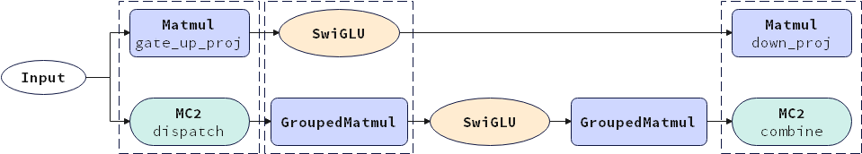

此外，为避免共享专家"down_proj"计算结束后的AllReduce通信拖尾，通过保存共享专家冗余权重的方式消除了张量并行引入的AllReduce通信。由于共享专家矩阵运算规模较小，即使未进行TP切分，其计算耗时也可被MC2算子基本掩盖，从而获得进一步的性能提升。

**MLA多流-CV并行：**

与MoE结构类似，DeepSeek-V3网络的MLA结构中亦存在部分无数据依赖的计算步骤。初始vLLM-Ascend的实现未考虑这一特点，将所有算子串行执行，因而存在进一步的优化空间。

针对MLA部分，同样可以经过一定的流水排布将无数据依赖的Cube与Vector计算作多流并行执行，提升Decode性能。

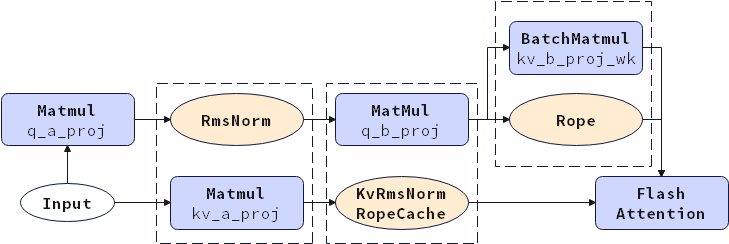

开启MoE多流与MLA多流优化后的网络片段Profiling如下图所示：

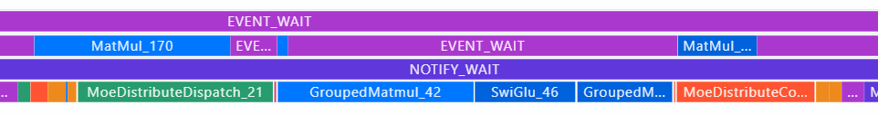
 

可见MoE层共享专家计算和MLA层Vector计算已被卸载到从流中，相关耗时被对应通信算子、Cube计算算子所掩盖，对应单步Decode TPOT优化6ms，整网推理吞吐提升7%。

**2.3.3 重构通信模式，消除冗余计算与传输，提升Decode吞吐**

为突破单设备内存限制，推理阶段针对MLA层与MoE层分别采用TP和EP切分，将DeepSeek-V3完整模型拆分至多个设备运行。在vLLM-Ascend的原始实现中，MLA层通过AllReduce完成张量并行场景下的数据汇聚，MoE层通过Split算子从中提取本卡所需数据，完成TP切分至EP切分的转换。该过程中AllReduce + Split的组合引入了通信量与计算量的双重冗余。

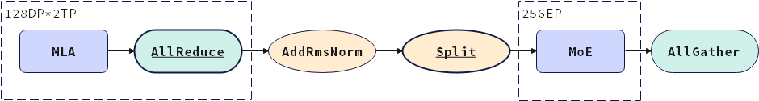

通过采用零冗余的TP转EP通信方案，在Decode阶段将MLA层的AllReduce算子替换为ReduceScatter算子，使MoE层仅接收本卡计算必需的数据，并将MoE层末尾的AllGather通信移至MLA层，确保原有TP切分逻辑的正确性。由于AllReduce算子的通信量与ReduceScatter及AllGather算子的通信量之和相当，该方案在保持MLA层整体通信量不变的前提下，消除了MoE部分原有的AllGather通信与Split算子。
 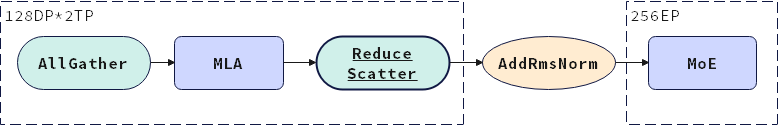

开启零冗余TP转EP通信优化后，MoE层内的StridedSlice和AllGather算子被消除。另一方面，MoE层通信的减少还进一步缓解了卡间通信不均衡问题，最终推理TPOT优化2ms以上，Decode吞吐提升超过3%。

**2.3.4 消除冗余算子Transpose、Cumsum，实现Decode关键路径优化**

**冗余Transpose算子**

DeepSeek-V3模型普遍使用大EP的推理部署方式，通过减少MoE部分参与GroupedMatmul计算的路由专家数量，以降低单次Decode耗时。然而，在分析EP256配置下的profiling时发现，GroupedMatmul算子执行前出现了额外的Transpose操作，导致性能反而出现较大劣化。
 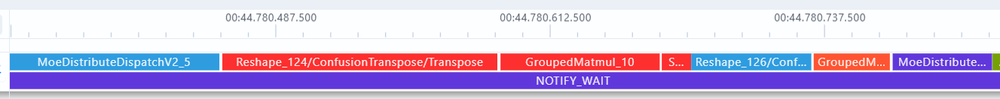
 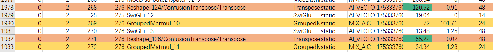

上图的profiling信息显示，单层MoE中的Transpose算子总耗时高达175us。经过模型代码排查、对比EP128无Transpose场景的dump图，发现问题由以下原因导致：

在EP256单卡1专家的配置下，由于专家权重shape中存在值为1的维度，导致针对权重的Transpose算子触发TorchAir的"enable_view_optimize"优化(详见[PyTorch图模式使用指导 > View类算子优化功能](https://www.hiascend.com/document/detail/zh/Pytorch/710/modthirdparty/torchairuseguide/torchair_00033.html))而被插入了额外的Reshape算子。
 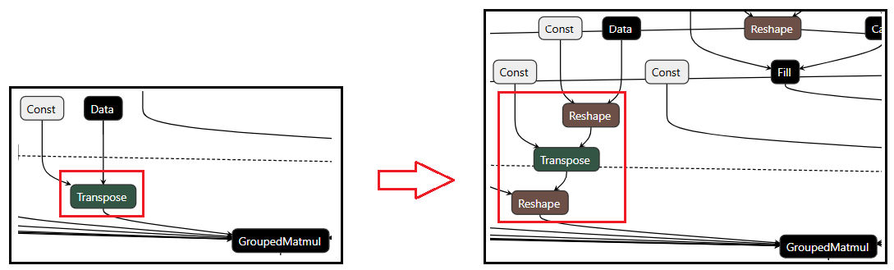

新引入的Reshape算子使融合Pass "GroupedMatmulTransFusionPass"无法检测到其预定目标模式，最终导致Transpose算子被保留到图执行阶段。

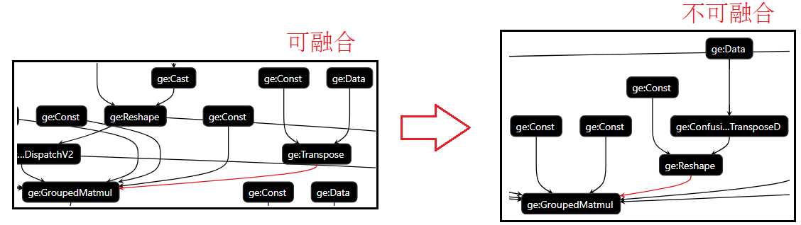

**冗余Cumsum算子**

DeepSeek-V3网络的多路由专家计算由GroupedMatmul算子实现，该算子用于批量处理多个矩阵乘法操作，通过将具有相同或相似形状的矩阵乘法操作组合在一起，减少内存访问开销和计算资源的浪费，从而提高计算效率。对应的torch_npu接口"npu_grouped_matmul"依赖入参"group_list"获取每个子矩阵运算中实际M轴的大小，并支持以"累加和数列"或"逐维度指定"两种形式提供这一参数。vLLM-Ascend的模型脚本中使用了"累加和数列"模式，因而在MoE层中引入了用于实现累加和的Cumsum算子。

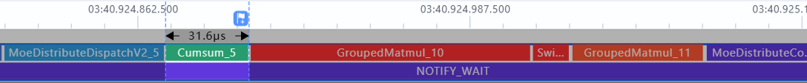

优化项"enable_view_optimize"在TorchAir中默认开启，目标是为了融合连续的view类算子。由于DeepSeek-V3网络不涉及这一目标场景，所以选择将其在"additional_config"配置中显式关闭，避免因此导致的Transpose/Gmm算子融合失败。

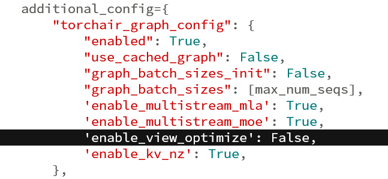

同时，修改vLLM-Ascend的网络脚本，调整"npu_grouped_matmul"接口的"group_list_type"配置，以消除原本的Cumsum操作。

调整TorchAir的优化功能开关"enable_view_optimize"和torch_npu接口"npu_grouped_matmul"的配置后，MoE阶段关键路径上的Transpose/Cumsum算子即被消除。尽管GroupedMatmul算子耗时有所增加，仍能获得单层158us，整网9ms的Decode性能收益，在3K推理长度下可将rollout总耗时优化超过28s。

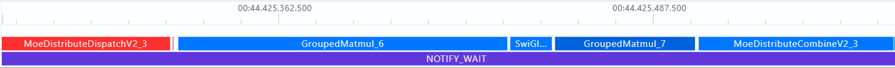

**3. 总结与展望**

vLLM-Ascend是一个完全开源的项目，致力于让大模型推理在昇腾芯片上运行得更高效、更经济。vLLM-Ascend开源项目目前已经达成如下能力并且在多个商用场景实现大模型的高效部署与商用上线：

1.vLLM原生特性支持：除inductor外社区特性全部支持，如PD分离、chunk prefill、Prefix cache、并行配置、multi lora、function call、MTP、图模式、静态负载均衡。

2.vLLM原生模型支持：支持稠密(Qwen、Llama)、稀疏MOE(Deepseek等)、多模态(Qwen VL)等40+主流模型。

3.昇腾贡献特性：长序列技术、动态负载均衡、DP负载均衡、通算融合、后处理优化、异步调度、DBO优化技术、量化技术等。

项目代码已在官方仓库中公开，并且在持续集成新特性的适配与优化。欢迎更多开发者来使用、反馈甚至参与贡献，共同推动大模型推理生态繁荣进步。

[vLLM-Ascend仓库地址](https://github.com/vllm-project/vllm-ascend)

[vLLM-Ascend使用文档](https://vllm-ascend.readthedocs.io/en/latest)
