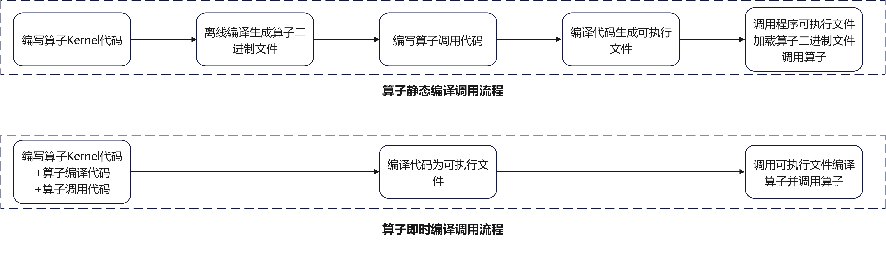
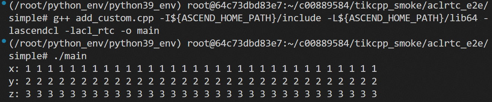

## 自定义算子开发系列：Ascend C RTC即时编译

### 1.基础知识准备

本文内容基于Ascend C算子开发衍生而来，对于算子开发还不了解的读者可以通过以下资源进行学习：

[《Ascend C算子开发文档手册》](https://www.hiascend.com/document/redirect/CannCommunityOpdevAscendC)

[《Ascend C算子开发系列课程》](https://gitcode.com/cann/cann-learning-hub/tree/master/tutorials/ascendc_operator_development)

### 2.背景介绍

传统算子静态编译技术通过提前将算子编译成可执行的二进制数据保存到存储设备，供算子调用程序运行时加载调用。在当前大模型的应用场景下，该编译方式存在了以下两点挑战：

1.大模型的输入语句不定长，使得模型中算子shape不确定，静态编译方式难以为每个shape提供最佳的算子性能。

2.算子通常都需要持续优化迭代，静态编译方式下由于算子对于调用程序的交付件是算子二进制文件，每次迭代需要重新编译算子，维护和优化不太方便。

因此昇腾推出了**Ascend C RTC（Runtime Compiler）** 技术，在算子调用程序运行时使用aclrtc接口直接编译执行算子Kernel源码，此时已经确定了算子的输入shape，类型等，可以针对特定shape编译出最佳性能的算子二进制文件；同时因为算子编译发生在算子调用程序运行阶段，算子的运行交付件不再是算子二进制文件而是算子Kernel源码，进一步提升了算子维护和优化的便利性。

 

### 3.亮点

- 运行时根据当前输入shape编译，
  算子执行性能提升
  。
- 编译IO交互减少，
  编译速度提升
  。
- 算子直接通过Kernel源码交付给算子调用程序，
  算子维护和优化更加便利
  。

### 4.实战介绍

**1.根据算子Kernel代码编译二进制数据**

 （1）头文件和宏定义

```
#include <iostream>
#include <fstream>
#include <vector>

#include "acl/acl.h"
#include "acl/acl_rt.h"
#include "acl/acl_rt_compile.h"

#define CHECK_ACL(x)                                                                              \
    do {                                                                                          \
        aclError __ret = x;                                                                       \
        if (__ret != ACL_ERROR_NONE) {                                                            \
            std::cerr << __FILE__ << ":" << __LINE__ << " aclError:" << __ret << std::endl;       \  
        }                                                                                         \
    } while (0);
```

（2）将Add算子Kernel代码赋值给字符串变量

```
const char *src = R""""(
#include "kernel_operator.h"
constexpr int32_t TOTAL_LENGTH = 8 * 32;                              // total length of data
constexpr int32_t USE_CORE_NUM = 8;                                   // num of core used
constexpr int32_t BLOCK_LENGTH = TOTAL_LENGTH / USE_CORE_NUM;         // length computed of each core
constexpr int32_t TILE_NUM = 1;                                       // split data into 1 tiles for each core
constexpr int32_t BUFFER_NUM = 2;                                     // tensor num for each queue
constexpr int32_t TILE_LENGTH = BLOCK_LENGTH / TILE_NUM / BUFFER_NUM; // separate to 2 parts, due to double buffer

class KernelAdd {
public:
    __aicore__ inline KernelAdd() {}
    __aicore__ inline void Init(GM_ADDR x, GM_ADDR y, GM_ADDR z)
    {
        xGm.SetGlobalBuffer((__gm__ float *)x + BLOCK_LENGTH * AscendC::GetBlockIdx(), BLOCK_LENGTH);
        yGm.SetGlobalBuffer((__gm__ float *)y + BLOCK_LENGTH * AscendC::GetBlockIdx(), BLOCK_LENGTH);
        zGm.SetGlobalBuffer((__gm__ float *)z + BLOCK_LENGTH * AscendC::GetBlockIdx(), BLOCK_LENGTH);
        pipe.InitBuffer(inQueueX, BUFFER_NUM, TILE_LENGTH * sizeof(float));
        pipe.InitBuffer(inQueueY, BUFFER_NUM, TILE_LENGTH * sizeof(float));
        pipe.InitBuffer(outQueueZ, BUFFER_NUM, TILE_LENGTH * sizeof(float));
    }
    __aicore__ inline void Process()
    {
        int32_t loopCount = TILE_NUM * BUFFER_NUM;
        for (int32_t i = 0; i < loopCount; i++) {
            CopyIn(i);
            Compute(i);
            CopyOut(i);
        }
    }

private:
    __aicore__ inline void CopyIn(int32_t progress)
    {
        AscendC::LocalTensor<float> xLocal = inQueueX.AllocTensor<float>();
        AscendC::LocalTensor<float> yLocal = inQueueY.AllocTensor<float>();
        AscendC::DataCopy(xLocal, xGm[progress * TILE_LENGTH], TILE_LENGTH);
        AscendC::DataCopy(yLocal, yGm[progress * TILE_LENGTH], TILE_LENGTH);
        inQueueX.EnQue(xLocal);
        inQueueY.EnQue(yLocal);
    }
    __aicore__ inline void Compute(int32_t progress)
    {
        AscendC::LocalTensor<float> xLocal = inQueueX.DeQue<float>();
        AscendC::LocalTensor<float> yLocal = inQueueY.DeQue<float>();
        AscendC::LocalTensor<float> zLocal = outQueueZ.AllocTensor<float>();
        AscendC::Add(zLocal, xLocal, yLocal, TILE_LENGTH);

        outQueueZ.EnQue<float>(zLocal);
        inQueueX.FreeTensor(xLocal);
        inQueueY.FreeTensor(yLocal);
    }
    __aicore__ inline void CopyOut(int32_t progress)
    {
        AscendC::LocalTensor<float> zLocal = outQueueZ.DeQue<float>();
        AscendC::DataCopy(zGm[progress * TILE_LENGTH], zLocal, TILE_LENGTH);
        outQueueZ.FreeTensor(zLocal);
    }

private:
    AscendC::TPipe pipe;
    AscendC::TQue<AscendC::TPosition::VECIN, BUFFER_NUM> inQueueX, inQueueY;
    AscendC::TQue<AscendC::TPosition::VECOUT, BUFFER_NUM> outQueueZ;
    AscendC::GlobalTensor<float> xGm;
    AscendC::GlobalTensor<float> yGm;
    AscendC::GlobalTensor<float> zGm;
};
extern "C" __global__ __aicore__ void add_custom(GM_ADDR x, GM_ADDR y, GM_ADDR z)
{
    KERNEL_TASK_TYPE_DEFAULT(KERNEL_TYPE_AIV_ONLY);
    KernelAdd op;
    op.Init(x, y, z);
    op.Process();
}
)"""";
```

（3）通过Kernel代码字符串创建编译程序

```
    aclrtcProg prog;
    CHECK_ACL(aclrtcCreateProg(&prog, src, "add_custom", 0, nullptr, nullptr));
```

（4）传入毕昇编译器编译选项进行算子编译

```
    const char *options[] = {
        "--npu-arch=dav-2201",
    };
    int numOptions = sizeof(options) / sizeof(options[0]);
    CHECK_ACL(aclrtcCompileProg(prog, numOptions, options));
```

（5）获取编译后的算子二进制数据和数据大小

```
    size_t binDataSizeRet;
    CHECK_ACL(aclrtcGetBinDataSize(prog, &binDataSizeRet));
    std::vector<char> deviceELF(binDataSizeRet);
    CHECK_ACL(aclrtcGetBinData(prog, deviceELF.data()));
```

**2.加载算子二进制数据调用算子**

（1）ACL资源初始化。

```
    CHECK_ACL(aclInit(nullptr));
    int32_t deviceId = 0;
    CHECK_ACL(aclrtSetDevice(deviceId));
    aclrtStream stream = nullptr;
    CHECK_ACL(aclrtCreateStream(&stream));
```

（2）输入输出准备，申请Host侧和Device侧输入输出的内存，为输入x和y赋值，并拷贝Host侧输入内存到Device侧。

```
    uint8_t *xHost, *yHost, *zHost;
    uint8_t *xDevice, *yDevice, *zDevice;
    size_t inputByteSize = 8 * 32 * sizeof(uint32_t);
    size_t outputByteSize = 8 * 32 * sizeof(uint32_t);
    CHECK_ACL(aclrtMallocHost((void **)(&xHost), inputByteSize));
    CHECK_ACL(aclrtMallocHost((void **)(&yHost), inputByteSize));
    CHECK_ACL(aclrtMallocHost((void **)(&zHost), outputByteSize));
    CHECK_ACL(aclrtMalloc((void **)&xDevice, inputByteSize, ACL_MEM_MALLOC_HUGE_FIRST));
    CHECK_ACL(aclrtMalloc((void **)&yDevice, inputByteSize, ACL_MEM_MALLOC_HUGE_FIRST));
    CHECK_ACL(aclrtMalloc((void **)&zDevice, outputByteSize, ACL_MEM_MALLOC_HUGE_FIRST));

    uint32_t *xHostAsUint32 = reinterpret_cast<uint32_t*>(xHost);
    uint32_t *yHostAsUint32 = reinterpret_cast<uint32_t*>(yHost);
    for (int i = 0; i < 8 * 32; i++) {
        xHostAsUint32[i] = 1;
        yHostAsUint32[i] = 2;
    }

    CHECK_ACL(aclrtMemcpy(xDevice, inputByteSize, xHost, inputByteSize, ACL_MEMCPY_HOST_TO_DEVICE));
    CHECK_ACL(aclrtMemcpy(yDevice, inputByteSize, yHost, inputByteSize, ACL_MEMCPY_HOST_TO_DEVICE));
```

（3）加载编译得到的算子二进制数据，并通过aclrtBinaryLoadOptions配置加载选项

```
    aclrtBinHandle binHandle = nullptr;
    aclrtBinaryLoadOptions loadOption;
    loadOption.numOpt = 1; // 配置选项数量
    aclrtBinaryLoadOption option;
    option.type = ACL_RT_BINARY_LOAD_OPT_LAZY_MAGIC;
    option.value.magic = ACL_RT_BINARY_MAGIC_ELF_VECTOR_CORE;   // 设置magic值，表示算子在Vector Core上执行
    loadOption.options = &option;
    CHECK_ACL(aclrtBinaryLoadFromData(deviceELF.data(), binDataSizeRet, &loadOption, &binHandle));
```

（4）获取算子核函数句柄并设置核函数的输入输出

```
    aclrtFuncHandle funcHandle = nullptr;

    CHECK_ACL(aclrtBinaryGetFunction(binHandle, funcName, &funcHandle)); // 获取算子核函数句柄

    aclrtArgsHandle argsHandle = nullptr;
    aclrtParamHandle paramHandle = nullptr;
    CHECK_ACL(aclrtKernelArgsInit(funcHandle, &argsHandle));   
    CHECK_ACL(aclrtKernelArgsAppend(argsHandle, (void **)&xDevice, sizeof(uintptr_t), &paramHandle));
    CHECK_ACL(aclrtKernelArgsAppend(argsHandle, (void **)&yDevice, sizeof(uintptr_t), &paramHandle));
    CHECK_ACL(aclrtKernelArgsAppend(argsHandle, (void **)&zDevice, sizeof(uintptr_t), &paramHandle));
    CHECK_ACL(aclrtKernelArgsFinalize(argsHandle));
```

（5）算子核函数执行并拷贝输出回Host侧内存

```
    uint32_t blockDim = 8;
    // 核函数入口
    CHECK_ACL(aclrtLaunchKernelWithConfig(funcHandle, blockDim, stream, nullptr, argsHandle, nullptr));

    CHECK_ACL(aclrtSynchronizeStream(stream));
    CHECK_ACL(aclrtMemcpy(zHost, outputByteSize, zDevice, outputByteSize, ACL_MEMCPY_DEVICE_TO_HOST));
```

（6）打印输入和输出结果

```
    printf("x:");
    for (int i = 0; i < 32; i++) {
        printf(" %u", xHostAsUint32[i]);
    }
    printf("\n");

    printf("y:");
    for (int i = 0; i < 32; i++) {
        printf(" %u", yHostAsUint32[i]);
    }
    printf("\n");

    printf("z:");
    for (int i = 0; i < 32; i++) {
        printf(" %u", zHostAsUint32[i]);
    }
    printf("\n");
```

（7）资源释放

```
    CHECK_ACL(aclrtBinaryUnLoad(binHandle));
    CHECK_ACL(aclrtFree(xDevice));
    CHECK_ACL(aclrtFree(yDevice));
    CHECK_ACL(aclrtFree(zDevice));
    CHECK_ACL(aclrtFreeHost(xHost));
    CHECK_ACL(aclrtFreeHost(yHost));
    CHECK_ACL(aclrtFreeHost(zHost));
    CHECK_ACL(aclrtDestroyStream(stream));
    CHECK_ACL(aclrtResetDevice(deviceId));
    CHECK_ACL(aclFinalize());

    // 编译和运行均已结束，销毁程序
    CHECK_ACL(aclrtcDestroyProg(&prog));
```

**3.将上述代码编译执行**
 
 （1）设置CANN包环境变量(请自行替换CANN安装路径，以下为root用户默认CANN安装路径)

```
source /usr/local/Ascend/ascend-toolkit/set_env.sh
```

（2）将代码编译为可执行文件

```
g++ add_custom.cpp -I${ASCEND_HOME_PATH}/include -L${ASCEND_HOME_PATH}/lib64 -lascendcl -lacl_rtc -o main
```

（3）执行生成的main文件完成算子调用

```
./main
```

执行结果如下图所示：

 

样例代码和使用说明链接: [https://www.hiascend.com/document/detail/zh/canncommercial/83RC1/opdevg/Ascendcopdevg/atlas_ascendc_10_00040.html](https://www.hiascend.com/document/detail/zh/canncommercial/83RC1/opdevg/Ascendcopdevg/atlas_ascendc_10_00040.html)

#### 四. 总结

Ascend C RTC 提供了算子即时编译的能力，在算子Kernel执行性能、算子优化成本、算子编译速度等方面较于静态编译存在显著优势，为大模型场景的性能优化和框架集成提供了新的方向。
