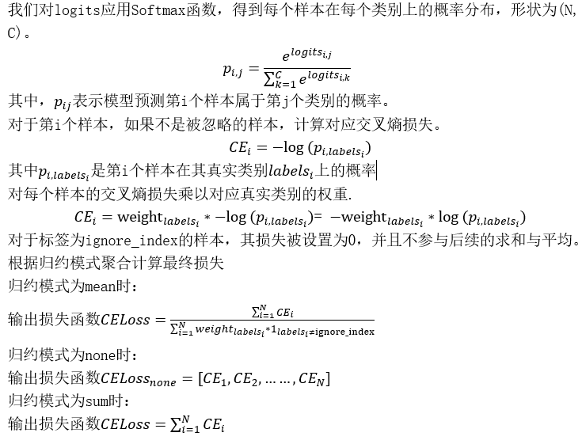
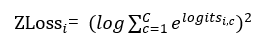
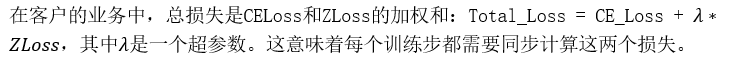
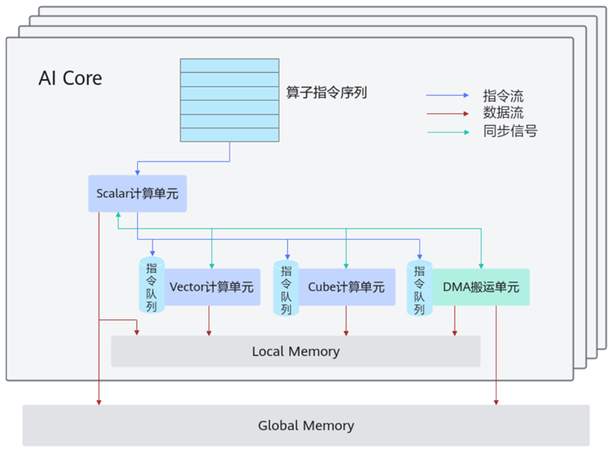
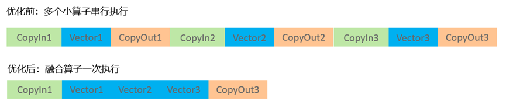
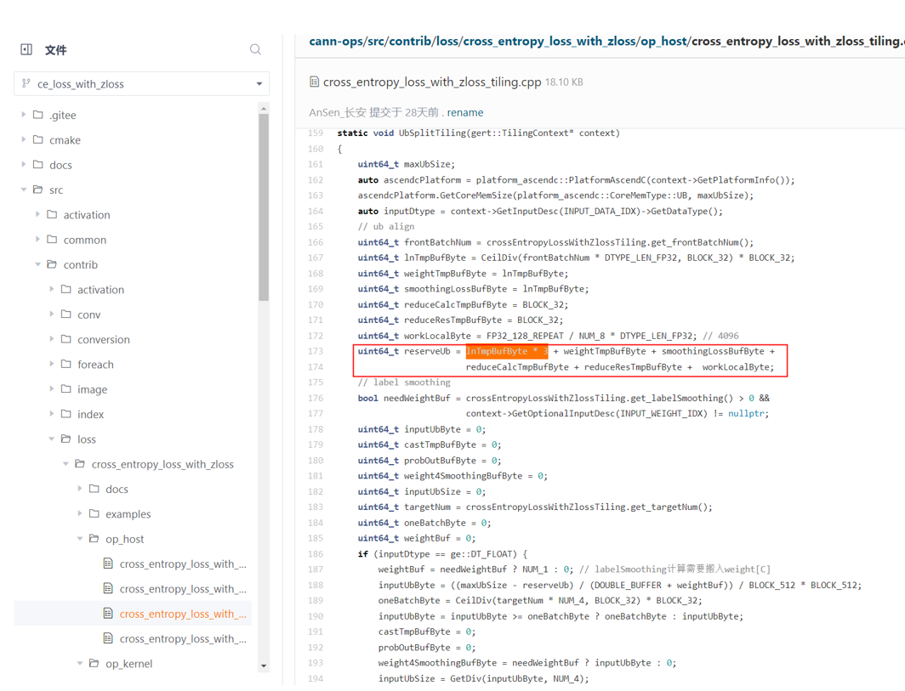
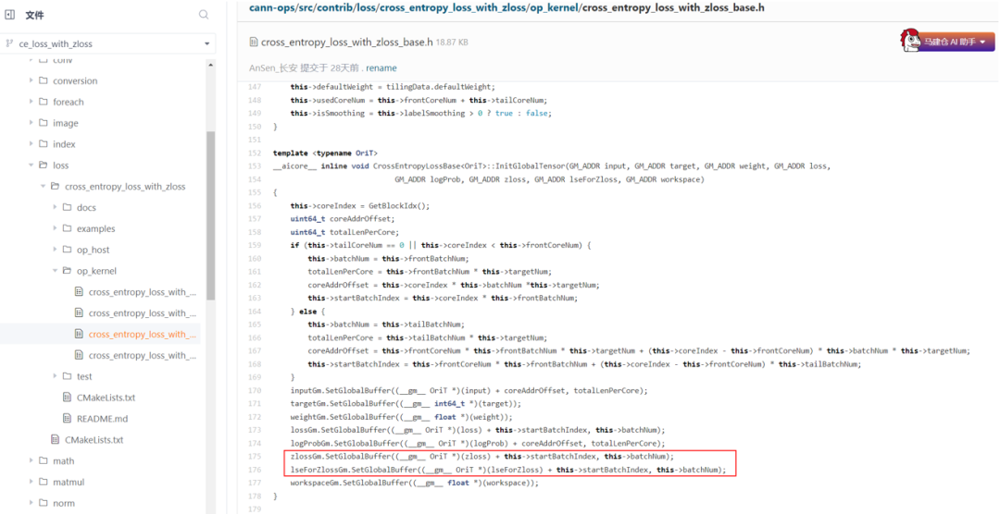
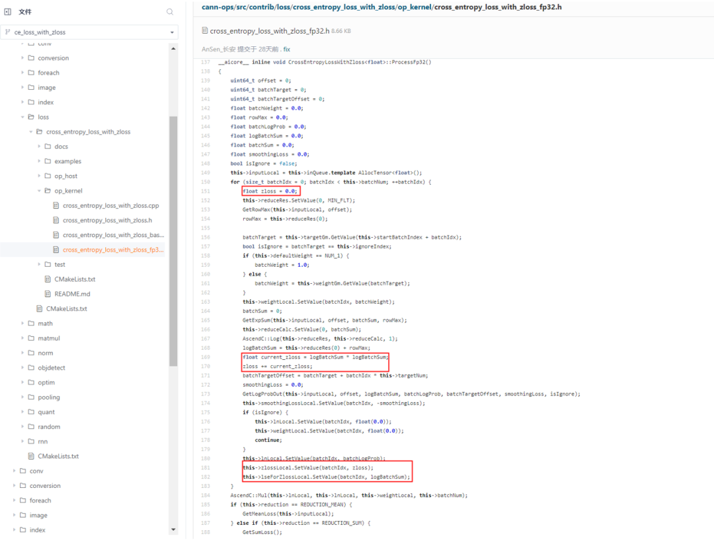
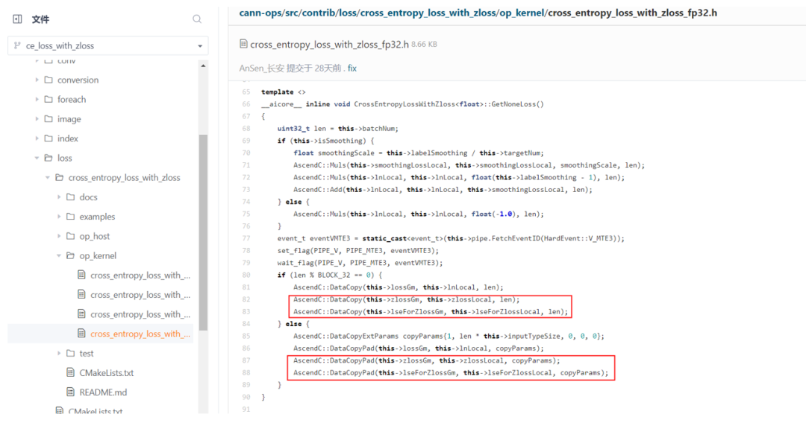
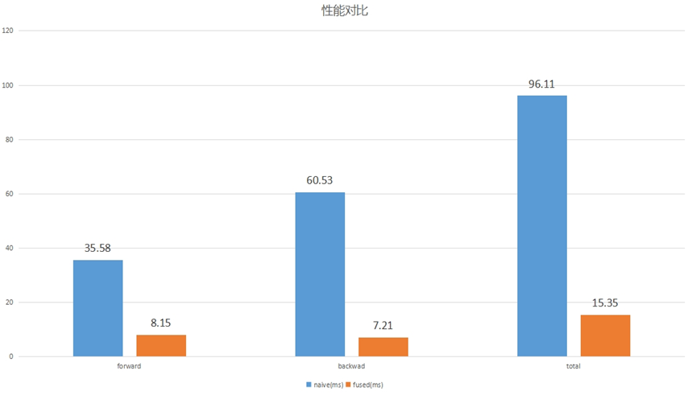

# CrossEntropyLoss与Zloss融合算子开发

**1.背景与问题**

在AI大模型训练过程中，性能优化是永恒的主题。如何快速、高效地实现算子级优化，进一步提升整网训练效率，成为很多开发者与企业的核心诉求。昇腾CANN开放了算子源码，并提供了Ascend C编程能力，使用户能够根据自身业务需求开发高性能算子。

本实践聚焦于两个紧密相关的损失函数：交叉熵损失（CrossEntropyLoss）和ZLoss。在客户的某大模型训练场景中，使用Mind Studio Insight工具进行整网性能分析时发现，模型整网端到端的耗时分布存在不均衡现象，特别是尾部流水计算损失函数的耗时占比较大。这两个损失函数的原始实现存在显著的性能瓶颈——它们的计算由一系列串行的小Vector算子构成，导致了不必要的计算开销，影响了整体训练效率，如下图。

本文将先解释客户场景使用的损失函数Cross Entropy Loss和正则化ZLoss的基本概念和公式，然后详细介绍客户如何通过算子融合技术，基于CANN已开源Cross Entropy Loss算子增加的ZLoss相关功能，成功解决这一性能难题。基于这些改动，本实践达成了融合算子集成到整网后，在MoE模型训练中实现了端到端5.2%的效率提升。有效解决了真实客户场景模型训练流水瓶颈问题。这一优化算子也通过PR提交的方式重新贡献回开源算子仓，为其他开发者提供参考。

****2.基础回顾：Cross Entropy Loss与ZLoss解析****

**交叉熵损失（Cross Entropy Loss）**

交叉熵损失（Cross Entropy Loss）是深度学习分类任务中最核心的损失函数之一。它衡量的是两个概率分布之间的差异。假设我们有一个分类问题，共有C个类别，批次大小为N。对于给定的样本，我们定义以下符号。

logits: 一个形状为(N, C)的张量，表示模型对于每个样本在每个类别上的得分。

labels: 一个形状为(N,)的张量，表示每个样本的真实类别，取值范围在[0, C-1]或ignore_index。

weight: 一个形状为(C,)的张量，表示每个类别的权重。

ignore_index: 一个整数，表示要忽略的标签值。

交叉熵损失（Cross Entropy Loss）的计算步骤如下：

**ZLoss**

在机器学习中，我们经常通过在损失函数中添加正则项（如L1、L2）来防止过拟合。ZLoss并非一个通用损失函数，它在某些场景下被用作正则项，旨在惩罚过大的 logits 值，从而增加数值稳定性，它计算的是所有logits的平方和(L2 Norm)，对于上述Cross Entropy Loss损失函数第i个样本对应Zloss计算公式为：

使用ZLoss通常有以下作用：

1. 控制模型复杂度：防止模型通过产生极大（正或负）的logits 来“强行”拟合训练数据，从而减轻过拟合。

2. 数值稳定性：过大的 logits 在输入到 Softmax 函数时，会导致

变得非常大，容易引发数值计算上的问题（如溢出）。ZLoss可以抑制这种情况，使训练过程更稳定。

3. 平滑输出分布：通过限制 logits 的幅度，模型输出的概率分布不会变得过于“尖锐”（即一个类别概率接近1，其他接近0），这有时可以提高模型的校准度和泛化能力。

**两者的关联：**

**3.** **问题根因分析：性能瓶颈在哪里？**

**基于Ascend C开发的算子运行在AI Core上，对于开发者需要对硬件架构有基本认识。**

AI Core的硬件架构抽象如上图所示，AI Core中包含计算单元、存储单元、搬运单元等核心组件。

- 计算单元包括了三种基础计算资源：Cube计算单元、Vector计算单元和Scalar计算单元。
- 存储单元包括内部存储和外部存储：
  AI Core的内部存储，统称为Local Memory。
  AI Core能够访问的外部存储称之为Global Memory。
- DMA（Direct Memory Access）搬运单元：负责在Global Memory和Local Memory之间搬运数据。

AI Core内部数据处理的基本过程可以分为三个阶段，该过程可以参考上图中的红色箭头所示的数据流：

1. CopyIn阶段：DMA搬入单元把数据搬运到Local Memory。

2. Compute阶段：Vector/Cube计算单元完成数据计算，并把计算结果写回Local Memory

3. CopyOut阶段：DMA搬出单元把处理好的数据搬运回Global Memory。

回到客户场景使用Mind Studio Insight工具进行整网性能分析得到的结果，在优化前的尾部损失函数计算流程为Exp、Log、Power等一系列Vector小算子串接执行，会产生中间结果读写开销问题：每一个Vector小算子都需要从GM地址空间读取输入数据，再将计算结果写回到GM地址空间，然后又被下一个Vector算子读取，这产生了大量不必要的显存带宽占用，使用融合算子一次执行可以减少这部分开销：

**4.解决方案：融合算子设计与实现**

**核心思想：**为了优化计算损失函数的耗时，客户决定开发CrossEntropyLossWithZLoss算子，将所有损失函数计算过程使用的Vector操作融合为单个Vector算子，在一个kernel内完成从输入logits到最终输出CELoss和

的所有计算步骤，避免产生任何中间全局显存变量，从而减少尾部计算耗时。

**参考与借鉴：**面对这一挑战，客户参考了昇腾CANN开源算子源码仓ops-nn中高性能CrossEntropyLoss算子的实现，该算子已经具备高性能的CE Loss交叉熵损失函数计算能力，客户在此基础上，融入了ZLoss和lseForZLoss计算，分别用于计算辅助损失ZLoss和ZLoss场景下输出给反向传播的值。参考前文CE Loss计算公式和ZLoss计算公式说明可知，可在计算log_prob的同时完成ZLoss和lseForZLoss计算，这种基于已有算子的开发方式，利用经过测试和验证的现有代码，减少重复劳动，大大提高了开发效率。

**关键优化代码点：**

1. host侧代码遵循原有切分逻辑的基础上，在计算Tiling分块时增加申请两块buffer临时空间，用于ZLoss和lseForZLoss计算：

2. kernel侧代码新增ZLoss和lseForZLoss多核切分操作：

3. kernel侧代码新增ZLoss和lseForZLoss计算：复用log_prob计算过程中的lse计算结果计算刷新ZLoss和lseForZLoss

4. kernel侧代码新增保存ZLoss和lseForZLoss计算输出到GM空间操作：

**优化前后性能对比：** 使用开发完成的CrossEntropyLossWithZLoss融合算子替换模型内部使用的多个Vector小算子，优化后的性能数据令人振奋：在A2硬件上，当批次大小（bs）为8192时，前向计算性能提升4.37倍，反向计算性能提升8.39倍，平均计算性能提升达6.26倍。更重要的是，该融合算子集成到整网后，在MoE模型训练中实现了端到端5.2%的效率提升，有效解决了尾部流水损失函数计算耗时的瓶颈问题。

**开源贡献，回馈社区**

在开发完成并达到预期优化效果后，客户将代码通过PR方式提交到CANN开源社区（参见：https://gitee.com/ascend/cann-ops/tree/master/src/contrib/loss/cross_entropy_loss_with_zloss，后期会迁移到gitcode：https://gitcode.com/cann），完成了从使用开源到贡献开源的过程。这个例子很好的展示了如何基于CANN开源算子优化开发用户自定义算子。

**开源共享，生态共赢**

这一实践表明，CANN开源算子库为用户提供了开发基础，有助于降低开发门槛，支持更多创新。用户可以直接基于开源代码进行定制，并结合Ascend C编程实现优化。这些优化成果最终也可以通过PR形式回馈社区，形成使用与贡献的循环，为其他开发者提供参考，不断丰富CANN算子生态，让更多人能够受益，推动整个昇腾AI产业持续发展。
