# 基于昇腾的DeepXTrace推理集群快慢卡在线检测

## 1 背景

在大规模分布式环境下部署MoE（Mixture of Experts）模型时，随着ExpertParallelism（EP）数量增加，通信开销（如Dispatch和Combine操作）可能显著影响推理延迟（TTFT & TPOT）。由于通信变慢的原因复杂多样（如token负载不均、通信链路异常、进程锁或CPU层面问题），通信slow问题的定界和定位变得困难。因此，为MC2 Dispatch/Combine算子设计一套轻量级异常诊断方案，实现分钟级的问题精准定位，成为大规模集群MOE模型部署的迫切诉求。

目前，昇腾CANN社区已经支持对接开源非均衡通信架构（e.g. MOE）的快慢卡轻量级精准定位方案——DeepXTrace。为了充分发挥DeepXTrace在昇腾NPU集群上的诊断效果，在社区开发者的联合共创下，首次实现遵循CANN社区开源规则的生态玩法，基于ops-transformer社区SIG组织，参与社区SIG例会，并在SIG例会讨论和评审需求、设计方案、代码合入，最终实现了社区贡献ops-transformer社区首个PR合入和DeepXTrace支持昇腾，实现了昇腾CANN开源社区和DeepXTrace开源社区的双赢，扩大了昇腾开源生态影响力，形成了多方社区的共赢：

- 解决用户通信slow难题：轻量级、高效、精准rank粒度定位推理/训练场景下表象为MC2 Dispatch/Combine slow的问题，方便用户推理/训练变慢问题得到有效解决。
- MOE异构硬件通信诊断统一：方便用户侧异构硬件下MC2/DeepEP的Dispatch/Combine通信算子slow诊断产品统一，降低用户切换成本。
- 社区共建：社区开发者往ops-transformer贡献新能力，同时支持和接入DeepXTrace社区，共建一套诊断方案，加速方案演进及长期社区维护。

## 2 DeepXTrace介绍

DeepXTrace是业界针对MOE模型场景下的轻量级快慢卡检测工具，它通过对DeepEP库进行扩展和增强实现了慢卡的快速和精确定位。它包括两个模块：DeepEP指标探测模块和指标分析模块，其链接如下：

<https://github.com/antgroup/DeepXTrace/pull/2>

DeepXTrace支持的检测场景如下：

- 发送端异常：慢卡是由于发送端异常导致，比如由于计算不均（e.g. Attention/MOE）导致MOE通信算子延迟执行
- 接收端异常：慢卡是由于接收端异常导致，比如计算不均（e.g. Attention/MOE）导致某些卡更早执行MOE通信算子或热点专家导致的接收端Incast拥塞
- 通信路径异常：慢卡是由于接收端和发送端的通信链路异常导致

具体图示如下：

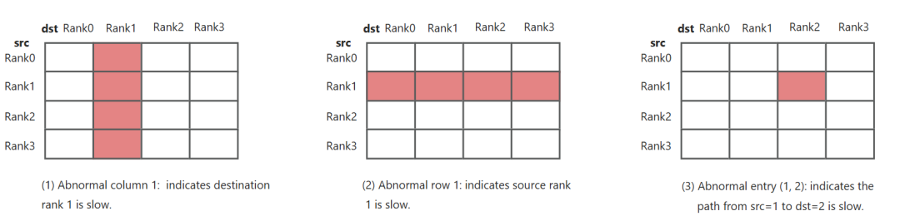

DeepXTrace会自动收集所有进程组中Dispatch/Combine算子的通信诊断指标，同时在Rank 0上根据聚合的指标构建一个大小为N×N的延迟矩阵M（其中Mij表示rank_i等待rank_j的延迟）。

### 2.1 DeepEP指标探测方案介绍

基于DeepEP开源库的扩展增强探测模型实现方案是在dispatch和combine算子增加打点计时，dispatch和combine的实现分为两阶段，第一阶段是发送tokens，buf按rank维度排布，高速直连则调用load、store高速内存拷贝，RoCE则调用shmem接口走RDMA操作，发送后进行sync同步保证所有数据都发出。第二阶段为接收tokens，buf按local expert维度排布，下图为DeepEP的dispatch算子流程图示：

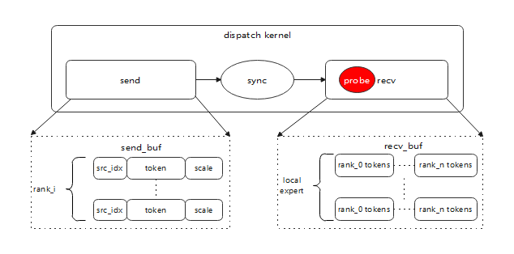

其中的红色probe即为在dispatch算子的接收数据前后进行计时打点实现指标检测。combine算子的流程类似。具体实现请参考PR链接：

<https://github.com/deepseek-ai/DeepEP/pull/311>

## 3 MOE算子介绍

当前A2上MoeDistributeDispatch和MoeDistributeCombine支持非分层Fullmesh和分层Hierarchy两种通信算法，分别对应DeepEP中的Low-Latency和Normal模式。非分层Fullmesh算法下，所有卡之间通过RDMA互联；在分层Hierarchy算法下，跨server间同号卡通过RDMA互联，server内通过HCCS互联。

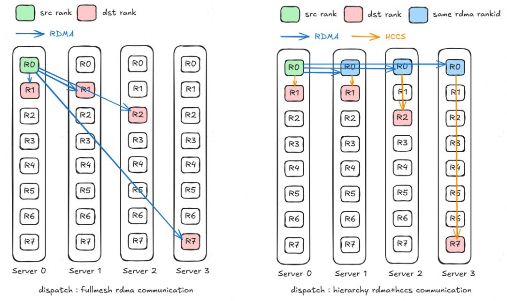

*Fullmesh和Hierarchy通信示意图*

在Fullmesh通信算法下，发送token的数据会按照选择的topk个专家，复制topk份，保存到目标rank对应的缓冲区，全部token数据重排完成后，通过RDMA链路将数据发送。

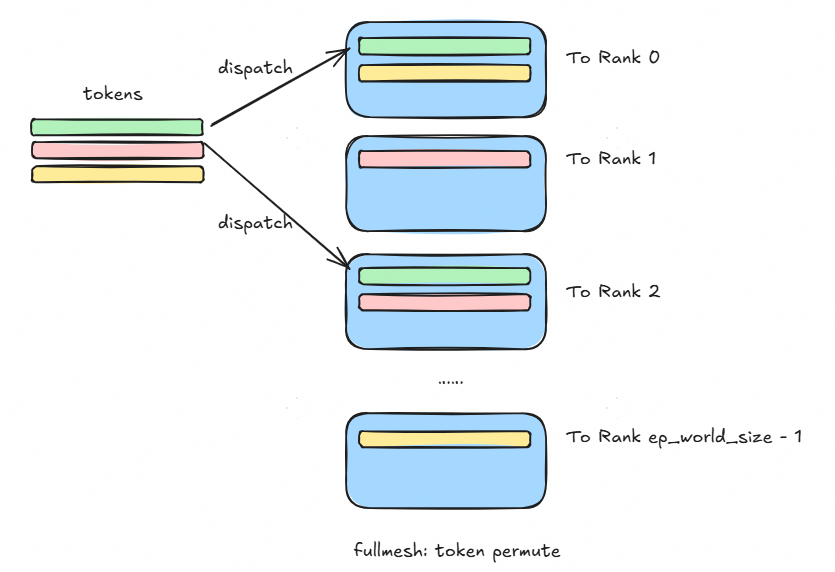

*Fullmesh 数据重排示意图*

每个token选择的topk个专家会很可能存在某些专家部署在同一个server，由于RDMA带宽较低，为了降低RDMA通信数据量，在hierarchy通信算法中，仅会向topk专家所在server发送一份数据，在同号卡间做RDMA通信；再利用机内HCCS高带宽，由该同号卡将token转发给专家所在的目标卡。多核下通过RDMA和HCCS通信流水并行，进一步获取性能收益。

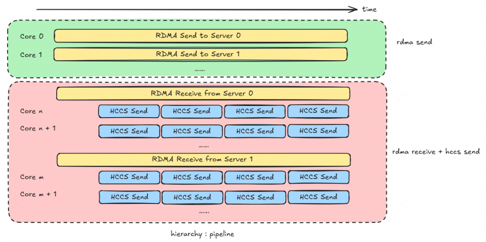

*hierarchy多核流水并行示意图*

## 4 MOE算子支持打点方案

### 4.1 方案概述

本节介绍了算子主流程中打点的位置，计时逻辑，以及接口设计。具体实现代码见如下PR：

<https://gitcode.com/cann/ops-transformer/pull/288>

#### 4.1.1 主流程打点位置

选择打点的位置是在前述第3节中介绍的算子主流程中等待接收数据的位置，根据分层和不分层以及算子不同而不同，具体打点的函数见下表

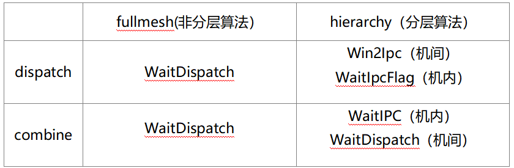

打点的详细位置和方案见下节4.2-4.5。

#### 4.1.2 计时逻辑

我们设计了GetCurrentTimestampUs函数获取当前系统时间。通过系统调用GetSystemCycle获取系统cycle数，cycle数转微秒因子为50，具体实现如下：

```cpp
constexpr uint32_t TIME_CYCLE = 50; // 系统cycle数转换成时间的基准单位，固定为50

__aicore__ inline int64_t GetCurrentTimestampUs()
{
    return AscendC::GetSystemCycle() / TIME_CYCLE;
}
```

获取打点位置前后的时间差，并根据RankID保存对应卡的处理耗时到LocalTensor的对应位置，具体实现如下：

```cpp
__aicore__ inline void RecordRankCommDuration(AscendC::LocalTensor<int32_t> performanceInfoU32Tensor, uint32_t rankId, int64_t startTime)
{
    int64_t endTime = GetCurrentTimestampUs();
    int32_t duration = static_cast<int32_t>(endTime - startTime); // int32_t可以表示2^31(us)，约35min在实际场景下满足需要
    performanceInfoU32Tensor.SetValue(rankId * sizeof(int64_t) / sizeof(int32_t), duration); // 使用int32_t是因为atomicAdd不支持int64_t类型，这里只赋值到int64_t的低32位。
}
```

#### 4.1.3 接口设计

算子的API需要增加记录Rank打点时间的Tensor，因此新增aclnnMoeDistributeDispatchV4、aclnnMoeDistributeCombineV4接口，相比V3接口增加了可选参数。

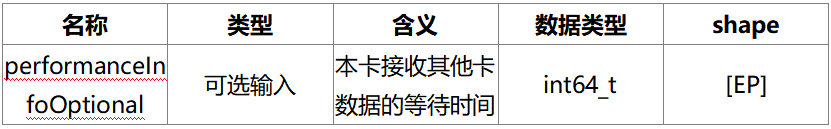

### 4.2 dispatch非分层埋点方案

如前4.1.1所述，非分层埋点在函数WaitDispatch里面实现。该函数的核心功能分核接收Rank数据。

#### 4.2.1 分核接收Rank数据的策略

dispatch_fullmesh分核策略是，将worldSize_张卡的数据尽可能均匀地分配给aivNum_个核心处理，总核心数为48个。

以2机16卡为例，前16个核心处理对应rankId的数据。

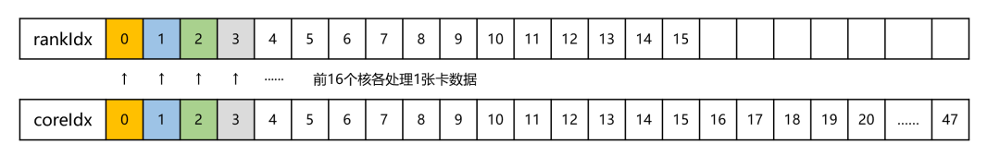

以8机64卡为例，前16个核心各处理2张卡数据，后32个核各处理1张卡数据，如下图所示。

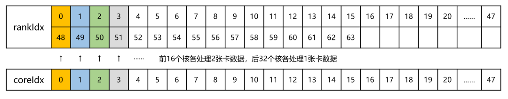

#### 4.2.2 数据接收逻辑和打点位置

非分层算法为fullmesh算法，遍历每张卡，获取该卡所有发过来的token的状态，并记录耗时。

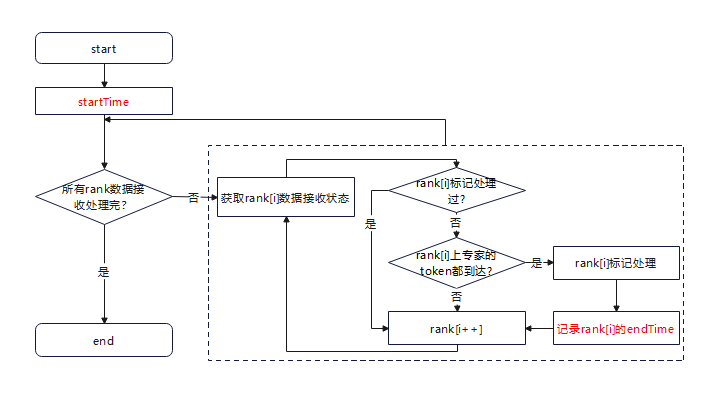

### 4.3 dispatch分层埋点方案

分层算法下，流程比fullmesh非分层算法更复杂，需统计的时间包括跨机和机内两部分。

#### 4.3.1 跨机通信分核接收Rank数据的策略

dispatch分层跨机通信分核策略是，前serverNum个核处理发送任务，第serverNum+1个核负责计算outer表，剩下的核用接收来自serverNum台机器的数据，多个核会负责接收来自同一个server的数据，总核心数为48个。

以8机64卡为例，core0-7核处理发送任务，core8核负责计算outer表，剩余的核平均分配给8台机器，每台server分配到(48-8-1)/8=4个核，因此core9-12处理server0的跨机数据发送，core13-16处理server1的跨机数据发送，以此类推。

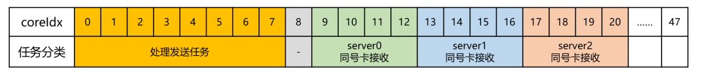

#### 4.3.2 跨机通信数据接收逻辑和打点位置

dispatch分层跨机通信的接收逻辑是循环判断获取到serverId对应的接收状态是否为到达，记录通信耗时。

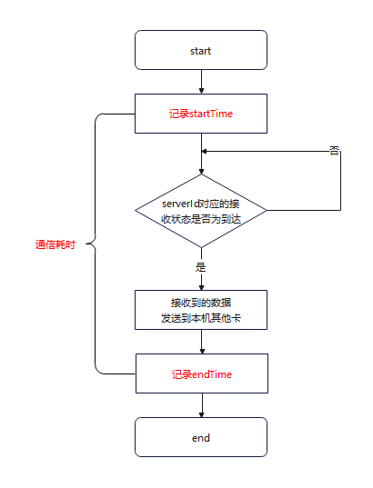

源卡ID的计算：srcRankId=rankId_%SERVER_RANK_SIZE+curServerId*SERVER_RANK_SIZE，

其中，rankId_：全局rankId号

SERVER_RANK_SIZE：单台服务器卡数量，一般为8

curServerId=logicAivId/coresPerServer，logicAivId为在核物理Id号加偏移后的Id（见4.3.1），coresPerServer为每台服务器处理数据的aiv核数

#### 4.3.3 机内通信分核接收Rank数据的策略

dispatch分层机内通信分核策略是，前SERVER_RANK_SIZE个核参与同步，剩下的核未参与处理。

以8机64卡为例，单机8卡，前8个核各对应1个rank的数据收发。

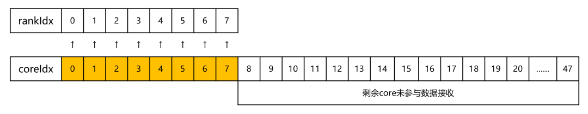

#### 4.3.4 机内通信数据接收逻辑和打点位置

dispatch分层机内通信的数据接收是通过判断同号卡数据的接收状态是否为到达，并记录到达前后的时间，为通信耗时。

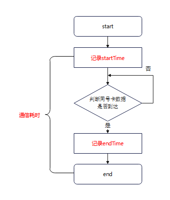

源卡ID的计算：srcRankId=curServerId*SERVER_RANK_SIZE+destRankIdx，其中destRankIdx为接收卡的local rankId。

### 4.4 combine非分层埋点方案

#### 4.4.1 分核接收Rank数据的策略

combine非分层分核策略与dispatch非分层相同，具体逻辑可参考4.2章节。

#### 4.4.2 数据接收逻辑和打点位置

combine非分层的接收逻辑是判断该核负责的rank是否全部收到数据，若没有，判断目标卡数据状态是否为到达，未到达进入下一个rank，到达则记录通信耗时。

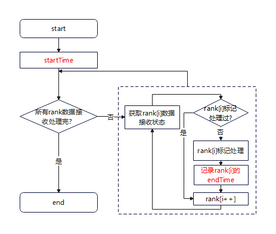

### 4.5 combine分层埋点方案

#### 4.5.1 跨机通信分核接收Rank数据的策略

combine分层跨机通信分核策略是，仅前serverNum个核参与跨机通信，且只有其他服务器对应的本地核心才需要等待（本服务器核心跳过）。

以8机64卡为例，对于server0，仅core1-7参与跨机通信，core0不参与是因为它处理本server的数据，如下图所示。

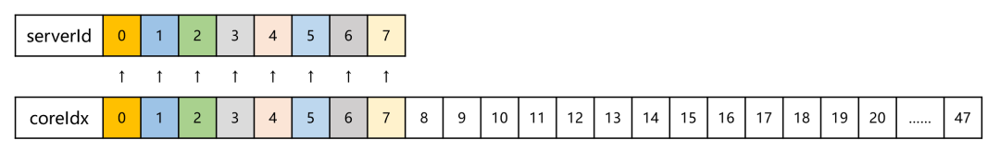

#### 4.5.2 跨机通信数据接收逻辑和打点位置

combine分层跨机通信数据接收首先判断本核处理的rank是否全部收到数据，然后判断卡状态是否到达，到达后记录通信耗时。

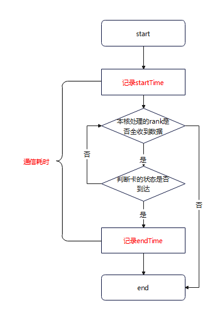

#### 4.5.3 机内通信分核接收Rank数据的策略

combine分层机内通信分核策略与dispatch分层机内通信相同，具体逻辑可参考4.3章节。

#### 4.5.4 机内通信数据接收逻辑和打点位置

combine分层的机内通信逻辑和机间通信类似，都是通过while循环等待到达目标状态后计时，区别是机间通信映射的是serverNum个卡，机内通信映射的是rankSize个卡。

## 5 MOE算子接入DeepXTrace方案

### 5.1 昇腾适配方案

昇腾NPU提供了脚本自动迁移至NPU的方法，操作简单，且修改内容少，只需在代码中添加一下

```python
from torch_npu.contrib import transfer_to_npu
```

即可完成脚本迁移。

在DeepXTrace中，通过上述方式，完成NPU的适配，具体PR见：

<https://github.com/antgroup/DeepXTrace/pull/2>

### 5.2 分层算法/非分层算法兼容

#### 5.2.1 分层打点计时异常

在非分层算法逻辑下，dispatch和combine每张卡之间相互存在通信，Tensor每个位置都有耗时信息，使用基本异常检测逻辑即可。而在hierarchy分层算法逻辑，只存在机内通信和机间通信，机间通信为同号卡通信，单机8卡模式下，rank0和rank8存在通信，因此通信矩阵中存在大量的“0”。

deepxtrace通过计算行/列/点的归一化值，和用户设置的阈值进行比较，当归一化值>阈值时，检测出异常。对于行/列，大量0值对计算并无影响，但对于异常点的计算，大量的0会使点平均值值变小，归一化值变大，导致大于阈值的异常点数量增加，影响结果判断。

针对这个问题，在下节提出了异常检测逻辑，能够有效避免这种异常导致的快慢卡误判。

#### 5.2.2 异常检测逻辑

异常检测逻辑实现了对3种异常场景的检测，具体实现逻辑如下图示

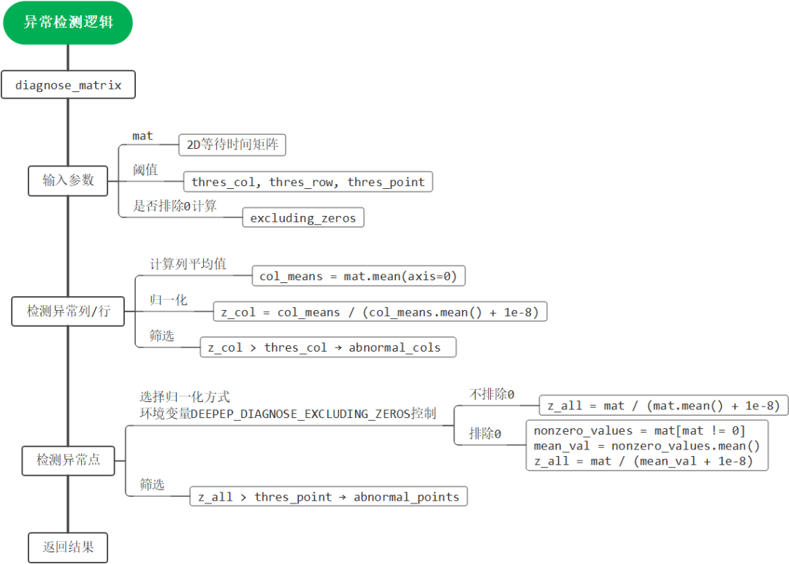

我们设计了环境变量DEEPEP_DIAGNOSE_EXCLUDING_ZEROS，当改环境变量=0时，不排除0计算；=1时排除0计算。

相关PR：<https://github.com/antgroup/DeepXTrace/pull/8>

## 6 上线诊断

### 6.1 安装使用步骤

步骤1：根据DeepXTrace ReadMe安装性能数据处理工具，在脚本开头引入from deepxtrace import diagnose as ds。

步骤2：初始化_diagnose并调用get_stats_ll_stats_tensor()函数生成1D，shape=(ep_world_size)，datatype=int64的performance_info_dispatch，performance_info_combine。

```python
#  Initialize the diagnostic instance.
def get_diagnose(group: dist.ProcessGroup, enable_async: bool) -> ds.Diagnose:
    global _diagnose
    if _diagnose is None or _diagnose.group != group:
        _diagnose = ds.Diagnose(group = group, enable_async = enable_async)
        #  Start the asynchronous diagnosis thread which will periodically perform diagnosis.
        if enable_async:
            _diagnose.start_async_diagnose()
    return _diagnose
_diagnose = get_diagnose(group = dist.group.WORLD, enable_async = False)
performance_info_dispatch = _diagnose.get_stats_ll_stats_tensor()[0]
performance_info_combine = _diagnose.get_stats_ll_stats_tensor()[1]
#  print: Torch.Tensor[0,0,0,...].device("npu:{rankid}")
#                     ep_world_size个0
```

步骤3：将变量传入MC2算子。

```python
output1 = torch_npu.moe_distribute_dispatch_v2(
    ...,
    performance_info = performance_info_dispatch
)
output2 = torch_npu.moe_distribute_combine_v2(
    ...,
    performance_info = performance_info_combine
)
```

步骤4：算子运行完成后，使用_diagnose.diagnose_ll_sync()函数获取性能数据，并汇聚到0卡上，在同级目录下生成一个diagnose_rank0.txt文件。

```python
diagnose_res = _diagnose.diagnose_ll_sync(diagnose_step = 10) # 每10步记录一次
if rank == 0:
    print(diagnose_res)
```

### 6.2 结果分析

### 通信路径异常场景

我们正常运行算子时，经常会出现通信慢卡场景，是由于接收端和发送端的通信链路异常导致，如下所示，检测出两个异常点。

- batch_size=32
- diagnose_step=58（算子执行58次记录一组数据）
- mode=dispatch_hierarchy（分层）

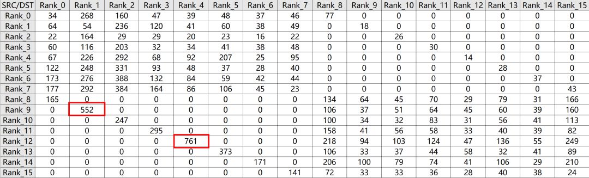

根据异常点检测逻辑，异常点阈值设置为5.0，[9,1]处的归一化值计算为5.52，超出阈值，工具报告[9,1]为异常点。同理，[12,4]=761也是异常点。

### 发送端异常场景

- batch_size=32
- diagnose_step=10（算子执行10次记录一组数据）
- mode=dispatch_hierarchy（分层）

我们模拟了双机8卡rank2发送慢的情况，每次执行算子时2号卡休眠1秒（time.sleep(1)），循环10次，结果显示rank2和rank10发送端耗时增大到了10秒（表格中的单位为us）。

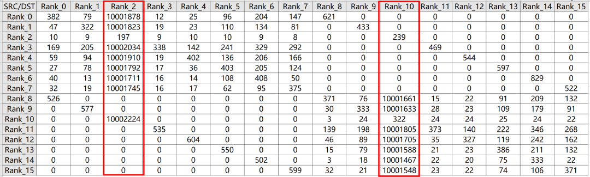

## 7 附录

PR列表：

- <https://gitcode.com/cann/ops-transformer/pull/288>
- <https://github.com/deepseek-ai/DeepEP/pull/311>
- <https://github.com/antgroup/DeepXTrace/pull/2>
- <https://github.com/antgroup/DeepXTrace/pull/8>
- op-plugin master：<https://gitcode.com/Ascend/op-plugin/pull/3538>
- op-plugin 7.3.0：<https://gitcode.com/Ascend/op-plugin/pull/3539>
- torchair master：<https://gitcode.com/Ascend/torchair/pull/2221>
- torchair 7.3.0：<https://gitcode.com/Ascend/torchair/pull/2220>
