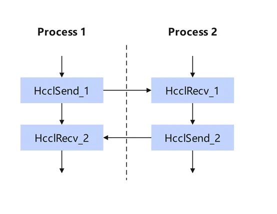
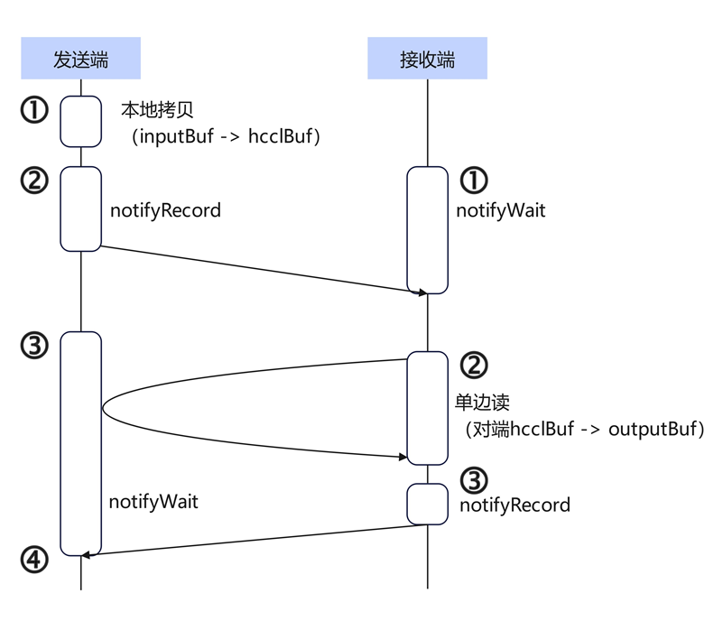
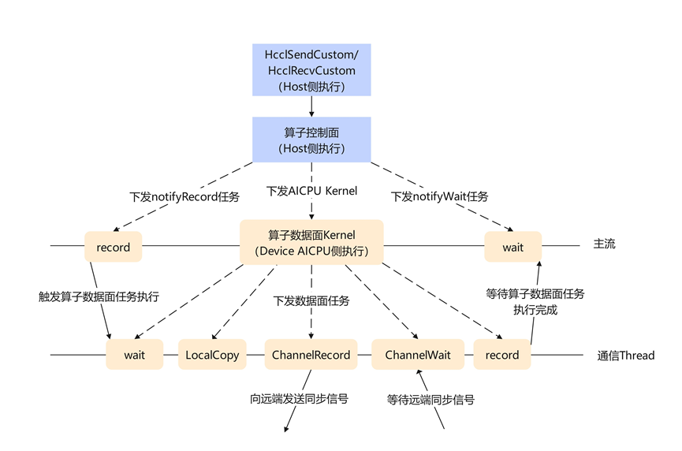
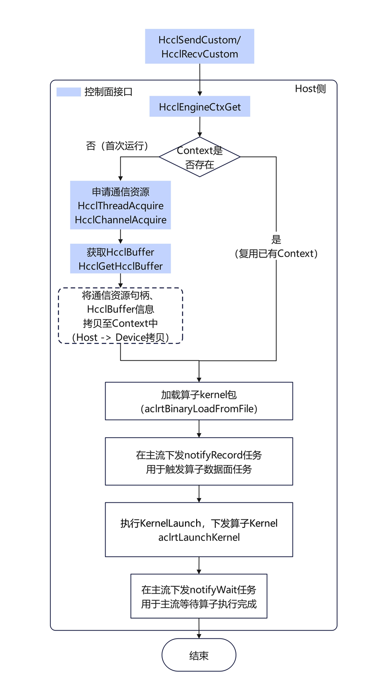
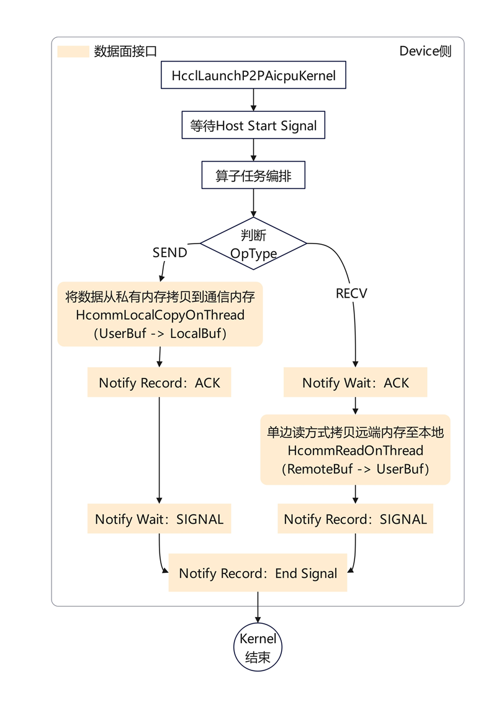
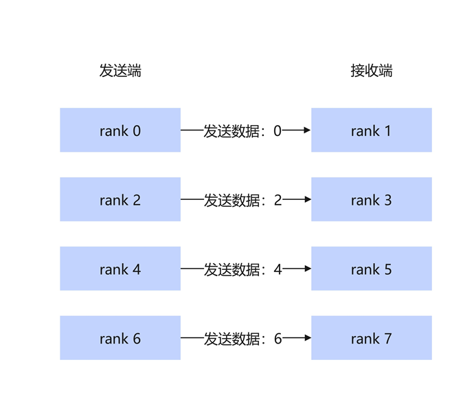
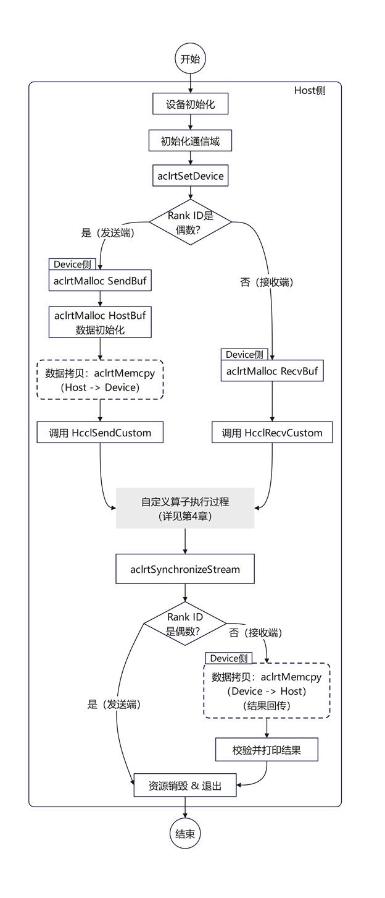

# 基于AICPU引擎的HCCL点对点通信算子开发

## 1 前言

在高性能计算与大模型训练场景中，标准的集合通信原语通常能满足大部分需求。然而，在某些特定算法编排、非规则通信拓扑或需要精细控制同步时序的场景下，开发者需要更灵活的通信能力。本文将以 AICPU+TS引擎下的自定义 Send/Recv 算子为例，深入描述如何使用 Hcomm 层通信算子编程接口开发自定义算子。

## 2 点对点通信算子介绍

点对点通信是指通信域中的两个 Rank 之间直接传输数据的通信模式，一个作为发送者一个作为接收者。常用于pipeline并行场景下对激活值的数据收发。点对点通信由两个基础算子组成，发送端和接收端需要配对使用且按序下发。




Send算子：源进程将内存中的数据块发送到指定的目标进程。

Recv 算子：目标进程从指定的源进程接收数据，并将其存入本地内存缓冲区。

## 3 点对点通信算子原理




**发送端执行 Send算子：**

**Step 1：** 准备数据。

发送端执行本地拷贝的任务，将待发送数据从用户输入内存拷贝到通信内存 （HcclBuffer）。

**Step 2：** 发送数据就绪的同步信号至接收端。

发送端将数据拷贝至通信内存后，执行 notifyRecord 任务，向接收端发出一个同步信号，告诉接收端：“数据已准备好，可以访问”。

**Step 3：** 执行 notifyWait 任务，进入等待状态。等待接收端数据读取完成的同步信号。

**Step 4：** 收到接收端的数据读取完成同步信号后，解除等待状态。

**接收端执行 Recv 算子：**

**Step 1：** 执行 notifyWait 任务，进入等待状态。等待发送端准备好数据。

**Step 2：** 收到发送端的同步信号后，说明数据已就绪。执行远端单边读操作，通过物理链路直接访问发送端的内存地址，将数据拷贝到本地内存中。

**Step 3：** 执行 notifyRecord 任务通知发送端 “数据拷贝已完成 “，以便发送端释放或复用内存。

## 4 自定义点对点通信算子实现流程

### 4.1 源码

开发者可以点击下方链接获取完整样例代码。

<https://gitcode.com/cann/hccl/tree/master/examples/04_custom_ops_p2p>

整体流程：



自定义通信算子需要实现算子控制面部分和算子数据面部分。

- 算子控制面：通过算子入口调用，在 Host侧执行，负责申请算子数据面执行需求的通信资源，包括通信 Channel和通信Thread，下发算子数据面 Kernel到Device。
- 算子数据面：当前案例在 Device侧 AICPU 执行，负责算子数据面任务的下发，实现数据搬运和同步操作。

### 4.2 算子控制面实现




**Step 1：初始化通信上下文**

代码位置：send.cc / recv.cc

通信上下文是用于承载算子执行所需的各个资源。此阶段核心是**调用控制面接口（图中蓝色节点）** 在发送、接收两端都创建好算子执行上下文。因为资源是 Per-Device 的，收发双方都需要建立自己的通信端点。

当 HcclSendCustom 或 HcclRecvCustom 被多次调用时会复用已存在的资源上下文。首次调用时，会触发资源的初始化：

1. **上下文检查：** 通过 HcclEngineCtxGet 检查当前通信域是否已存在对应的 AICPU 资源上下文。目的：通信上下文是用于算子反复执行时的资源复用，以提升性能。

1. **资源申请：**

   **Thread：** 调用 HcclThreadAcquire 申请 Device 侧的执行线程。

   **Channel：** 调用 HcclChannelAcquire 建立点对点物理通信链路。

   **Hccl Buffer：** 调用 HcclGetHcclBuffer 申请通信内存。

   **Notify：** 调用 aclrtCreateNotify 创建 Host-Device 同步用的同步信号资源。

1. **资源句柄拷贝：** Host 将申请到的资源句柄（Thread ID, Channel Handle, Notify ID）封装在结构体中，通过 aclrtMemcpy 拷贝到 Device 侧的显存。

   目的：让 AICPU Kernel 知道它该用哪个线程跑、发给谁、监听哪个信号。

**Step 2：下发 Kernel**

代码位置：launch_kernel.cc

在准备好算子执行的资源后，host 侧会把 kernel下发到device去执行。

这一阶段利用 ACL 流（Stream）实现了异步控制：

1. **加载算子信息：** 调用 aclBinaryLoadFromFile（封装在 LoadAICPUKernel 方法中）。
1. **发送同步信号：** 调用 aclrtRecordNotify (g_notifies [0], stream) 发送同步信号，通知Device算子已经下发好。
1. **下发任务：** 调用 aclrtLaunchKernel，将 HcclLaunchP2PAicpuKernel 函数推送到任务队列中，下发算子Kernel。
1. **阻塞等待结束：** 调用 aclrtWaitAndResetNotify (g_notifies [1], ...)。Host 线程在此处挂起（Sleep），直到 Device 侧发回“结束” 的同步信号，确保 main 函数不会提前销毁资源。

### 4.3 算子数据面实现




**Device 侧执行算子**

代码位置：aicpu_kernel.cc & exec_op.cc

此阶段会在Device侧**调用数据面接口（图中黄色节点）** 完成Kernel的展开执行。AICPU 根据 OpType 进行数据拷贝以及收/发 Rank 间的同步。

Device 内部的指令执行如下：

**1.等待发令：** Kernel 启动后，首先执行 HcommAclrtNotifyWaitOnThread，等待 Host 的 RecordNotify 执行完毕。

**2.执行编排 (ExecOp)：** 根据 opType 分流逻辑。

**发送端：**

- **数据拷贝 :** 调用 HcommLocalCopyOnThread 接口将用户数据 (sendBuf) 拷贝到 H CCL通信中转内存 (LocalBuffer)。
- **notifyRecord任务 :** 调用 HcommChannelNotifyRecordOnThread 接口发送 ACK 信号 （通知接收方本端已准备好数据）。
- **notifyWait任务 :** 调用 HcommChannelNotifyWaitOnThread 接口等待 SIGNAL 信号 （等待接收方告知已完成本卡数据的读取）。

**接收端：**

- **notifyWait任务 :** 调用 HcommChannelNotifyWaitOnThread 等待 ACK 信号 （等待发送方告知数据已准备好）。
- **单边读：** 调用 HcommReadOnThread 接口，直接通过物理通道从发送方的 RemoteBuffer 拉取数据写入自己的 recvBuf。
- **notifyRecord任务 :** 调用 HcommChannelNotifyRecordOnThread 接口发送 SIGNAL 信号 （告知发送方本端已完成数据读取）。

**3.发送结束信号：** 任务完成后，Device 调用 HcommAclrtNotifyRecordOnThread 接口发送同步信号，告诉Host算子已执行完毕，唤醒 Host。

## 5 . 样例执行

### 5.1 样例设计

本样例由一共 8个rank组成一个通信域。Rank id为偶数的rank作为发送端，发送内容为其rank编号。Rank id为奇数的rank作为接收端，因此打印结果中各个奇数rank接收到的是前一rank的id。




### 5.2 算子调用流程




**Step 1：Host 侧准备数据**

代码位置：main .cc

此阶段需准备好Host侧send 端需要的数据并搬运到Device 侧显存中，在调用任何算子接口之前，必须确保数据已经位于 NPU 的 Device 显存中。recv 端只需要在 Deviec 侧准备好接收内存。

发送端：

1. **申请内存：** 调用 aclrtMalloc 在 Host 侧申请 hostBuf，在 Device 侧申请 sendBuf。
1. **数据初始化：** 在 Host 侧内存中生成测试数据（如 0, 1, 2... 的浮点数组）。
1. **数据拷贝：** 调用 aclrtMemcpy，将 Host 侧生成的数组写入到 Device 侧的 sendBuf 中。注：若无此步，后续 Device 侧读到的将是未初始化的随机值。
1. **算子调用：** 调用 HcclSendCustom 自定义算子。

接收端：

1. **申请内存：** 调用 aclrtMalloc 在 Device 侧申请 recvBuf。
1. **算子调用：** 调用 HcclRecvCustom 自定义算子。

**Step 2：Host侧回传结果**

代码位置：main.cc

Host 收到Device发送的同步信号，确认 Device 执行完毕，取回结果进行验证。

1. **Host 恢复：** 阶段三中的 aclrtWaitNotify 收到 Device 的结束信号，Host 线程恢复运行。
1. **流同步：** 调用 aclrtSynchronizeStream 确保所有操作彻底完成。
1. **结果回传 （仅 Recv 端）：** 调用 aclrtMemcpy (Device->Host)，将 Device 侧 recvBuf 中的最终结果搬回 Host 侧内存。
1. **校验与清理：** Host 打印结果，验证数值正确性，最后销毁 Stream、Context 和 Device 资源。

### 5.3 编译安装

在CANN/hccl 代码仓根目录下执行如下命令，编译并安装自定义算子包：

```bash
# 设置CANN软件包环境变量，此处以root用户默认安装路径为例
source /usr/local/Ascend/cann/set_env.sh

# 执行build.sh脚本进行编译，通过custom_ops_path指定自定义算子工程路径
bash build.sh --vendor=cust --ops=p2p --
custom_ops_path=./examples/04_custom_ops_p2p

# 自定义算子安装包在代码仓的build_out目录下
./build_out/cann-hccl_custom_p2p_linux-<arch>.run --install
```

自定义算子包安装信息如下：

- 头文件：${ASCEND_HOME_PATH}/ opp/vendors/cust/include/hccl_custom_p2p.h
- 动态库：${ASCEND_HOME_PATH}/opp/vendors/cust/lib64/libhccl_custom_p2p.so
- AI CPU算子描述文件：${ASCEND_HOME_ PATH}/opp/vendors/cust/aicpu/config/libp2p_aicpu_kernel.json
- AI CPU算子包：${ASCEND_HOME_ PATH}/opp/vendors/cust/aicpu/kernel/aicpu_hccl_custom_p2p.tar.gz
- 安装脚本：${ASCEND_HOME_ PATH}/opp/vendors/cust/scripts/install.sh

### 5.4 执行测试用例

**关闭 AI CPU算子验签功能：**

AI CPU算子包会在业务启动时加载至Device，加载过程中驱动默认会执行安全验签，以确保包的可信性。但用户自行编译生成的AI CPU算子包不包含签名头，因此需要手工关闭驱动的验签机制，才可以正常加载。

参考如下命令，使用 root用户在物理机上执行，以device 0为例：

```apache
npu-smi set -t custom-op-secverify-enable -i 0 -d 1 # 使能验签配置
npu-smi set -t custom-op-secverify-mode -i 0 -d 0 # 关闭自定义验签
```

关闭驱动安全验签机制存在一定的安全风险，需要用户自行确保自定义通信算子的安全可靠，防止恶意攻击行为。

**修改 AI CPU白名单：**

若用户新增 AI CPU算子包，需同步将该AI CPU算子包配置到AI CPU白名单中。以root用户默认安装路径为例，编辑ascend_package_load.ini文件：

vim /usr/local/Ascend/cann/conf/ascend_package_load.ini

将下列内容追加到 ascend_package_load.ini中：name:aicpu_hccl_custom_p2p.tar.gzinstall _path:2optional:truepackage_path:opp/vendors/cust/aicpu/kernel

**编译并执行测试样例：**

- 进入样例代码目录

```bash
cd examples/04_custom_ops_p2p/testcase
```

- 编译

```go
make
```

- 执行测试用例

```bash
make test
```

**本样例的预期实验结果为：**

rank为偶数的节点负责发送数据，内容为其rank编号，rank为奇数的节点负责接收数据，因此打印结果中各个奇数rank接收到的是上一rank的编号。

```apache
Found 8 NPU device(s) available
rankId: 1, output: [ 0 0 0 0 0 0 0 0 ]
rankId: 3, output: [ 2 2 2 2 2 2 2 2 ]
rankId: 5, output: [ 4 4 4 4 4 4 4 4 ]
rankId: 7, output: [ 6 6 6 6 6 6 6 6 ]
```
