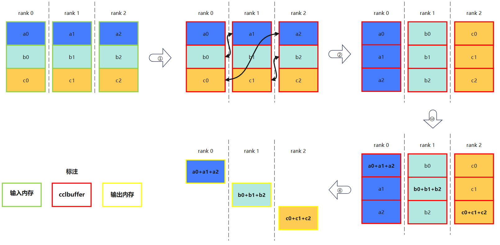
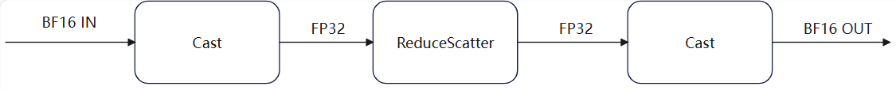
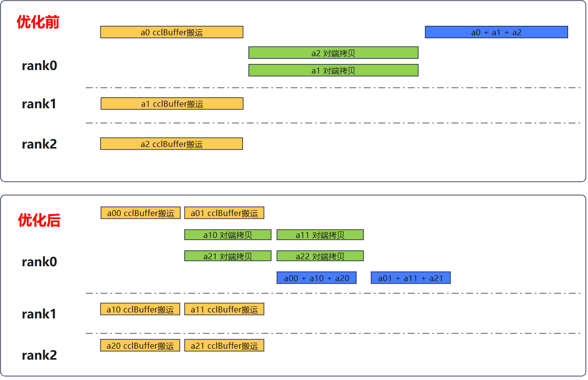

# HCCL ReduceScatter精度优化

### 背景介绍

当前大模型广泛依赖分布式计算突破单设备计算和内存瓶颈,由此各节点间的数据通信逐渐成为制约模型的性能的关键瓶颈。昇腾的高性能集合通信库HCCL（Huawei Collective Communication Library）提供单机多卡以及多机多卡间的数据并行、模型并行集合通信方案，成为昇腾设备解决通信效率问题的关键抓手。
 某实际商业应用场景中使用了HCCL提供的ReduceScatter算子,在模型中提供给ReduceScatter算子的输入输出为BF16类型,在此基础上期望进一步提升算子的精度。本文将为大家介绍如何在兼顾性能的前提下基于开源的ReduceScatter算子进行精度优化。

### ReduceScatter介绍

ReduceScatter算子的功能分为Reduce和Scatter两个步骤：

- Reduce：所有节点先对相同位置的数据执行归约操作。
- Scatter：将规约后的完整结果拆分，每个节点只获取拆分后的一部分结果。
  如下图所示，每个节点对相同颜色（即相同位置）的数据进行归约操作（求和）后，只获取位置编号和自己节点编号相同的归约数据。

### ReduceScatter原始方案介绍

HCCL提供的ReduceScatter操作主要分为四个步骤完成计算：
 ① 将各rank的输入内存拷贝到cclBuffer上。
 ② 从对端拷贝所需数据（相同位置数据）到本rank的cclBuffer上。
 ③ 使用**MTE3单元**执行求和归约计算。
 ④ 拷贝归约后的数据到输出内存。
 
 

### ReduceScatter优化方案介绍

#### 精度优化

由于算子本身使用BF16计算，在确保计算不会溢出的前提下，最直接的精度提升方式便是使用更高的精度类型即采用FP32计算。为此，需要在计算前后插入Cast算子将BF16的输入转为FP32的输入，执行完FP32的计算后再将FP32的输出转为BF16的输出，这便得到了最基础的精度优化方案——在原ReduceScatter算子前后插入Cast算子，如下图：

 

#### 性能优化

**1.数据拷贝耗时优化**
 结合HCCL ReduceScatter的原始方案来看，方案中的①、②和④步骤都是在做拷贝操作，在使用基础精度优化方案后这些操作的输入都从BF16变为了FP32，传输的数据量增大了一倍，这大幅增加了拷贝的时延。从另一个角度来看，拷贝操作不涉及计算内容，即便仍旧使用BF16类型也不会造成精度损失。因此对精度优化的基础方案做了进一步的改进，从原本算子前后插入Cast算子改为基于原算子二次开发，在执行步骤③归约计算的前后插入Cast计算。既提升了计算精度，也不会引入额外的拷贝开销。

**2.计算优化**
 HCCL ReduceScatter是使用MTE3单元执行的归约计算，计算效率受制于带宽，另外对于拷贝的优化也引入新的Cast计算增加了计算开销，因此可以替换为向量计算单元 AIV 去执行`Cast+归约（Add）+Cast`这部分逻辑提升计算效率。

**3.并行优化**
 HCCL ReduceScatter原始方案中由于是使用MTE3单元进行的归约计算，需要基于完整的数据块处理，而现在经过优化后使用了AIV去执行计算，可以根据核的数量将数据块切成多份并行处理。下图展示了数据切分前后（切成2份）的流水变化：
 
 

从图中可以看到因为数据切分变少了每个动作的执行速度提升了，同时也充分利用了AIV的多核计算能力并行执行。

### 总结

经过上述的优化，ReduceScatter算子在性能几乎不变的情况下精度得到提升，满足了实际的业务需求，这也为开发者们进行HCCL 算子优化时提供了可借鉴的思路和方案。

HCCL开源仓库链接：[https://gitcode.com/cann/hccl](https://gitcode.com/cann/hccl)
