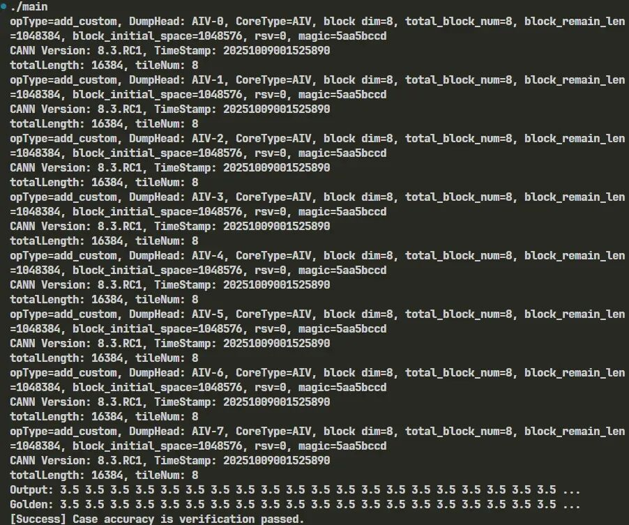
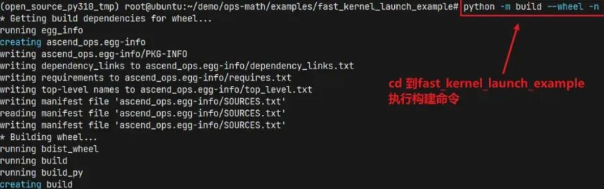
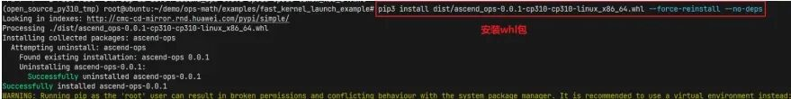
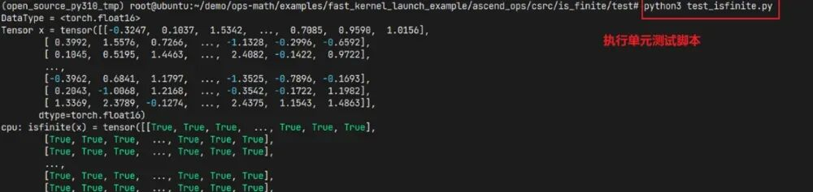
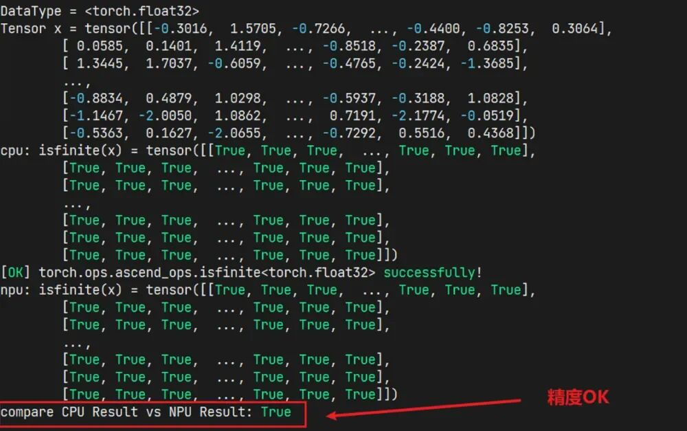

# 算子Kernel直调编程

## 1 基础知识准备

本文内容基于Ascend C算子开发衍生而来，对于算子开发还不了解的读者可以通过以下资源进行学习：

[《Ascend C算子开发文档手册》](https://www.hiascend.com/document/redirect/CannCommunityOpdevAscendC)

[《Ascend C算子开发系列课程》](https://gitcode.com/cann/cann-learning-hub/tree/master/tutorials/ascendc_operator_development)

## 2 背景介绍

Kernel直调方式具备代码轻量化、开发直观便捷的优势，在CANN全面开源开放的过程中对Kernel直调做了进一步的改进和优化，新增了Ascend C异构混合编程和AscendOps模板化编程降低算子编译部署和开发实现的难度。

## 3 Ascend C异构混合编程和AscendOps模板编程概述

### 3.1 Ascend C异构混合编程

Ascend C异构混合编程模式支持将设备端（Device）的 Ascend C代码与主机端（Host）的 C++代码集成在同一代码文件中。Host侧通过`<<<>>>`内核调用符直接调用核函数，并可以通过命令行的编译命令或者简单的CMake代码完成算子编译调用。

🚀 开箱即用 (Out-of-the-Box)：安装CANN包并配置环境变量即可上手使用。

🧩 易于编程 (Developer-Friendly)：代码文件数量少，逻辑清晰。

📦 部署便捷 (Deployment-Conveniently)：通过一行命令或者20余行CMake代码完成算子编译部署。

### 3.2 AscendOps模板

Ascend C异构混合编程提供了简单便捷的C++算子调用开发方式，使用Python或者Pytorch框架调用算子时则可以使用AscendOps模板编程。AscendOps 是一个轻量级，高性能的算子开发工程模板，它集成了PyTorch、PyBind11和昇腾CANN工具链，提供了从算子内核编写，编译到Python封装的完整工具链。

🚀 开箱即用 (Out-of-the-Box): 预置完整的昇腾NPU算子开发环境配置，克隆后即可开始开发。

🧩 极简设计 (Minimalist Design): 代码结构清晰直观，专注于核心算子开发流程。

📦 一键部署 (One-Click Deployment): 集成setuptools构建系统，支持一键编译和安装。

🔌 PyTorch集成 (PyTorch Integration): 无缝集成PyTorch张量操作，支持自动微分和GPU/NPU统一接口。

## 4 环境准备

**1.安装Python依赖（要求Python >= 3.8版本）**

```
pip install 'numpy>=1.19.2,<=1.24.0' pyyaml build decorator scipy
attrs psutil expecttest
```

**2.安装社区版CANN toolkit包**

根据实际环境，下载对应`Ascend-cann-toolkit_${cann_version}_linux-${arch}.run`包，下载链接为

x86_64包：

https://ascend-cann.obs.cn-north-4.myhuaweicloud.com/CANN/2025091701_newest/Ascend-cann-toolkit_8.3.RC1_linux-x86_64_tmp.run

aarch64包：

https://ascend-cann.obs.cn-north-4.myhuaweicloud.com/CANN/2025091701_newest/Ascend-cann-toolkit_8.3.RC1_linux-aarch64_temp.run

安装命令如下：

```
# 确保安装包具有可执行权限
chmod +x Ascend-cann-toolkit_${cann_version}_linux-${arch}.run
# 安装命令
./Ascend-cann-toolkit_${cann_version}_linux-${arch}.run --full --force --install-path=${install_path}
```

**3.配置环境变量**

请根据当前环境上CANN开发套件包的安装方式，选择对应配置环境变量的命令。

安装方式：

https://hiascend.com/document/redirect/CannCommunityInstSoftware

默认路径，root用户安装CANN软件包

```
export ASCEND_INSTALL_PATH=/usr/local/Ascend/ascend-toolkit/latest
```

默认路径，非root用户安装CANN软件包

```
export ASCEND_INSTALL_PATH=$HOME/Ascend/ascend-toolkit/latest
```

指定路径`install_path`，安装CANN软件包

```
export ASCEND_INSTALL_PATH=${install_path}/ascend-toolkit/latest
```

配置安装路径后，执行以下命令统一配置环境变量。

```
# 配置CANN环境变量
source ${ASCEND_INSTALL_PATH}/../set_env.sh
source ${ASCEND_INSTALL_PATH}/bin/setenv.bash
# 添加Ascend C CMake Module搜索路径至环境变量
export CMAKE_PREFIX_PATH=${ASCEND_INSTALL_PATH}/compiler/tikcpp/ascendc_kernel_cmake:$CMAKE_PREFIX_PATH
```

**4. 安装`torch`与`torch_npu`包（AscendOps依赖项，Ascend C异构混合编程可不装）（要求Pytorch >= 2.1.0版本）**

根据实际环境，下载对应`torch`包并安装：`torch-${torch_version}+cpu-${python_version}-linux_${arch}.whl`，下载链接为：

http://download.pytorch.org/whl/torch

安装命令如下：

```
pip install torch-${torch_version}+cpu-${python_version}-
linux_${arch}.whl
```

根据实际环境，安装对应`torch-npu`包：`torch_npu-${torch_version}-${python_version}-linux_${arch}.whl`。

可以直接使用`pip`命令下载安装，版本匹配关系请参照：

https://gitcode.com/Ascend/pytorch/blob/master/README.zh.md

命令如下：

```
pip install torch_npu
```

## 5 Ascend C异构混合编程使用详解

### 5.1 编译方式说明

Ascend C异构混合编程提供了两种方式，分别为命令行编译和CMake编译。用户在`.asc`或者`.cpp`文件完成Device侧的Kernel实现和Host侧的调用代码即可通过这两种方式进行编译调用。

#### 命令行编译

**编译`.asc`代码**

```
bisheng main.asc --npu-arch=dav-2201 -o main # 编译代码
```

**编译`.cpp`代码**

```
bisheng -xasc main.cpp --npu-arch=dav-2201 -o main # 编译代码
```

`--npu-arch`为npu架构类型，目前支持的有dav-2201架构，常用编译命令如`-c`、`-shared`、`-I`、`-L`、`-l`、`-D`等选项的用法与clang一致。

#### CMake编译

以`matmul_leakyrelu`样例为例

```
# 编译单元为cpp文件时，需要配置代码文件为ASC代码
# set_source_files_properties(
#     matmul_leakyrelu.cpp PROPERTIES LANGUAGE ASC
# )
# add_executable(demo
#     matmul_leakyrelu.cpp
# )
# 需要链接的库
target_link_libraries(demo PRIVATE
    tiling_api  # Tiling函数相关库，使用高阶API相关的Tiling接口时需要链接。
    register    # Tiling注册相关库，使用高阶API相关的Tiling接口时需要链接。
    platform    # 硬件平台信息库，使用PlatformAscendC相关硬件平台信息接口时需要链接。
    m           # math标准库
)
# 添加编译选项
target_compile_options(demo PRIVATE
    $<$<COMPILE_LANGUAGE:ASC>:--npu-arch=dav-2201> # 配置芯片类型
)
```

### 5.2 异构混合编程实战Demo - Add算子

介绍样例算子Add的开发及调用

#### 5.2.1 开发流程

**1.新建代码文件**

在任意目录下，新建ASC语言代码文件`add_custom.asc`。

**2.编写算子实现及调用逻辑**

头文件引入

```
// 本demo host实现所依赖的标准库头文件
#include <cstdint>
...
// acl 接口头文件
#include "acl/acl.h"
// Ascend C 接口头文件
#include "kernel_operator.h"
```

算子Kernel实现。核函数需要指定Kernel类型，支持的Kernel类型可参考：

https://www.hiascend.com/document/detail/zh/canncommercial/82RC1/API/ascendcopapi/atlasascendc_api_07_0218.html

```
// 核函数
__global__ __aicore__ void add_custom(GM_ADDR x, GM_ADDR y, GM_ADDR z, AddCustomTilingData tiling)
{
    KERNEL_TASK_TYPE_DEFAULT(KERNEL_TYPE_AIV_ONLY); // 指定算子的kernel类型，此处设置表示为只启动Vector核
    KernelAdd op;
    op.Init(x, y, z, tiling.totalLength, tiling.tileNum);
    op.Process();
}
```

算子调用实现。Host代码通过`<<<>>>`内核调用符直接调用核函数。

```
std::vector<float> kernel_add(std::vector<float> &x,
std::vector<float> &y)
{
    ...
    // 算子核函数调用
    add_custom<<<blockDim, nullptr, stream>>>(xDevice, yDevice, zDevice, tiling);
    ...
    return z;
}
```

详细代码可参考`samples`样例：

https://gitee.com/ascend/samples/blob/master/operator/ascendc/0_introduction/25_simple_add/add_custom.asc

**3.编译并执行代码**

```
bisheng add_custom.asc --npu-arch=dav-2201 -o demo # 编译代码
./demo # 执行
```

**4.运行结果**

```
Output: 3.5 3.5 3.5 3.5 3.5 3.5 3.5 3.5 3.5 3.5 3.5 3.5 3.5 3.5 3.5 3.5 3.5
3.5 3.5 3.5 ...
Golden: 3.5 3.5 3.5 3.5 3.5 3.5 3.5 3.5 3.5 3.5 3.5 3.5 3.5 3.5
3.5 3.5 3.5 3.5 3.5 3.5 ...
[Success] Case accuracy is verification passed.
```

#### 5.2.2 代码维测

```
__global__ __aicore__ void add_custom(GM_ADDR x, GM_ADDR y,
GM_ADDR z, AddCustomTilingData tiling)
{
    KERNEL_TASK_TYPE_DEFAULT(KERNEL_TYPE_AIV_ONLY);
    KernelAdd op;
    // 打印tiling结构体变量
    AscendC::printf("totalLength: %u, tileNum: %u\n", tiling.totalLength, tiling.tileNum);
    op.Init(x, y, z, tiling.totalLength, tiling.tileNum);
    op.Process();
}
```

运行结果如下：



## 6 AscendOps模板编程使用详解

通过IsFinite算子开发实现到Pytorch调用实战说明如何使用AscendOps模板。

Tips：IsFinite算子已经开发提交到`ops-math`项目中作为演示样例，以下是按算子未提交的状态演示如何基于模板从零开发一个新的算子。

### 6.1 算子代码开发

**1.下载算子模板项目并进入对应目录**

```
git clone https://gitcode.com/cann/ops-math.git
cd examples/fast_kernel_launch_example/
```

**2.编写算子调用文件**

在 `ascend_ops/csrc/` 目录下添加新的算子目录 `isfinite`，在 `isfinite` 目录下添加新的算子调用文件 `isfinite_torch.cpp`，实现三个函数和一个注册。

头文件引入

```
// 所有依据AscendOps模板开发的算子都要引入以下头文件
#include <ATen/Operators.h>
#include <torch/all.h>
#include <torch/library.h>
#include "acl/acl.h"
#include "torch_npu/csrc/core/npu/NPUStream.h"
#include "torch_npu/csrc/core/npu/DeviceUtils.h"
#include "torch_npu/csrc/framework/OpCommand.h"
#include "tiling/platform/platform_ascendc.h"
// 算子的实现代码，使用了math仓中的isfinite实现
#include "math/is_finite/op_kernel/is_finite.h"
#include "math/is_finite/op_host/is_finite_tiling_common.h"
```

算子Kernel实现

```
template <typename T>
__global__ __aicore__ void isfinite_kernel(
    __gm__ uint8_t* x, __gm__ uint8_t* y, const IsFiniteTilingData tilingData)
{
    if constexpr (std::is_same_v<T, c10::Half>) {
        // 调用了math仓已经实现的isfinite kernel实现逻辑
        IsFiniteKernelImpl<IS_FINITE_TPL_FP16, IS_FINITE_TPL_BOOL>(x, y, &tilingData);
        return;
    }
    if constexpr (std::is_same_v<T, c10::BFloat16>) {
        // 调用了math仓已经实现的isfinite kernel实现逻辑
        IsFiniteKernelImpl<IS_FINITE_TPL_BF16, IS_FINITE_TPL_BOOL>(x, y, &tilingData);
        return;
    }
    if constexpr (std::is_same_v<T, float>) {
        // 调用了math仓已经实现的isfinite kernel实现逻辑
        IsFiniteKernelImpl<IS_FINITE_TPL_FP32, IS_FINITE_TPL_BOOL>(x, y, &tilingData);
        return;
    }
}
```

算子入口API实现，输入Torch Tensor数据执行算子再输出Torch Tensor

```
template <typename T>
void isfinite_api(aclrtStream stream, const at::Tensor& x, const at::Tensor& y)
{
    int64_t num_element = x.numel();
    IsFiniteTilingData tilingData;
    // 调用了math仓已经实现的isfinite tiling实现逻辑
    IsFiniteTiling::IsFiniteCommonTiling<at::Tensor>(x, tilingData);
    uint32_t blockDim = tilingData.needCoreNum;
    auto x_ptr = x.data_ptr<T>();
    auto y_ptr = y.data_ptr<bool>();
    // 上一步实现的kernel函数
    isfinite_kernel<T><<<blockDim, nullptr, stream>>>((__gm__ uint8_t*)x_ptr, (__gm__ uint8_t*)y_ptr, tilingData);
}
// 算子不支持double类型，因此定义此函数当输入double类型时抛出异常
template <>
void isfinite_api<double>(aclrtStream stream, const at::Tensor& x, const at::Tensor& y)
{
    throw std::runtime_error("double is not supported on aicore!");
}
```

算子wrapper接口，用于向Pytorch注册自定义接口

```
torch::Tensor isfinite_npu(torch::Tensor x)
{
    TORCH_CHECK(torch_npu::utils::is_npu(x), "Input tensor must be on NPU device");
    TORCH_CHECK(x.scalar_type() != at::kDouble, "Double type is not supported by isfinite_npu");
    at::Tensor y = at::empty_like(x, at::dtype(at::kBool));
    auto stream = c10_npu::getCurrentNPUStream().stream(false);
    auto acl_call = [=]() -> int {
        AT_DISPATCH_FLOATING_TYPES_AND2(
            at::kHalf, at::kBFloat16, x.scalar_type(), "isfinite_npu", [&] { isfinite_api<scalar_t>(stream, x, y); });
        return 0;
    };
    at_npu::native::OpCommand::RunOpApiV2("IsFinite", acl_call);
    return y;
}
```

Pytorch算子注册，使用wrapper接口绑定python pytorch接口

```
// Register Ascend implementations for isfinite
TORCH_LIBRARY_IMPL(ascend_ops, PrivateUse1, m)
{
    m.impl("isfinite", isfinite_npu);
}
```

**3.编译文件开发**

在`isfinite`目录下创建`CMakeLists.txt`文件

```
message(STATUS "BUILD_TORCH_OPS ON in isfinite")
# ISFINITE operation sources
file(GLOB ISFINITE_NPU_SOURCES "${CMAKE_CURRENT_SOURCE_DIR}/*.cpp")
# set(ISFINITE_SOURCES ${ISFINITE_CPP_HEADER} ${ISFINITE_CPP_SOURCES} ${ISFINITE_NPU_SOURCES})
set(ISFINITE_SOURCES ${ISFINITE_NPU_SOURCES})
# Mark .cpp files with special properties
set_source_files_properties(
    ${ISFINITE_NPU_SOURCES} PROPERTIES
    LANGUAGE CXX
    COMPILE_FLAGS "--cce-soc-version=Ascend910B1 --cce-soc-core-type=VecCore --cce-auto-sync -xcce"
)
# Create object library
add_library(is_finite_objects OBJECT ${ISFINITE_SOURCES})
target_compile_options(is_finite_objects PRIVATE ${COMMON_COMPILE_OPTIONS})
target_include_directories(is_finite_objects PRIVATE ${COMMON_INCLUDE_DIRS})
return()
```

**4.在`ascend_ops/csrc/npu_ops_def.cpp`中添加`TORCH_LIBRARY_IMPL`定义**

```
TORCH_LIBRARY(ascend_ops, m) {
    m.def("isfinite(Tensor x) -> Tensor");
}
```

**5.（可选）在`ascend_ops/ops.py`中封装自定义接口**

```
def isfinite(x: Tensor) -> Tensor:
    """Performs isfinite(x, beta) in an efficient fused kernel"""
    return torch.ops.ascend_ops.isfinite.default(x)
```

### 6.2 算子编译安装

**1.从源码构建`.whl`包**

```
python -m build --wheel -n
```




**2.安装构建好的`.whl`包**

```
pip install dist/xxx.whl
```

重新安装请使用以下命令覆盖已安装过的版本。

```
pip install dist/xxx.whl --force-reinstall --no-deps
```



**3.（可选）再次构建前请先执行以下命令清理编译缓存**

```
python setup.py clean
```

### 6.3 算子调用测试

算子编译安装后调用方法和Pytorch算子基本一致，通过注册的自定义Pytorch接口输入`torch.Tensor`完成算子调用，可以很便捷地集成到Pytorch框架模型代码中。

**1. 测试代码开发**
创建`test_isfinite.py`脚本，调用我们实现的NPU IsFinite自定义算子和CPU Torch IsFinite算子结果作对比，验证算子功能精度是否正常。

```
import torch
import torch_npu
import ascend_ops

supported_dtypes = {torch.float16, torch.bfloat16, torch.float}
for data_type in supported_dtypes:
    print(f"DataType = <{data_type}>")
    x = torch.randn(40, 10000).to(data_type)
    print(f"Tensor x = {x}")
    cpu_result = torch.isfinite(x)
    print(f"cpu: isfinite(x) = {cpu_result}")
    x_npu = x.npu()
    # 调用自定义接口
    npu_result = torch.ops.ascend_ops.isfinite(x_npu).cpu()
    print(f"[OK] torch.ops.ascend_ops.isfinite<{data_type}> successfully!")
    print(f"npu: isfinite(x) = {npu_result}")
    print(f"compare CPU Result vs NPU Result: {torch.allclose(cpu_result, npu_result)}\\n\\n")
```

**2.测试脚本运行**

```
python test_isfinite.py
```





更多详细信息可参考：

https://gitcode.com/cann/ops-math/blob/master/examples/fast_kernel_launch_example/README.md

## 7 总结

Ascend C异构混合编程和AscendOps模板进一步提升了Kernel直调编程的易用性，并在开发者的实际使用下取得了不错的反馈。这两种编程方式使得开发者能更加关注于算子本身的代码逻辑，降低了算子编译部署和开发调用的难度，极大提升开发效率和代码可读性。
