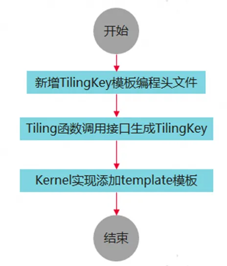

# TilingKey模板化编程

### 基础知识准备

本文内容基于Ascend C算子开发衍生而来，对于算子开发还不了解的读者可以通过以下资源进行学习：

[《Ascend C算子开发文档手册》](https://www.hiascend.com/document/redirect/CannCommunityOpdevAscendC)

[《Ascend C算子开发系列课程》](https://gitcode.com/cann/cann-learning-hub/tree/master/tutorials/ascendc_operator_development)

### 背景介绍

随着越来越多的用户基于Ascend C进行算子开发，算子开发过程中的易用性相关问题陆续被反馈出来，其中多场景算子的高效开发实现以及维护管理一直是用户的痛点。本次在CANN全面开源开放中做了很多算子开发易用性提升的工作，针对多场景算子的开发CANN推出了TilingKey模板化编程，有效解决了多场景算子开发管理的问题。

### 亮点介绍

TilingKey模板化编程具备以下特点：

- 减少icache miss和scalar耗时，提升算子调用性能
- 通过模板化的开发方式提升算子开发效率

- 算子代码的可读性和可维护性提升

### 技术详细解析

在算子开发过程中，会遇到同一个算子有多种不同的实现的情形；为了能够在运行时能够正确加载到对应的算子实现，在Tiling的实现中会引入TilingKey的概念。TilingKey是一个算子内为了区分不同场景的实现而将Kernel代码进行区分的方法，该方法类似于C++的Template模板机制，可减少不必要的icache miss以及scalar耗时，有助于优化单次调用Kernel的性能。不同的Kernel实现分支可以通过TilingKey来标识，Host侧设置TilingKey后，可以选择对应的分支，例如：一个算子在不同的shape下，有不同的算法逻辑，Kernel侧可以通过TilingKey来选择不同的算法逻辑，在Host侧Tiling算法也有差异，Host/Kernel侧通过相同的TilingKey进行关联。

假如有如下Kernel代码：

```

if (condition) {
  ProcessA();
} else {
  ProcessB();
}
```

​

如果函数ProcessA、ProcessB两个函数是个非常大的函数，那么上述代码在编译后会变得更大，而每次Kernel运行只会选择1个分支，条件的判断和跳转在代码大到一定程度（16-32K，不同芯片存在差异）后会出现icache miss。通过TilingKey可以对这种情况进行优化，给2个Kernel的处理函数设置不同的TilingKey 1和2：

```

if (TILING_KEY_IS(1)) {
  ProcessA();
} elseif (TILING_KEY_IS(2)) {
  ProcessB();
}
```

​

这样Device Kernel编译时会自动识别到2个TilingKey并编译2个Kernel入口函数，将条件判断进行常量折叠。同时需要和Host Tiling函数配合，判断走ProcessA的场景设置TilingKey为1，走ProcessB的场景设置TilingKey为2：

```

static ge::graphStatus TilingFunc(gert::TilingContext* context)
{
    // some code
    if (condition) {
        context->SetTilingKey(1);
    } else {
        context->SetTilingKey(2);
    }
    return ge::GRAPH_SUCCESS;
}
```

​

但是，上述编程方式会让其他阅读这份代码的用户产生疑问：假如用户从函数调用入口查看代码时，看到了两个分支分别是TILING_KEY_IS(1)和TILING_KEY_IS(2)，那么用户会无法理解“1”和“2”的含义。尤其是在涉及多个TilingKey的场景中，开发者依赖TilingKey来管理Kernel的实现，无论是在管理还是使用上都会遇到相当大的复杂性。因此为了简化这一过程，消除TilingKey不易于记忆和理解的问题，我们引入了一种采用模板编程的方法来替代传统的TilingKey编程的方案，从而减少对TilingKey数值标识的依赖，使Kernel的管理更加直观和高效。

具体的开发步骤如下：



下面我们以add自定义算子开发为样例，详细介绍一下具体的使用方法：

1  在**自定义算子工程**的op_kernel目录下，新增定义模板参数和模板参数组合的头文件，本示例中头文件命名为tiling_key_add_custom.h

该头文件中需要包含模板头文件ascendc/host_api/tiling/template_argument.h。

定义模板参数ASCENDC_TPL_ARGS_DECL和模板参数组合ASCENDC_TPL_ARGS_SEL（即可使用的模板）。具体API参考见模板参数定义。

**模板参数定义：**

[https://www.hiascend.com/document/detail/zh/canncommercial/82RC1/API/ascendcopapi/atlasascendc_api_07_00011.html](https://weibo.cn/sinaurl?u=https%3A%2F%2Fwww.hiascend.com%2Fdocument%2Fdetail%2Fzh%2Fcanncommercial%2F82RC1%2FAPI%2Fascendcopapi%2Fatlasascendc_api_07_00011.html)

```

#include"ascendc/host_api/tiling/template_argument.h"
#define ADD_TPL_FP16 1  // 数据类型定义
#define ADD_TPL_FP32 0
#define ADD_TPL_ND 2   //  数据格式定义
#define ADD_TPL_NZ 29
// 模板参数
ASCENDC_TPL_ARGS_DECL(AddTemplateCustom, // 算子OpType
ASCENDC_TPL_DTYPE_DECL(D_T_X, ADD_TPL_FP16, ADD_TPL_FP32), // DataType类型的模板参数定义：输入参数x的数据类型，取值范围为float16/float32
ASCENDC_TPL_DTYPE_DECL(D_T_Y, ADD_TPL_FP16, ADD_TPL_FP32), // DataType类型的模板参数定义：输入参数y的数据类型，取值范围为float16/float32
ASCENDC_TPL_DTYPE_DECL(D_T_Z, ADD_TPL_FP16, ADD_TPL_FP32), // DataType类型的模板参数定义：输入参数z的数据类型，取值范围为float16/float32
ASCENDC_TPL_UINT_DECL(TILE_NUM, ASCENDC_TPL_8_BW, ASCENDC_TPL_UI_MIX, 2, 0, 2, 3, 5, 10, 12, 13, 9, 8),// 自定义UINT类型（无符号整形）的模板参数定义：模板参数为切分的块数，编码位宽为ASCENDC_TPL_8_BW即8比特，表示该模板参数的个数不超过8比特能表达的范围；ASCENDC_TPL_UI_MIX表示通过混合模式表达取值范围，有2组的数据{0-2}、{3-5}和穷举值10、12、13、9、8，最后结果为{0, 1, 2, 3, 4, 5, 10, 12, 13, 9, 8}
ASCENDC_TPL_BOOL_DECL(IS_SPLIT, 0, 1), // 自定义bool类型的模板参数定义：模板参数为是否切分标志位，取值范围为0和1，1表示切分，0表示不切分
);
// 模板参数组合
// 用于调用GET_TPL_TILING_KEY获取TilingKey时，接口内部校验TilingKey是否合法
ASCENDC_TPL_SEL(
    ASCENDC_TPL_ARGS_SEL(
    ASCENDC_TPL_DTYPE_SEL(D_T_X, ADD_TPL_FP16),
    ASCENDC_TPL_DTYPE_SEL(D_T_Y, ADD_TPL_FP16),
    ASCENDC_TPL_DTYPE_SEL(D_T_Z, ADD_TPL_FP16),
    ASCENDC_TPL_UINT_SEL(TILE_NUM, ASCENDC_TPL_UI_LIST, 1, 8),
    ASCENDC_TPL_BOOL_SEL(IS_SPLIT, 0, 1),
    ),
    ASCENDC_TPL_ARGS_SEL(
    ASCENDC_TPL_DTYPE_SEL(D_T_X, ADD_TPL_FP32),
    ASCENDC_TPL_DTYPE_SEL(D_T_Y, ADD_TPL_FP32),
    ASCENDC_TPL_DTYPE_SEL(D_T_Z, ADD_TPL_FP32),
    ASCENDC_TPL_UINT_SEL(TILE_NUM, ASCENDC_TPL_UI_LIST, 1, 8),
    ASCENDC_TPL_BOOL_SEL(IS_SPLIT, 0, 1),
    ),
);
```

2 Host侧调用**GET_TPL_TILING_KEY**接口生成TilingKey

**GET_TPL_TILING_KEY：**

https://www.hiascend.com/document/detail/zh/canncommercial/82RC1/API/ascendcopapi/atlas_ascendc_10_00008.html

Host实现文件中包含步骤1中定义模板参数和模板参数组合的头文件。

调用GET_TPL_TILING_KEY接口生成TilingKey，GET_TPL_TILING_KEY输入参数为模板参数的具体值，传入时需要与定义模板参数和模板参数组合的头文件中的模板参数顺序保持一致。

```

#include "tiling_key_add_custom.h"
static ge::graphStatus TilingFunc(gert::TilingContext *context)
{
    TilingData tiling;
    uint32_t totalLength = context->GetInputShape(0)->GetOriginShape().GetShapeSize();
    ge::DataType dtype_x = context->GetInputDesc(0)->GetDataType();
    ge::DataType dtype_y = context->GetInputDesc(1)->GetDataType();
    ge::DataType dtype_z = context->GetOutputDesc(1)->GetDataType();
    uint32_t D_T_X = ADD_TPL_FP32, D_T_Y=ADD_TPL_FP32, D_T_Z=ADD_TPL_FP32, TILE_NUM=1, IS_SPLIT=0;
    if(dtype_x == ge::DataType::DT_FLOAT){
        D_T_X = ADD_TPL_FP32;
    }elseif(dtype_x == ge::DataType::DT_FLOAT16){
        D_T_X = ADD_TPL_FP16;
    }
    if(dtype_y == ge::DataType::DT_FLOAT){
        D_T_Y = ADD_TPL_FP32;
    }elseif(dtype_y == ge::DataType::DT_FLOAT16){
        D_T_Y = ADD_TPL_FP16;
    }
    if(dtype_z == ge::DataType::DT_FLOAT){
        D_T_Z = ADD_TPL_FP32;
    }elseif(dtype_z == ge::DataType::DT_FLOAT16){
        D_T_Z = ADD_TPL_FP16;
    }
    if(totalLength< MIN_LENGTH_FOR_SPLIT){
        IS_SPLIT = 0;
        TILE_NUM = 1;
    }else{
        IS_SPLIT = 1;
        TILE_NUM = DEFAULT_TILE_NUM;
    }
    context->SetBlockDim(BLOCK_DIM);
    tiling.set_totalLength(totalLength);
    tiling.SaveToBuffer(context->GetRawTilingData()->GetData(), context->GetRawTilingData()->GetCapacity());
    context->GetRawTilingData()->SetDataSize(tiling.GetDataSize());
    constuint64_t tilingKey = GET_TPL_TILING_KEY(D_T_X, D_T_Y, D_T_Z, TILE_NUM, IS_SPLIT);
    context->SetTilingKey(tilingKey);
    size_t *currentWorkspace = context->GetWorkspaceSizes(1);
    currentWorkspace[0] = 0;
    return ge::GRAPH_SUCCESS;
}
```

3 Kernel侧实现

- Kernel实现文件中包含步骤1中定义模板参数和模板参数组合的头文件。
- 核函数添加template模板，以便支持模板参数的传入，参数顺序需要与定义模板参数和模板参数组合的头文件中的模板参数顺序保持一致。
- 通过对模板参数的分支判断，选择不同的Kernel侧实现。

```

#include "tiling_key_add_custom.h"
...
...
template<int D_T_X, int D_T_Y, int D_T_Z, int TILE_NUM, int IS_SPLIT>
 __global__ __aicore__ void add_custom(GM_ADDR x, GM_ADDR y, GM_ADDR z, GM_ADDR workspace, GM_ADDR tiling)
 {
     GET_TILING_DATA(tiling_data, tiling);
     if(D_T_X == ADD_TPL_FP32 && D_T_Y == ADD_TPL_FP32 && D_T_Z == ADD_TPL_FP32){
         KernelAdd<float, float, float> op;
         op.Init(x, y, z, tiling_data.totalLength, TILE_NUM, IS_SPLIT);
         op.Process1();
     }else if(D_T_X == ADD_TPL_FP16 && D_T_Y == ADD_TPL_FP16 && D_T_Z == ADD_TPL_FP16){
         KernelAdd<half, half, half> op;
         if(IS_SPLIT == 0){            op.Init(x, y, z, tiling_data.totalLength, TILE_NUM, IS_SPLIT);
            op.Process1();
         }else if(IS_SPLIT==1){
         op.Init(x, y, z, tiling_data.totalLength, TILE_NUM, IS_SPLIT);
         op.Process2();        }    }}
```

当前已开源的ops-nn仓和ops-transfomer仓中的部分核心算子已经基于该模板化编程方式完成优化，感兴趣的同学可以访问ops-nn仓 BatMatMulV3算子和ops-transformer仓 FA算子。

**ops-nn仓 BatMatMulV3算子：**

https://gitcode.com/cann/ops-nn/tree/master/matmul/batch_mat_mul_v3

**ops-transformer仓 FA算子：**

https://gitcode.com/cann/ops-transformer/tree/master/attention/flash_attention_score

### 总结

TilingKey模板化编程既提供了一种简单的多场景算子开发编程范式，简化了算子的开发难度，也实际提升了算子的执行效率，帮助开发者更便捷的开发高性能多场景算子。


