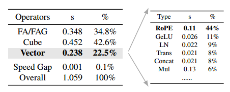
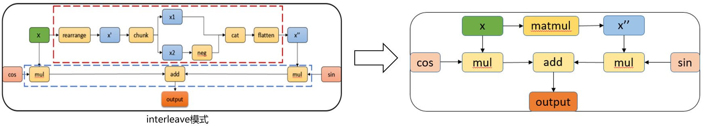
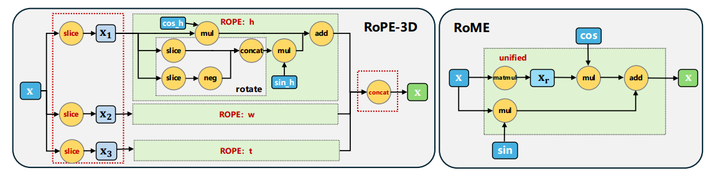
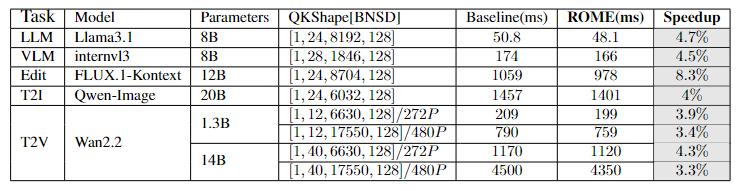
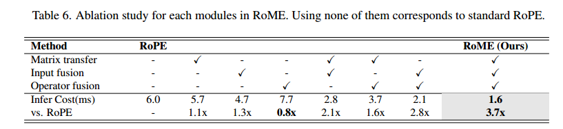

# transformer仓experimental路径MIX算子开发贡献

#### 一、背景

笔者主要业务为AI加速，在对业务相关的Transformer网络做profiling分析时发现，当前常见的AIGC、多模态、VLM、LLM中都存在RoPE（Rotary Position Embedding，旋转位置编码）算法，且其中RoPE算子执行占比高，如下图所示，我们可以看到Flux网络中，除了FA（Flash Attention）和matmul，第三就是RoPE，它由一些基础的Vector操作组成，耗时远高于预期，占比整网10%。
 

通过分析发现，性能问题可以总结为两方面：
 1）由于涉及到对元素奇偶数位操作，昇腾910系列不亲和；
 2）部分网络RoPE-3D实现无法使用等价的RoPE-1D实现替代。
 为了解决该问题，我们通过细粒度的拆解RoPE的每步操作，发现其中rearrange、slice、chunk等操作实际上可以通过一个**完全数学等价的矩阵乘替代：新增右矩阵mat=[D,D]， x=[B,N,S,D]，新增计算x@mat，其余部分不变，由于Cube的高算力和该计算的连续性，该新增计算相比原先的不对齐场景的rearrange等操作快速很多**，如下图所示：
 

尤其是在3D场景中可以进一步的减少slice等算子的数量，天然的能将3D合并为1D，如下图所示：
 

**为了充分发挥算法的能力，融合算子是一个很重要的优化项，所以在CANN算子仓不存在该算子的时候，我们需要开发自定义算子**。
 后续章节我们将详细的描述基于昇腾已有的开源文档和用例，如何开发自定义算子实现我们算法方案，达成优化目标。

设计详情可参考方案设计issue([https://gitcode.com/cann/ops-transformer/issues/61](https://gitcode.com/cann/ops-transformer/issues/61) )。 更为详细的算法原理可以参考我们的已投CVPR的**算法论文Efficient Matrix Implementation for Rotary Position Embedding**，预计2月份公开。
 当前章节我们先展示最终优化效果，如表所示，我们算法简称为RoME，在单算子和整网(整网测试可以使用Mindspeed)中都能得到很好的效果。
 



#### 二、自定义算子开发：基于官网pybind教程开发

在算子开发前，我们首先需要将我们的需求从算法原理转换为文字描述：本算法设计公式为`out=x * cos + x @ mat * sin`， 其中`x=[B,N,S,D]`为RoPE算法原始输入，`mat=[D,D]`为本方案特有的新增矩阵， `sin/cos=[1, 1, S, D]`与原始RoPE算法相同。 所以本算法是一个**同时需要使用Cube(矩阵乘)和Vector(向量)的MIX融合算子**。 通过调研发现，业界最常用的`D=128`，所以本文所述自定义算子仅编写支持`D=128`的输入和昇腾`910系列`环境，后续泛化版本预计通过CANN正式版本发布。

##### Step1：算子开发准备工作：

从官网入口，根据官网README查到pybind编程入口（笔者在自定义算子开发过程中时商发版本README最新为8.3RC1）：
 `https://www.hiascend.com/document/detail/zh/canncommercial/83RC1/opdevg/Ascendcopdevg/atlas_ascendc_10_0057.html`
 根据官网的指引我们找到了samples的路径：
 `https://gitee.com/ascend/samples/tree/master/operator/ascendc/0_introduction`
 由于我们的目标算子是个MIX（同时有矩阵乘操作和向量操作）融合算子，所以遍历了整个路径，从中选取了一个看起来较为完善的MIX融合算子编程过程作为参考：
 `https://gitee.com/ascend/samples/blob/master/operator/ascendc/0_introduction/22_baremix_kernellaunch/BareMixInvocation/baremix_custom.cpp`

##### Step2：算子开发

实现流程设计：由于910系列 CV分离(Cube上的数据传入Vector必须经过L2或高带宽内存)的特性，我们分析发现matmul计算和Vector计算理论上都是memory bound， 所以我们决策采用先计算matmul后再计算Vector的方式完成编程。
 参考样例的实现，我们使用`ASCEND_IS_AIC, ASCEND_IS_AIV`去区分Cube和Vector部分，按照官网说法，这个好处是Cube和Vector解耦，无需关心Cube和Vector数量问题(C/V=1/2)，再通过`CrossCoreSetFlag， CrossCoreWaitFlag`去控制C和V之间的通信关系。

```
    KERNEL_TASK_TYPE_DEFAULT(KERNEL_TYPE_MIX_AIC_1_2);  // dry kernel type: KERNEL_TYPE_MIX_xxx
    TPipe tpipe;
    TCubeTiling tilingLocal;
    RopeMatrix::CopyTiling(&tilingLocal, tiling);
    if ASCEND_IS_AIC {
        ...
        AscendC::CrossCoreSetFlag<0x2, PIPE_FIX>(0x8); // set flag after matmul
    }
    if ASCEND_IS_AIV {
        AscendC::CrossCoreWaitFlag(0x8); // wait matmul outputs
        ...
    }
```

之后基于该套逻辑，我们可以完成算子实现，具体实现可查阅`https://gitcode.com/cann/ops-transformer/tree/master/experimental/posembedding/rope_matrix`中op_host和op_kernel目录。

##### Step3：适配torch

遍历`https://gitee.com/ascend/samples/tree/master/operator/ascendc/0_introduction`， 我们通过测试找到了（参考13_matmulleakyrelu_kernellaunch和22_baremix_kernellaunch）一个可以支持MIX融合算子编译的cmake以及torch对应的适配和编译方式，并对其做了精简，保留其中核心的两项:

 **1. 编译功能**
 
 A). CMakeLists.txt: 用于编译出kernel侧执行的so文件，其中使用了auto_gen的策略生成了一些中间文件，这些东西用户无需关心，只要注意export对应的so即可；
 
 B). setup.py: 用于编译torch pybind功能，编译完成后安装"python setup.py build_ext --inplace"， 之后可直接使用torch调用。
 
 **2. 接口实现 torch_interface.cpp：用户需要适配的核心组件**

'torch_interface.cpp’的实现：可以分为三个组件，PYBIND11_MODULE、ACLRT_LAUNCH_KERNEL以及tiling构造。

**(1) PYBIND11_MODULE**

如下所示，按照规则写即可

```
PYBIND11_MODULE(TORCH_EXTENSION_NAME, m) {
    m.def("rope_matrix_kernel_bf16", &rope_matrix_kernel_bf16, "rope_matrix_kernel_bf16");
}
```

 **(2) ACLRT_LAUNCH_KERNEL**

 该调用来源于make编译后自动生成的文件，用户一般不用关心，感兴趣的同学可以grep编译出的文件，可以看到"ACLRT_LAUNCH_KERNEL"本质上是个extern "C"的全局声明，该函数调用了kernel函数对外接口(需extern C声明)

```
at::Tensor rope_matrix_kernel_bf16(at::Tensor x, at::Tensor y, at::Tensor sin, at::Tensor cos)
{
    ...

    ACLRT_LAUNCH_KERNEL(rope_matrix_kernel_bf16)(
        blockDims, aclstream,
        (uint8_t*)(x.storage().data()),
        (uint8_t*)(y.storage().data()),
        (uint8_t*)(sin.storage().data()),
        (uint8_t*)(cos.storage().data()),
        (uint8_t*)(output.storage().data()),
        (uint8_t*)(workspace_tensor.storage().data()),
        tilingDevice);
}
```

 **(3) tiling构造**

 ACLRT_LAUNCH_KERNEL调用中有一项是tilingDevice，该项是一个device侧的内存空间。
 首先分配内存空间：`aclrtMalloc((void **)&tilingDevice, tilingFileSize, ACL_MEM_MALLOC_HUGE_FIRST)`
 然后拷贝：`aclrtMemcpy(tilingDevice, tilingFileSize, tilingHost, tilingFileSize, ACL_MEMCPY_HOST_TO_DEVICE);`
 其中host侧的`tilingHost`参数和普通C与C++的new内存操作差不多，不过使用时需要使用 `aclrtMallocHost`接口以及`aclrtMemcpy(..., ACL_MEMCPY_HOST_TO_HOST)`接口替换普通的malloc和memcpy。
 最终可参考以下实现：`https://gitcode.com/xuyun15/ops-transformer/blob/xy_bak_dev/experimental/posembedding/rope_matrix/torch_interface.cpp`

##### Step4：性能优化

完成Step2和Step3后，可编写`python+torch`的测试用例，使用`torch_profiling`做性能测试， 我们发现算子无论Vector还是Cube侧的`memory copy in(MTE2)`开销都超过预期，所以我们分别对两者进行了细致的分析和优化。

 **(1) tiling优化：tiling改为切S方向，在BN方向上做pingpong。**
 
 通过注释掉matmul组件代码，仅执行Vector的profiling，可发现 `Vector memory copy in`的开销比预期的要高1倍有余，通过对比我们的实现和原版的RoPE融合算子（`https://gitcode.com/cann/ops-transformer/blob/master/posembedding/rotary_position_embedding/rotate_half_bf16.h`），我们发现tiling的差异：由于x的维度`[B,N,S,D]`, sin/cos维度`[1,1,S,D]`，本方案第一个版本切核方式是BNS方向均分，导致sin和cos需重复拷贝，实际拷贝量不是`S*D`而是约等于x的`B*N*S*D`，因此Vector部分的`memory copy in`开销翻倍。所以Vector部分通过参考开源仓原始的RoPE最优实现，修改Vector tiling可达成优化效果。 由于 `CrossCoreSetFlag`仅支持核内同步（比如说20个Cube和40个Vector，Cube0仅能和Vector0和Vector1同步），所以我们需要同步的将matmul的tiling修改为切S轴的方式。

```
以[B,N,S,D]=[1,24,28799,128]， Cube20核，Vector40核为例：
则我们可以将S=28799切分为40份： 720*39 + 719；
如此非尾块的Cube执行720*2， Vector执行720，尾块的Vector执行719， 尾块的Cube执行(720+719)。
```

**(2)  matmul优化：右矩阵缓存复用。**

 通过profiling，我们识别到matmul执行时的memory copy in(MTE2)开销远大于预期(理论copy in值为`左矩阵+右矩阵*corenum`)。基于对昇腾硬件的了解，一般memory copy in开销过大的原因为左矩阵和右矩阵多次拷贝（笔者觉得大部分场景copy in开销远大于预期就是该原因）。
 通过分析发现，本算法执行过程中右矩阵一直保持的不变，且大小为[D,D]，Transformer网络D的大小一般为64、128、192，这样右矩阵是小于100K的，这种小的存储开销可以一直缓存在L1甚至L0B(此处需要对昇腾硬件有所了解)上。 所以我们最终选择了右矩阵缓存复用。 万幸的是，高阶API提供了该功能(`https://www.hiascend.com/document/detail/zh/canncommercial/83RC1/API/ascendcopapi/atlasascendc_api_07_0614.html`)。
 优化前：

```
typedef MatmulType<AscendC::TPosition::GM, CubeFormat::ND, A_T> aType;
typedef MatmulType<AscendC::TPosition::GM, CubeFormat::ND, B_T> bType;
typedef MatmulType<AscendC::TPosition::GM, CubeFormat::ND, C_T> cType;
typedef MatmulType<AscendC::TPosition::GM, CubeFormat::ND, C_T> biasType;
Matmul<aType, bType, cType, biasType> matmulObj;
```

优化后：差异在于右矩阵MatmulType配置时需额外配置IBSHARE参数为true。

```
typedef MatmulType<AscendC::TPosition::GM, CubeFormat::ND, A_T> aType;
typedef MatmulType<AscendC::TPosition::GM, CubeFormat::ND, B_T, false, LayoutMode::NONE, true> bType;
typedef MatmulType<AscendC::TPosition::GM, CubeFormat::ND, C_T> cType;
typedef MatmulType<AscendC::TPosition::GM, CubeFormat::ND, C_T> biasType;
Matmul<aType, bType, cType, biasType> matmulObj;
```

##### Step5：总结

最终可以构建出整体的工程目录

```
  ${op_class}                                          # class
  ├── ${op_name}                                       # name
  │   ├── inc                                          # define a struct as TCubeTiling, which can be call by both op_device and op_host
  │   │   └── ${op_name}_extern.h
  │   ├── op_host                                      # Tiling、InferShape(If needed, custom operator may not need)...
  │   │   ├── ${op_name}_tiling.h
  │   │   └── ${op_name}_tiling.cpp                    # Tiling
  │   ├── op_kernel                                    # kernel
  │   │   ├── ${op_name}.cpp                           # kernel input
  │   │   ├── ${op_name}.h                             # fused vector part
  │   │   └── ${op_name}_cube.h                        # matrix part
  │   ├── CMakeLists.txt                               # makefile
  │   ├── torch_interface.cpp                          # for torch pybind mode, for torch calling
  │   ├── build_torch.sh                               # 3 file to install a lib which can be call by torch
  │   ├── setup.py
  │   ├── ascendc_extension.py
  │   ├── test_rope.py                                 # test file: contain how to gen the [d, d] rope-matrix,
  │   └── README.md                                    # readme
```

初版开源工程路径可参考：
 `https://gitcode.com/xuyun15/ops-transformer/blob/xy_bak_dev/experimental/posembedding/rope_matrix/README.md`

#### 三、开源贡献：从pybind(ACLRT_LAUNCH_KERNEL)-> experimental仓"<<<>>>"模式

作为一个优秀的算法设计和实现，我们认为应该将算法贡献到开源社区以供更多的用户参考和使用。
 通过官方引导，我们识别到开源贡献仓地址：`https://gitcode.com/cann/ops-transformer`。最终本算法也是交付到该开源仓：`https://gitcode.com/cann/ops-transformer/blob/master/experimental/posembedding/rope_matrix/README.md`， 下文将详细介绍开源流程。

##### Step1：与开源仓Owner沟通贡献方式

`ops-transformer`仓作为Transformer相关的算子仓，提供了两种贡献路径：
 **1. 全量的组件贡献方式，需要编写全量的组件。**
 **2. kernel直调方式：experimental目录接受kernel直调方式的贡献方式，方式类似于pybind，是我们这种torch用户较为喜爱的方式，也是本文的贡献方式。**
 为此，我们首先和ops-transformer仓的Owner对齐了experimental路径的详细贡献方式，最终Owner决策为 **<<<>>>模式+RunOpApiV2接口**方式，该方式相比之前的章节提到的pybind的方式少了acl相关调用和编译，且pybind模式区分host和kernel，而库上方式用户侧感知更为接近CUDA自定义算子调用，更为接近C++调用方式，无需显式的做host和kernel通信。

##### Step2：调整之前的pybind工程

可以参考`https://gitcode.com/cann/ops-transformer/pull/299`。我们主要做了以下调整：

1. 更新了CANN和torch版本：
   CANN为最新的版本，torch需要>2.4， 且建议从https://gitcode.com/Ascend/pytorch/releases路径下载后pip install指定该下载；
2. 更新gcc版本：
   gcc>9，注意需要ccec -v查询确认ccec链接到正确的版本；
3. 删除了torch编译相关项：
   该项在
   experimental的npu_ops_transformer_ext路径下完成
   ，所有experimental路径下的算子会编译为一个whl包（具体使用参考对应的README）；
4. 目录结构调整：
   tiling和kernel实现都调整到h文件中，当前官网编译工程如果声明在h文件，实现在cpp文件中可以编译通过但是无法执行的；
5. 自定义typedef uint8_t char_t; ：
   否则使用高阶API的时候编译会报错；
6. 二级的namespace：
   所有的文件都使用一级的namespace npu_ops_transformer_ext以及用户自定义的二级namespace， 二级namespace需相同，且所有文件需要如此，否则编译不过；
7. namespace显式调用:
   由于kernel和host不同的namespace内有重名的结构，而新的编译方式不区分kernel和host侧，所以using namespace matmul_tiling; using namespace matmul; using namespace AscendC; 不能同时使用，否则会编译工程报错。 为此代码需要调整为显示的调用命名空间中类和结构，如：TPosition修改为matmul_tiling::TPosition；
8. CMakeLists文件重写：
   请参考库上代码，COMPILE_FLAGS “–npu-arch=dav-2201 -xasc -ltiling_api -lplatform -lregister” 是为了MIX融合算子编译通过，如果Vector算子可参考ops-math仓的编译工程；
9. 重写的torch_interface.cpp，如下所示

(1) 首先需要在 npu_ops_transformer_ext/npu_ops_def.cpp 路径下的TORCH_LIBRARY函数补齐新增的算子接口:

```
"m.def("rope_matrix(Tensor x, Tensor y, Tensor sin, Tensor cos) ->Tensor");"
```

(2) torch_interface.cpp中新增TORCH_LIBRARY_IMPL注册函数， 函数类型必须和上面一一对应，如果有多个TORCH_LIBRARY_IMPL注册，注意每个函数都需要满足该条件，且函数间如果有’&’ 引用符号需要同时保持有无

```
// Register Ascend implementations for RopeMatrix
TORCH_LIBRARY_IMPL(npu_ops_transformer_ext, PrivateUse1, m)
{
    m.impl("rope_matrix", rope_matrix_npu);
}
// Register Meta Function for RopeMatrix
TORCH_LIBRARY_IMPL(npu_ops_transformer_ext, Meta, m)
{
    m.impl("rope_matrix", TORCH_FN(rope_matrix_meta));
}
```

(3)  torch_interface.cpp删除所有acl相关使用，直接传入host侧定义的变量，但是调用方式需要按照如下方式`<<<>>> + RunOpApiV2`

```
// then design rope_matrix_npu
at::Tensor rope_matrix_kernel(at::Tensor &x, at::Tensor &y, at::Tensor &sin, at::Tensor &cos)
{
    ...

    auto acl_call = [=]() -> int {
        rope_matrix_kernel<bfloat16_t><<<blockDims, nullptr, aclstream>>>(
            (GM_ADDR)(x.storage().data()),
            (GM_ADDR)(y.storage().data()),
            (GM_ADDR)(sin.storage().data()),
            (GM_ADDR)(cos.storage().data()),
            (GM_ADDR)(output.storage().data()),
            (GM_ADDR)(workspaceTensor.storage().data()),
            ropeTiling,
            mmTilingData);
        return 0;
    };
    at_npu::native::OpCommand::RunOpApiV2("RopeMatrix", acl_call);
}
```

##### Step3：总结

最终可以构建出整体的工程目录

```
  ${op_class}                                          # class
  ├── ${op_name}                                       # name
  │   ├── inc                                          # define aRopeMatrixTiling like TCubeTiling, which can be call by both op_device and op_host
  │   │   └── ${op_name}_extern.h
  │   ├── op_host                                      # Tiling、InferShape(If needed, custom operator may not need)...
  │   │   └── ${op_name}_tiling.h                      # Tiling
  │   ├── op_kernel                                    # kernel
  │   │   ├── ${op_name}.h                             # fused vector part
  │   │   └── ${op_name}_cube.h                        # matrix part
  │   ├── tests                                        # tests
  │   │   └── test_rope.py                             # test file: contain how to gen the [d, d] rope-matrix,
  │   ├── CMakeLists.txt                               # makefile
  │   ├── torch_interface.cpp                          # for torch calling
  │   └── README.md                                    # readme
```

而工程的编译和执行如下所示：

```
# How to run this sub-project$, please first read the reade at "experimental/npu_ops_transformer_ext"
path="path for experimental"
cd $path$/npu_ops_transformer_ext
python -m build --wheel -n
cd dist
pip install *.whl --force-reinstall --no-deps
cd $path$/posembedding/rope_matrix/tests
python ./test_rope.py # full code can be find at the last of readme.
```

#### FAQ：昇腾CANN开源贡献经验总结

由于我们是第一个往ops-transformer仓的experimental仓贡献torch可调用的MIX融合算子，过程中不可避免的有些问题和难点，为此我们专门以issue(`https://gitcode.com/cann/ops-transformer/issues`搜索作者xuyun15和jimmy_lin)的方式记录了对应问题，开源官方的同学也热情的联系并根据我们的问题做出了一些改进。
 后续如果大家在做开源贡献过程中遇到问题，也可以通过issue的方式记录并联系开源仓Owner。

---

本文原创作者为**华为2012实验室中央媒体技术院 AI 加速团队**，文中的RoPE_Matrix算子由该团队自主开发，且作为ops-transformer开源算子仓experimental路径首个贡献的融合算子成功落地。感谢团队的无私分享，助力开发者高效参与昇腾CANN开源生态贡献~

**原文链接**：[https://www.hiascend.com/developer/blog/details/02120199330272228240](https://www.hiascend.com/developer/blog/details/02120199330272228240)

**Rope-Matrix融合算子贡献地址**：[https://gitcode.com/cann/ops-transformer/blob/master/experimental/posembedding/rope_matrix/README.md](https://gitcode.com/cann/ops-transformer/blob/master/experimental/posembedding/rope_matrix/README.md)
