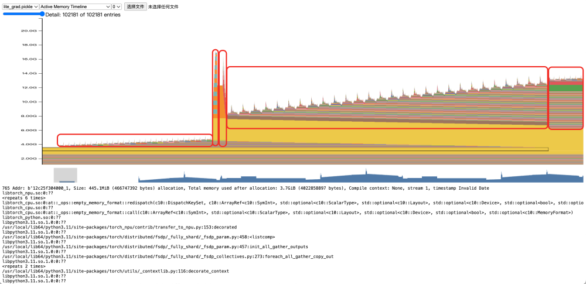
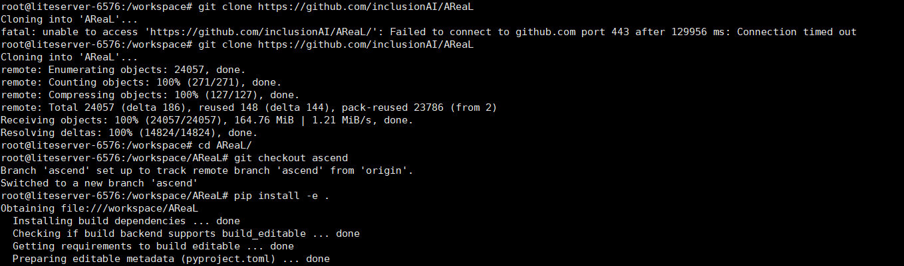
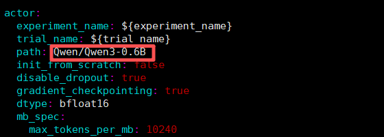
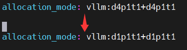
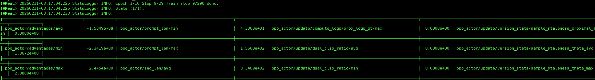
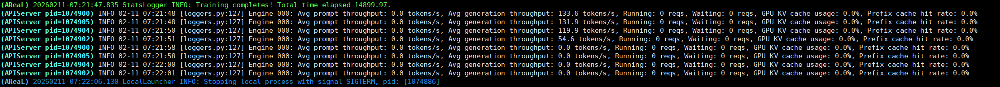
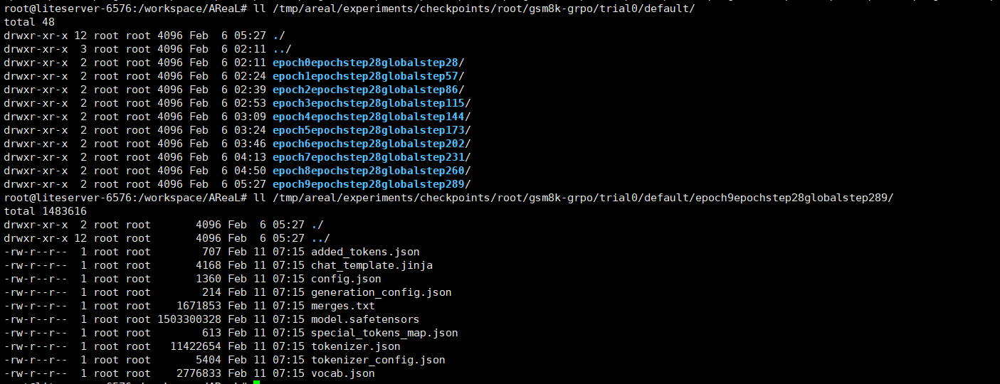

# 基于昇腾的AReaL全异步RL训练

近年来强化学习已成为增强大模型推理能力的关键手段，通过奖励机制和策略迭代能使大模型快速适应对应场景任务，且无需大量的数据标注，极大地降低了后训练成本，越来越多的大模型开发人员开始关注如何高效、便捷地进行大模型强化学习。AReaL框架凭借高效的性能、简单易用的API，基于昇腾NPU开箱即用，加速大模型全异步RL训练创新。

## 1️、AReaL 是什么？

AReaL 是一个面向算法设计者的强化学习框架，核心目标是：

👉 将 RL 框架从完整应用演进为高性能、可复用的后端依赖

AReaL 通过 极简 API + 可扩展插件机制，把算法开发者从复杂的系统工程中解放出来，使其专注于 RL 算法、Reward 设计与 Agent 行为建模，而不是分布式、通信、容错等底层细节。

📌 项目地址：👉 https://github.com/inclusionAI/AReaL

## 2、AReaL 的核心优势

AReaL相较于传统RL训练系统存在三大核心优势：

- **全异步 RL 训练系统：** 传统RL训练系统将生成（rollout)和训练（train)强绑定，生成序列长度的分布会显著影响算力的利用率。AReaL采用全异步RL训练系统，生成和训练完全解耦，即便序列长度差异较大算力也可以得到充分利用，提升RL训练效率。

- **Single Controller架构：**传统RL训练系统采用SPMD（Single Program，Multiple Data）架构，多个进程运行相同代码，做不到资源的灵活控制和异常状况的快速恢复。AReaL采用Single Controller架构，将**调度**和**计算**分为两个完全独立的平面，互不干扰，可以轻松地添加修改RL训练资源，也可以将异常进程任务分配给其他进程，大大提高系统可靠性。

- **解耦式 Agentic RL：**AI智能体的构建常常会因为RL训练和Agent编排框架的高度耦合导致代码复用性差，难以迭代更新。AReaL采用解耦式的Agentic RL，围绕**Agent完全独立运行**和**RL训练作为外部观察者**两大原则设计，实现了Agent逻辑和RL训练的完全分离，极大提升了智能体的开发效率和系统可维护性。

  同时，AReaL在昇腾平台通过提供**Docker镜像**，**软件版本矩阵**以及**可复现的运行教程**，已经具备了**稳定、便捷的开箱能力**，并会持续地维护、优化AReaL框架在昇腾平台的使用体验。在超大规模RL训练中，AReaL也在昇腾平台完成了**万亿参数MoE模型**的真实RL后训练业务验证，保证商业用户的大规模部署需求。

## 3、AReaL 在昇腾上的关键适配工作

为了顺利让AReal框架在昇腾上运行起来，昇腾团队分析并做了一系列的适配工作，包括：**vLLM推理引擎支持**、**训练阶段适配**、**权重Resharding功能验证**。

### vLLM推理引擎支持

AReaL中的推理后端使用的是服务化的推理引擎。适配前，AReaL 只支持 SGLang推理引擎。而vLLM推理引擎以其稳定性和广泛的生态系统成为众多用户的选择，需要在AReaL框架中适配vLLM推理引擎作为推理后端。强化学习训练过程需要做权重更新，SGLang中的 update_weights 接口支持该功能，而 vLLM不支持，需要适配update_weights接口。因此，AreaL支持vLLM推理引擎分为2个部分： **AReaL 适配 vLLM** 、**vLLM新增支持update_weights权重更新功能**。

对于AReaL 适配 vLLM部分，需要新增vLLM相关的类，继承AReaL中抽象出来的推理引擎接口，实现vLLM的相关模块和功能。

对于vLLM新增支持update_weights权重更新功能，起初在vLLM中直接修改添加的update_weights接口，这样依赖vLLM版本更新和其他变动，同时侵入式修改vLLM代码在设计上也不推荐。因此通过patch方式给vLLM新增接口，代码在AReaL仓库承载，使用方便也对vLLM版本无影响。

### 训练阶段适配

AReaL使用FSDP2作为训练后端，FSDP2在torch_npu上已经支持，首先需要torch升级到2.7.1以上版本。其次，得益于FSDP训练后端本身模型结构与并行策略解耦的轻量化设计，同时AReaL 框架的设计时就考虑了多种设备的支持，将设备部分抽象成了Platform类，用于抽象不同的设备类型。因此，训练部分适配NPU，只需要实现NPU对应的Platform类，在训练开始前根据当前使用的设备初始化对应的platform。

适配过程中,系统显存占用较高，通过采集短序列场景下显存快照数据，分析显存异常点，发现显存峰值在logits前方向位置，分析代码并进行优化，将sp_group上的allgather操作从logits位置调整至logprobs位置，实现整体显存占用下降50%。




图为update_actor模型训练部分，红框分别代表模型前向、loss前向、loss反向，模型反向和第二次前向。

### 权重 resharding 特性支持

权重 Resharding 是强化学习训练中连接“训练更新”与“推理生成”的桥梁，它通过快速、无缝地重组权重格式，实现模型的热切换，避免训练与推理间的等待瓶颈，从而大幅提升RL迭代效率。AReaL中的权重resharding分为disk和xccl两种方式。disk指的是训练端把更新后的权重转为huggingface格式并离线保存，然后推理端再加载这份huggingface权重。xccl方式指训练端把更新后的权重通过设备通信的方式传输给推理端。

若使用disk方式，NPU 和 GPU上是没有区别的，缺点是对小模型友好，对于参数量大的模型需要占用大量磁盘空间且读写磁盘或共享存储花费大量时间，训练性能低下。而AReaL在使用xccl方式进行权重resharding时，会重新构建一个以训练0卡为rank0，推理卡顺延为后续rank的特殊通信域，在这个通信域上调用hccl的broadcast通信算子，将训练0卡作为广播源，把权重参数broadcast到推理卡。这种建立通信域的方式在NPU上较为少见，昇腾通过支持broadcast通信算子，适配xccl_update_weights功能，完成权重Resharding特性的支持。

## 4、 如何在 Ascend NPU 上使用 AReaL？

### Step 1：使用官方 NPU Docker 镜像


```bash
IMAGE=swr.cn-north-9.myhuaweicloud.com/areal/areal_npu:v0.5.0-a3
docker pull ${IMAGE}
```


以上地址为 Atlas A3系列产品 镜像，Atlas A2系列产品用户请将镜像地址中替换为 v0.5.0-a2。

镜像内已包含：

- 昇腾CANN包及相关依赖

- torch-npu / vLLM-Ascend 适配

- AReaL 昇腾平台运行依赖

### Step 2：启动容器（单机 / 多机一致）,按照设备调整--device配置

```bash
WORK_DIR=<your_workspace>
CONTAINER_WORK_DIR=<your_container_workspace>
CONTAINER_NAME=areal_npu
docker run -itd --cap-add=SYS_PTRACE --net=host \
--device=/dev/davinci0 \
--device=/dev/davinci1 \
--device=/dev/davinci2 \
--device=/dev/davinci3 \
--device=/dev/davinci4 \
--device=/dev/davinci5 \
--device=/dev/davinci6 \
--device=/dev/davinci7 \
--device=/dev/davinci8 \
--device=/dev/davinci9 \
--device=/dev/davinci10 \
--device=/dev/davinci11 \
--device=/dev/davinci12 \
--device=/dev/davinci13 \
--device=/dev/davinci14 \
--device=/dev/davinci15 \
--device=/dev/davinci_manager \
--device=/dev/devmm_svm \
--device=/dev/hisi_hdc \
--shm-size=1200g \
-v /usr/local/sbin/npu-smi:/usr/local/sbin/npu-smi \
-v /usr/local/dcmi:/usr/local/dcmi \
-v /etc/ascend_install.info:/etc/ascend_install.info \
-v /sys/fs/cgroup:/sys/fs/cgroup:ro \
-v /usr/local/Ascend/driver:/usr/local/Ascend/driver \
-v /var/log/npu/:/usr/slog \
-v ${WORK_DIR}:${CONTAINER_WORK_DIR} \
--privileged=true \
--name ${CONTAINER_NAME} \
${IMAGE}  \
/bin/bash
```


多节点场景只需保证 共享存储挂载一致。

### Step 3：进入容器并拉取 AReaL NPU 分支安装

```bash
docker exec -it areal_npu /bin/bash
git clone https://github.com/inclusionAI/AReaL
cd AReaL
git checkout ascend
pip install -e .
```



### Step 4（可选）：启动 Ray 集群（多节点）


```bash
# Head
ray start --head
# Worker
ray start --address <head_ip>
```

AReaL 会自动感知集群资源并分配 Worker。

### Step 5：运行 NPU 示例

训练脚本：

```bash
examples/math/gsm8k_rl.py
```


配置文件：

```bash
examples/math/gsm8k_grpo_npu.yaml
```


修改配置文件gsm8k_grpo_npu.yaml将模型配置为Qwen3-0.6B模型：




修改配置文件gsm8k_grpo_npu.yaml调整训推的卡资源分配以及并行方式，默认为4卡推理+4卡训练，都使用DP并行，下面给出调整为单卡推理+单卡训练的配置调整方式：



执行以下命令，无需修改核心算法逻辑，即可在 NPU 上跑通 RL 训练：


```bash
python -m areal.launcher.local examples/math/gsm8k_rl.py --config examples/math/gsm8k_grpo_npu.yaml
```


当图中信息循环显示时RL训练便在正常运行了：



训练完成显示如下：



训练结束后新的模型文件默认在`/tmp/areal/experiments/`下，可通过`gsm8k_grpo_npu.yaml`配置文件`fileroot`参数调整文件路径:



更多详细使用方法参考：

📘 官方文档：https://inclusionai.github.io/AReaL/tutorial/installation_npu.html

## 🎯 总结

AReaL框架为需要在昇腾平台进行强化学习的开发者提供了新的可靠途径——开箱即用保障开发者轻松上手，优秀架构支撑模型性能。AReaL框架在昇腾平台上会持续演进，为开发者提供更强大、更便捷的强化学习体验，大家可以持续关注AReaL开源项目了解最新的技术动态。

AReaL开源项目：https://github.com/inclusionAI/AReaL
