## 大模型训练故障恢复方案FlashRecovery

**1.  引言：大模型训练的可靠性挑战**

在大模型训练中，我们常常面临一个现实问题：随着模型参数规模和数据量的不断增长，大模型训练通常要在成千上万张AI加速卡上运行数周甚至数月。训练周期越长、集群规模越大，遇到硬件或软件故障的可能性就越高。在这个过程中，任何一个节点出现故障，都可能会打断训练过程，让整个训练任务暂停，导致大量算力被浪费。

今天，我们想和大家介绍一种新的故障恢复方案——FlashRecovery，它尝试在故障发生时，实现快速、低成本的恢复，让训练任务尽快回到正轨。

**2.  传统检查点恢复机制的瓶颈**

在深度学习模型训练任务中，通常存在两个过程，由训练进程交替执行：

1\) 训练：每个训练过程都会执行前向传播、反向传播和优化器步骤，以拟合模型权重。

2\) 检查点(保存checkpoint)：为防止可能出现的故障，模型参数、优化器状态和其他必要信息会定期(每t步)进行存储。通常，检查点先转储到主机内存(下图中的过程$k_{0}$)，然后再转储到持久化存储(下图中的过程$k_{1}$)。

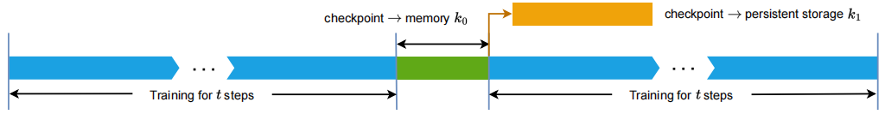<html>
常规训练任务的交替过程(训练和检查点)
</html>

传统的异常恢复方法系统采用周期性检查点机制，系统每隔一段时间把模型参数和优化器状态保存下来，一旦发生故障，就回滚到上一个检查点，重新计算从那之后的所有步骤：

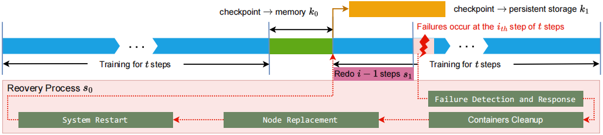
<html>

故障的标准恢复流程

 
</html>
虽然这种恢复过程能够在故障后成功恢复训练状态，但是这种方法存在两个关键局限性：

1\) 在检查点保存和加载过程中产生的I/O开销与模型规模成正比：随着大模型(LLM)的规模扩大到数百GB或TB级别，这成为了一个显著的瓶颈。

2\) 重计算成本高昂：故障发生后所有集群需回滚至上一检查点，丢弃自上一个检查点以来的所有中间计算结果。导致每次故障大约有一半的检查点间工作被冗余地重新计算。

这就陷入了一个两难：检查点频率高了，I/O压力大；频率低了，故障时重算的代价又太高。有没有可能在不频繁保存检查点的前提下，也能实现快速、低成本的故障恢复呢？这就是FlashRecovery想要解决的问题。

**3.  故障恢复开销建模与优化方向**

为了更清晰地看到优化方向，我们对传统基于检查点的故障恢复过程进行数学建模，定量分析恢复的开销，即从故障中恢复所消耗的时间。总故障恢复时间F(t)可表示为t的函数：

$F(t)\  = \ m\ *(s_{0}\  + s_{1})\  + \ \frac{d\ }{t}\ *k_{0}\  = m\ *(s_{0} + \frac{t\ }{2})\  + \ \frac{d\ }{t}\ *k_{0}$    &nbsp;&nbsp;&nbsp;&nbsp;&nbsp;&nbsp;   (公式1)

其中：

• $d$：固定的训练周期。

• $t$：检查点间隔时间，$\frac{d\ }{t}$是时间段d期间检查点的个数。

• $m$：时间段d内集群故障次数。

• $s_{0}$：故障恢复代价(耗时)，包括故障检测、故障响应、容器清理、节点替换、系统重启和训练恢复等。

• $s_{1}$：重计算成本，因回滚到检查点产生的训练时间开销，假设故障均匀随机发生的情况下，近似为$\frac{t\ }{2}$。

• $k_{0}$：将checkpoint从AI集群转储到主机内存所花费的时间(与其他操作不重叠)。

• $k_{1}$：将checkpoint从主机内存转储到持久化存储所需的时间(可能与训练过程重叠)。

在传统的周期性检查点方法中，参数$m$、$s_{0}$、$k_{0}$可视为常数，$k_{1}$因与训练重叠而可忽略不计，而检查点间隔t和重计算成本$s_{1} \approx\ \frac{t\ }{2}$是可调的。$m\ *(s_{0} + \frac{t\ }{2})$表示故障恢复成本，$\frac{d\ }{t}$∗$k_{0}$表示检查点开销。

对公式1求导，并令导数为0：

$F(t)' = \ \frac{m\ }{2}\  - \ \frac{d*k_{0}}{t^{2}}\  = \ 0$ &nbsp;&nbsp;&nbsp;&nbsp;&nbsp;&nbsp; (公式2)

计算得出使总故障恢复时间最小的最优的检查点间隔$t^{*}$：

$t^{*}\  = \ \sqrt{\frac{2d*k_{0}}{m}}$ &nbsp;&nbsp;&nbsp;&nbsp;&nbsp;&nbsp; (公式3)

公式1中带入$t^{*}$得到最小化总故障恢复时间：

$F_{\min} = m * {\color{red}{s_0}}   + \sqrt{2d *  {\color{red}{k_0}} * m}$ &nbsp;&nbsp;&nbsp;&nbsp;&nbsp;&nbsp; (公式4)

通过公式推导发现，最优的检查点间隔确实存在，但即便如此，系统仍无法摆脱两个核心开销：$s_{0}$(故障检测+故障恢复代价)和$k_{0}$(周期性checkpoint代价)。因此，要降低恢复成本，有两个明确的优化方向：

1\) 降低恢复开销($s_{0}$)，由于分布式协调开销，$s_{0}$通常随集群规模的增长而增长。将$s_{0}$与集群规模解耦，从而使$s_{0}$成为一个与集群规模无关的常数，是一个可能的优化目标。

2\) 降低甚至消除检查点保存开销($k_{0}$)，无检查点恢复机制可以实现$k_{0} = 0$，从而完全消除检查点开销。

**4.  FlashRecovery：快速低成本故障恢复方案**

基于上述思路，FlashRecovery提供了一套完整的故障恢复机制。**它不依赖高频次的检查点保存，而是通过“主动感知故障、精准重启任务、利用数据冗余恢复状态”的方式，实现快速复原。**

FlashRecovery是一套面向大规模语言模型训练的故障恢复系统。它的目标是在节点发生故障时，实现“秒级感知、局部重启、一步回退”，从而将训练中断时间控制在分钟级别，同时避免频繁保存检查点带来的I/O压力。

FlashRecovery由三个核心模块组成：

\-主动实时故障检测：通过心跳机制与设备插件，在几秒内发现故障并定位问题节点；

\-规模无关的任务重启：只重启故障节点，保持正常节点待机，通信链路也采用并行更新方式，避免全局重建；

\-无检查点的状态恢复：利用数据并行组中其他节点上的模型副本，直接恢复故障节点的参数，最多只需回退一步。

下面我们逐一看看它们是如何运作的:

**4.1 主动实时故障检测机制，从被动等待到主动发现**

在没有额外故障检测模块的情况下，传统训练任务往往在通信超时后才能发现故障，有时甚至要等待30分钟。FlashRecovery在每个节点上部署了一个监控进程，定期向中央控制器发送心跳信息。一旦心跳异常，控制器结合设备插件上报的硬件状态，就能在3–5秒内判定故障节点，并触发恢复流程。

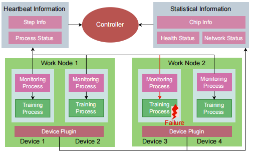

主动故障检测系统架构和故障检测的工作流程

 

1\) 控制器：全局服务，收集设备插件和监控进程的状态报告，决策恢复策略。

2\) 监控进程：随训练进程启动，定期发送心跳信号(**间隔秒级**)，报告当前步骤编号、健康状态等必要信息。

3\) 设备插件：采集节点硬件状态(如芯片信息、健康状况和网络状态)，支持异常预警。

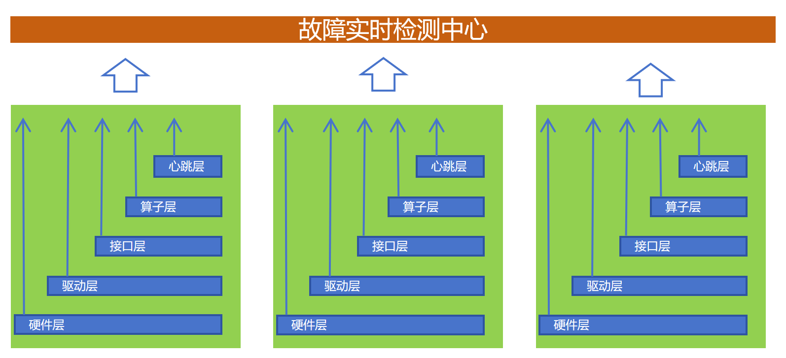

通过集成多层故障感知能力，遇到故障后主动上报故障码

 

**心跳机制和设备插件都提供了主动检测故障的能力，能在几秒钟检测到故障，并锁定故障源头**。当故障发生且故障设备被确认后，控制器会为每个节点确定恢复策略，并重新调度所有训练过程。与传统的基于超时的方法相比，主动故障检测机制显著降低了监控开销。

**4.2 与集群规模无关的训练任务重启，只重启该重启的**

传统方法在故障恢复时需要无差别地重启所有训练进程，重启时间随集群规模线性增长。FlashRecovery对此进行了重要改进：

\- **仅重启故障节点上的进程，正常节点只需暂停训练进入待机状态**：

在FlashRecovery系统中，如下图所示，控制器会向每个正常节点发送终止信号，指示它们暂停训练过程，进入待机状态，等待控制器发出另一个继续信号重新启动它们的训练过程。与此同时，控制器会执行节点重新调度，用健康的节点替换故障节点。在新节点上启动训练进程，初始化通信，并通知控制器相应地更新排名表。新加入节点的重启过程与正常节点的训练暂停是并行执行的。通过对正常节点和故障节点分别应用不同的策略，将重新创建的节点数量限制在仅遇到错误的节点，并减少了不必要的容器重启，这使得重启过程与训练集群的规模无关，并且更快。

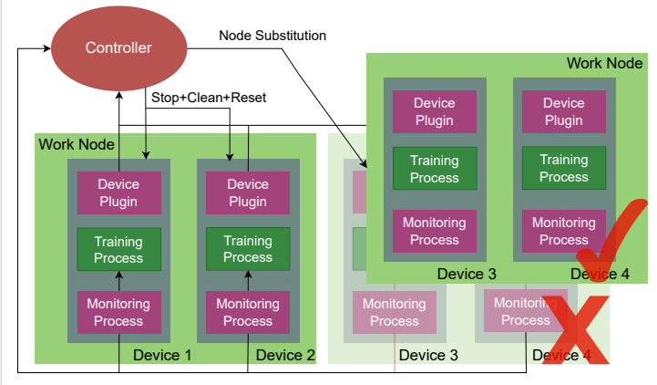

替换故障节点，并在新节点上启动训练进程

\- **通过并行TCP Store初始化优化通信重建过程**：

传统TCP Store通常以串行方式建立，导致时间消耗与集群大小呈线性关系。FlashRecovery方案通过跨不同规模的训练集群的并行化TCP Store的建立优化策略(下图中红线)，显著降低了缩放系数，并有效地将建立开销与集群规模解耦，将时间复杂度从O(n)降低到O($\frac{n}{p}$)，n为集群规模，p为并行度)。

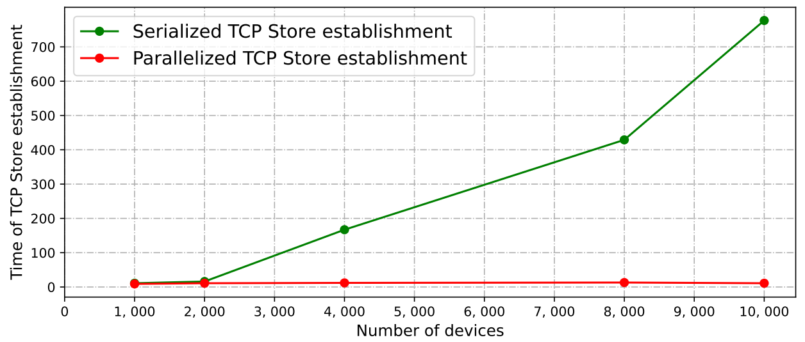

并行化tcp store减少torch节点感知时间本(单位：秒)

 

\- **使用共享文件维护全局秩表，避免串行收集和分发：**

秩表记录了整个集群的资源信息，用于建立设备间的通信。在传统故障恢复方案中，主节点从每个节点收集信息，然后生成一个全局秩表，之后再将其发送给每个节点，秩表的生成和分发是串行执行的，因此时间复杂度为O(n)。相比之下，FlashRecovery系统中的控制器在节点间的共享文件中维护一个全局秩表。每个设备都能直接从文件中加载最新的秩表，无需进行秩表的收集和分发，从而将时间复杂度降低到O(1)。

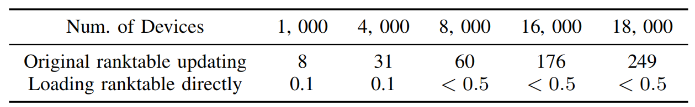

秩表更新时间表(单位：秒)

 

控制器为正常节点和故障节点采用不同的恢复策略，协调正常节点进程内函数跳转，新节点迅速启动训练进程，并“更新”通信链路。**这些优化使得任务重启时间基本与集群规模无关，无论是在几十个节点还是几千个节点的集群上，重启时间都保持稳定。**

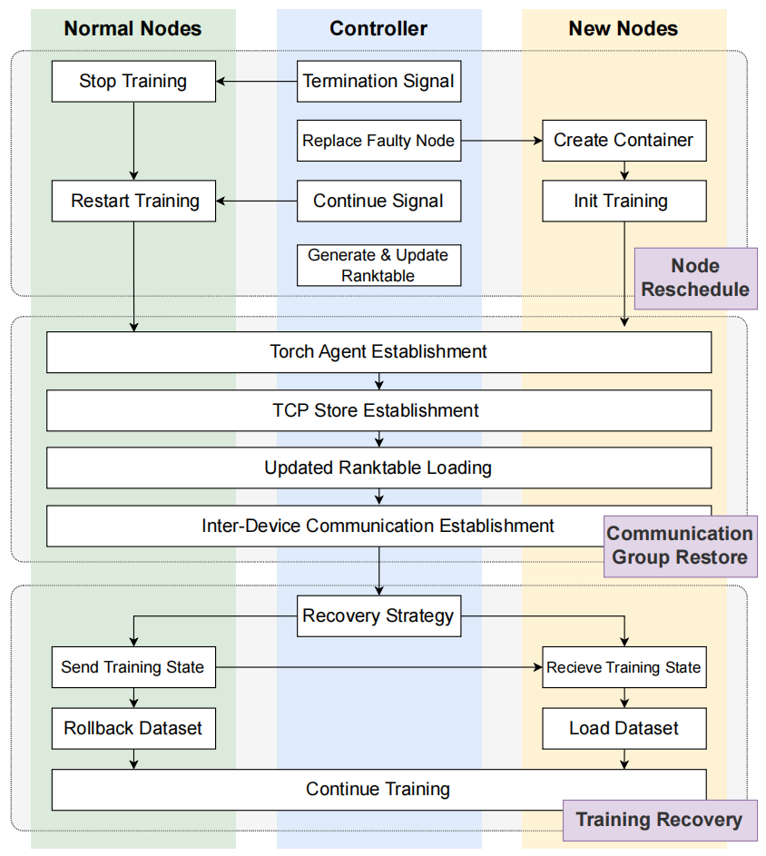

FlashRecovery中的任务重启流程

 

**4.3 基于数据并行的无检查点恢复**

在数据并行训练架构中，同一DP组内的所有进程均持有完整的模型副本。训练过程中，各进程通过周期性的梯度同步确保状态一致性。当某个进程发生故障时，只要该DP组内至少存在一个正常运行的进程，即可将其最新的模型参数、优化器状态等完整状态直接复制到恢复节点，实现快速恢复，而其他正常节点只需等待。

**此方案无需依赖检查点文件，仅利用数据并行固有的状态冗余特性，即可在保证训练连续性的同时，将进度损失严格控制在单个训练步之内。**

控制器具有全局故障信息，可以快速确定是否存在故障进程的模型状态副本。实际上，如果正常节点上至少有一个相同数据并行(DP)组的训练进程，就可以恢复故障节点上其他进程的模型状态。这样，训练进程会保持${\ i}_{th}$或${(i + 1)}_{th}$步的模型状态。

关键在于确定从哪一步开始恢复。大模型多节点并行训练时，由于设备异步执行，节点间训练执行快慢不一致，无法保证所有设备都处于前向和后向阶段或优化器步骤阶段。**FlashRecovery通过在优化器步骤前添加同步屏障，精确感知所有节点的训练进度：**

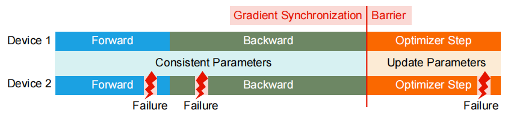

优化器步骤前的数据并行和屏障训练过程

 

\-  如果故障发生在前向或后向传播阶段，由于屏障操作，其他正常进程必须在优化步骤之前挂起，以确保所有进程都处于向前和向后的阶段。此时所有正常节点都还未更新参数，训练可从当前步骤$i_{th}$重新开始；

\-  如果故障发生在优化器更新阶段，屏障操作表明所有进程都已进入优化步骤阶段。在这种情况下，尽管很难确定设备上的哪些参数已被更新，但可以确认正常设备的参数将会被更新。因此故障设备能够从正常设备上那些已更新的参数中恢复出重新创建的进程中的参数。然后，直接从${(i + 1)}_{th}$步骤开始继续训练。

通过这种方式，最多只丢失一步的训练进度，避免了传统方案中可能丢失数小时训练进度的情况。下面具体说明在训练步骤中不同阶段发生故障的恢复过程：

1)  在前向阶段开始时，为每个训练过程设置step=i。

2)  控制器通过心跳机制从每个设备接收步骤标签。

3)  当在前向和后向过程中发生故障时，控制器会从除故障节点上的设备之外的所有正常设备接收step=i，此时所有正常过程都处于前向或后向阶段，并且能够立即发出“停止”、“清理”和“重置”命令，而不会产生任何副作用。

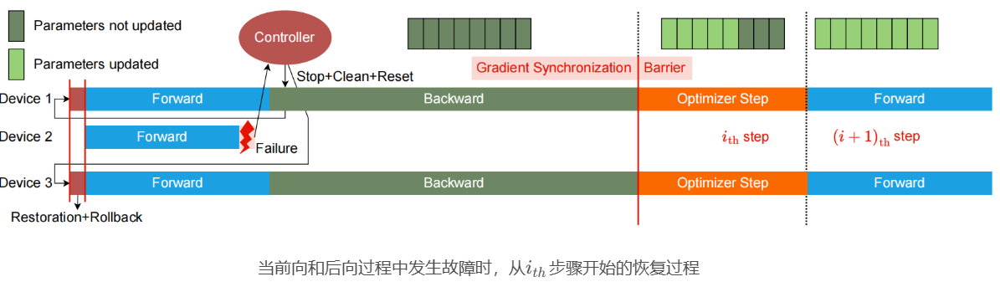

 

4)  在优化器步骤开始时，为每个训练过程设置step=-1。

5)  当正常训练过程完成优化器步骤时，设置step=i+1。

6)  当优化器步骤过程中发生故障时，控制器会从除故障节点上的设备之外的所有正常设备接收step=i+1，此时正常节点上所有过程的优化器步骤结束，可以发出“停止”、“清理”和“重置”指令，而不会产生任何副作用，并从step=i+1更新的参数中恢复故障节点上训练过程的模型状态。

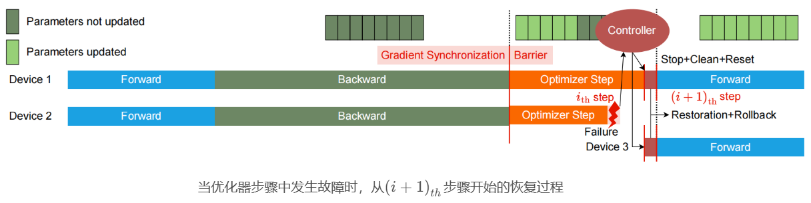

**5.  性能评估：恢复效率显著提升**

FlashRecovery方案的恢复开销分析：

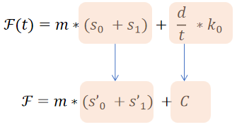

- $s_{0}$优化：被动故障检测系统改为主动实时故障检测系统，通过工程化系统设计，引入心跳、多层故障响应和感知系统，实现3-5秒故障感知和故障源锁定；与规模无关的任务重启仅重启故障节点上的进程，同时缩短“建链”过程为“更新链”，最终做到故障恢复与集群规模无关。

- $s_{1}$优化(与LLM参数规模相关，约30秒)：利用LLM训练DP设备内存权重冗余，不依赖Host
  Checkpoint，并做到单步计算恢复，将重计算平均时间降低至0.5step(即半个权重更新周期)。

- $\frac{d\ }{t}$∗$k_{0}$优化(24小时12次，每次3秒)：训练恢复不再依赖CheckPoint周期长度，可以大幅降低CheckPoint(ToHostMemory)频率，减少存储/系统等资源消耗。

综上所述，总故障恢复时间变为：

$F\  = \ m*(s_{0}' + s_{1}')$&nbsp;&nbsp;&nbsp;&nbsp;&nbsp;&nbsp;  (公式5)

其中$s_{0}'$表示不考虑集群大小时的最优恢复开销，而$s_{1}'$表示最优重计算成本，该成本仅限于一步。

**6.  FlashRecovery方案在昇腾硬件上的实践效果：某商用场景大模型训练的恢复时间大幅降低**

在某商用实际训练场景中，基于昇腾硬件集群部署了FlashRecovery。该集群规模超过1万张AI加速卡，训练千亿参数模型。在使用传统检查点方案时，传统基于检查点恢复机制在不同任务规模下的恢复时间(公式1中的$s_{0}$)，具体细节见下表。可以看到使用PyTorch的默认配置，通信挂起持续1,800秒时，系统报告故障，且任务重启时间随任务规模线性增加，如下表最后一列所示。由于故障在两个连续检查点之间随机发生，未包含重新计算成本(公式1中的$s_{1}$，即从最后一个检查点到故障发生步骤所浪费的工作)。

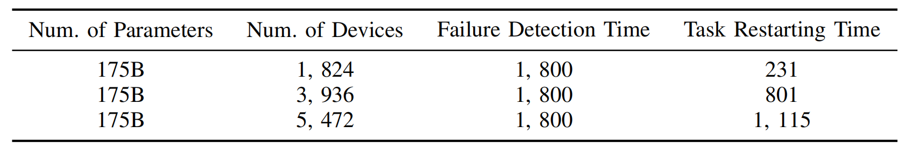

不同任务规模下传统方案(checkpoint+被动故障检测)系统耗时(单位：秒)

 

为了评估FlashRecovery的效率，在标准训练过程中人为注入故障，并记录恢复过程中每个阶段所花费的时间。从下表的第3列可以看出，部署FlashRecovery后，FlashRecovery故障恢复系统能够在10秒内检测到故障。从下表的第4列可以看出，FlashRecovery故障恢复系统中的重启时间几乎保持不变，且与训练集群的规模无关。此外，根据关于$s_{1}$的假设，使用一步的平均时间来估计重做训练的时间，即重做步骤的一半(如下表的第6列所示)，训练集群规模的变化对总恢复时间的影响要小得多。尽管我们将设备数量从32个增加到4800个，但总恢复时间仍然保持在150秒以内，仅增加了约52%，远低于设备数量增加的影响。简而言之，下表中的结果表明，**FlashRecovery故障恢复系统进行故障恢复所需的时间几乎与可扩展性无关，显著提升了训练效率和集群利用率。**

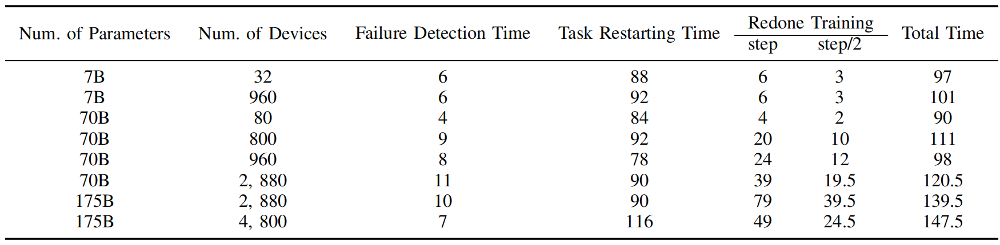

在不同任务规模和模型大小下FlashRecovery故障恢复方案耗时(单位：秒)

 

**7.  小结**

FlashRecovery方案在某商用大模型训练场景将拥有数千台设备的训练集群的故障恢复时间开销减少到150秒以内。这种改进不是通过更快的硬件或更多的资源投入实现的，而是通过重新思考故障恢复的本质，在系统架构层面做出的创新。它不追求完美的理论极限，而是在工程可行性与恢复效率之间找到平衡，让长时间、大规模的训练任务更加稳健、高效。FlashRecovery所践行的这一思路，正为应对大模型训练中的故障恢复开销挑战，提供了一条清晰且经过实践验证的路径。

**参考资料：<https://arxiv.org/abs/2509.03047>**
