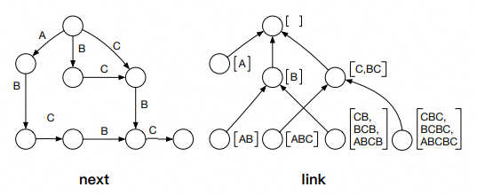
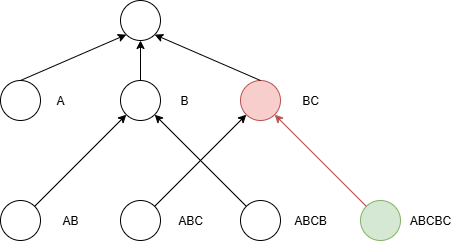
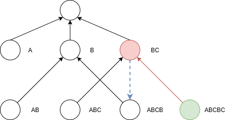
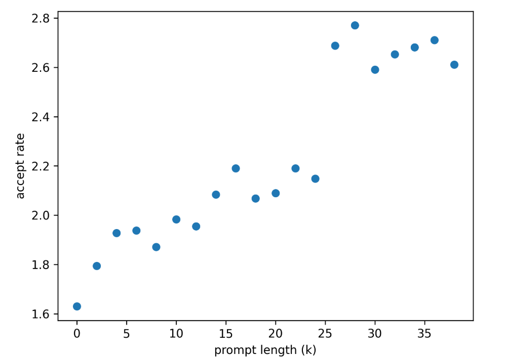
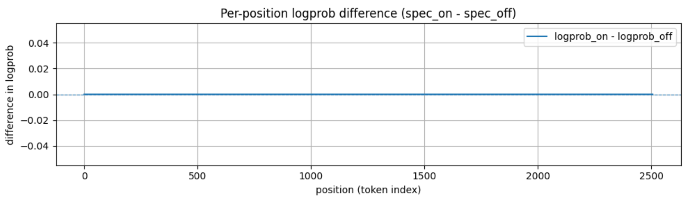
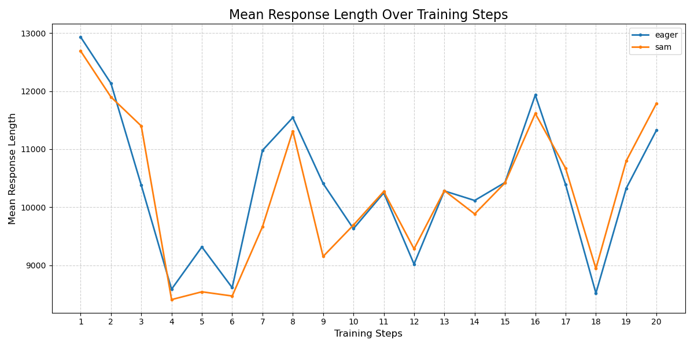
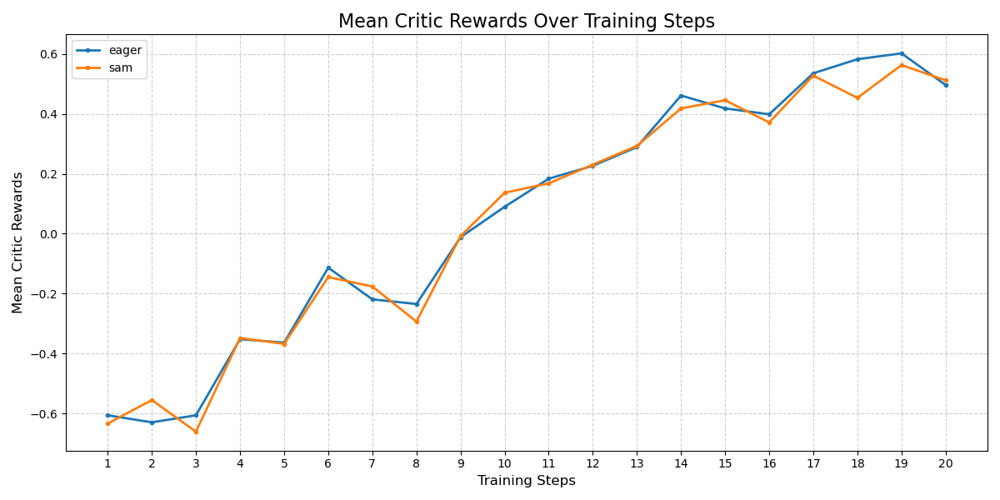
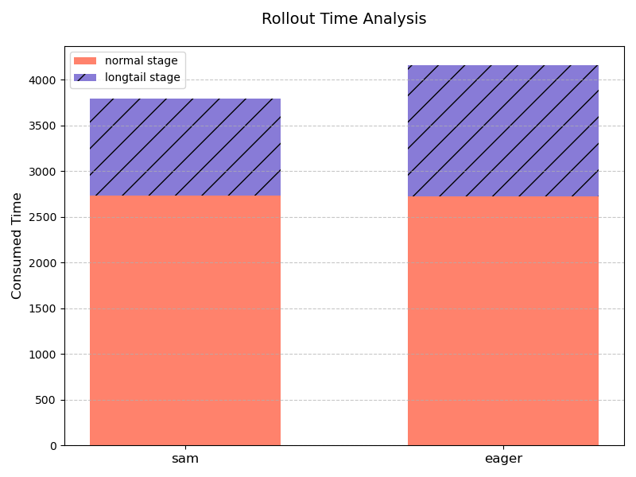

# 基于昇腾的SAM投机解码长序列强化学习训练

## 摘要

针对大语言模型强化学习训练（RL-training）中的海量交互式采样耗时瓶颈，传统的投机解码（Speculative Decoding）技术依赖辅助模型，而且存在策略更新导致的分布漂移风险。本文提出在RL训练中引入一种基于 **后缀自动机（SAM）** 的无模型（Model-Free）投机解码方案，该方法无需任何辅助模型，利用RL数据（如数学推理、代码生成）中固有的结构化重复特性生成候选序列检索。本文结合自适应Batch调度与向量化拒绝采样等工程优化，基于昇腾设备在Qwen3系列模型（32B/235B）上完成了SAM 投机解码在 RL 后训练场景的端到端验证。实践表明，SAM在保证精度严格无损的前提下，显著降低了Rollout延迟，特别是在长尾阶段获得了超过 35%的加速收益，相关代码已在CANN开源社区[cann-recipes-train](https://gitcode.com/cann/cann-recipes-train)全部开源。

## 1. 背景介绍

### 1.1 SAM 原理

SAM（suffix automaton，后缀自动机）是一个能够高效解决许多字符串问题的数据结构。直观上，字符串的 SAM 可以理解为给定字符串的 **所有子串** 的压缩形式。SAM主要维护两个重要的集合：

1. 结束位置endpos：考虑字符串 s 的任意非空子串 t，记 endpos(t) 为字符串 s 中 t的所有结束位置的集合。例如，对于字符串 ABCBC 我们有 endpos(BC)={2,4}。在SAM 中，所有满足 endpos 集合相同的字串被归入同一个状态，也被称为
    **endpos 等价类**。endpos 等价类的划分使得 SAM 可以以 O(n) 的空间复杂度存储所有子串信息。
2. 后缀链接link：对于 SAM 中任意非初始状态 u，u 中的最长子串为 w，则link(u) 指向的状态对应于 w 的后缀中与它的endpos 集合不同且最长的那个，即u所代表所有子串的**最大真后缀**所在状态。后缀链接构成了 SAM的核心树形结构，被称为**后缀链接树**，它使得 SAM 可以在 O(n)的线性时间内构造完成，因为每次添加新字符时，只需要通过后缀链接快速定位和更新相关状态。

下图展示了基于字符串 ABCBC 构建的 SAM：

 

其中左图 next 是 SAM 的状态转移函数，表示的是 SAM 中的不同状态如何按前序进行转移，是 SAM 的**自动机**部分；右图 link则是上文所述的后缀链接，是 SAM 的**结构**部分。SAM采用线性复杂度的[**增量构造法**](https://oi-wiki.org/string/sam/)，每次向当前SAM 中加入一个新字符时，同时更新 next 和 link，单次更新的时间复杂度为O(1)。

**SAM Decoding 将 SAM用于投机解码**
 投机解码被转化为在后缀自动机中的后缀匹配，使用 SAM能够在 O(1) 的常数时间内高效实现这个过程。SAM分为 **静态 SAM（S-SAM）** 和 **动态 SAM（D-SAM）** 两种类型：

- **静态 SAM** 是基于已有的语料库构建后缀自动机，将所有文本拼接成连续字符串，并在每个文本片段末尾添加特殊符号（如 EOS），然后逐 token 遍历预处理后的语料，通过添加 next 边和 link边扩展节点。对于自动机的每一个状态我们记录该状态所对应的所有 endpos 等价字符串第一次出现的位置 (min_endpos)。
- **动态 SAM** 是完全基于当前处理的 prompt 建立一个动态的后缀自动机。​该自动机随生成过程动态扩展，每生成一个新
   token 并被 LLM 验证通过后，立即更新 D-SAM：若当前 token 可通过现有节点的 next 边转移，则直接更新节点状态；若无法转移，则新建节点并添加 next 边和 link 边，确保 D-SAM 始终包含最新生成的文本序列。对于 D-SAM，可以在构建自动机的同时维护 min_endpos。

在本文的实践中，为了实现零迁移成本以及不引入额外系统维护复杂度，使用了**动态SAM**。

**基于 SAM-Decoding 的草稿（draft）生成**
 从当前序列的最后一个 token开始，通过 SAM 的 link 边回溯，直至找到能通过 next 边转移到下一个 token 的节点。 根据节点的min_endpos，在当前文本序列中定位匹配后缀的起始位置，提取后续连续 token作为候选序列。单次查询的复杂度为最坏O(|S|) 、平均O(1)。以下是一个具体的例子。

同样以字符串 ABCBC 为例（下图对应上文的 link 状态图），为了简洁起见，使用每个等价类中最长的子串来表示这个节点。当前的最后一个token 是 C，将 SAM 的最后一个节点沿着 link 边回溯，到达节点 BC。

 

该节点能够找到 next 边（下图蓝色虚箭头）转移到下一个 token，停止回溯。该节点中的最长子串 BC 就是需要寻找的（前缀子串中出现过的）**最长后缀**，因此将该节点的后续序列 BC 作为本次生成的 draft token。

 

在生成草稿后，使用大模型进行逐 token 验证，若候选 token 符合大模型的预测分布则保留，不符合就触发 “拒绝” — 从拒绝位置开始由大模型重新生成，这个过程就是**拒绝采样**。拒绝采样确保最终输出和大模型直接生成的结果完全一致，实现"无损加速"。

假设有函数 α(x)∈[0,1] 表示接受概率，**拒绝采样**从 q(x) 采样一个样本 x，从 U[0,1] 中采样一个随机数 ϵ，若 ϵ≤α(x) 则接受该样本，否则拒绝并重新按照此流程采样。

### 1.2 SAM 接受率

基于昇腾设备使用 Qwen3-8B 模型在 Math500 数据集测试了 SAM-Decoding 的接受率，具体的配置为：

- 投机 token 个数：3
- 采样参数：temperature=0，repetition penalty=1，不设置 top-k 和 top-p 采样
- 并行设置：tensor parallel = 4
- 推理框架：vLLM-Ascend

注：这里的接受率指的是 mean acceptance length，包括了1个 bonus token。另外，这里（包括后文中）的 SAM 使用的是动态 SAM，不涉及额外语料库。

从上图可以看到在不使用冷启动的情况下，接受率与序列长度呈正向相关。因此在长序列推理场景使用 SAM-Decoding 会带来不错的性能收益。测试中设置的默认投机个数是3，因为再加上1个本来就要解码的 bonus token 刚好是4个 token，在使用图模式的时候不用额外 padding。此外，随着投机个数增加带来的接受率提升存在边界效应，设置过大反而可能造成性能收益下降。

### 1.3 SAM 在 RL 后训练场景落地的意义

在LLM的强化学习后训练场景中，模型需要进行大量的交互式采样来收集或评估数据。这个过程通常涉及数百万次的生成迭代，成为推理成本的主要瓶颈。SAM-Decoding 因其无模型（Model-Free）和基于检索（Retrieval-Based）的特性，为这一关键阶段的加速提供了一种轻量化、易落地的实践路径。

首先，作为一种非参数化的投机采样方法，SAM-Decoding不需要额外的模型参数，这节省了专门训练 draft model 或者auxiliary head 的成本，同时也不必担心模型权重更新导致的分布漂移问题。并且在训练时不需要进行额外的内存管理，这对于训推共卡的 Colocate 框架尤为重要，对于现有系统实现了**即插即用**的加速。

其次，SAM-Decoding 对强化学习数据集具有天然的​亲和性​。在许多 RL 任务中，生成的 Context 中往往包含大量的​重复或结构化元素​​。例如在 RLVR（Reinforcement Learning with Verifiable Rewards）场景，模型被训练来生成详细、结构化的推理过程，这种推理过程在数学问题求解中表现为重复的公式结构和计算步骤；在代码生成中表现为高度重复的语法模式和库调用；在Agent 规划任务中表现为结构化的行动指令或观察报告。SAM-Decoding 的后缀自动机设计能够高效捕捉这些​局部重复和结构化元素​​。它能快速地从历史生成中检索最长匹配后缀作为高质量草稿，从而显著提高 draft token 的​接受率​。这种能力对于需要大量生成结构化、长序列推理轨迹的RL后训练流程来说至关重要，能有效降低高昂的采样成本，加速模型在专业领域（如数学、编程和自主智能体）的迭代效率。

接下来，本文将通过基于昇腾设备的 Qwen3 系列模型长序列 RL训练实践，详细展开 SAM 投机解码在RL后训练场景的精度与性能验证结论。

## 2. RL 训练精度验证

虽然拒绝采样在理论上保证了 SAM投机的无损性，但在实践中，精度还受其他各种复杂因素的影响。为了确保 SAM 在 RL 场景的精度正确性，实践中进行了包括算子校验、下游任务评测和端到端训练的验证工作。

### 2.1 算子精度

首先是算子的精度验证。普通解码和投机解码使用的是不同的算子，在vLLM-Ascend 中使用torch_npu._npu_paged_attention进行 token-by-token的解码，使用 torch_npu._npu_paged_attention_splitfuse 进行投机解码，生成 draft tokens 的logprobs。为了验证这两个算子的等价性，测试中统计了对相同的输入两个算子对各个 token 预测的 logprobs 的差值，结果如下所示：

结果表明普通解码和投机解码使用的算子之间没有精度差异。

### 2.2 下游评测

基于 Qwen3-32B 模型在数学数据集 GSM8k 以及 AIME2024进行纯推理测评（pass@1）， 采样参数为 temperature=0.6，repetition penalty=1，不设置 top-k 和 top-p。 测试结果如下：

| 数据集 | **不开启SAM** | **开启SAM** |
| --- | --- | --- |
| GSM8k | 88.9 | 88.7 |
| AIME2024 | 66.5 | 66.8 |

可以发现开启 SAM 投机并不影响这些推理任务的准确率。

### 2.3 端到端后训练

最后，通过端到端的 RL 训练直接检验 SAM 的精度。使用 DAPO算法（基于[veRL](https://github.com/volcengine/verl)）在 DAPO-MATH-17k 数据集上训练 Qwen3-32B 模型，在固定了 vLLM的随机种子的前提下，开启和不开启 SAM 每步的平均回复长度曲线和 reward 曲线如下所示：

可以看到开启 SAM 的训练曲线在数值和趋势上都与不开启 SAM 的基线基本吻合，结合之前的算子精度和下游评测的验证，可以得出 SAM 投机解码在 RL 后训练场景的精度是无损的。

## 3. RL 训练性能验证

### 3.1 性能优化

投机解码的性能取决于两个因素：第一是接受率，第二是投机算法本身带来的额外耗时（draft token 的生成和验证、拒绝采样）。为了能够最大化 SAM 无损投机在RL训练中的收益，需要尽可能地提高接受率并减少额外耗时。为此实践中使用了以下两点优化------**关于batch size 的自适应开关**和**拒绝采样加速**。

#### 3.1.1 自适应开关

vllm_ascend/worker/model_runner_v1.py中适配了无损投机关于 batch size 的自适应开关，当开关开启时，只有当 vLLM engine当前处理的请求数量小于等于阈值，投机解码才会生效。设置投机自适应开关既是为了减少额外耗时，也能够提高接受率。

首先，从减少额外耗时角度考虑。当前使用的对draft token进行验证的 Page Attention 算子在输入shape（batch size，sequence length）增加时会有比较严重的劣化。在大 batch size 长序列的输入下，draft token 验证带来的额外耗时会超过投机本身的收益，因此当小 batch size的情况下开启 SAM 投机可以更好地平衡加速收益与计算开销。

其次从提高接受率的角度出发，由于目前使用的是动态构建 SAM的模式，即把当前序列当作后缀自动机的全部语料，在 Rollout 初期，后缀树的体量较小，因此接受率较低。在 Rollout 后期，由于在同步 RL 框架下存在 Rollout 生成长度不均的问题，请求排队和抢占机制会导致长输出请求的调度延迟，从而导致少数请求主导最终执行阶段。通过把单步处理的请求总数当作Rollout进程的指示物的方式，来提示是否开启 SAM 投机，这样显著提升了长尾请求的训练性能。

#### 3.1.2 拒绝采样加速

拒绝采样是投机推理引入的额外操作，想要最大化投机推理的收益，也需要对这个模块的性能做尽可能的优化。vllm-ascend原生的投机推理实现性能较差，单个推理step会带来超过50ms的额外耗时，完全掩盖了投机推理带来的性能收益。本方案使用了纯pytorch层面的代码优化，将拒绝采样的耗时减少到原本的十分之一左右。

本次主要优化了vllm_ascend/sample/rejection_sampler.py中的三个函数：

- **expand_batch_to_tokens**：把采样参数（temperature、top-k、top-p）从**每个请求一个值**的batch 向量展开成**每个draft token 一个值**的 token 向量，使后续拒绝采样能逐 token 正确应用这些参数。
- **sample_recovered_tokens_pytorch**：在拒绝采样中为每个被否决的草稿位置即时生成一个 recovered token，保证序列能继续推进。
- **rejection_random_sample_pytorch**：按接受-拒绝规则逐个比对草稿与目标概率，决定用 draft token、recovered token 还是终止，并在全接受时追加 bonus token，最终拼出随机采样模式下的输出序列。

以sample_recovered_tokens_pytorch为例，[原生实现](https://github.com/vllm-project/vllm-ascend/blob/v0.11.0rc0/vllm_ascend/sample/rejection_sampler.py#L461)中含有嵌套的for循环操作。这种逐个元素的操作方式无法利用NPU的并行计算能力，并且在循环内部反复创建新张量（如 .clone(), torch.full()），导致效率极低。

方案中优化的核心思想是​**向量化(Vectorization)** ​：去掉所有Python循环，使用PyTorch的张量操作来一次性处理所有数据。首先使用张量操作消除了循环内重复的张量创建，并通过高效的索引和广播实现了关键变量的计算。具体实现可以参考[开源的代码](https://gitcode.com/cann/cann-recipes-train/blob/master/llm_rl/qwen3/patches/vllm_ascend/0009-vllm_ascend-feature-rewrote-rejection-sampler.patch#L215)，后续也可以使用 Triton 对这个模块做进一步的优化。

### 3.2 RL 训练实测收益

在 DAPO 长序列 RL 场景测试 SAM 投机解码的加速收益。在模型选择上选用了 Qwen3-32B 稠密模型以及 Qwen3-235B-A22B MoE模型这两个比较有代表性的模型。下文介绍具体的配置和性能数据。

#### 3.2.1 Qwen3-32B

相关配置：

- 数据集： DAPO-MATH-17k
- 最大回复长度（max_response_length）：34816
- 训练 batch 大小（train_batch_size）：32
- 生成 batch 大小（gen_batch_size）：96
- Rollout 最大请求数（max_num_seqs)：128
- Rollout 模型张量并行（tensor_model_parallel_size）：8
- SAM相关配置：自适应 batch size 开关阈值为8，投机 token 个数为3个。
- 运行模式：eager

性能数据如下表所示，其中"单轮平均推理时间"指每个 DP （Data Parallel）域的单轮（DAPO算法由于其动态过滤机制，可能会有多轮生成）推理平均耗时，"单步总推理时间"指单个 step 的 Rollout 总耗时：

|  | 单轮平均推理时间 / s | 单步总推理时间 / s | 单步总时间 / s |
| --- | --- | --- | --- |
| 不开启SAM | 3904.22 | 4159.06 | 4730.86 |
| 开启SAM | 3548.62 | 3793.29 | 4374.99 |
| 收益 | 10.02% | 9.64% | 8.13% |

#### 3.2.2 Qwen3-235B-A22B

相关配置：

- 数据集： DAPO-MATH-17k
- 最大回复长度（max_response_length）：34816
- 训练 batch 大小（train_batch_size）：128
- 生成 batch 大小（gen_btach_size）：128
- Rollout 最大请求数（max_num_seqs)：64
- Rollout 模型张量并行（tensor_model_parallel_size）：4
- SAM相关配置：自适应 batch size 开关阈值为8，投机 token 个数为3个。
- 运行模式：eager

性能数据：

|  | 单轮平均推理时间 / s | 单步总推理时间 / s | 单步总时间 / s |
| --- | --- | --- | --- |
| 不开启SAM | 7102.92 | 14287.54 | 15441.45 |
| 开启SAM | 6467.52 | 12811.98 | 13960.98 |
| 收益 | 9.82% | 11.52% | 10.60% |

#### 3.2.3 Rollout 长尾分析

此外特别统计了 SAM 投机在 Rollout 长尾阶段（当前处理的请求数在投机阈值以下）的表现，性能达到非投机 **1.35X**。如果后续对算子进行优化，支持更大投机阈值的话，这一收益将更加明显。

## 4. 总结

SAM-Decoding 基于昇腾平台成功落地并带来了巨大的性能收益，为 LLM在长序列、高并发、训推共存的复杂 RL 场景中，提供了一个即插即用并且易于集成的加速方案。这对于迫切需要降低海量交互采样成本的 RL 后训练流程，具有重大的实践意义。同时，昇腾也欢迎开发者们基于昇腾设备进行种种创新尝试，大家在创新过程中遇到困难可以通过CANN开源社区积极反馈，社区会为大家提供强有力的技术支撑。

最后，大家可以持续关注**cann-recipes-train**仓库，SAM-Decoding方案会持续在此仓库迭代优化，同时仓库中也针对LLM与多模态模型训练的典型模型、算法，提供了基于昇腾平台的优化样例。

**参考链接**

Qwen3系列模型 RL 训练优化实践样例：[https://gitcode.com/cann/cann-recipes-train/blob/master/llm_rl/qwen3/README.md](https://gitcode.com/cann/cann-recipes-train/blob/master/llm_rl/qwen3/README.md)

cann-recipes-train仓库地址：[https://gitcode.com/cann/cann-recipes-train](https://gitcode.com/cann/cann-recipes-train)
