# 使用 CANNLab 快速进行 pypto 开发

## 概述

**PyPTO**（发音：pai p-t-o）是一款面向 AI 加速器的高性能编程框架，旨在简化复杂融合算子乃至整个模型网络的开发流程，同时保持高性能计算能力。该框架采用创新的 **PTO（Parallel Tensor/Tile Operation）编程范式**，以基于 Tile 的编程模型为核心设计理念，通过多层次的中间表示（IR）系统，将用户通过 API 构建的 AI 模型应用从高层次的 Tensor 图逐步编译成硬件指令，最终生成可在目标平台上高效执行的可执行代码。

> **仓库地址：** [https://gitcode.com/cann/pypto.git](https://gitcode.com/cann/pypto.git)

本章节主要介绍如何使用 CANNLab 快速体验 pypto 框架。

---

## 使用 CANNLab 创建 NPU 环境

CANNLab 提供了即开即用的 NPU 环境。打开 GitCode 中 [CANN 的任意仓库](https://gitcode.com/cann)，在仓库页面中可以看到 CANNLab 按钮。以 [cann-learning-hub](https://gitcode.com/cann/cann-learning-hub) 仓库为例：

点击后可使用华为云账号登录，进入开发者空间。
<div style="border: solid 16px #f1f1f8; text-align: center; background-color: #f6f7f9">
  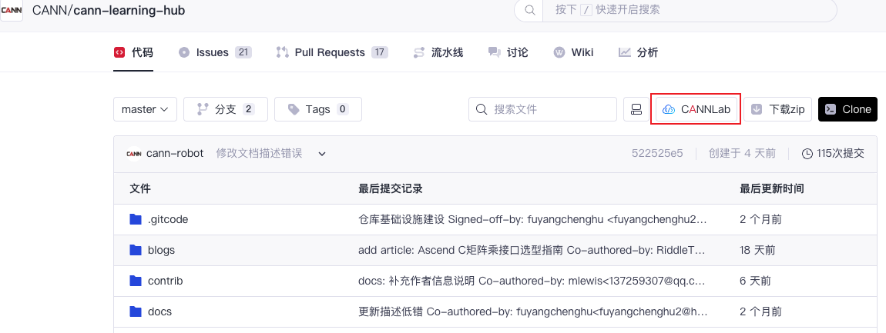
</div>
<br />

这里可以创建 CPU 环境，也可以创建 NPU 环境，时限为 **100 小时**。使用 pypto 需要 NPU 环境，我们点击**创建 NPU 环境**。

<div style="border: solid 16px #f1f1f8; text-align: center; background-color: #f6f7f9">
  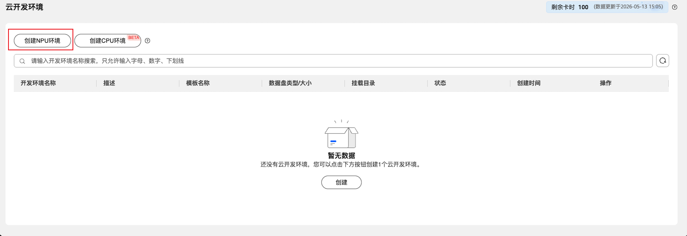
</div>
<br />

CANN 的版本基于以下对应关系选择。其中 A2 对应 npu 910B 系列，A3 对应 910C 系列。
| pypto | cann |
|------|------|
| 0.1.x | CANN 8.5+ |
| 0.2.x | CANN 9.0+ |

这里我们基于 pypto 0.2.0、CANN 9.0、910C 进行创建，开发环境名称任意即可。
<div style="border: solid 16px #f1f1f8; text-align: center; background-color: #f6f7f9">
  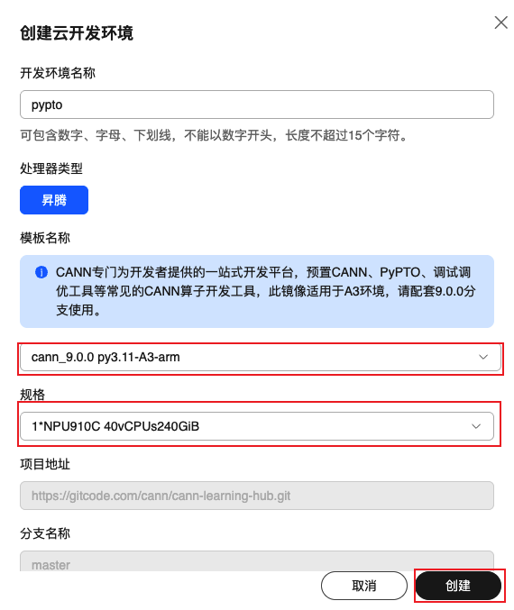
</div>
<br />

点击**创建**并开机后，NPU 环境即创建完成，可以使用 WebIDE 和 VSCode 进行连接。本章内容后续以 WebIDE 连接方式进行演示。

<div style="border: solid 16px #f1f1f8; text-align: center; background-color: #f6f7f9">
  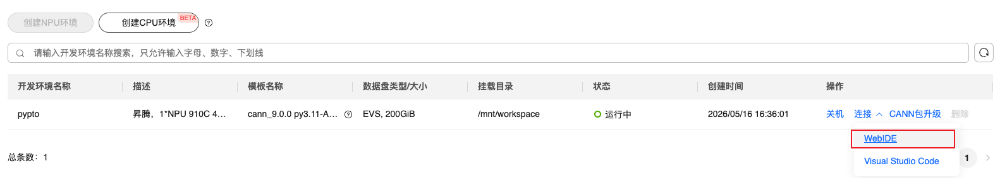
</div>
<br />

> **注意：** 如果开机时显示资源不足，说明当前时间段使用的人较多，可以过一段时间再尝试。

---

## 设置资源管理器从 workspace 打开

使用 WebIDE 连接进入环境后，可以看到整个界面类似于 VSCode，可以进行源代码管理、安装扩展等操作。

<div style="border: solid 16px #f1f1f8; text-align: center; background-color: #f6f7f9">
  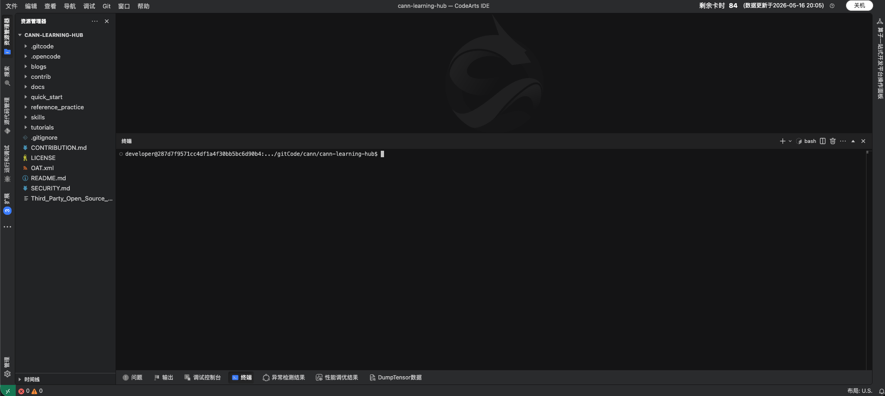
</div>
<br />

目前资源管理器只可以监管到项目仓库，点击左侧菜单 **文件 → 打开项目 → `/mnt/workspace`**，然后选择当前窗口打开，可以使资源管理器监管到 workspace 下的所有文件。

<div style="border: solid 16px #f1f1f8; text-align: center; background-color: #f6f7f9">
  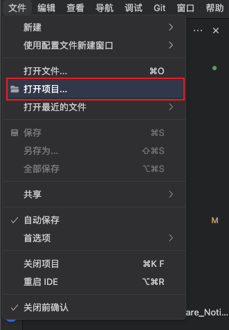
</div>
<br />

<div style="border: solid 16px #f1f1f8; text-align: center; background-color: #f6f7f9">
  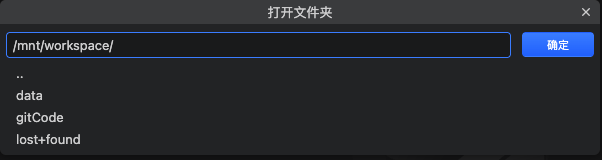
</div>
<br />

选择当前窗口打开。
<div style="border: solid 16px #f1f1f8; text-align: center; background-color: #f6f7f9">
  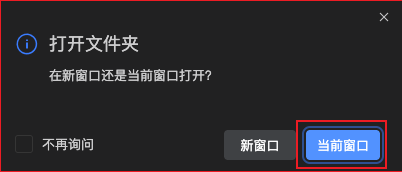
</div>
<br />

可以看到资源管理器切换到了 workspace。

<div style="border: solid 16px #f1f1f8; text-align: center; background-color: #f6f7f9">
  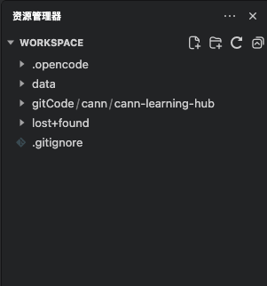
</div>
<br />

---

## pypto 环境配置

### 安装 pypto

先用 `npu-smi info` 查看一下当前的 NPU 设备信息，确保 CANN 环境正常：

```bash
npu-smi info
```

```
+------------------------------------------------------------------------------------------------+
| npu-smi 25.5.1                   Version: 25.5.1                                               |
+---------------------------+---------------+----------------------------------------------------+
| NPU   Name                | Health        | Power(W)    Temp(C)           Hugepages-Usage(page)|
| Chip  Phy-ID              | Bus-Id        | AICore(%)   Memory-Usage(MB)  HBM-Usage(MB)        |
+===========================+===============+====================================================+
| 0     Ascend910           | OK            | 166.6       42                0    / 0             |
| 0     0                   | 0000:0B:00.0  | 0           0    / 0          2911 / 65536         |
+------------------------------------------------------------------------------------------------+
| 0     Ascend910           | OK            | -           42                0    / 0             |
| 1     1                   | 0000:0A:00.0  | 0           0    / 0          2870 / 65536         |
+---------------------------+---------------+----------------------------------------------------+
| NPU     Chip              | Process id    | Process name             | Process memory(MB)      |
+===========================+===============+====================================================+
| No running processes found in NPU 0                                                            |
+===========================+===============+====================================================+
```
接下来使用 Git 拉取指定版本（例如 0.2.0），打开终端，

<div style="border: solid 16px #f1f1f8; text-align: center; background-color: #f6f7f9">
  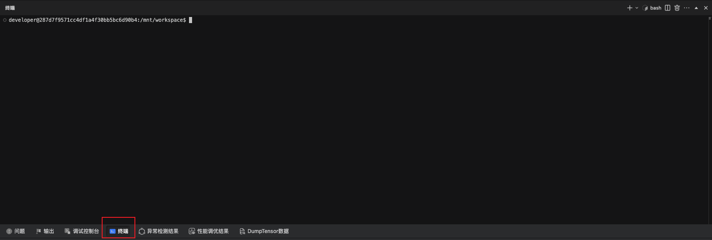
</div>
<br />

在终端中输入：

```bash
mkdir /mnt/workspace/dev
cd /mnt/workspace/dev
git clone -b 0.2.0 https://gitcode.com/cann/pypto.git
```

> **提示：** 可以 clone 到 `workspace` 的任意目录下，上述示例 clone 到了 `/mnt/workspace/dev`。

进行安装：

```bash
cd pypto
python3 -m pip install ./ --verbose
```

安装完成后，进入 `examples` 目录运行示例：

```bash
export TILE_FWK_DEVICE_ID=0
python3 examples/00_hello_world/hello_world.py
```

运行成功结果为：

```
============================================================
PyPTO hello_world Example
============================================================

Running examples that require NPU hardware...
(Make sure CANN environment is configured and NPU is available)

Running Example hello_world::test_add_direct: hello_world
Input0 shape: torch.Size([1, 4, 1, 64])
Input1 shape: torch.Size([1, 4, 1, 64])
Output shape: torch.Size([1, 4, 1, 64])
Max difference: 0.000000
✓ Hello world example passed
```

> **提示：** 可能会看到一些 warning，不影响正常使用。

```
UserWarning: Permission mismatch: The owner of /opt/buildtools/Python-3.11.4/lib/python3.11/site-packages/torch_npu/lib/libop_plugin_atb.so does not match.
  warnings.warn(f"Permission mismatch: The owner of {path} does not match.")
```

---

### 一键重装 pypto

通过默认 python 环境 pip 安装的 pypto 不能持久化，每次重启都需要重装 pypto。可以创建一个脚本文件，每次重启 CANNLab 的时候执行该脚本一键安装 pypto。

在终端中输入以下命令创建`i-pto`脚本文件：
```bash
cd /mnt/workspace
touch i-pto
cat << 'EOF' > /mnt/workspace/i-pto
#!/bin/bash
export TILE_FWK_DEVICE_ID=0
python3 -m pip install /mnt/workspace/dev/pypto --verbose
EOF
```
在 `/mnt/workspace` 目录下创建好的 `i-pto` 文件内容应为：

<div style="border: solid 16px #f1f1f8; text-align: center; background-color: #f6f7f9">
  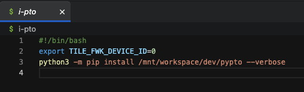
</div>
<br />


> **注意：** `/mnt/workspace/dev/pypto` 为 pypto 项目路径，如果 pypto 安装在了其他位置，需要更改此路径。

接下来，每次重启 CANNLab 后，执行如下命令即可自动安装 pypto 并设置环境变量，后续有其他需要的设置也可以一并加入。
```bash
source i-pto
```
至此，就可以开始愉快地进行 pypto 的开发了。

---

<div align="center">

**[← 上一节](./01.00_chapter_intro.ipynb)** | **[下一节 →](./01.02_CANNLab_proj_env_config.md)**

</div>
