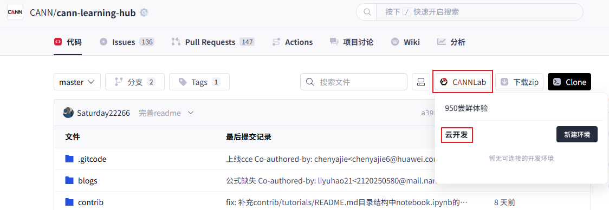
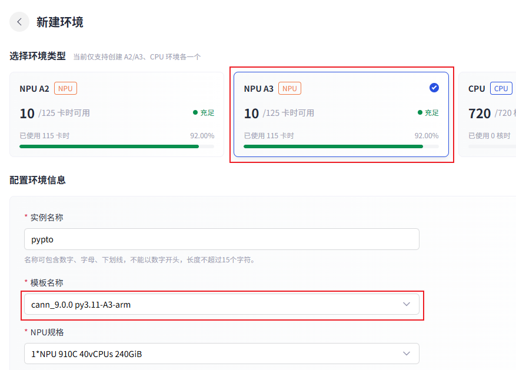
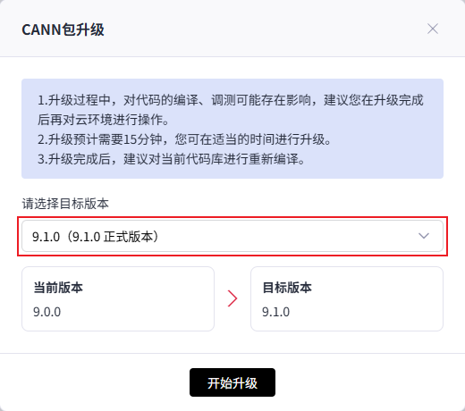
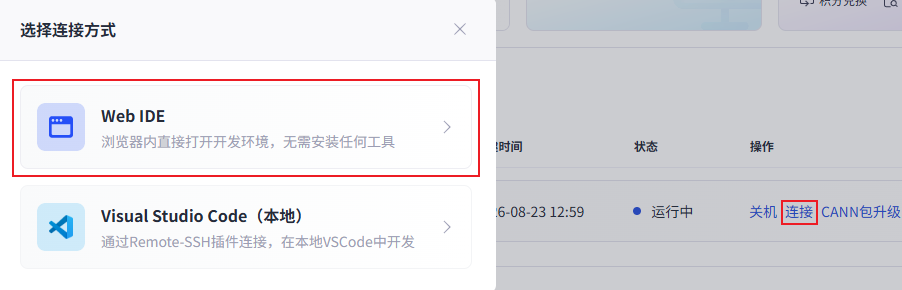
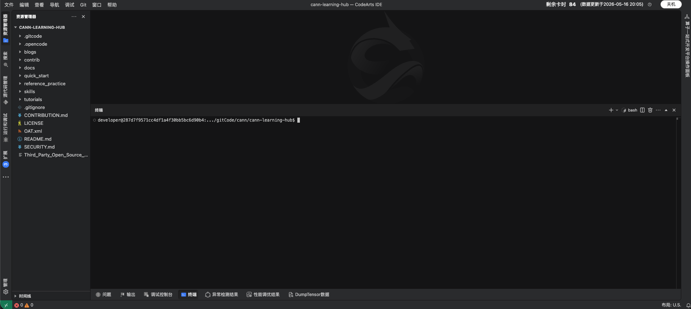
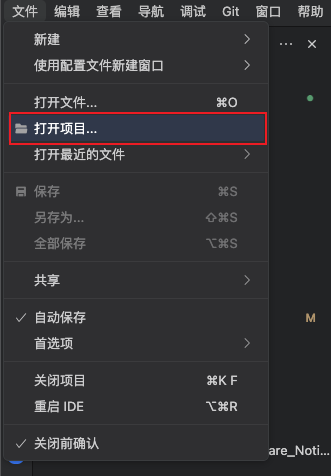
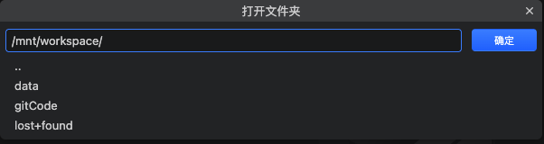
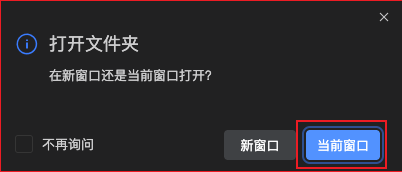
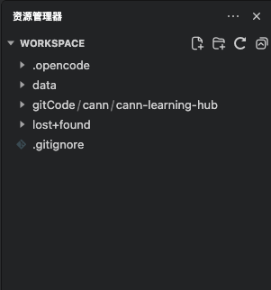
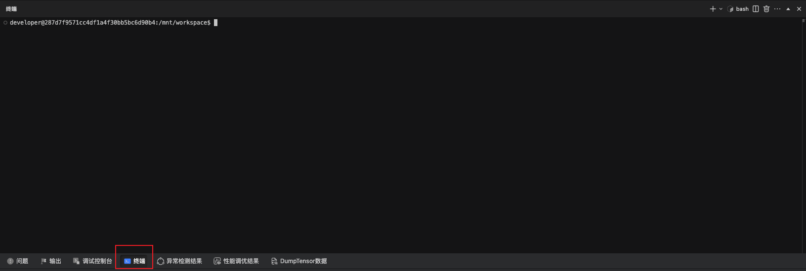

# 使用 CANNLab 快速进行 pypto 开发

## 概述

**PyPTO**（发音：pai p-t-o）是一款面向 AI 加速器的高性能编程框架，旨在简化复杂融合算子乃至整个模型网络的开发流程，同时保持高性能计算能力。该框架采用创新的 **PTO（Parallel Tensor/Tile Operation）编程范式**，以基于 Tile 的编程模型为核心设计理念，通过多层次的中间表示（IR）系统，将用户通过 API 构建的 AI 模型应用从高层次的 Tensor 图逐步编译成硬件指令，最终生成可在目标平台上高效执行的可执行代码。

> **仓库地址：** [https://gitcode.com/cann/pypto.git](https://gitcode.com/cann/pypto.git)

本章节主要介绍如何使用 CANNLab 快速体验 pypto 框架。

---

## 使用 CANNLab 创建 NPU 环境

CANNLab 提供了即开即用的 NPU 环境。打开 GitCode 中 [CANN 的任意仓库](https://gitcode.com/cann)，在仓库页面中可以看到 CANNLab 按钮。以 [cann-learning-hub](https://gitcode.com/cann/cann-learning-hub) 仓库为例：

展开CANNLab后点击**云开发**可使用华为云账号登录，进入开发者空间。
<div style="border: solid 16px #f1f1f8; text-align: center; background-color: #f6f7f9">
  
</div>
<br />

在我的环境中可以创建环境，NPU初始时限为 **100 小时**。使用 pypto 需要 NPU 环境，我们点击**新建环境**。

<div style="border: solid 16px #f1f1f8; text-align: center; background-color: #f6f7f9">
  
</div>
<br />

CANN 的版本基于以下对应关系选择。其中 A2 对应 npu 910B 系列，A3 对应 910C 系列。

| pypto | cann |
|---|---|
| 0.1.x | CANN 8.5+ |
| 0.2.x | CANN 9.0+ |

由于 CANN 9.1.0 需要在创建后的环境中进行升级，这里我们选择 A2 或 A3 环境，基于 CANN 9.0.0 进行创建，开发环境名称任意即可。完成选择后点击下方**新建环境**。
<div style="border: solid 16px #f1f1f8; text-align: center; background-color: #f6f7f9">
  
</div>
<br />

创建环境后，回到我的环境中，点击**CANN包升级**将CANN升级到9.1.0。
<div style="border: solid 16px #f1f1f8; text-align: center; background-color: #f6f7f9">
  
</div>
<br />

在升级界面选择CANN 9.1.0正式版本，点击**开始升级**等待升级完成，升级完成后需要手动将**系统重启**，即可完成升级。
<div style="border: solid 16px #f1f1f8; text-align: center; background-color: #f6f7f9">
  
</div>
<br />

完成**升级**并重启开机后，NPU 环境即创建完成，点击**连接**可以使用 WebIDE 和 VSCode 进行连接。本章内容后续以 WebIDE 连接方式进行演示。

<div style="border: solid 16px #f1f1f8; text-align: center; background-color: #f6f7f9">
  
</div>
<br />

> **说明：** CANN 9.1.0 已内置预装 PyPTO 0.2.1，升级并重启后即可直接使用。  
> **注意：** 如果开机时显示资源不足，说明当前时间段使用的人较多，可以过一段时间再尝试。

---

## 设置资源管理器从 workspace 打开

使用 WebIDE 连接进入环境后，可以看到整个界面类似于 VSCode，可以进行源代码管理、安装扩展等操作。

<div style="border: solid 16px #f1f1f8; text-align: center; background-color: #f6f7f9">
  
</div>
<br />

目前资源管理器默认仅展示当前项目仓库，点击左侧菜单 **文件 → 打开项目 → `/mnt/workspace`**，然后选择当前窗口打开，可以使资源管理器监管到 workspace 下的所有文件。

<div style="border: solid 16px #f1f1f8; text-align: center; background-color: #f6f7f9">
  
</div>
<br />

<div style="border: solid 16px #f1f1f8; text-align: center; background-color: #f6f7f9">
  
</div>
<br />

选择当前窗口打开。
<div style="border: solid 16px #f1f1f8; text-align: center; background-color: #f6f7f9">
  
</div>
<br />

可以看到资源管理器切换到了 workspace。

<div style="border: solid 16px #f1f1f8; text-align: center; background-color: #f6f7f9">
  
</div>
<br />

至此，资源管理器已配置完毕。

---

## 验证 pypto 环境

完成 CANN 9.1.0 升级后，系统已内置预装 **PyPTO 0.2.1**。在开始开发前，建议在 WebIDE 的终端中进行快速验证。

点击左上角菜单 **终端 → 新建终端** 打开终端窗口：

<div style="border: solid 16px #f1f1f8; text-align: center; background-color: #f6f7f9">
  
</div>
<br />

### 1. 验证 NPU 状态

在终端中执行 `npu-smi info`，确认 NPU 设备正常工作：

```bash
npu-smi info
```

若能正确输出昇腾 NPU 芯片信息（如 Ascend910 系列），说明底层硬件与 CANN 驱动运行正常。

### 2. 验证 PyPTO 安装

在终端中执行以下 Python 命令，检查 PyPTO 是否可用：

```bash
python3 -c "import pypto; print('PyPTO 版本:', pypto.__version__)"
```

若成功输出 `PyPTO 版本: 0.2.1`，说明 PyPTO 环境已就绪。

至此，就可以开始愉快地进行 pypto 的开发了。

---

<div align="center">

**[← 上一节](./01.00_chapter_intro.ipynb)** | **[下一节 →](./01.02_CANNLab_proj_env_config.md)**

</div>
