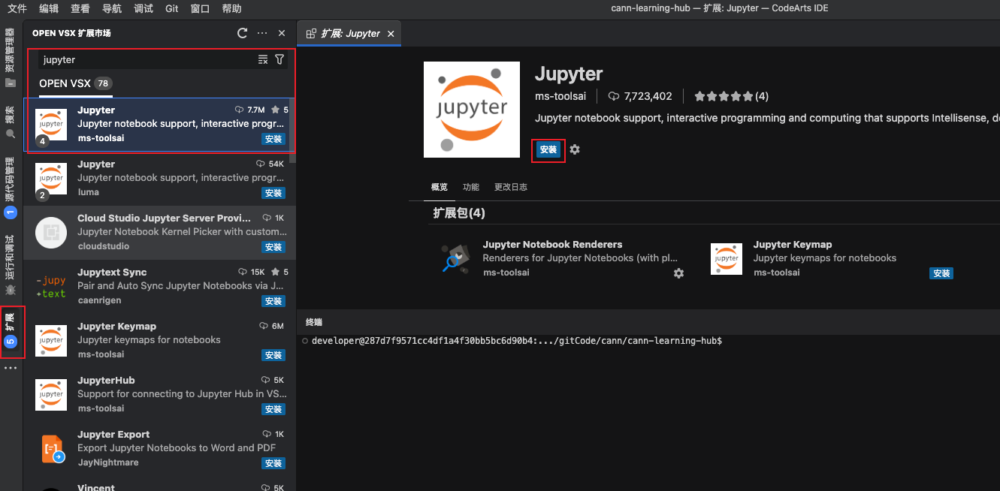
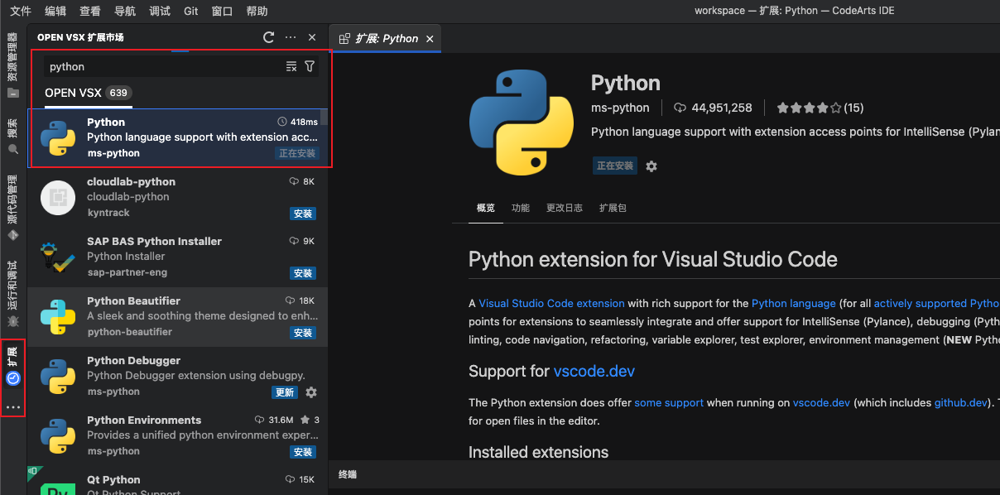
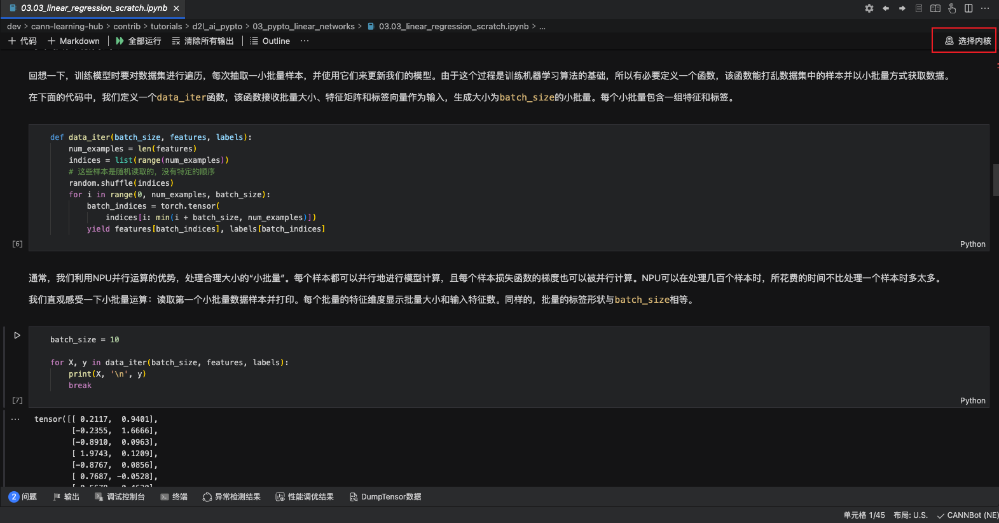
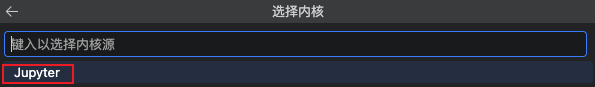
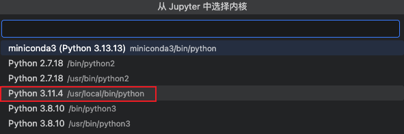
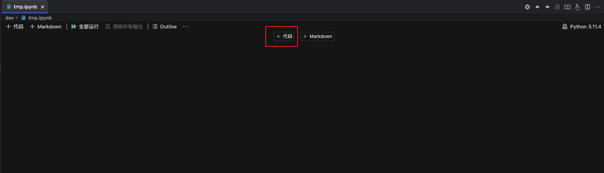
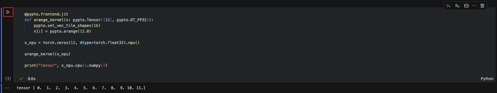

# 使用 notebook 进行 pypto 开发

本项目使用 notebook 的形式进行展示，下面以 CANNLab WebIDE 为例展示如何使用 notebook。

## 1.下载扩展（插件）
首先下载 jupyter 扩展，我们在 CANNLab 左侧的扩展处搜索 jupyter，选择 ms-toolsai 发布的 jupyter 扩展进行安装。

  

 

再搜索 python，选择 ms-python 发布的 python 扩展进行安装。

  

 

> CANNLab 上进行扩展安装可能需要一些时间。 

---

## 2.选择内核
打开任意需要运行的 notebook 后，点击 `选择内核`

  

 

这里我们选择 CANNLab 预装的 python 3.11 版本。

  

 

  

 

接下来就可以愉快地进行开发了。jupyter notebook 可以同时具有 `代码 cell` 和 `Markdown cell`，十分适合用于学习与展示。

点击 `+ 代码` 创建 `代码 cell`。

  

 

点击 `执行单元格` 即可运行 cell。

  

 

---

**[← 上一节](./01.02_CANNLab_proj_env_config.md)** | **[下一节 →](./README.md)**

