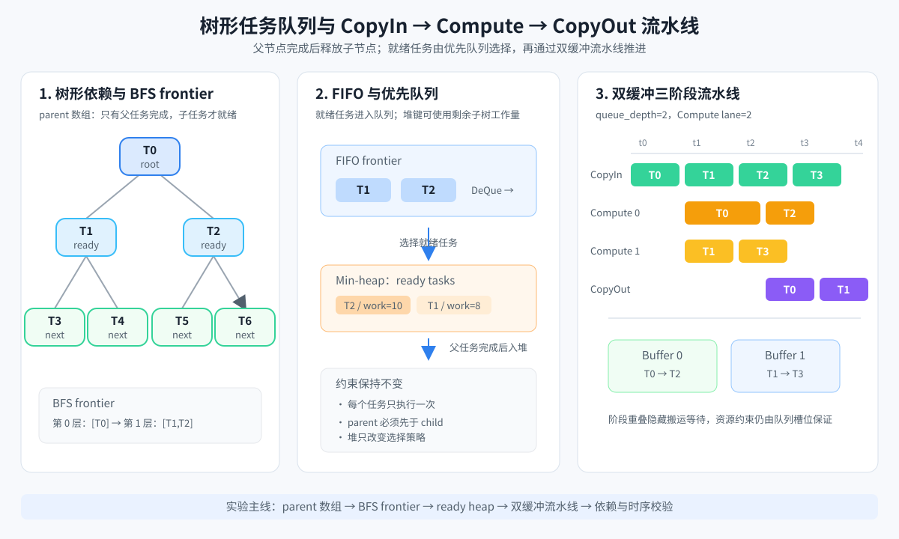

# 10_tree_queue_pipeline

本实验把树的层次依赖、优先队列和 Ascend C 的三阶段流水线放到同一个任务调度问题中。输入是一棵带有任务耗时的树，实验先用 BFS 队列推进依赖层级，再用小根堆维护已就绪任务，最后比较 FIFO 顺序和优先级顺序在 `CopyIn → Compute → CopyOut` 流水线中的完成时间。

本实验不重复 Reduce、TopK 或 MoE 路由主题，重点是“树形依赖如何转化为数组索引、就绪任务如何进入队列、流水线如何通过双缓冲隐藏阶段等待”。



## 适用对象与前置要求

本实验面向已经学习数组、队列、树和堆基础知识，并希望阅读 Ascend C 工程的开发者。开始前建议完成本课程前面的队列、堆和算子基础章节，能够阅读 Python 函数、JSON 数据和 C/C++ 基本控制流。

Python reference 只依赖 Python 3.8+ 标准库；执行 910B 设备 Notebook 还需要 Linux、CANN 8.5+、`cmake`、`gcc`、`bash` 和可用的 Ascend 910B 设备。没有设备时可以先完成 10.01 和 10.02 中的 Python reference 部分。

## 支持平台

| 平台 | 芯片 | 状态 |
|------|------|------|
| 昇腾 310B | Ascend310B1 | 已适配 |
| 昇腾 910B | Ascend910B | 已验证 |

本章已在远程 Ascend 910B 环境跑通。提交 PR 时仍需在描述中写明实际硬件型号、CANN 版本、运行环境和 Notebook 验证结果；本目录中的 Python 参考输出不能替代设备输出。

## 在线体验环境

本章支持在 CANNLab 云开发环境中体验。请先阅读[CANNLab 环境体验指南](../../../../docs/CANNLab_env_experience_guide.md)，再按 10.01 → 10.02 → 10.03 的顺序打开 Notebook。提交到 `test` 分支后，GitCode 在线 Notebook 入口由仓库维护人员配置。

## 课程来源

- `第4讲_队列结构与流水线.pptx`：FIFO、生产者-消费者、TPipe、EnQue/DeQue、双缓冲和三阶段流水线。
- `第5讲_树结构与堆结构.pptx`：parent 数组、BFS frontier、完全二叉树、堆调整和优先队列。

## 章节内容

| 章节 | 主题 | 学习入口 |
|------|------|----------|
| 10.01 | 树形依赖、FIFO 队列和优先级就绪队列 | [章节导论](./10.01_chapter_intro.ipynb) |
| 10.02 | BFS frontier、堆调度和三阶段流水线模拟 | [动手实验](./10.02_tree_queue_lab.ipynb) |
| 10.03 | 调度正确性、缓冲深度和性能分析 | [章节测试](./10.03_chapter_test.ipynb) |

建议按 `10.01 → 10.02 → 10.03` 的顺序学习。参考答案位于 `answer/`，Python 参考脚本和 910B Ascend C 工程位于 `src/tree_queue_lab/`。

## 实验目标

1. 用 `parent[i]` 数组表示树的父子关系，避免依赖指针跳转。
2. 用 BFS frontier 计算层级和依赖释放顺序。
3. 用二叉堆实现就绪任务优先队列，比较 FIFO 与优先级调度。
4. 用队列深度 2 模拟双缓冲，并用两个 Compute lane 观察 `CopyIn`、`Compute`、`CopyOut` 的重叠。
5. 用约束检查确认每个任务只执行一次，且父任务一定先于子任务完成。

## 快速开始

```bash
cd src/tree_queue_lab
python3 scripts/gen_data.py --num_nodes 31 --seed 10
python3 scripts/run_lab.py --data_dir data --output data/output.json
python3 scripts/verify_results.py data/output.json
```

预期输出包含：

- BFS 层序和每个节点的 `depth`；
- FIFO 与优先级调度得到的任务顺序；
- 两种顺序在双缓冲流水线中的 `end_to_end` 时间；
- 父子依赖、堆序和流水线阶段关系的校验结果。

## 910B Ascend C 运行入口

设备侧算子名为 `TreeQueuePipelineLite`。Host 侧先生成树依赖和 FIFO/优先队列顺序，ACLNN 算子再按给定顺序模拟两个缓冲槽、两个 Compute lane 和三阶段时间推进，并返回每个任务的 `CopyOut` 完成时间及依赖校验值。

```bash
cd src/tree_queue_lab
source /usr/local/Ascend/ascend-toolkit/latest/set_env.sh
TARGET=ascend910b bash scripts/build_ops.sh
source scripts/env_custom_opp.sh
bash scripts/build_runner.sh
python3 scripts/gen_data.py --num_nodes 31 --seed 10 --output data
aclnn_runner/build/main_tree_queue_benchmark data priority
aclnn_runner/build/main_tree_queue_benchmark data fifo
```

当前 Kernel 使用一个 control block 保持跨任务依赖的确定性，`queue_depth=2` 和 `compute_lanes=2` 在 Tiling 中传入；这套代码用于 910B 工程迁移和正确性验证，不把有前后依赖的调度循环伪装成无依赖的逐元素并行算子。

## Ascend C 映射思路

本实验的树遍历和调度控制运行在 Host 侧，适合先验证算法和依赖关系。910B 工程中，`parent`、`cost` 和 `order` 作为 Tensor 传入 `TreeQueuePipelineLite`，Kernel 使用 `GlobalTensor` 访问数据，Tiling 传递任务规模、双缓冲深度和 Compute lane 数；后续可把每个 frontier 的节点属性作为连续 Tensor 搬入 Local Memory，再通过 TQue 传递到下一层。

## 目录结构

```text
10_tree_queue_pipeline/
├── 10.01_chapter_intro.ipynb
├── 10.02_tree_queue_lab.ipynb
├── 10.03_chapter_test.ipynb
├── 910b_guide.md
├── answer/
├── images/
│   └── tree_queue_pipeline.svg
└── src/tree_queue_lab/
    ├── aclnn_runner/
    ├── custom_ops/
    └── scripts/
```
