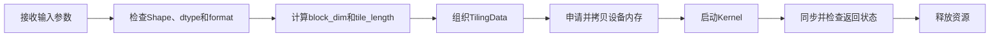

# 实验三：Host侧体验参考答案

## 1. Host 到 Kernel 调用链



调用链中的关键边界是：Host 侧决定如何切分任务并把 Tiling 参数传给 Kernel；Kernel 根据这些参数完成数据搬运和计算。

## 2. 代码分类

| 分类 | 典型内容 | 判断依据 |
| --- | --- | --- |
| 业务逻辑 | Shape 检查、Tiling 计算、block 数量、tile 长度、边界处理 | 改变后会影响算子的执行策略或正确性 |
| 框架胶水 | ACL 初始化、Context/Stream 管理、设备内存申请释放、错误码与日志 | 服务于运行环境和框架接入，可通过模板复用 |

至少应指出以下三类常见胶水代码：运行环境初始化与销毁、设备内存生命周期管理、Kernel 启动与错误处理。

## 3. Tiling 参考思路

设输入元素数为 `total_length`，每个 block 处理的数据量可写为：

```text
block_length = ceil(total_length / block_dim)
tile_num = ceil(block_length / tile_length)
```

实现时还必须处理最后一个 block 和最后一个 tile 的尾块，不能假设输入长度总能整除。`tile_length` 还需要满足数据搬运对齐和本地 Buffer 容量约束。

## 4. 检查清单

- 输入 Shape、dtype 和 format 均经过检查。
- TilingData 的字段顺序和类型与 Kernel 侧定义一致。
- Kernel 启动参数使用实际输入规模计算，而不是固定常量。
- 每个资源申请都有对应释放路径，异常分支同样不会泄漏。
- 错误码和日志能够定位初始化、拷贝、启动或同步阶段的问题。
