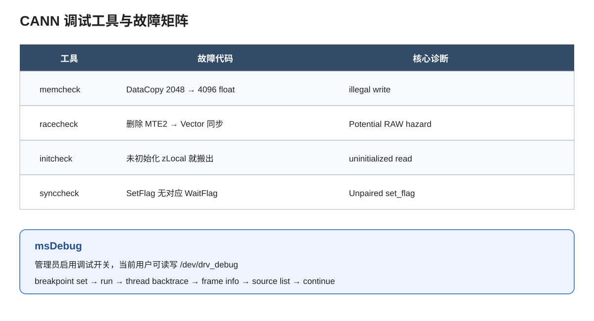

---

# CANN 编程错误调试（CANN 模块 5.1）

## 课程简介

本实验对应 CANN 教学体系模块 5.1（CANN 编程错误调试），用一个故障可切换的 Ascend C Add 算子学习
memcheck、racecheck、initcheck、synccheck 和 msDebug。四类 msSanitizer 故障同时提供独立 ASC
与标准算子工程两种形态。

故障 Add 算子只是 sanitizer 与 msDebug 的**调试载体**：本实验的目的定位、验证故障与修复，
不是算子调优实验；该载体不迁移到 5.2，也不对应任何调优实验。

## 适用人群与前置要求

面向具备 C++、Ascend C、CMake 和基本算子构建经验的学习者。开始前应能在 CANN 环境构建并运行
一个简单的 Vector Kernel。

## 学习目标

- 把设备越界、流水线竞争、未初始化读取和同步不配对定位到源码；
- 理解 `target_compile_options` 与标准算子工程编译选项接口的区别；
- 使用 msDebug 的断点、调用栈、栈帧和源码查看命令。

## 课程支持的硬件产品与已验证的在线体验环境

| 项目 | 说明 |
|------|------|
| 支持硬件 | Atlas A3（SoC Ascend910_9362）；本轮已验证，标准算子工程 A3 编译标识 `ascend910_93`；msDebug 已完成断点、调用栈、栈帧和源码定位；历史记录另有 Ascend 910B3 |
| CANNLab 环境 | CANN 9.0，镜像模板 `cann_9.0.0-py3.11-A3-arm-20260829` |
| Notebook 内核 | `Python 3.11.4 (CANN)`，kernelspec 为 `python3` |
| CANNLab 指南 | [CANNLab 环境体验指南](../../../../docs/CANNLab_env_experience_guide.md) |
| 实验验证情况 | 2026-09-02 A3 验证：独立 ASC 与标准算子工程的 memcheck、racecheck、initcheck、synccheck 均产生对应 `EXPECTED_DIAGNOSTIC`，故障诊断不是普通 PASS；不含 HCCL、多卡或其它未涉及内容 |

msDebug 还要求管理员启用调试开关，并让当前用户可读写 `/dev/drv_debug`；实验代码不会修改系统权限。

| 状态 | 含义 |
|------|------|
| `PASS` | baseline 或修复后的程序正常完成，且要求的校验通过 |
| `EXPECTED_DIAGNOSTIC` | 故障程序产生与 MODE 对应的诊断；工具退出码单独记录 |
| `BLOCKED` | 缺少工具、调试开关或设备节点权限；不得写成 PASS |

## 课程章节目录

| 章节 | 说明 | 相对链接 |
|------|------|----------|
| 8.1 章节介绍 | 工具、故障、状态与权限边界 | [08.01_chapter_intro.ipynb](./08.01_chapter_intro.ipynb) |
| 8.2 msDebug 与 msSanitizer | 两种工程形态的四类诊断与 msDebug | [08.02_msdebug_mssanitizer.ipynb](./08.02_msdebug_mssanitizer.ipynb) |
| 8.3 章节实践 | 客观题与简单/中等/困难三档实践 | [08.03_chapter_test.ipynb](./08.03_chapter_test.ipynb) |
