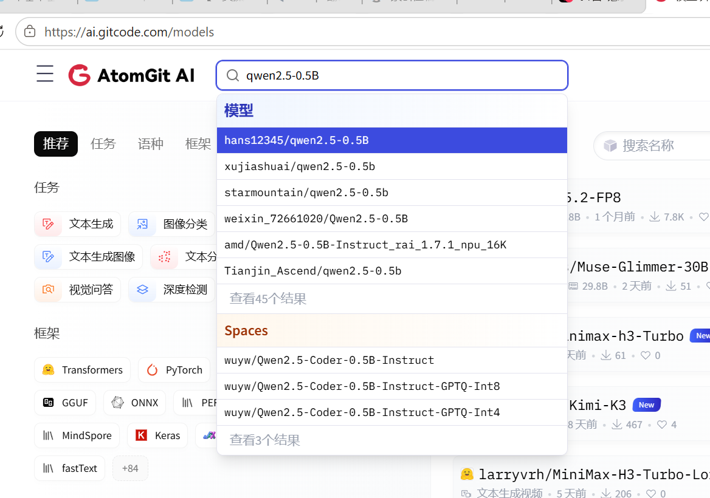
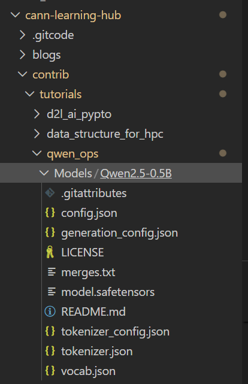

[](https://e.huawei.com/cn/talent/learning/#/zone?customizedZoneId=n3CkUWeurIQ9mwSHKkeOo9abFL8)
---
## 实验简介

本目录包含 12 个 Jupyter 实验手册，围绕 Qwen2.5 中的五类关键算子展开：RMSNorm、RoPE、SwiGLU、GEMM 和 GQA Attention。实验从基础版算子开发开始，逐步进入数据搬运、UB 分块、向量化和流水线优化，最后将五类算子统一接入 Qwen2.5 模型进行正确性与性能验证。

## 实验内容

### 第一阶段：基础版算子

1. **RMSNorm 基础版**：实现均方根归一化，掌握 I/O 规格、任务划分、Kernel 编写、PyTorch 注册和 Golden 验证。
2. **RoPE 基础版**：实现旋转位置编码，理解 `rotate_half`、Tiling、模型替换及设备侧计时。
3. **SwiGLU 基础版**：以 FP32 标量方式实现 SwiGLU，打通 Ascend C Kernel 到 PyTorch 的调用链路。
4. **GEMM 基础版**：使用直观三层循环实现矩阵乘法，验证矩阵索引、任务划分和注册接口。
5. **GQA Attention 基础版**：实现分组查询注意力，理解 Q/K/V 布局、因果掩码和数值稳定 Softmax。

### 第二阶段：优化版算子

6. **RMSNorm 优化版**：通过分块搬运、片上缓存和向量计算降低全局内存访问开销。
7. **RoPE 优化版**：使用 Profiling 定位瓶颈，并实践动态 Tiling、UB 分块和向量化计算。
8. **SwiGLU 优化版**：将输入按 tile 搬入 UB，使用向量接口完成激活和逐元素计算。
9. **GEMM 优化版**：设计 M/N/K 分块，调整矩阵布局，并完成向量乘法与归约。
10. **GQA Attention 优化版**：使用 `TPipe`、`TQue` 和 `TBuf` 管理 UB，优化 QK 点积、Softmax 与 V 累积。

### 第三阶段：模型统一接入

11. **五个基础版算子统一接入**：加载五类动态库，替换 Qwen2.5 对应模块，并与原生模型输出进行 Golden 对比。
12. **五个优化版算子统一接入**：统一接入优化版算子，对比正确性、替换数量和端到端性能。

## 前置知识

建议开始实验前具备以下基础：

- C/C++ 编程、指针、内存布局和动态库基础。
- Python、PyTorch 张量操作及自定义算子调用经验。
- Linux 命令行、Shell、CMake 和基本编译调试能力。
- Transformer 基本结构，以及归一化、位置编码、激活函数、矩阵乘法和 Attention 的计算过程。
- Ascend C 基础概念：Host/Device、AI Core、GM、UB、Tiling、核函数启动和多核任务划分。
- 基础性能分析知识：预热、重复计时、吞吐与延迟，以及正确性和性能的分离验证。

## 环境要求

实验手册使用的主要环境如下：

| 项目     | 建议配置                                                    |
| -------- | ----------------------------------------------------------- |
| 硬件     | Ascend 910B4 NPU                                            |
| 工具链   | CANN 8.5.x，手册接口说明以 8.5.0 为主                       |
| 编程环境 | Ascend C、C/C++、Python                                     |
| 框架     | PyTorch 及对应的 NPU 适配环境                               |
| 构建工具 | CMake、GCC/G++、CANN 编译工具链                             |
| 模型     | Qwen2.5-0.5B，用于模型级替换与验证                          |

不同服务器上的 CANN 安装目录可能不同，请先确认实际路径：

```bash
export ASCEND_HOME_PATH=/实际的/Ascend/cann目录
source ./scripts/setup_cannlab_env.sh
```

`torch` 与 `torch_npu` 必须至少保持相同的主、次版本，并与所用 CANN 版本遵循官方兼容矩阵。四个直接包含 `NPUStream.h` 的 GEMM/SwiGLU 扩展优先使用 `torch_npu` 随包 ACL 头文件，并在 PyTorch 当前 NPU 流上启动 kernel；不要通过新建私有 ACL stream 绕过头文件冲突，否则上游 `.contiguous()` 等异步操作可能与 kernel 形成跨流竞态。

进入具体实验工程后，通常按以下流程检查和构建：

```bash
cd "$QWEN_OPS_CODE_ROOT/09_gemm_optimized/src/GemmOptimizedExperiment"

bash scripts/check_env.sh
bash scripts/build.sh

export LD_LIBRARY_PATH="$PWD/out/lib:${LD_LIBRARY_PATH}"
```

构建完成后，可先运行单算子正确性测试：

```bash
python3 tests/test_torch_op.py
```

具体参数、脚本名称和模型路径以对应实验手册为准。

## 已验证的在线体验环境

本教程已在以下在线环境完成运行验证：

| 体验环境 | 镜像模板 / 版本 | Python 内核 | 说明 |
| --- | --- | --- | --- |
| CANNLab 云开发环境 | `cann_8.5.2-py3.11-A2-arm` | Python 3.11.4 | `1*NPU 910B3`；PyTorch 2.7.1、torch_npu 2.7.1.post4。参考 [CANNLab 环境体验指南](https://gitcode.com/cann/cann-learning-hub/blob/master/docs/CANNLab_env_experience_guide.md)创建环境并运行 Notebook |

课程当前各章节表格提供仓库内 Notebook 链接；gitcode 在线体验链接将在课程上线时由 committer 统一配置。

## 推荐学习顺序

1. 按实验 1–5 完成五类基础版算子，优先确保数学语义、接口和测试链路正确。
2. 按实验 6–10 对照相应基础版，先 Profiling，再实施优化，并保持测试口径一致。
3. 完成实验 11–12，学习动态库加载、模型模块替换、张量边界适配和端到端验证。

建议基础版和对应优化版成对学习，例如实验 1 与实验 6、实验 2 与实验 7。

## 实验手册

| 实验内容 | Notebook |
| :--- | :--- |
| 实验一：RMSNorm 基础版 | [查看手册](./01_rmsnorm_baseline/01.01_rmsnorm_baseline.ipynb) |
| 实验二：RoPE 基础版 | [查看手册](./02_rope_baseline/02.01_rope_baseline.ipynb) |
| 实验三：SwiGLU 基础版 | [查看手册](./03_swiglu_baseline/03.01_swiglu_baseline.ipynb) |
| 实验四：GEMM 基础版 | [查看手册](./04_gemm_baseline/04.01_gemm_baseline.ipynb) |
| 实验五：GQA Attention 基础版 | [查看手册](./05_gqa_attention_baseline/05.01_gqa_attention_baseline.ipynb) |
| 实验六：RMSNorm 优化版 | [查看手册](./06_rmsnorm_optimized/06.01_rmsnorm_optimized.ipynb) |
| 实验七：RoPE 优化版 | [查看手册](./07_rope_optimized/07.01_rope_optimized.ipynb) |
| 实验八：SwiGLU 优化版 | [查看手册](./08_swiglu_optimized/08.01_swiglu_optimized.ipynb) |
| 实验九：GEMM 优化版 | [查看手册](./09_gemm_optimized/09.01_gemm_optimized.ipynb) |
| 实验十：GQA Attention 优化版 | [查看手册](./10_gqa_attention_optimized/10.01_gqa_attention_optimized.ipynb) |
| 实验十一：五个基础版算子统一接入 | [查看手册](./11_baseline_ops_integration/11.01_five_baseline_ops_integration.ipynb) |
| 实验十二：五个优化版算子统一接入 | [查看手册](./12_optimized_ops_integration/12.01_five_optimized_ops_integration.ipynb) |

## 模型安装
- 源码树不预置 `Models/`。执行第 11、12 章的下载单元时，会共用课程根目录下运行时创建的 `Models/Qwen2.5-0.5B`；也可使用 `modelscope download --model Qwen/Qwen2.5-0.5B --local_dir ./Models/Qwen2.5-0.5B` 下载，或通过 `QWEN_OPS_MODEL_PATH` 使用已有模型。

- 下载后以cann-learning-hub/contrib/tutorials/qwen_ops/Models/Qwen2.5-0.5B的目录结构放置该模型。


## 验证与注意事项

- 正确性测试应与 PyTorch、NumPy 或独立 C++ 参考实现进行 Golden 对比。
- 性能测试应包含预热和多次重复，并优先使用 ACL Event 统计设备侧 Kernel 时间。
- 比较基础版与优化版时，应保持输入形状、数据类型、核数、预热次数和重复次数一致。
- 基础版与优化版可能注册相同或相近的 `torch.library` 命名空间，建议在独立 Python 进程中运行，避免重复注册或加载旧动态库。
- 修改代码后应重新构建，并确认 `LD_LIBRARY_PATH` 指向当前实验的 `out/lib`。
- 模型级验证应记录最大误差、平均误差、`allclose` 结果以及实际替换的模块数量。
- 先通过单算子测试，再进行模型接入；出现误差时，可按 GEMM、RMSNorm、SwiGLU、RoPE、GQA Attention 的顺序逐类排查。

## 文件对应关系

- `01`–`05`：五类基础版算子实验。
- `06`–`10`：五类对应优化版算子实验。
- `11`：五个基础版算子统一接入。
- `12`：五个优化版算子统一接入。

详细实现步骤、代码片段、测试参数和验收标准请查阅各章节中的 `.ipynb`。每章配套工程位于同章 `src/`，课程级环境、构建和验证入口集中在 `scripts/`。

## 五算子统一接入

第 11、12 章在原生 Qwen 前向后加载五类算子的动态库，并替换 Linear、RMSNorm、SwiGLU、RoPE 和 GQA Attention 的相应计算。模型级结果应记录最大误差、平均误差、`allclose` 结论与实际替换的模块数量；该路径同时包含模型前向和 NPU/CPU bridge copy，不应直接视为纯 kernel 性能。

```bash
source ./scripts/setup_cannlab_env.sh
python3 11_baseline_ops_integration/src/Qwen2.5BaselineIntegrationExperiment/qwen2_5_five_ops_benchmark.py \
  --model "$QWEN_OPS_MODEL_PATH" --repeat 1
python3 12_optimized_ops_integration/src/Qwen2.5OptimizedIntegrationExperiment/qwen2_5_five_ops_benchmark.py \
  --model "$QWEN_OPS_MODEL_PATH" --repeat 1
```
