# 基于 CANNLab 环境开发与提交课程指南

本指南面向希望向 cann-learning-hub 贡献课程的开发者，介绍如何基于 CANNLab 云开发环境完成课程开发、验证与 PR 提交的完整流程。

> **建议：CANNLab 云开发环境支持持久化开发，但仍建议将开发内容及时 commit 并 push 到个人 fork 仓库分支，避免环境异常或资源回收造成数据丢失。**

---

## 1. 整体流程概览

基于 CANNLab 环境开发并提交课程的整体流程如下：

| 步骤 | 操作 | 说明 |
| --- | --- | --- |
| 1 | 签署 CLA & Fork 仓库 | 完成社区准入准备，获取个人开发仓库。 |
| 2 | 创建并进入 CANNLab 云开发环境 | 申请 NPU 环境，通过 WebIDE 连接。 |
| 3 | 克隆仓库 & 切换开发分支 | 在环境中拉取代码，切换到 `test` 分支。 |
| 4 | 开发课程内容 | 按照目录结构与 Notebook 规范开发课程。 |
| 5 | 提交代码 | 将开发内容提交并推送到个人 fork 仓库的 `test` 分支。 |
| 6 | 运行验证 | 在课程支持的环境中逐 cell 执行 Notebook，确认可正常运行。 |
| 7 | 发起 PR | 向 `cann/cann-learning-hub` 的 `test` 分支发起 PR。 |
| 8 | 响应评审 & 迭代修改 | 根据评审意见在环境中修改并更新 PR。 |

详细规范请参见 [新课程上库与上线验收标准](./course_submission_criteria.md)，本指南聚焦于 CANNLab 环境下的操作步骤。

---

## 2. 准备工作

### 2.1 签署 CLA

在参与贡献之前，请前往 [CLA 使用指南](https://gitcode.com/cann/infrastructure/blob/main/docs/cla/cla%E4%BD%BF%E7%94%A8%E6%8C%87%E5%8D%97.md) 完成 CLA 协议签署。未签署 CLA 的 PR 将无法合入。

### 2.2 Fork 仓库

1. 在 [cann-learning-hub](https://gitcode.com/cann/cann-learning-hub) 仓库页面点击 **Fork**，将仓库 fork 到个人空间。

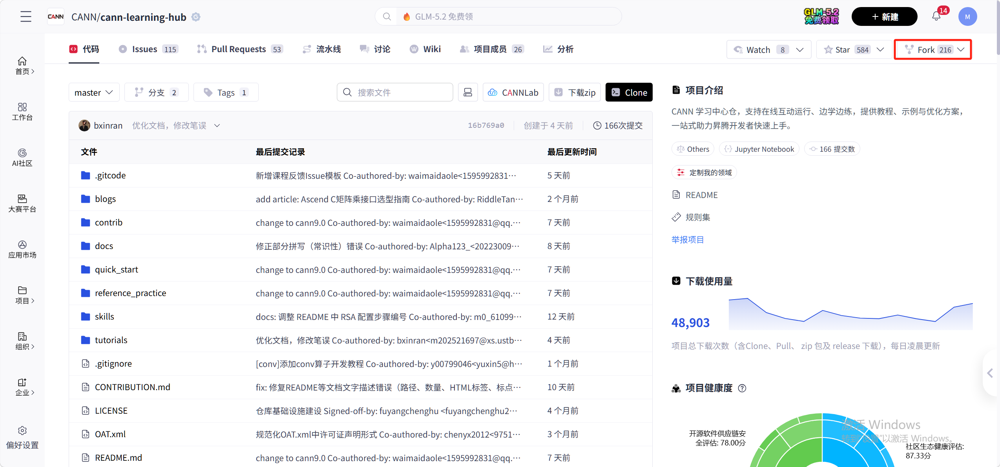

2. 记下个人 fork 仓库地址，例如 `https://gitcode.com/<your_username>/cann-learning-hub.git`。Fork 时选择要 Fork 的分支请选择全部。

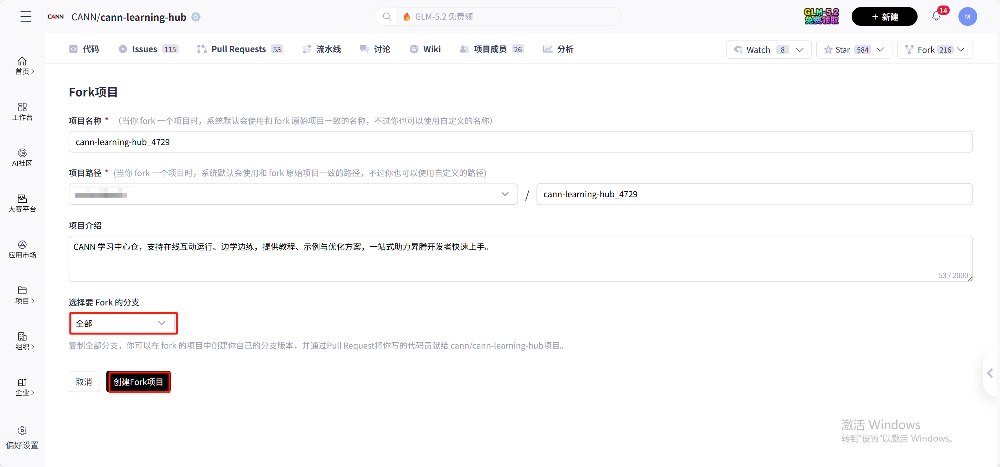

---

## 3. 创建并进入 CANNLab 云开发环境

### 3.1 进入 CANNLab 入口

打开 [cann-learning-hub](https://gitcode.com/cann/cann-learning-hub) 仓库页面，将鼠标移至 **CANNLab** 图标，在弹出选项中选择 **云开发**，使用华为云账号登录并进入开发者空间。


> CANNLab 提供两类环境：**云开发环境**（可申请 A2/A3）与 **950 尝鲜体验环境**（可申请 A5）。请根据课程支持的目标硬件选择对应环境。本指南以云开发环境为例。

### 3.2 创建 NPU 环境

进入页面后点击 **创建** 按钮：


按课程目标硬件选择规格配置（以 A2 为例）：

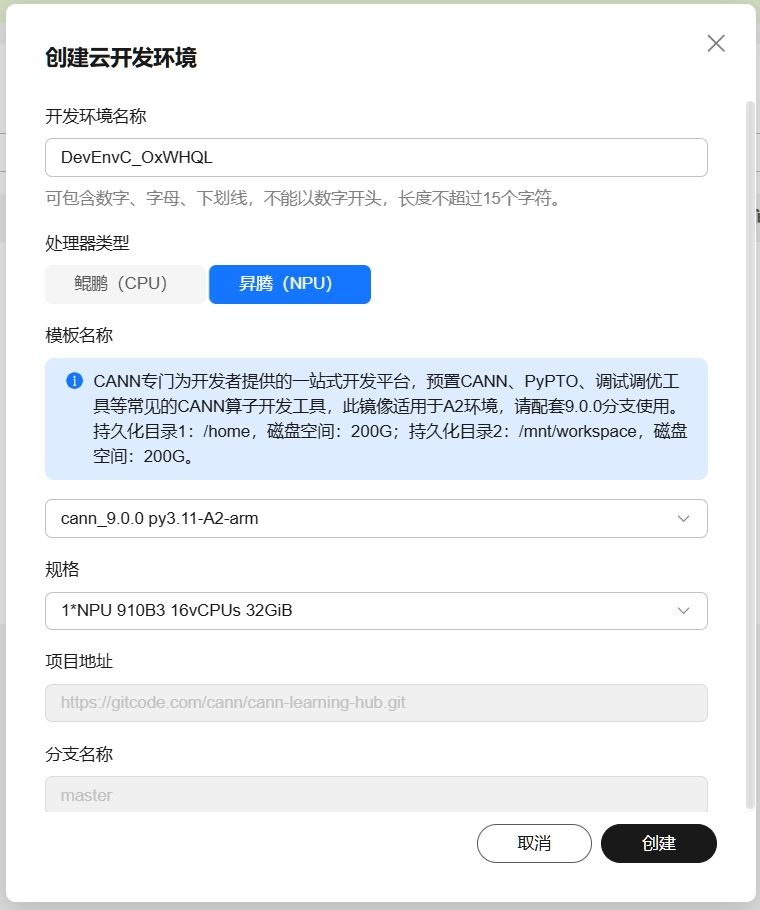


点击 **创建** 后，点击 **开机** 启动环境：


> 注意：如果开机时提示资源不足，说明当前时间段使用人数较多，可稍后再尝试。

### 3.3 通过 WebIDE 连接环境

环境开机后，点击 **WebIDE** 进入环境（也支持 VS Code 连接）：

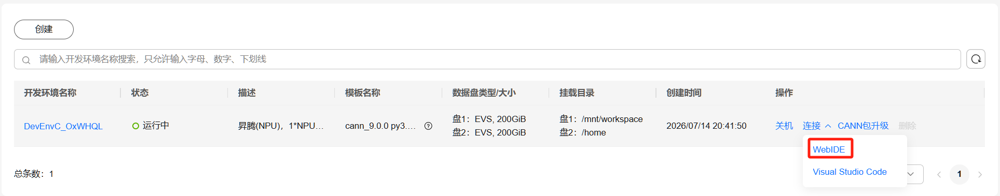

进入后界面类似 VS Code，支持源代码管理、扩展安装、终端等操作：

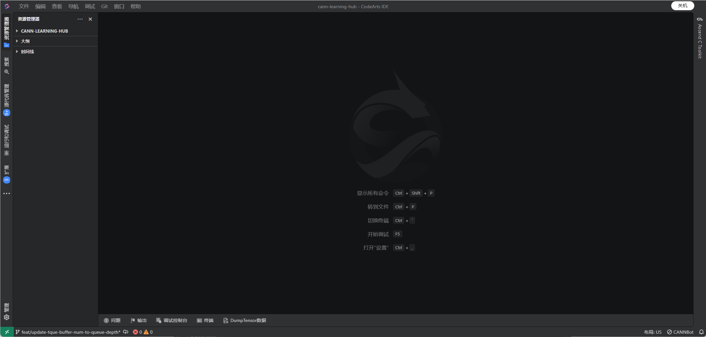

---

## 4. 克隆仓库与分支管理

### 4.1 打开终端

在 WebIDE 中通过菜单 **Terminal → New Terminal** 打开集成终端。

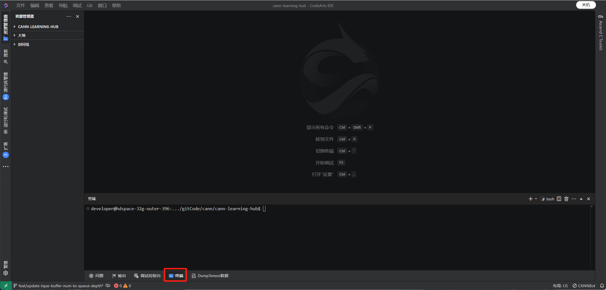

### 4.2 克隆个人 fork 仓库

执行以下命令，克隆个人 fork 仓库：

```bash
cd /mnt/workspace/gitCode/
git clone https://gitcode.com/<your_username>/cann-learning-hub.git
cd cann-learning-hub
```

### 4.3 切换到开发分支

课程开发统一基于个人 fork 仓库的 `test` 分支进行，切换到该分支即可开始开发：

```bash
git checkout test
```

---

## 5. 开发课程内容

### 5.1 在 WebIDE 中打开 fork 仓库

克隆完成后，在 WebIDE 中使用快捷键 `Ctrl+K Ctrl+O` 打开工程，在弹出窗口输入 `/mnt/workspace/gitCode/` 目录：

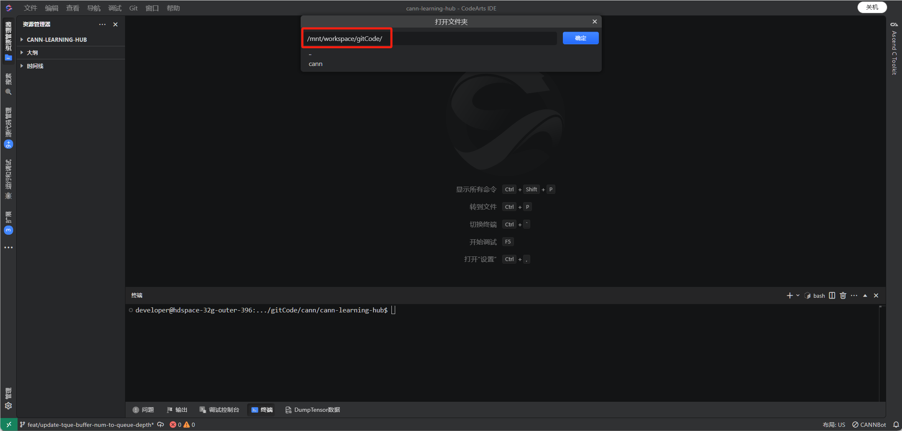

选择当前窗口打开：

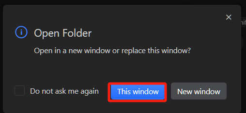

即可在左侧资源管理器中看到自己的 fork 仓库目录结构，直接在其中开发。

### 5.2 确定课程目录位置

- **官方课程**：放在 `tutorials/` 目录下。
- **社区贡献课程**：放在 `contrib/tutorials/` 目录下。

课程目录名建议全部小写，多个单词之间用下划线连接，例如 `yolov3_inference`。

### 5.3 目录结构

按照以下结构组织课程内容（以 `tutorials/` 下多章节课程为例）：

```text
tutorials/
└── course_name/
    ├── README.md                          # 课程主 README
    ├── 01_chapter_name/
    │   ├── 01.01_chapter_intro.ipynb      # 章节概述（必须为第一小节）
    │   ├── 01.02_section_name.ipynb       # 中间小节
    │   ├── 01.03_chapter_test.ipynb       # 章节实践（必须为最后一小节）
    │   ├── answer/                        # 课后练习/实践答案
    │   ├── images/                        # 章节配图
    │   └── src/                           # 工程源码
    └── 02_chapter_name/
        ├── 02.01_chapter_intro.ipynb
        ├── 02.02_section_name.ipynb
        ├── 02.03_chapter_test.ipynb
        ├── answer/
        ├── images/
        └── src/
```

命名规范要点：

- 课程目录、章节目录、文件名均使用英文、数字、下划线和点号，不包含中文。
- 章节目录命名符合 `0n_abc` 格式，例如 `01_introduction`。
- 小节 notebook 命名符合 `0n.0m_abc.ipynb` 格式，例如 `01.01_chapter_intro.ipynb`。

### 5.4 开发 README.md

课程根目录的 `README.md` 必须包含：

- 教程整体简介。
- 适用对象。
- 整体学习目标。
- **支持或已验证的硬件型号**（必须说明）。
- **在线体验环境说明**（必须说明）：明确课程支持在 **gitcode 在线 Notebook 环境** 还是 **CANNLab 环境** 中体验。
  - 若支持 **gitcode 在线 Notebook 环境**：在 README 中说明。gitcode 在线体验链接由仓库维护人员统一配置，开发者无需自行配置；课程提交到 `test` 分支后，请创建一个 Issue，说明课程名称、目录路径及各 `.ipynb` 入口文件，请求维护人员协助配置 gitcode 在线体验链接。
  - 若支持 **CANNLab 环境**：在 README 中说明，并附上 CANNLab 环境体验指导链接：[CANNLab 环境体验指南](./CANNLab_env_experience_guide.md)。

### 5.5 开发 Notebook 内容

每个章节的小节 Notebook 必须包含 **小节概述、教程具体内容、课后练习或课后实践** 三个部分。

开发要点：

- **章节概述**（第一小节）：包含学习前置要求、章节目标、章节内容与跳转链接。
- **章节实践**（最后一小节）：至少包含一道综合编程实践题。
- **教程正文**：行文通顺、逻辑由浅入深；第一次出现的新概念、新工具、新命令、新参数必须解释清楚；适当添加图片辅助讲解。
- **可运行代码**：工程目录创建、依赖安装、代码开发、脚本运行等操作在 code cell 中执行，学习者无需手动打开其他文件夹。
- **课后实践**：实践题的代码开发、编译执行等操作在 code cell 中执行；待填写文件通过 `%%writefile` 命令写入；答案通过 `cat` 命令展示。
- **源码查看**：源码较多放入 `src` 时，notebook 中通过 `cat`、`tree`、`ls` 等命令展示关键源码结构与内容。

### 5.6 在 WebIDE 中编辑 Notebook

在左侧资源管理器中找到并双击 `.ipynb` 文件即可在 Notebook 编辑器中打开，通过顶部工具栏新增单元格编写内容：

- **+Code**：新增 code cell，用于添加可执行代码。
- **+Markdown**：新增 markdown cell，用于添加文字说明、图片、表格等。

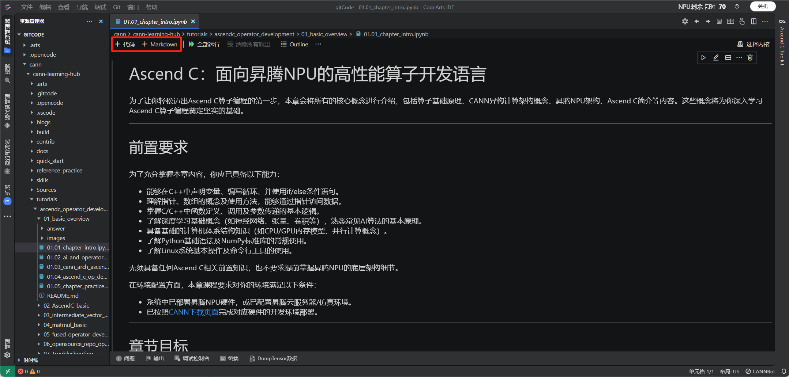

---

## 6. 提交代码

在终端中执行以下命令，将开发内容提交到个人 fork 仓库的 `test` 分支：

```bash
git add .
git commit -m "feat: 新增<课程名称>课程"
git push origin test
```

> 提交信息建议遵循 Conventional Commits 规范，例如 `feat: 新增yolov3推理课程`、`docs: 补充课程README`。

---

## 7. 运行验证

课程提交前 **必须** 在课程要支持的环境中完成实际运行验证，确保所有 Notebook 可从上到下顺序执行且不报错。根据课程声明的在线体验环境，分为：

- **gitcode 在线 Notebook 环境**：在 gitcode 在线 Notebook 中完成运行验证。
- **CANNLab 环境**：在 CANNLab 云开发环境（或 950 尝鲜体验环境）中完成运行验证。

### 7.1 打开 Notebook

运行验证前，需先在对应支持环境中打开课程 Notebook。

#### 7.1.1 在 gitcode 在线 Notebook 环境中打开

点击[gitcode在线体验链接](https://ai.gitcode.com/user/username/notebookcann?repoUrl=https://gitcode.com/cann/cann-learning-hub.git&ttl=120&diskSize=40Gi&path=quick_start/cann_basics&scanFilePath=quick_start/cann_basics/01_ai_basics.ipynb)进入 Notebook 在线体验环境。

进入环境后，点击页签右侧的加号：


在弹出菜单中选择打开 Terminal 终端界面：


在终端中执行以下命令，克隆个人 fork 仓库并切换到 `test` 分支：

```bash
cd
rm -rf cann-learning-hub/
git clone https://gitcode.com/<your_username>/cann-learning-hub.git
cd cann-learning-hub/
git checkout test
```

从左侧菜单栏点击进入 `cann-learning-hub` 仓库，即可在 Notebook 中查看并打开个人 fork 仓库 `test` 分支下的新增课程内容：


#### 7.1.2 在 CANNLab 环境中打开

按照本指南第 3 节创建并进入 CANNLab 云开发环境，通过 WebIDE 在左侧资源管理器中双击课程 `.ipynb` 文件即可打开 Notebook。

### 7.2 逐 cell 执行验证

#### 7.2.1 注册 Jupyter 内核

在终端中依次执行以下命令，注册 Python 3.11.4 (CANN) 内核：

```bash
# 安装 ipykernel（如已安装会提示 already satisfied，忽略即可）
/opt/buildtools/Python-3.11.4/bin/python3.11 -m pip install ipykernel
# 注册内核
/opt/buildtools/Python-3.11.4/bin/python3.11 -m ipykernel install --user \
  --name cann_py311 \
  --display-name "Python 3.11.4 (CANN)"
```

#### 7.2.2 设置环境变量自动加载

创建 `usercustomize.py`，让 Python 启动时自动设置 CANN 环境变量：

```bash
# 获取 CANN 路径
CANN_PATH=$(echo $ASCEND_TOOLKIT_HOME)
mkdir -p ~/.local/lib/python3.11/site-packages
cat > ~/.local/lib/python3.11/site-packages/usercustomize.py << EOF
import os
os.environ.setdefault('ASCEND_OPP_PATH', '${CANN_PATH}/opp')
os.environ.setdefault('ASCEND_TOOLKIT_HOME', '${CANN_PATH}')
os.environ.setdefault('ASCEND_HOME_PATH', '${CANN_PATH}')
os.environ.setdefault('ASCEND_AICPU_PATH', '${CANN_PATH}')
EOF
```

#### 7.2.3 关机重新开机并执行验证

完成上述配置后，**关机并重新开机**，使内核与环境变量配置生效。开机后通过 WebIDE 重新进入环境，打开每个 `.ipynb` 文件，在右上角 **选择内核**，选择 **Python 3.11.4 (CANN)**：

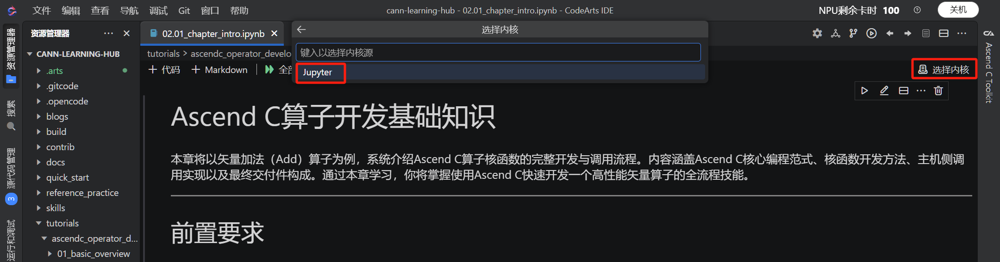

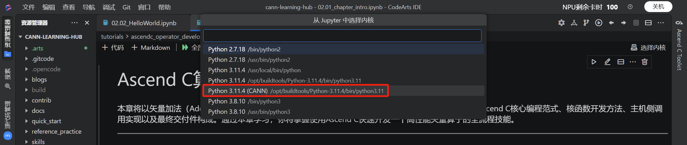

内核选择完成后，从第一个 code cell 开始依次点击运行按钮，确认：

- 每个 code cell 均能正常执行，无报错。
- 运行结果与预期一致。
- Kernel 不会中断或重启。

执行 code cell 及成功结果示意：

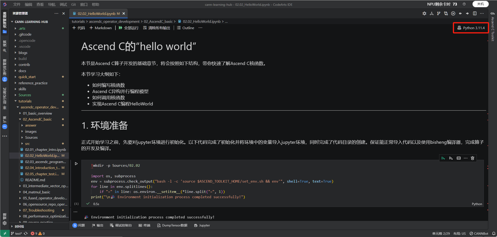


### 7.3 验证记录

在 PR 描述中需要说明：

- 验证使用的硬件型号（如 NPU 910B3）。
- 运行环境（如 CANNLab 云开发环境，模板及规格）。
- 验证结果（所有 Notebook 运行通过 / 存在的已知问题）。

### 7.4 多硬件验证

若课程同时支持多种硬件，需在每种硬件对应的体验环境中分别完成运行验证：

| 课程支持硬件 | 验证环境 | 验证要求 |
| --- | --- | --- |
| A2 / A3 | CANNLab 云开发环境 | 所有 Notebook 可从上到下顺序执行且不报错。 |
| A5 | CANNLab 950 尝鲜体验环境 | 所有 Notebook 可从上到下顺序执行且不报错。 |
| A2 | gitcode 在线 Notebook 环境 | 所有 Notebook 可从上到下顺序执行且不报错。 |

验证完成后，在 PR 描述中按硬件型号分别说明：

- 验证使用的硬件型号（如 NPU 910B3、NPU 950）。
- 运行环境（如 CANNLab 云开发环境、950 尝鲜体验环境、gitcode 在线 Notebook 环境）。
- 各环境下的验证结果（所有 Notebook 运行通过 / 存在的已知问题）。

> 仅支持单一硬件的课程，完成对应环境验证即可，无需多硬件验证。

---

## 8. 发起 PR

### 8.1 发起 PR

1. 在 GitCode 上进入个人 fork 仓库页面，切换到 `test` 分支。
2. 点击 **发起 Pull Request**。
3. **目标仓库** 选择 `cann/cann-learning-hub`，**目标分支** 选择 `test`。
4. 按照 PR 模板填写以下内容：
   - **描述**：本次改动的背景、目的与方案。
   - **测试**：说明运行验证情况（硬件型号、环境、验证结果）。
   - **文档更新**：如涉及 README 等文档更新请说明。
   - **类型标签**：勾选 **新特性** 或对应类型。
5. 提交 PR。

### 8.2 PR 准入自检

提交 PR 前请对照 [PR 准入 Checklist](./course_submission_criteria.md#6-pr-准入-checklist) 完成自检，重点关注：

- 课程目录位置、命名规范是否合规。
- 主 README 是否包含硬件型号与在线体验环境说明。
- 每个章节是否包含章节概述、章节实践、answer/images/src 目录。
- 所有练习/实践是否提供答案。
- 所有 Notebook 是否完成运行验证。
- 是否不含二进制文件（README 配图除外）。

---

## 9. 响应评审与迭代修改

### 9.1 查看评审意见

PR 提交后，课程组组长与 committer 会依据准合入 Checklist 进行评审。评审意见会在 PR 评论中给出。

### 9.2 在开发环境中修改

如需修改，在原开发环境（CANNLab 云开发环境）中继续开发。若使用 CANNLab 环境，环境关机后重新开机并进入即可，代码已保存在 fork 仓库。拉取最新代码：

```bash
cd cann-learning-hub
git checkout test
git pull origin test
```

修改完成后再次到对应环境运行验证，然后推送更新：

```bash
git add .
git commit -m "fix: 根据评审意见修改<具体内容>"
git push origin test
```

推送后 PR 会自动更新，在 PR 评论中回复评审意见并说明修改情况。

### 9.3 合入流程

- PR 评审通过后合入 `test` 分支。
- 在 `test` 分支组织内测，评审团队体验课程并提 Issue 闭环问题。
- 内测问题闭环后，由 Maintainer 合入 `master` 分支对外发布。

---

## 10. 常见问题

**Q1：课程应该提交到 `test` 分支还是 `master` 分支？**

所有课程 PR 统一提交到 `test` 分支，经内测闭环后再由 Maintainer 合入 `master`。

**Q2：如何选择 CANNLab 环境规格？**

根据课程目标硬件选择：A2/A3 选择 **云开发环境**，A5 选择 **950 尝鲜体验环境**。具体规格以课程 README 中声明的支持硬件为准。

**Q3：环境关机后代码会丢失吗？**

已 commit 并 push 到 fork 仓库的代码不会丢失。CANNLab环境关机仅释放计算资源，重新开机后可继续开发；但未提交的本地修改需重新创建，建议频繁提交并 push。

**Q4：课程中需要使用第三方数据集怎么办？**

在文档中说明数据集的下载方式与使用方法即可，无需直接提供数据集。

---

## 11. 相关文档

| 文档 | 说明 |
| --- | --- |
| [贡献指南](../CONTRIBUTION.md) | 项目整体贡献流程与要求。 |
| [新课程上库与上线验收标准](./course_submission_criteria.md) | 课程目录结构、Notebook 内容、运行验证等准入要求与 PR Checklist。 |
| [CANNLab 环境体验指南](./CANNLab_env_experience_guide.md) | CANNLab 云开发环境的体验流程（面向学习者）。 |
