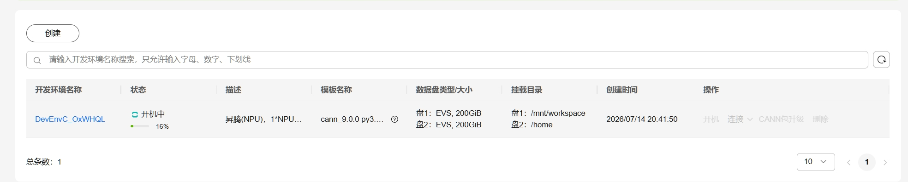

# CANNLab 环境体验指南

## 一、引言

CANNLab 提供两种即开即用的 NPU 体验环境。打开 [cann-learning-hub](https://gitcode.com/cann/cann-learning-hub) 仓库后，可在仓库页面看到 **CANNLab** 按钮：

将鼠标移至 **CANNLab** 图标，会弹出 **云开发** 和 **950 尝鲜体验** 两个选项。

请根据要体验的教程 `README.md` 中说明的支持环境，选择对应的运行环境。

- **云开发环境**：可申请创建 A2/A3 环境。
- **950 尝鲜体验环境**：可申请创建 A5 环境。

点击对应选项后，可使用华为云账号登录并进入开发者空间。当前云开发环境支持体验本仓库中的 `.ipynb` 教程文件。本指南将介绍如何基于 CANNLab 云开发环境体验 `cann-learning-hub` 仓库中的 `.ipynb` 教程。

---

## 二、云开发环境教程体验指南

### 2.1 创建并登录环境

根据上一小节的操作，点击 **云开发** 选项，使用华为云账号登录并进入开发者空间。进入页面后，点击 **创建** 按钮：

云开发环境支持创建 CPU 环境和 NPU 环境。这里以在 A2 环境上体验 Ascend C 系列课程为例，创建 NPU 环境，规格配置如下：

- **开发环境名称**：自行命名。
- **处理器类型**：昇腾 NPU。
- **模板名称**：`cann_9.0.0 py3.11-A2-arm`。
- **规格**：`1*NPU 910B3 16vCPUs 32GiB`。

> 注意：不同课程的规格配置可能会有所不同，开发者需要根据要体验的课程 `README.md` 中说明的规格参数配置并创建对应的 NPU 环境，否则可能会出现未知错误。

点击 **创建** 按钮后，可以看到 NPU 环境已创建。自动开机启动环境：

> 注意：如果开机时提示资源不足，说明当前时间段使用人数较多，可稍后再尝试。

环境成功开机后，即可通过 WebIDE 或 VS Code 连接使用。这里以 WebIDE 连接方式为例，点击 **WebIDE** 进入环境：

使用 **WebIDE** 连接进入环境后，可以看到整体界面类似 VS Code，支持源代码管理、扩展安装等操作：

### 2.2 体验教程

环境创建并连接成功后，即可打开仓库中的教程文件进行体验。下面以 `cann-learning-hub/tutorials/ascendc_operator_development/02_AscendC_basic/02.02_HelloWorld.ipynb` 为例：

点击窗口左侧菜单栏中的 **资源管理器**，在仓库目录中找到并打开 **02.02_HelloWorld.ipynb** 教程文件。打开后，在 Notebook 右上角点击 **选择内核**，选择 Python Kernel，例如 **Python 3.11.4**：

内核选择完成后，可以看到 Notebook 右上角已显示 **Python 3.11.4**。此时点击 code cell 左侧的运行按钮，即可正常执行单元格代码，code cell 执行成功后，页面会显示对应的运行结果：

