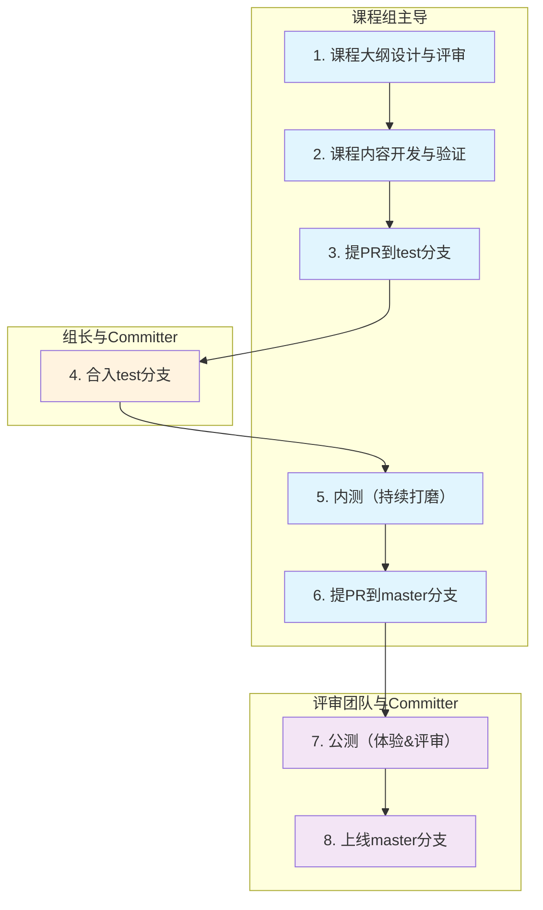

# 新课程上库与流程上线验收标准

适用范围：所有新增或重构后准备合入cann-learning-hub的课程。

用途：PR 作者自检、Reviewer 验收、课程上库准入判断。

---

## 1. 新教程的上线流程

新教程按照“设计开发 → 合入test分支 → 优化打磨 → 合入master分支”四个阶段推进上线，课程组对内容质量负主责，Committer在关键节点把关。

| 步骤 | 核心任务 | 责任方 | 验收关注点 |
| --- | --- | --- | --- |
| 1. 课程大纲设计与评审 | 设计课程大纲并完成内部分层评审 | 课程组 | 明确课程主题、章节规划、学习路径、目标对象，以及初中高级能力递进关系和考核方式。 |
| 2. 课程内容开发与验证 | 开发教程内容并本地验证通过 | 课程组 | 按大纲完成README、章节notebook、答案、images、src等开发，本地运行无误。 |
| 3. 提PR到test分支 | 完成质量自检（AI低错检查 + Checklist自检 + 在线体验环境执行验证），确认全部通过后提PR到 `cann-learning-hub/test` | 课程组 | ① AI检查拼写、格式、语法、链接；② 逐项自检第5章Checklist；③ 在线环境完整执行课程，确保运行正确；④ 同步更新主README（课程简介、学习人群、硬件产品、环境配置、章节目录等）；⑤ 各notebook编写风格保持一致。全部通过后提PR，达到可对外展示的发布级水准。PR同时满足目录结构、命名规范等基础格式要求。 |
| 4. 合入test分支 | 审核内容质量与低错，通过后合入test | 课程组长、Committer | 组长把关知识正确性、章节逻辑、教学深度；Committer检查拼写、语法、格式、链接等低级错误。合入即代表课程组对内容质量认可。 |
| 5. 内测（持续打磨） | 在test分支上持续完善课程内容 | 课程组 | 新增章节、补充案例、优化教学逻辑、调整结构等，按需在在线环境验证，确保不引入新问题。 |
| 6. 提PR到master分支 | 通过本地Git操作选择性合并test分支内容到master，解决冲突后发起PR | 课程组 | 用 `git checkout test -- <文件>`或本地文件迁移的方式仅提取课程文件，排除无关变更；PR描述中附验证结论和合并文件清单。（详见附录说明） |
| 7. 公测（体验&评审） | 评审团队在线体验并评论，Committer执行验证，课程组逐条闭环 | 评审团队、Committer、课程组 | 评审团队提内容/体验改进意见；Committer确保notebook可运行、结果合理；课程组针对反馈逐一修改闭环。 |
| 8. 上线master分支 | Committer审核通过，合入master并发布 | Committer | 所有评论闭环、Committer验证通过，合入master对外发布。 |

以上流程共8个步骤，按“课程组主导 → 组长/Committer准入 → 课程组内测打磨 → 外部评审发布”的节奏推进。为便于直观理解各步骤的流转关系及责任方归属，流程图示例如下：




**图例说明：**

| 图例 | 发起方 | 步骤 |
| --- | --- | --- |
| 🟦 蓝色 | 课程组主导 | 1、2、3、5、6 |
| 🟧 橙色 | 组长 + Committer | 4 |
| 🟪 紫色 | 评审团队 + Committer | 7、8 |

---

## 2. 课程大纲与能力分层设计规范

课程大纲设计应以学习者能力成长为主线，明确以下核心问题：

- **目标人群**：课程面向谁？学习起点是什么？
- **教学目标**：学完后能做什么？达到什么能力水平？
- **设计思路**：如何由浅入深组织章节、实践任务和阶段性成果？
- **趣味性**：如何通过案例、互动、挑战任务等方式提升学习者的参与感和完成成就感？

课程大纲应体现明确的能力分层递进关系（如初级、中级、高级），每个层级需说明覆盖章节、核心能力、典型任务及考核方式。能力分层设计应为后续不同层级的能力认证考试提供依据，确保课程内容、实践任务与认证考核目标保持一致。

以下以 Ascend C 算子开发系列课程为例，展示能力分层设计参考（章节编号不严格代表难度顺序，以能力目标为准）：

| 阶段 | 章节范围 | 能力目标 | 考核方式 |
| --- | --- | --- | --- |
| 初级 | 第 1-2 章 | 理解基础概念，掌握核函数开发、调用方式及简单矢量算子编程方法。 | 选择题检验知识点掌握情况。 |
| 中级 | 第 3-4、7 章 | 掌握工程化算子开发、泛化 Tiling、API 调用算子、矩阵乘法高阶 API 开发及精度调试方法。 | 复杂矢量算子编程实践。 |
| 高级 | 第 5-6、8 章及以后 | 掌握融合算子开发、性能调优方法及开源仓贡献流程。 | 融合算子编程实践。 |

---

## 3. 课程内容验收标准

### 3.1 目录结构规范

每个课程按“课程 → 章节 → 小节”三级组织，目录结构清晰、可定位、可维护。

```text
tutorials/
└── course_name/
    ├── README.md
    ├── 01_chapter_name/
    │   ├── 01.01_chapter_intro.ipynb
    │   ├── 01.02_section_name.ipynb
    │   ├── 01.03_chapter_test.ipynb
    │   ├── answer/
    │   ├── images/
    │   └── src/
    └── 02_chapter_name/
        ├── 02.01_chapter_intro.ipynb
        ├── 02.02_section_name.ipynb
        ├── 02.03_chapter_test.ipynb
        ├── answer/
        ├── images/
        └── src/
```

**命名规范：**
- 目录名、文件名使用英文、数字、下划线，必要时使用点号。
- 章节目录：`0n_abc` 格式，如 `01_introduction`。
- 小节notebook：`0n.0m_abc.ipynb` 格式，如 `01.01_chapter_intro.ipynb`。

**目录结构：**
- 每个课程根目录必须包含主 `README.md`。
- 每个章节目录包含多个notebook及 `answer/`、`images/`、`src/` 三个子目录。


### 3.2 主 README.md 要求

主 README 为课程入口文档，必须包含以下内容：

**① 课程整体简介**：说明课程内容与整体学习目标。

**② 课程适用学习人群**：说明前置知识要求（学习课程、知识储备等）。

**③ 课程支持的硬件产品**：列出全部验证通过的硬件型号，帮助开发者确认适配性。

参考写法如下：
## 软硬件配套说明

| 项目 | 要求 |
| --- | --- |
| 支持硬件 | Atlas A2 训练/推理系列产品、Atlas A3 训练/推理系列产品 |
| CANN 版本 | 9.0.0 及以上 |
| Python | 3.11 |

**④ 已验证的在线体验环境**：列举验证无报错的在线体验环境及配置要求，详见第4节。

**⑤ 课程章节目录**：分章节用表格展示，提供跳转链接。

> 如支持在cann-learning-hub在线体验notebook中执行，在线体验链接由Committer统一配置，课程开发时 `Link` 列填写 `-` 即可。否则给出课程跳转链接即可。


### 3.3 单个章节结构规范

每个章节目录包含多个notebook，结构要求如下：

**第一小节：章节概述**（如 `01.01_chapter_intro.ipynb`）
- 前置要求：所需能力、前置教程/章节、环境要求
- 章节目标：学完后能做到什么
- 章节内容：各小节简介及跳转链接

**最后一小节：章节实践**（如 `01.03_chapter_test.ipynb`）
- 包含客观题（选择/填空）检验知识点掌握情况，以及3道编程实践题（简单、中等、困难各一道）检验综合应用能力。

**中间小节**（按实际内容拆分）
- 必须包含：小节概述 + 教程内容 + 课后练习/实践
- 纯知识点小节 → 选择题/填空题；含代码实操小节 → 代码实践题
- 所有练习与实践均须提供答案或参考实现


### 3.4 Notebook 内容规范

**① 风格统一**：同一课程各notebook风格一致（图片、表格居左对齐，使用HTML `<table>` 格式）。

**② 教程内容**：
- **逻辑清晰**：行文通顺，由浅入深。
- **概念解释**：首次出现的新概念、新工具、新命令、新参数须解释清楚，不得默认学习者已知。
- **图片辅助**：架构、流程、数据流、模型结构、运行结果等复杂内容优先使用图片说明。
- **可执行示例**：正文使用完整可运行的示例代码，工程的创建、依赖安装、代码开发、脚本运行等均在notebook的code cell中执行，学习者无需手动切换文件夹。
- **源码说明**：每个关键源码文件须说明作用。源码较多无法全部展示时，存入`src/`目录，并在notebook中用 `cat`、`tree`、`ls` 等命令展示关键结构和内容。

**③ 课后实践**：
- 须有独立输入、任务说明和答案。
- 实践题操作步骤均在notebook的code cell中执行。
- 工程存于`src/`对应小节目录，待填写文件通过 `%%writefile` 命令提供写入操作。
- 答案通过 `cat` 命令展示。


### 3.5 answer / images / src 目录说明

| 目录 | 用途 |
| --- | --- |
| `images/` | 存放章节配图 |
| `answer/` | 存放课后练习、实践题的答案 |
| `src/` | 存放不便完整写入notebook的工程源码 |

三个目录下可按 `0n.0m_abc` 格式新建子目录，以对应具体小节。

---

## 4. 在线体验环境验证要求

课程必须在目标硬件对应的在线体验环境完成验证，确保学习者可直接打开notebook完成操作。课程开发与验证可参考 [基于 CANNLab 环境开发与提交课程指南](./CANNLab_course_development_guide.md)。

**支持的在线体验环境：**
- gitcode 在线体验 notebook
- CANNLab 云开发环境 / 950 尝鲜体验环境 / CPU 模拟环境

**验证要求：**
- 所有课程须在至少一个 CANNLab 环境开箱即用、运行无报错。验证环境须为**外部开发者可创建的环境**，不得使用内部用户环境或本地环境。
- 算子课程及模型参数量 <0.5B 的课程，同时要求在 cann-learning-hub notebook 可直接运行。
- **【硬性】CANNLab环境须明确指定NPU镜像模板名称和Python内核版本**，并在主README中说明，确保开发者可复现。


参考写法如下：

## 在线体验环境

本教程支持以下在线体验环境：

| 体验环境 | 镜像模板 / 版本 | Python 内核 | 说明 |
| --- | --- | --- | --- |
| cann-learning-hub 在线体验 notebook | cann_9.0.0_py3.11-A2-arm | Python 3.11.15 | 各 Notebook 表格中的"在线体验"链接可直接打开运行 |
| CANNLab 云开发环境 | cann_9.0.0_py3.11-A2-arm | Python 3.11.4 |参考 [CANNLab 环境体验指南](https://gitcode.com/cann/cann-learning-hub/blob/master/docs/CANNLab_env_experience_guide.md)创建CANNLab环境运行notebook |

> **注意：** 如在本地环境离线体验，需自行安装配套的 CANN 软件，具体请参考 [CANN 安装指南](https://www.hiascend.com/document/detail/zh/CANNCommunityEdition/600alpha003/softwareinstall/instg/atlasdeploy_03_0001.html)，选择对应CANN版本文档。
## 5. PR准入Checklist

> 本清单用于课程组在提PR到test分支前逐项自检，全部通过后方可发起PR。可将本清单提供给AI辅助预检，快速定位问题。

| 序号 | 验收项 | 准入要求 | 结果 |
| --- | --- | --- | --- |
| 1 | 命名规范 | 课程目录、章节目录、文件名均为英文、数字、下划线或点号，不包含中文。 | □ 通过  □ 不通过 |
| 2 | 章节命名 | 章节目录命名符合 `0n_abc` 格式。 | □ 通过  □ 不通过 |
| 3 | 小节命名 | 小节 notebook 命名符合 `0n.0m_abc.ipynb` 格式。 | □ 通过  □ 不通过 |
| 4 | 主README | 包含课程整体简介、适用学习人群（含基础要求与前置课程）、支持的硬件产品、已验证的在线体验环境、课程章节目录表格。主README与课程实际内容保持同步。 | □ 通过  □ 不通过 |
| 5 | answer/images/src目录 | 每个章节目录包含 `answer`、`images`、`src` 三个子目录。 | □ 通过  □ 不通过 |
| 6 | 章节概述 | 每个章节第一小节为章节概述，包含前置要求、章节目标、章节内容及小节跳转链接。 | □ 通过  □ 不通过 |
| 7 | 章节实践 | 每个章节最后一小节为章节实践，包含客观题（选择/填空）检验知识点掌握情况，以及3道编程实践题（简单、中等、困难各一道）检验综合应用能力。 | □ 通过  □ 不通过 |
| 8 | 中间小节 | 每个中间小节包含小节概述、教程内容、课后练习或课后实践。 | □ 通过  □ 不通过 |
| 9 | 答案提供 | 所有课后练习、课后实践、章节实践均有答案或参考实现，并放入 `answer` 目录。 | □ 通过  □ 不通过 |
| 10 | 图片引用 | notebook 中适当添加图片辅助讲解，图片位于 `images` 目录并使用相对路径引用。 | □ 通过  □ 不通过 |
| 11 | 风格统一 | 同一课程各 notebook 编写风格保持一致，图片和表格居左对齐（使用 HTML `<table>` 格式）。 | □ 通过  □ 不通过 |
| 12 | 代码执行 | 除纯理论内容外，notebook 中所有代码均可从上到下执行并得到正确结果。 | □ 通过  □ 不通过 |
| 13 | 代码解耦 | 教程正文代码与实践题代码相互解耦。 | □ 通过  □ 不通过 |
| 14 | 源码查看 | 源码较多放入 `src` 时，notebook 中提供 `cat`、`tree`、`ls` 等命令查看、说明关键源码结构和内容。 | □ 通过  □ 不通过  □ 不适用 |
| 15 | 完整操作 | 学习者无需手动到其他目录查找或修改代码即可完成教程。 | □ 通过  □ 不通过 |
| 16 | 行文逻辑 | 教程内容行文通顺，逻辑由浅入深，新概念首次出现时解释清楚。 | □ 通过  □ 不通过 |
| 17 | 运行验证 | 所有 notebook 已在外部开发者可创建的 CANNLab 环境完成实际运行验证（不得使用内部用户环境或本地环境），运行无报错。提PR时在PR描述中附验证结论（含硬件型号、运行环境、在线体验环境和验证结果）。 | □ 通过  □ 不通过 |
| 18 | CANNLab环境配置 | 主README中明确指定 CANNLab 环境的 NPU 镜像模板名称和 Python 内核版本，并附上 CANNLab 环境体验指南链接。 | □ 通过  □ 不通过  □ 不适用 |
| 19 | gitcode notebook | 算子课程和模型参数量 <0.5B 的课程，须在 cann-learning-hub notebook 可直接运行。 | □ 通过  □ 不通过  □ 不适用 |
| 20 | 清理输出 | 提交 PR 前已删除所有 code cell 的输出内容，notebook 中不得保留运行结果。 | □ 通过  □ 不通过 |

**自检说明**：以上所有项须全部通过（含条件项结论明确）后，方可从课程组侧发起合入 test 分支的 PR。

---

## 附录一：课程 PPT 课件上传规范

课程 PPT 课件用于讲师引导式教学，上传时需遵循以下规范：

1. **存放位置**：PPT 文件统一放在课程目录下的 `slides/` 目录中。

   ```text
   course_name/
   └── slides/
       ├── 01_topic_name.pptx
       ├── 02_topic_name.pptx
       └── ...
   ```

2. **文件命名**：使用全英文命名，前置编号固定阅读顺序，格式为 `0n_topic_name.pptx`。
3. **体积控制**：PPT 中的大图片和视频需压缩处理，单个 PPT 文件尽量控制在 5MB 以内。
4. **统一模板**：PPT 必须使用 CANN 社区统一 PPT 模板：[ppt_template.pptx](https://gitcode.com/cann/community/blob/master/templates/ppt_template.pptx)。
5. **主 README 列出课件**：课程主 `README.md` 中使用表格列出并介绍 PPT 课件，参考写法如下：

   ```markdown
   ## 课程内容

   | 序号 | 主题 | 主要内容 | 课件 |
   |---|---|---|---|
   | 01 | 主题名称 | 主要内容概述 | [01_topic_name.pptx](./slides/01_topic_name.pptx) |
   | 02 | 主题名称 | 主要内容概述 | [02_topic_name.pptx](./slides/02_topic_name.pptx) |
   ```
   
---

## 附录二：test → master 选择性合并操作指引

课程组在执行步骤6“提PR到master分支”时，需要将test分支中的课程内容合并到master分支，同时排除test分支上的无关变更（如临时调试代码、测试文件等）。由于test与master两个分支可能存在较大差异，直接通过网页合并不现实，以下提供两种推荐方式。

> **适用场景**：test分支上除了课程内容外，还包含了开发过程中的临时文件、测试notebook、调试脚本等无关内容，需要仅提取课程相关文件合入master。


### 方式一：git checkout 命令（推荐）

使用 `git checkout test -- <文件路径>` 命令，从test分支选择性检出指定文件或目录到当前工作区。

**前提条件：**
- 本地已拉取最新代码，当前在 `master` 分支
- 工作区干净，无未提交的本地修改（可用 `git status` 确认）

**操作示例：**

以 `tutorials/sample_course/` 为例：

```bash
# 1. 切换到 master 分支并确保为最新
git checkout master
git pull origin master

# 2. 从 test 分支检出课程目录（覆盖本地同名文件/目录）
git checkout test -- tutorials/sample_course/

# 3. 查看变更，确认只修改了课程相关文件
git status

# 4. 提交变更
git add tutorials/sample_course/
git commit -m "feat: 从 test 分支合并 sample_course 课程内容"

# 5. 推送到远程 master
git push origin master
```

**精细控制示例（仅合并部分文件）：**

```bash
# 只合并 README 和第一章内容
git checkout test -- tutorials/sample_course/README.md
git checkout test -- tutorials/sample_course/01_introduction/
```

**冲突处理：**

如果 master 分支上该课程已有旧版本内容，执行检出后可能出现冲突：

```bash
# 查看冲突文件
git status

# 手动编辑冲突文件，保留需要的版本后
git add <冲突文件>
git commit -m "merge: 解决 sample_course 合并冲突"
git push origin master
```

**预先查看差异：**

```bash
# 对比 test 与 master 的差异
git diff test -- tutorials/sample_course/
```


### 方式二：本地文件迁移（适合不熟悉Git命令的开发者）

通过操作系统文件复制的方式，手动将课程文件从test分支工作区复制到master分支工作区。

**操作示例：**

```bash
# 1. 先切换到 test 分支，将课程文件复制到临时目录
git checkout test
mkdir -p /tmp/course_migration
cp -r tutorials/sample_course/ /tmp/course_migration/

# 2. 切换到 master 分支
git checkout master
git pull origin master

# 3. 从临时目录复制课程文件到工作区
cp -r /tmp/course_migration/sample_course/ tutorials/

# 4. 查看变更并提交
git status
git add tutorials/sample_course/
git commit -m "feat: 合并 sample_course 课程内容"
git push origin master
```


### 关键提醒

| 事项 | 说明 |
| --- | --- |
| ⚠️ 覆盖风险 | `git checkout test -- <文件>` 会**直接覆盖**工作区同名文件，操作前确认 master 分支上没有未提交的修改。 |
| ✅ 操作前检查 | 先执行 `git status` 确认工作区干净，再执行检出操作。 |
| 🔍 谨慎确认 | 合并前执行 `git diff test -- <文件路径>` 可预先查看变更差异。 |
| 💡 替代命令 | 若 `git checkout` 命令在较新版本Git中已弃用，可使用 `git restore --source=test -- <文件>` 替代。 |

