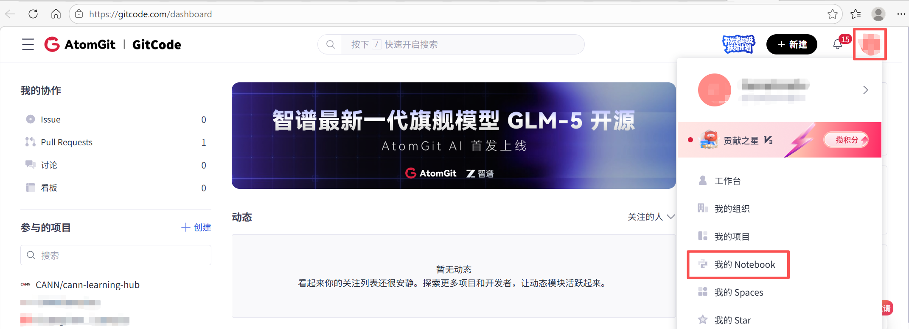
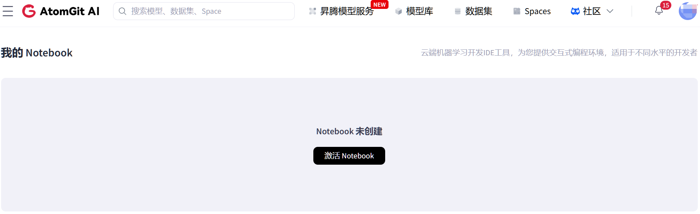
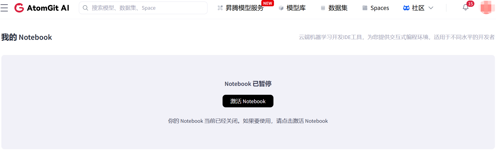
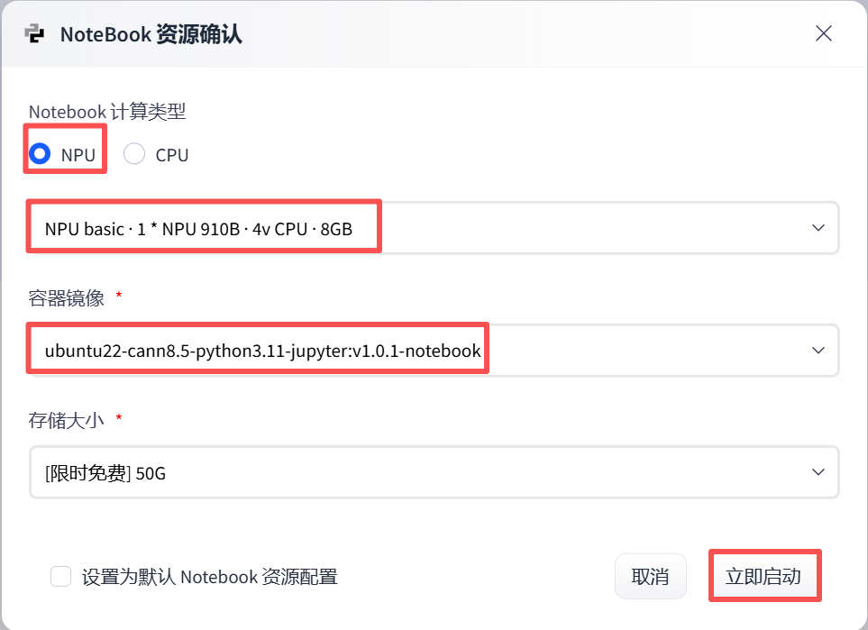
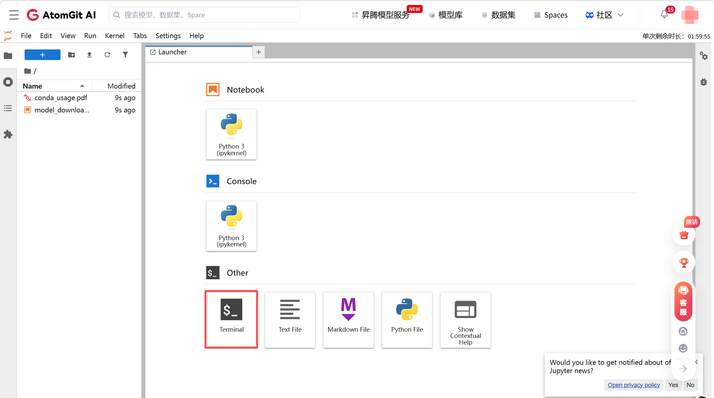
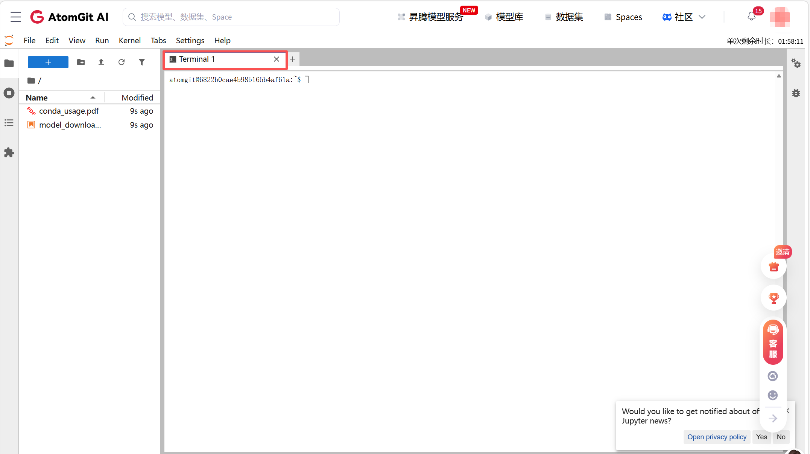
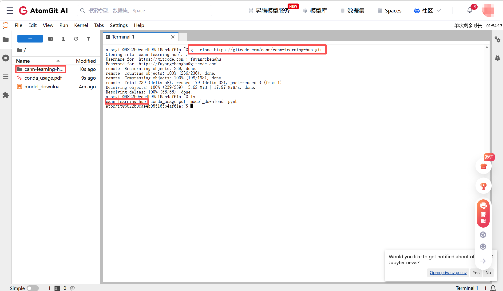
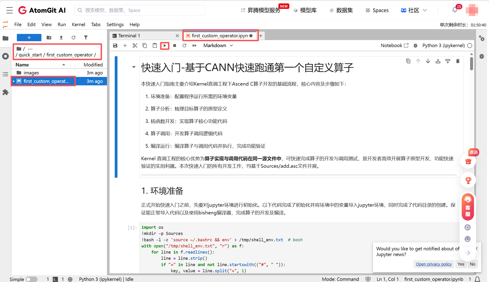

# gitcode环境体验指南
GitCode 提供免费 Notebook 在线开发环境，支持开发者快速运行与体验本仓库教程。本指南将详细介绍基于该环境的学习与使用流程。

**注意：gitcode环境单次仅可使用两小时，两小时后回自动关闭，需要重新启动，请注意文件备份！**

## 1. 创建Notebook开发环境

### 1.1 进入GitCode平台Notebook创建页面
在[GitCode主页](https://gitcode.com/)，点击右上角“个人中心-我的Notebook”进入Notebook的管理页面。



### 1.2 激活并启动Notebook实例
在**我的Notebook页面**选择“**激活Notebook**”，
- 如果之前未创建过notebook，该页面显示为**Notebook未创建**，选择**激活Notebook**”，如下图：

    

- 如果之前已创建过notebook，该页面显示为**Notebook已暂停**，同样选择**激活Notebook**”，如下图：

    

在Notebook资源确认界面中创建并启动一个新的Notebook，其配置如下:
- Notebook计算类型：“NPU”，“NPU basic · 1 * NPU 910B · 4v CPU · 8GB”。
- 容器镜像：“ubuntu22-cann8.5-python3.11-jupyter:v1.0.1-notebook”。

配置完成之后”立即启动”，如图所示：



### 1.3 启动Notebook进入开发环境
当上一步创建并启动好Notebook时，即可进入环境页面。



可点击**Terminal**打开终端。如下图：



## 2. 体验教程

### 2.1 下载cann-learning-hub
在terminal中执行以下语句下载cann-learning-hub仓库。
```
git clone https://gitcode.com/cann/cann-learning-hub.git
```

下载完成后，在左侧目录中也会出现仓库文件夹，如下图：



### 2.2 打开ipynb教程文件开始体验
接下来可以自行打开文件夹，选择需要的教程并进行体验。

以**cann-learning-hub/quick_start/first_custom_operator/first_custom_operator.ipynb**文件为例，如下图：

