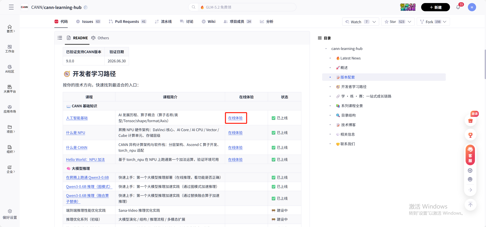
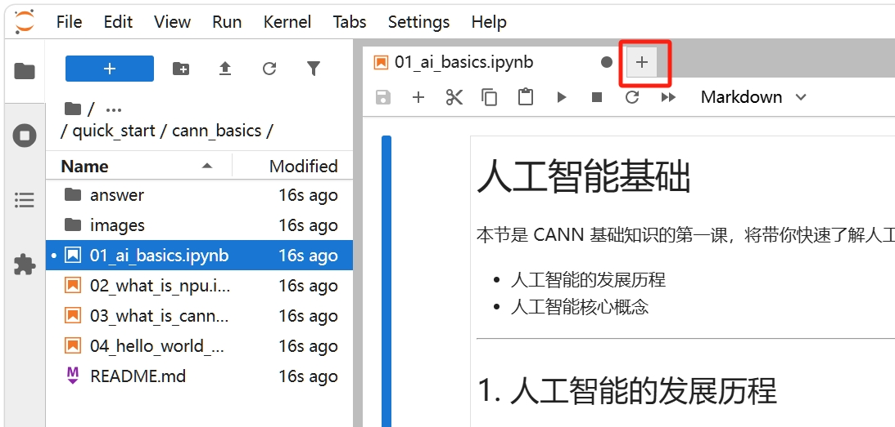
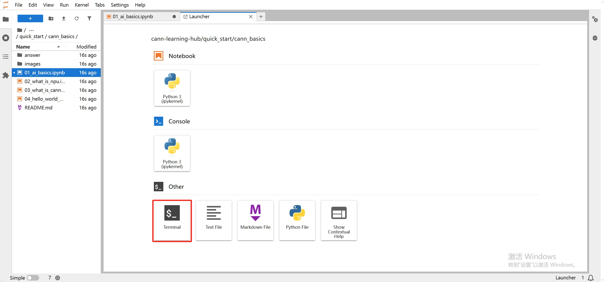
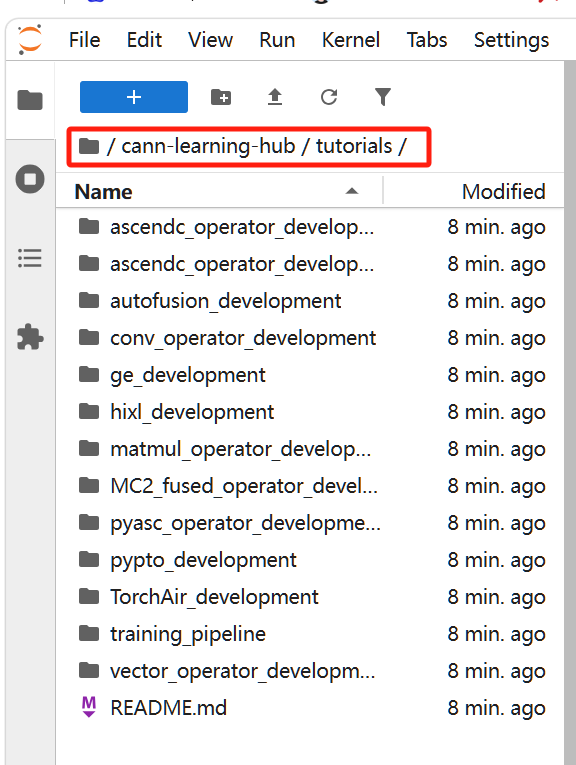

# Test分支课程体验指导书

## 1. 打开在线体验环境

点击 [cann-learning-hub](https://gitcode.com/cann/cann-learning-hub) 仓库中任一课程的在线体验链接，进入 Notebook 在线体验环境：



## 2. 切换到 test 分支

点击页签右侧的加号：



在弹出菜单中选择打开 Terminal 终端界面：



此时终端界面显示的路径位于 `cann-learning-hub` 子目录下，但该目录并非 Git 仓库，无法直接切换分支。请执行以下命令，完成仓库克隆并切换到 test 分支：

```
cd
rm -rf cann-learning-hub/
git clone https://gitcode.com/cann/cann-learning-hub.git
cd cann-learning-hub/
git checkout test
git branch
```

## 3. 体验课程

从左侧菜单栏点击进入 `cann-learning-hub` 仓库，即可体验 test 分支下的所有课程内容。



> **说明**：以上为支持 Notebook 在线体验环境的课程体验指导。如课程需在 950 环境进行在线体验，只需将第一步替换为打开 950 在线体验环境即可。
