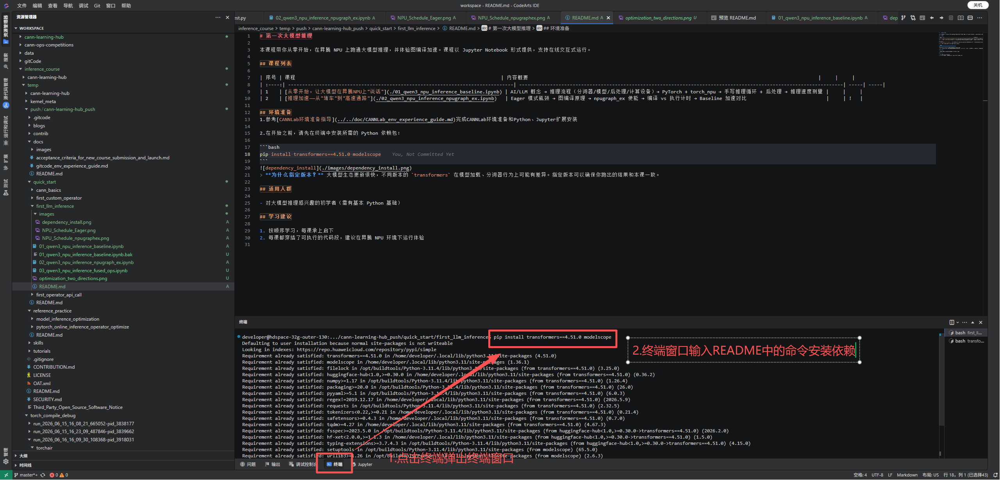

# 第一次大模型推理

本课程带你从零开始，在昇腾 NPU 上跑通 Qwen3-0.6B 大模型推理，并体验图编译加速。课程以 Jupyter Notebook 形式提供。

## 课程列表
| 序号 | 课程　　　　　　　　　　　　　　　　　　　　　　　　　　　　　　　　　　　　　　　　　| 内容概要　　　　　　　　　　　　　　　　　　　　　　　　 |
| :----:| ---------------------------------------------------------------------------------------| ----------------------------------------------------------|
| 1　　| [从零开始，让大模型在昇腾NPU上"说话"](./01_qwen3_npu_inference_baseline.ipynb)　　　　| 介绍AI和大模型的基本概念，并带同学初步体验大模型推理　　 |
| 2　　| [推理加速——从"堵车"到"高速通路"](./02_qwen3_npu_inference_npugraph_ex.ipynb)　　　　　| 介绍大模型推理加速方式，并使用图编译的方式加速大模型推理 |
| 3　　| [融合算子替换 —— 把"小车队"合并成"超级大巴"](./03_qwen3_npu_inference_fused_op.ipynb) | 介绍大模型推理融合算子替换的加速方式　　　　　　　　　　 |

## 环境准备
1.参考[CANNLab环境准备指导](../../docs/CANNLab_env_experience_guide.md)完成CANNLab环境准备和Python、Jupyter扩展安装

2.在开始之前，请先在终端中安装所需的 Python 依赖包：

```bash
pip install transformers==4.51.0 modelscope einops==0.8.2 accelerate==1.14.0
```

> **为什么指定版本？** 大模型生态更新很快，不同版本的 `transformers` 在模型加载、分词器行为上可能有差异。指定版本可以确保你跑出的结果和本课一致。

## 适用人群

- 对大模型推理感兴趣的初学者（需有基本 Python 基础）

## 学习建议

1. 按顺序学习，每课承上启下
2. 每课都穿插了可执行的代码段，建议在昇腾 NPU 环境下运行体验
