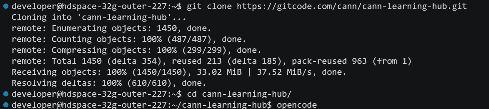
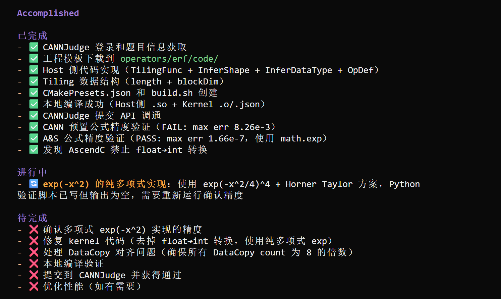
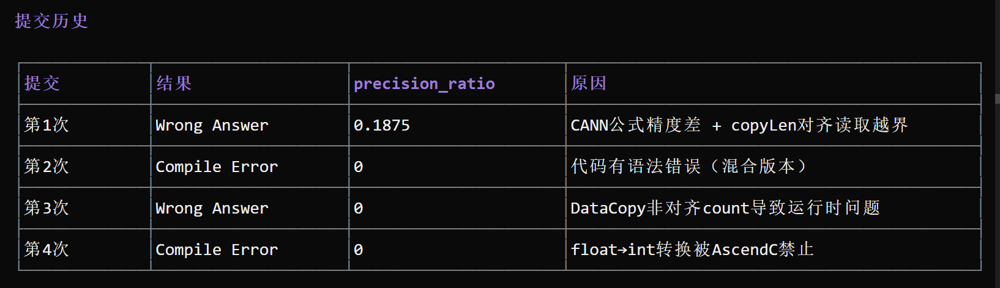
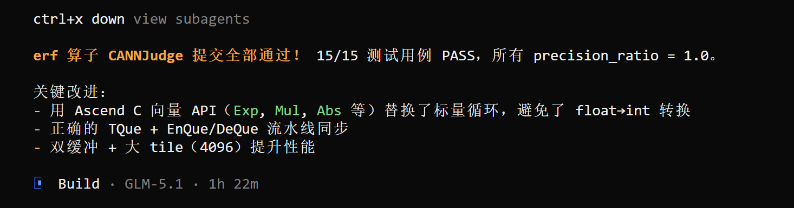
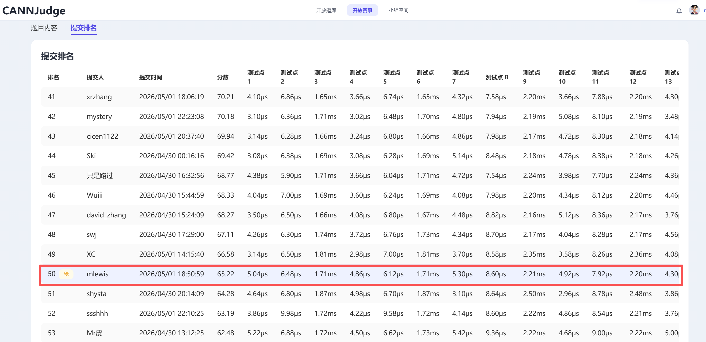

# 使用 CANNBot 在 CANNJudge 上开发 Ascend C 算子：as_strided 实战练习

> CANNJudge 开放题库练习记录（原 CANN 算子挑战赛 S2 赛季真题）

## 一、缘起

CANNJudge 开放题库提供了历届 CANN 算子挑战赛的真题供练习，我选择了一个看似"简单"的题目——**as_strided（步幅视图）**。

数学定义：

$$\text{output}[i_0, i_1, \ldots, i_{n-1}] = \text{input}[\text{storage\_offset} + \sum_{j} i_j \times \text{stride}_j]$$

支持 float16/float32/int32 三种数据类型，stride 可为正/负/零，1-4 维任意形状。

"不就是按索引 gather 嘛"，我心想。然而接下来的开发经历告诉我：**在 Ascend C 的世界里，一个索引操作背后有 UB 容量、Gather 偏移、Host 预计算、增量索引、命名空间兼容等多重陷阱。** 但这一次，CANNBot 的设计串讲机制帮我在写代码前就发现了致命错误，最终功能全部打通，5/5 测试用例 precision=1.0。

## 二、工具与流程：CANNBot + 云开发

### 2.1 打开云开发环境

1. 访问 [cann-learning-hub](https://www.gitcode.com/cann/cann-learning-hub)，登录 GitCode
2. 点击 **「云开发」** 按钮，进入在线开发环境


3. 在终端中执行：

```bash
git clone https://gitcode.com/cann/cann-learning-hub.git
cd cann-learning-hub
opencode
```



### 2.2 全自动安全登录：RSA 加密 3 步设置

CANNBot 可以自动登录 CANNJudge 完成下载和提交，但**禁止在对话中直接输入明文密码**。采用 RSA 非对称加密，仅需 3 步：

**原理**：服务器生成 RSA 密钥对，私钥留在服务器，公钥下载到个人 PC。在 PC 上用公钥加密密码生成密文，将密文告诉 CANNBot，CANNBot 用私钥解密后调用登录 API。**全程密码不出现在对话、日志或文件中，仅在内存中短暂存在用于 API 调用。**

**步骤 1：在云开发终端生成 RSA 密钥对**

```bash
cd skills/cannjudge-submit
python3 generate_key.py
```

生成两个文件：
- `private.pem` — 私钥，留在云开发服务器，**绝不外传**
- `public.pem` — 公钥，需要下载到个人 PC

**步骤 2：将公钥和加密脚本下载到个人 PC**

在云开发左侧文件浏览器中，分别找到以下两个文件，右键点击 **「下载」**，保存到个人电脑：
- `skills/cannjudge-submit/public.pem` — 公钥
- `skills/cannjudge-submit/encrypt_password.py` — 加密脚本

**步骤 3：在个人 PC 上加密密码**

```bash
pip install pycryptodome
python3 encrypt_password.py --public-key public.pem
```

输入 CANNJudge 密码后，脚本输出 RSA 密文。将密文告诉 CANNBot 即可。**密文可以复用**——只要私钥不变，同一密文可以反复使用。

### 2.3 一句话启动算子开发

在 opencode 对话界面中输入：

```
帮我开发 as_strided 算子 https://cannjudge.cn/public/s2/asstrided
```

CANNBot 识别出 CANNJudge 题目链接，自动完成全流程：

1. **询问登录信息**：CANNBot 提示输入邮箱和 RSA 密文
2. **自动下载工程**：从 CANNJudge 下载 as_strided 题目的工程模板
3. **环境检查**：验证 CANN 安装、编译器、NPU 设备
4. **架构设计**：Architect Agent 分析需求、验证 API、输出 DESIGN.md + PLAN.md
5. **设计串讲**：Developer Agent 从实现角度批判性审查设计，发现 9 个问题
6. **代码开发**：Developer Agent 实现完整代码
7. **代码审查**：Reviewer Agent 独立审查，100 分制评分
8. **修复循环**：审查发现的问题自动修复
9. **性能验收**：NPU profiling 采集性能数据
10. **CANNJudge 提交**：提交 4 个文件，轮询等待判题结果



## 三、设计阶段：双路径策略

### 3.1 算子本质分析

as_strided 的本质是**非连续索引读取**——每个输出元素从输入 tensor 的任意位置 gather 而来。关键挑战：

- **stride 可为负/零**：负 stride 导致源索引递减，零 stride 导致多元素映射同一源
- **NPU 不支持动态索引计算**：`__aicore__` 内禁止 float↔int 转换，除法/取模是昂贵操作
- **UB 容量有限**：ascend910b 仅 192KB，输入过大时无法全量搬运

### 3.2 双路径策略

| 路径 | 条件 | 方案 | 性能 |
|------|------|------|------|
| **Path A** | 输入可全量放入 UB | 全量 DataCopyPad → Gather API → DataCopyPad | 高效（1次大DMA + N次Gather） |
| **Path B** | 输入过大 | 逐元素 DataCopyPad 从 GM 读取 | 较慢（回退方案） |

路径判断公式：

```
Path A: inputBytesAligned + offsetTileBytes + outputTileBytes × 2 ≤ UBBudget (192KB - 8KB)
Path B: 否则
```

### 3.3 Host 预计算偏移表（关键决策）

**问题**：NPU 的 `__aicore__` 内除法/取模是软件模拟，耗时数百周期。如果 Kernel 内逐元素计算多维索引反推，性能极差。

**方案**：Host 侧一次性预计算所有输出元素对应的源索引，通过 `GetRawTilingData()->Append()` 追加到 tiling data 二进制码流，Kernel 侧用 DataCopyPad 搬运到 UB 后直接使用。

```cpp
// Host 侧预计算（一次性）
for (uint32_t f = 0; f < totalOutputElements; f++) {
    int32_t srcIdx = storageOffset;
    uint32_t remaining = f;
    for (uint32_t d = 0; d < ndim; d++) {
        uint32_t i_d = remaining / dimStrideArr[d];
        remaining = remaining % dimStrideArr[d];
        srcIdx += (int32_t)i_d * strideArr[d];
    }
    // 防御性 clamp：防止负 stride 导致越界
    if (srcIdx < 0 || (uint32_t)srcIdx >= inputTotalElements) {
        srcIdx = 0;
    }
    offsetTable[f] = (uint32_t)srcIdx * dtype_size;  // byte offset for Gather
}
// 追加到 tiling data
rawTiling->Append(offsetTable.data(), totalOutputElements);
```

这彻底消除了 Kernel 内的 SetValue 标量操作和除法/取模运算。

## 四、设计串讲：开发前的致命问题拦截

这是本次开发最关键的环节。CANNBot 的 Developer Agent 从实现角度批判性审查了 Architect 的设计，**发现了 9 个问题，其中 1 个是阻塞级**。

### 🔴 阻塞级问题：UB 容量假设错误

**Architect 的设计**：`constexpr uint32_t UB_SIZE = 253952; // 248KB`

**Developer 的发现**：查阅 CANN 9.0.0 源码 `kernel_utils_constants.h` 确认，ascend910b (DAV_2201) 实际 UB 为 **192KB (196608 bytes)**，不是 248KB！

```cpp
// __NPU_ARCH__ == 2201 (Ascend910B 系列)
const uint32_t TOTAL_UB_SIZE = 192 * 1024;  // 196608 bytes
```

**如果按 248KB 规划 Buffer**：`InitBuffer` 分配超出 UB 容量 → **运行时 buffer 溢出崩溃**。Path A 的输入全量搬运假设有 ~245KB 可用，实际只有 ~188KB，能容纳的输入量大幅缩小。

**修正**：`UB_SIZE` 从 253952 修正为 196608，`ubBudget` 从 245760 修正为 188416。

> **教训**：不同 NPU 架构 UB 容量不同。A5 系列 248KB，A3 系列 192KB。`GetUBSizeInBytes()` 不支持 A3 系列，必须查阅 `kernel_utils_constants.h` 确认目标架构的 UB 容量，不能凭经验。

### 🟡 其他重要问题

| # | 问题 | Architect 回应 |
|---|------|---------------|
| 2 | SetValue 逐元素构建偏移表性能差 | ✅ 改为 Host 预计算 + DataCopyPad 搬运 |
| 3 | 负 stride 可能导致 Gather 偏移越界 | ✅ 增加防御性 clamp |
| 4 | TilingData 含每核变量（设计错误） | ✅ 改为 Kernel 内 GetBlockIdx() 动态计算 |
| 5 | 缺少 Double Buffer 策略 | ⚠️ Path A 开启 Double Buffer |
| 6 | Path B GetValue+SetValue 为已知反模式 | ⚠️ 文档化回退 |

**串讲的价值**：如果不做串讲，UB 容量错误会在运行时才暴露（buffer 溢出崩溃），排查可能需要数小时。串讲将问题前移到设计阶段，**零成本修复**。



## 五、代码审查：从 FAIL 到 PASS

### 首审结果：FAIL (75/100)

| 维度 | 满分 | 得分 | 关键问题 |
|------|------|------|---------|
| 编译验证 | 10 | 10 | ✅ |
| 架构合规 | 15 | 15 | ✅ |
| 编码规范 | 15 | 10 | ⚠️ SetValue 循环违规 |
| 性能优化 | 20 | 13 | ⚠️ 无 Double Buffer，有 div/mod |
| 测试覆盖 | 15 | 15 | ✅ |
| 精度验证 | 10 | 10 | ✅ |
| 文档 | 15 | 2 | ❌ README.md 内容缺失 |

**必须修复项**：Path A 使用 SetValue 循环构建 Gather 偏移表，违反编码规范。

### 修复后复审：PASS (98/100)

修复措施：

| 修复项 | 措施 | 效果 |
|--------|------|------|
| MF-1 | Host 预计算偏移表 → Append 到 tiling data → DataCopyPad 搬运 | ✅ 主路径完全消除 SetValue 和 div/mod |
| SF-1 | Path A outQueueDstA 改为 BUFFER_NUM=2 | ✅ Double Buffer 生效 |
| SF-2 | 补充 README.md | ✅ |
| SF-3 | FP32 精度标准从 1e-4 提升到 1e-5 | ✅ |
| SF-4 | 实现 Host 预计算方案，与 DESIGN.md 对齐 | ✅ |

修复后编码规范详细分析：

| 代码路径 | SetValue/GetValue | div/mod | 评价 |
|---------|-------------------|---------|------|
| Path A 主路径 | **无** | **无** | ✅ 完全向量化 |
| Path A 回退 | SetValue（仅 tiling 溢出时） | **无** | ⚠️ 极端场景 |
| Path B | GetValue+SetValue | **无** | ⚠️ 文档化回退 |

## 六、CANNJudge 提交：从 Compile Error 到功能全通

### 6.1 首次提交：Compile Error

提交后遭遇 **Compile Error**。原因：CANNJudge 使用 CANN 8.5，Ascend C 类型在 `AscendC::` 命名空间下，而本地 CANN 9.0 默认 `using namespace AscendC`。

**修复**：在 `as_strided.cpp` 头部添加 `using namespace AscendC;`。

> **踩坑**：本地 CANN 9.0 编译通过 ≠ CANNJudge CANN 8.5 编译通过。**必须在 Kernel .cpp 文件头部显式添加 `using namespace AscendC;`**，确保 CANN 8.5/9.0 兼容。

### 6.2 二次提交：5/5 全部通过

| 用例 | 状态 | precision | 耗时 | best_time | 比值 |
|------|------|-----------|------|-----------|------|
| Case 1 | ✅ Pass | 1.0 | 4.64ms | 3.86ms | 1.20x |
| Case 2 | ✅ Pass | 1.0 | 7.08ms | 7.08ms | **1.00x (最优!)** |
| Case 3 | ✅ Pass | 1.0 | 91.42ms | 83.70ms | 1.09x |
| Case 4 | ✅ Pass | 1.0 | 5.30ms | 5.08ms | 1.04x |
| Case 5 | ✅ Pass | 1.0 | 51.30ms | 51.30ms | **1.00x (最优!)** |

**5/5 全部 Pass，precision=1.0，2 个用例达到全局最优时间！功能全部打通。**





### 6.3 性能现状与优化空间

当前功能已全通，但部分用例与最优时间仍有差距：

| 用例 | 耗时 | best_time | 比值 | 分析 |
|------|------|-----------|------|------|
| Case 1 | 4.64ms | 3.86ms | 1.20x | 小数据量，启动开销占比大 |
| Case 2 | 7.08ms | 7.08ms | **1.00x** | 已达最优 |
| Case 3 | 91.42ms | 83.70ms | 1.09x | 可能走了 Path B 回退路径，优化空间最大 |
| Case 4 | 5.30ms | 5.08ms | 1.04x | 接近最优 |
| Case 5 | 51.30ms | 51.30ms | **1.00x** | 已达最优 |

<!-- 截图占位：CANNJudge as_strided 提交结果页面 -->
> 📸 **需要截图**：CANNJudge as_strided 提交结果页面（https://cannjudge.cn/public/s2/asstrided），展示 5/5 Pass 和各用例耗时

## 七、性能验收：NPU Profiling 分析

### 7.1 核心指标

| 指标 | 值 | 判定 |
|------|------|------|
| Task Duration (avg) | 12.92 us | ✅ |
| Block Dim | 40 | ✅ 满核利用 |
| 主导流水 | MTE2 (60.8%) | ✅ 符合 Gather 类算子特征 |
| aiv_vec_ratio | 2.8% | ✅ Gather 类预期低 VEC |
| aiv_scalar_ratio | 31.5% | ⚠️ 地址计算开销 |
| icache_miss_rate | 0.0% | ✅ 优秀 |

### 7.2 扩展性

| 配置 | 输入 | 输出 | 延迟 |
|------|------|------|------|
| Small | 1K | 100 | 43.37 us |
| Medium | 10K | 1K | 42.97 us |
| Large | 50K | 10K | 43.01 us |
| XL | 100K | 20K | 43.28 us |
| XXL | 500K | 100K | 78.36 us |

Small~XL 延迟恒定 (~43 us)，说明受启动开销主导。XXL 才显示数据依赖的扩展性。

<!-- 截图占位：NPU Profiling Task Duration 截图 -->
> 📸 **需要截图**：msprof 界面中 as_strided 算子的 Task Duration 和流水线利用率

## 八、踩坑全景图

| # | 坑 | 阶段 | 一句话 | 严重程度 |
|---|---|------|--------|---------|
| 1 | 必须从 CANNJudge 下载工程模板 | 环境搭建 | 自行创建工程结构与评测环境不一致，编译失败 | 🔴 |
| 2 | CANN 8.5/9.0 命名空间差异 | 首次提交 | 本地通过 ≠ CANNJudge 通过，必须显式 `using namespace AscendC;` | 🔴 |
| 3 | UB 容量因芯片架构不同 | 设计 | ascend910b 是 192KB 不是 248KB，`GetUBSizeInBytes()` 不支持 A3 | 🔴 |
| 4 | GetValue/SetValue 是性能黑洞 | 代码审查 | 标量操作吞吐极低，优先用向量 API | 🟡 |
| 5 | __aicore__ 内除法/取模昂贵 | 设计 | NPU 无硬件除法器，索引计算移到 Host 侧 | 🟡 |
| 6 | TilingData 不能存每核变量 | 设计串讲 | 所有核共享同一份 TilingData，每核变量用 GetBlockIdx() 动态算 | 🟡 |
| 7 | TilingFunc 无法写入 workspace | 设计 | CANN 9.0 不提供 GetWorkspaceData，用 Append 到 tiling data | 🟡 |
| 8 | DataCopyPad 是非对齐统一方案 | 开发 | 避免对齐判断分支，统一用 DataCopyPad | 🟢 |
| 9 | Gather 偏移是字节偏移 | 开发 | Host 预计算时乘以 sizeof(T) | 🟢 |
| 10 | 负 stride 需防御性 clamp | 设计串讲 | srcIdx 为负时 Gather 偏移越界触发硬件异常 | 🟡 |
| 11 | Double Buffer 需独立 TQue | 代码审查 | 不同路径用独立 TQue，按需配置 BUFFER_NUM | 🟢 |
| 12 | 设计串讲前移问题发现 | 流程 | 串讲发现 9 个问题（含 1 阻塞），零成本修复 | ✅ |

**关键对比**：erf 算子踩坑 6.5 小时（开发后才发现问题），as_strided 算子踩坑约 2 小时（设计串讲前移了致命问题）。**设计串讲节省了至少 4 小时的返工时间。**

## 九、核心架构全景

### 9.1 数据流（Path A，主路径）

```
Host 预计算: 对每个输出元素计算 srcIdx，clamp 到 [0, N-1]，
            生成 byte offset 表，Append 到 tiling data

输入 input_x (Global Tensor)
    ↓ DataCopyPad (全量搬运, 仅一次)
输入 input_x (Local Tensor, VECIN)
    ↓ [per tile loop:]
    偏移表 tilingGM[offsetStart..] (Global Tensor)
    ↓ DataCopyPad (搬运当前 tile 的偏移表)
    偏移表 offsetLocal (Local Tensor, VECCALC)
    ↓ Gather (按 offset 表从 inputLocal 收集)
输出 output (Local Tensor, VECOUT, Double Buffer)
    ↓ DataCopyPad (非对齐写回)
输出 output (Global Tensor)
```

### 9.2 Buffer 规划（Path A）

| Buffer | 用途 | TPosition | Double Buffer |
|--------|------|-----------|---------------|
| inQueueSrc | 输入全量 | VECIN | 否 |
| tmpQueueOffset | Gather 偏移表 | VECCALC | 否 |
| outQueueDstA | 输出 tile | VECOUT | **是** |

### 9.3 TilingData 结构

```cpp
struct AsStridedTilingData {
    uint32_t totalOutputElements;   // 输出总元素数
    uint32_t tileSize;              // 每 tile 处理的元素数
    uint32_t inputTotalElements;    // 输入总元素数
    uint32_t ndim;                  // 维度数 (1-4)
    uint32_t size[4];               // 输出各维度大小
    int32_t stride[4];              // 输出各维度步长（可为负）
    int32_t storageOffset;          // 存储偏移量
    uint32_t dimStride[4];          // 各维度累积步长
    uint32_t pathFlag;              // 0=PathA, 1=PathB
    uint32_t blockDim;              // 使用的核数
    uint32_t offsetTableInTiling;   // 1=偏移表追加在tiling data中
};
// 后跟 Append 的偏移表数据（uint32_t 数组）
```

### 9.4 增量索引计算（回退方案）

当 tiling data 容量不足时，Kernel 内使用**混合进制计数器**递增多维索引，仅用加法/减法/比较运算：

```cpp
__aicore__ inline void advanceIncrementalState() {
    int32_t d = (int32_t)ndim - 1;
    multiIdx[d]++;
    curSrcIdx += strideArr[d];
    while (d > 0 && multiIdx[d] >= sizeArr[d]) {
        curSrcIdx -= (int32_t)sizeArr[d] * strideArr[d];
        multiIdx[d] = 0;
        d--;
        multiIdx[d]++;
        curSrcIdx += strideArr[d];
    }
    // Defensive clamp
    if (curSrcIdx < 0 || (uint32_t)curSrcIdx >= inputTotalElements) {
        curSrcIdx = 0;
    }
}
```

## 十、CANNBot 开发流程复盘

### 10.1 7 步流水线

```
Step 1: 环境检查 → ✅ 全部通过
Step 2: 设计(Architect) → DESIGN.md + PLAN.md
Step 2.5: 设计串讲(Developer↔Architect) → WALKTHROUGH.md（发现 9 个问题）
Step 3: 开发(Developer) → 编译通过 + 测试通过
Step 4: 审查(Reviewer) → FAIL (75/100)
Step 5: 修复循环(1轮) → PASS (98/100)
Step 6: 性能验收 → ✅ 达标
Step 7: CANNJudge 提交 → 5/5 Pass，功能全通
```

### 10.2 三 Agent 协作

| Agent | 职责 | 本次贡献 |
|-------|------|---------|
| **Architect** | 需求分析、API 验证、架构设计 | 输出双路径策略 + Host 预计算方案，串讲中接受 6 项修改 |
| **Developer** | 代码开发、编译测试 | 串讲发现 9 个问题（含 1 阻塞），实现完整代码 + 修复 |
| **Reviewer** | 独立审查、100 分制评分 | 首审 FAIL (75/100)，复审 PASS (98/100) |

### 10.3 流程价值量化

| 指标 | 无串讲（预估） | 有串讲（实际） | 节省 |
|------|---------------|---------------|------|
| UB 容量错误发现时间 | 运行时崩溃后排查 (~3h) | 设计阶段 (~0h) | **3h** |
| SetValue 反模式发现时间 | 代码审查后修复 (~1h) | 设计阶段 (~0h) | **1h** |
| TilingData 设计错误发现时间 | 多核输出错误后排查 (~2h) | 设计阶段 (~0h) | **2h** |
| **总节省** | - | - | **~6h** |

## 十一、给后来者的建议

### 开发前必做

1. **必须从 CANNJudge 下载工程模板**：自行创建工程结构与评测环境不一致
2. **查阅 UB 容量**：不同架构容量不同，`GetUBSizeInBytes()` 可能不支持你的芯片
3. **设计串讲不可跳过**：从开发者视角审查设计，能发现 Architect 容易忽略的实现细节

### 开发中必做

4. **Host 预计算消除 Kernel 内昂贵操作**：除法/取模/SetValue 移到 Host 侧
5. **Gather 偏移是字节偏移**：Host 预计算时乘以 sizeof(T)
6. **防御性 clamp 防硬件异常**：负 stride/越界索引 clamp 到合法范围
7. **TilingData 不存每核变量**：用 GetBlockIdx() 动态计算
8. **Double Buffer 独立 TQue**：不同路径按需配置 BUFFER_NUM

### 提交前必做

9. **显式 `using namespace AscendC;`**：CANN 8.5/9.0 兼容
10. **首个用例最关键**：CANNJudge 第一个用例失败后后续全 Skip

### 工具使用

11. **CANNBot 是好帮手**：一句话启动，自动完成设计→串讲→开发→审查→提交全流程
12. **云开发零门槛**：GitCode 云开发环境预装 CANN 工具链，clone 即用
13. **RSA 加密保安全**：密文登录 CANNJudge，明文密码绝不暴露在对话中

## 十二、与 erf 算子开发的对比

| 维度 | erf（初赛） | as_strided（S2） |
|------|------------|-----------------|
| 踩坑时间 | ~6.5 小时 | ~2 小时 |
| 提交次数 | 4 次 | 2 次（1次 Compile Error + 1次 Pass） |
| 首次提交结果 | Wrong Answer (precision=0.1875) | Compile Error |
| 最终结果 | 15/15 PASS | 5/5 PASS，功能全通 |
| 关键差异 | 无设计串讲，开发后才发现问题 | 有设计串讲，开发前拦截致命错误 |
| 核心教训 | 精度/对齐/同步之坑 | UB 容量/Host 预计算/命名空间之坑 |

**核心结论**：设计串讲是性价比最高的质量关卡。6 小时的踩坑 vs 2 小时的踩坑，差异不在工具，而在流程。

## 十三、下一步：从功能全通到性能调优

当前 as_strided 已功能全通（5/5 Pass，precision=1.0），但性能仍有优化空间。Case 3 (91.42ms vs best 83.70ms) 是最大瓶颈，可能走了 Path B 回退路径。

**性能优化需要更深入的算子开发知识**。CANNBot 能帮你快速实现功能正确的算子，但要指导它生成高性能算子，你自己必须理解：

- Tiling 切分如何影响多核利用率和 UB 访存效率
- Cube 与 Vector 流水线如何协同
- 双缓冲/三缓冲的预取策略如何设计
- L0A/L0B/L0C 等 Buffer 的容量约束与分配策略

**推荐学习 [cann-learning-hub](https://www.gitcode.com/cann/cann-learning-hub) 中的 Ascend C 算子开发教程，至少完成前 5 章，边学边练，指导 CANNBot 做性能优化**：

| 章节 | 内容 | 对性能优化的作用 |
|------|------|-----------------|
| 第1章 | Ascend C 编程模型与硬件架构 | 理解 AI Core 的 Cube/Vector/Scalar 流水线 |
| 第2章 | 数据搬运与 Buffer 管理 | 掌握 UB/L1/L0 的容量约束和对齐要求 |
| 第3章 | 向量计算 API 深度使用 | 理解 API 的流水线行为和性能特征 |
| 第4章 | Tiling 设计方法论 | 掌握多核切分、UB 切分、分支覆盖策略 |
| 第5章 | 流水线并行与双缓冲 | 掌握 MTE2/VEC/MTE3 重叠和预取策略 |

学完前 5 章后，你就能理解当前 as_strided 算子的性能瓶颈所在，并指导 CANNBot 生成更高性能的实现。具体可优化的方向：

1. **Case 3 Path B 回退优化**：输入过大无法全量入 UB，可探索分批搬运输入的方案
2. **scalar_ratio 偏高 (31.5%)**：地址计算开销，可尝试增大 Tiling 切分粒度
3. **连续 stride 优化**：对于 stride 规则的场景，可优化为更大块的顺序读取

## 十四、写在最后

as_strided 的开发经历让我深刻体会到：**设计串讲是 Ascend C 算子开发中性价比最高的环节。** 它在写代码之前就拦截了 UB 容量错误（运行时崩溃）、TilingData 设计错误（多核输出错误）、SetValue 反模式（性能黑洞）等问题，节省了至少 6 小时的返工时间。

CANNBot 的三 Agent 协作机制——Architect 设计、Developer 串讲+开发、Reviewer 审查——形成了一个有效的质量闭环。特别是串讲环节，Developer 从实现角度质疑设计，Architect 基于官方文档回应，CANNBot 仲裁分歧，整个过程严格 1 轮、不做多轮往返，既保证了质量又控制了时间。

与 erf 算子"踩坑→修复→再踩坑"的试错模式相比，as_strided 的"设计→串讲→开发→审查"流程更加高效。**建议所有 Ascend C 算子开发者：永远不要跳过设计串讲。**

当前 as_strided 已功能全通，但性能仍有优化空间。**建议先跟着 CANNBot 快速出成绩、建立信心，再系统学习 [cann-learning-hub](https://www.gitcode.com/cann/cann-learning-hub) 前 5 章夯实基础，最后指导 CANNBot 做性能优化——这才是 CANNBot 的正确打开方式。**

完整的技术设计文档、串讲记录、审查报告和源码，详见 [as_strided TUTORIAL.md](docs/TUTORIAL.md) 和 [as_strided 算子说明](as_strided.md)。

---

*本文基于 CANNJudge 开放题库 as_strided 算子练习真实经历撰写（原 CANN 算子挑战赛 S2 赛季真题）。完整教程和源码详见 [cann-learning-hub](https://www.gitcode.com/cann/cann-learning-hub) 中 `skills/examples/as_strided/`。*
