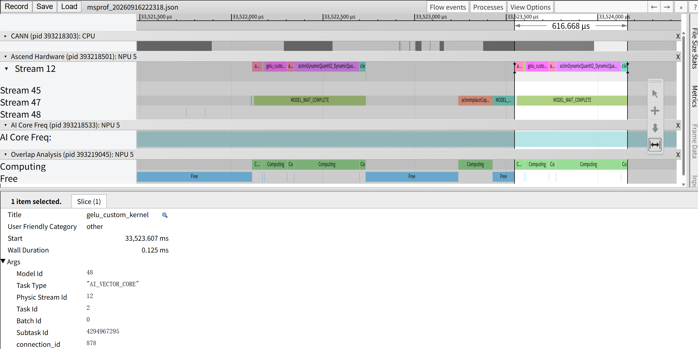
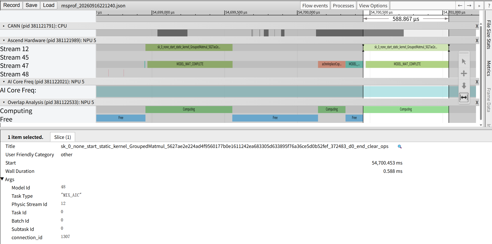

# 自定义 GELU 算子的 SuperKernel 性能与融合分析

## 1. 开启与关闭 SK 的 Profiling 对比

以下为两次采集的 trace 时间线截图，均观察Stream 12 上后一次完整的网络执行。

**静态kernel：**



网络执行包含 `GroupedMatmul_pre → DequantSwigluQuant → 自定义 gelu_custom_kernel → GroupedMatmul_after → DynamicQuant → clear_ops`，4个基础算子和1个clear_ops，图中表现为6个连续排列的小块。上方选取覆盖完整网络，耗时**616.668 μs**，下方选中的 `gelu_custom_kernel` 对应 **0.125 ms** 是自定义的 `gelu_custom_kernel` 单个算子耗时，占这段设备执行区间约 **20.3%**。这说明自定义 GELU 本身是本网络中较明显的向量计算开销来源。

**开启superkernel：**



开启 SK 后，同一网络中的 6 个节点融合为 **1个 SuperKernel 任务**，GELU 不再以独立设备任务调度，而是作为 SuperKernel 内部节点执行。图中表现为一个连续长块，任务名以 `sk_` 开头，名称中记录了SuperKernel融合首算子和尾算子，选中任务的 Wall Duration 为 **587.9 μs**。融合改变了任务组织方式，原有算子的计算仍需执行。

本次对比使用 `profiling-static` 和 `profiling-sk` 两次采集，网络结构、输入规模和设备均保持一致。完整网络执行从约 **616.668 μs** 缩短到 **587.9 μs**。融合减少了独立任务之间的调度开销。

## 2. op_summary 关键行与耗时对比

以下两张表均选取各自采集中的正式执行，Model ID 均为 48、Stream ID 均为 12。
关闭 SK 的完整 6 个算子任务，对应开启 SK 后的一个 SuperKernel 任务。

### 关闭 SK：独立算子任务

数据来源：[static op_summary](profiling-static/PROF_000001_20260916222239338_00384002AFBJBQNJ/mindstudio_profiler_output/op_summary_20260916222320.csv)。正式执行的 Stream 12 任务如下：

| CSV 行号 | Op Name | OP Type | Task ID | Task Start Time(us) | Task Duration(us) |
| --- | --- | --- | --- | --- | --- |
| 30 | aclnnGroupedMatmulV5_GroupedMatmul_GroupedMatmul | GroupedMatmul | 0 | 1789568593419016.915 | 51.8 |
| 31 | `DequantSwigluQuant` | DequantSwigluQuant | 1 | 1789568593419069.695 | 9.32 |
| 32 | `gelu_custom_kernel` | gelu_custom_kernel | 2 | 1789568593419079.035 | 125.08 |
| 33 | aclnnGroupedMatmulV5_GroupedMatmul_GroupedMatmul | GroupedMatmul | 3 | 1789568593419205.155 | 36.98 |
| 34 | aclnnDynamicQuantV2_DynamicQuant_DynamicQuant | DynamicQuant | 4 | 1789568593419243.215 | 355.48 |
| 35 | `clear_ops` | clear_ops | 5 | 1789568593419600.035 | 33.66 |

第 30-35 行依次对应网络的6个算子任务 `GroupedMatmul_pre`、`DequantSwigluQuant`、自定义 `gelu_custom_kernel`、`GroupedMatmul_after`、`DynamicQuant` 和 `clear_ops`。

从首个任务开始到最后一个任务结束，完整执行区间为：

```text
(1789568593419600.035 + 33.660) - 1789568593419016.915
= 616.780 μs
```

### 开启 SK：融合后的任务

数据来源：[profiling-sk](profiling-sk/PROF_000001_20260916221137598_00372189OKPEJHCL/mindstudio_profiler_output/op_summary_20260916221241.csv)。正式执行的 SuperKernel 任务为：

| CSV 行号 | Op Name | OP Type | Task ID | Task Start Time(us) | Task Duration(us) |
| --- | --- | --- | --- | --- | --- |
| 48 | sk_0_none_start_static_kernel_GroupedMatmul_..._end_clear_ops | SuperKernel | 0 | 1789567953883198.855 | 587.900 |

该任务覆盖从首个静态 `GroupedMatmul` 到 `clear_ops` 的完整融合范围。对比关闭 SK 的 616.780 μs，开启 SK 后耗时减少：

```text
616.780 - 587.900 = 28.880 μs
28.880 / 616.780 × 100% ≈ 4.68%
```

两者均统计一次完整的网络执行，不包含编译和预热。
开启 SK 后完整网络设备执行时间约下降 **4.68%**，节省 **28.880μs**。该收益来自多个独立任务合并后减少的任务调度、边界同步和中间结果交接开销；GELU 的计算本身仍然执行，并没有因为融合而消失。