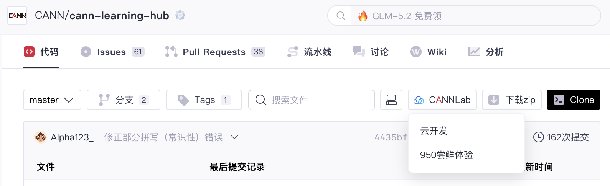

# Wordle 两阶段训练教程

本系列教程教授 Ascend NPU 开发者完成 Wordle 猜词任务的两阶段训练：**SFT（监督微调）→ RL（强化学习）**。

- **SFT 阶段**（`01-sft`）：使用 `torchtitan-npu` 框架，让 Qwen3-1.7B 学会按 `<guess>word</guess>` 格式输出，理解 G/Y/X 反馈规则。
- **RL 阶段**（`02-rl`）：使用 `verl` 框架 + GRPO 算法，让模型学会策略性猜词，提高 6 轮内猜中率：见 [RL 教程](../rl_training_pipeline/README.md)。

## 前置条件

- 了解 PyTorch 模型训练的基本流程（forward → loss → backward → update）。
- 了解 Transformer 模型的基本结构（attention、FFN、layer norm）。

## 环境准备

1. 在 [cann-learning-hub](https://gitcode.com/cann/cann-learning-hub) 点击 CANNLab 创建开发环境。

2. 镜像选择：`cann_9.0.0-A3`。

3. Notebook 用于阅读教程和章节练习。训练任务需在配备 Ascend NPU 的服务器上独立运行。

## 课程内容

| 序号 | 主题 | 主要内容 | 课件 |
|---|---|---|---|
| 01 | SFT 监督微调 | Wordle 任务、SFT 原理、TorchTitan/FSDP、基线训练、推理评测与融合算子性能优化 | [01_sft_training_pipeline.pptx](https://gitcode.com/cann/cann-learning-hub/blob/test/tutorials/sft_training_pipeline/slides/01_sft_training_pipeline.pptx) |

## 教程结构

### 01-sft：Wordle SFT 监督微调

#### 第 1 章：SFT 概念与 Wordle 任务 (`01_sft_and_wordle/`)

| Notebook | 内容 |
|---|---|
| [01.01 章节介绍](01_sft_and_wordle/01.01_chapter_intro.ipynb) | 两阶段训练方案（SFT → RL），本章目标 |
| [01.02 Wordle 任务介绍](01_sft_and_wordle/01.02_wordle_task_intro.ipynb) | 游戏规则、为什么选 Wordle、评测指标、数据格式 |
| [01.03 SFT 概念与原理](01_sft_and_wordle/01.03_sft_concepts.ipynb) | SFT vs 预训练、为什么 Wordle 需要 SFT、三阶段对比 |
| [01.04 章节练习](01_sft_and_wordle/01.04_chapter_practice.ipynb) | 选择题 + 判断题 |

#### 第 2 章：TorchTitan 框架与环境配置 (`02_torchtitan_framework/`)

| Notebook | 内容 |
|---|---|
| [02.01 章节介绍](02_torchtitan_framework/02.01_chapter_intro.ipynb) | 教程进度回顾、本章结构、前置条件、预期成果 |
| [02.02 FSDP 原理与 TorchTitan 框架](02_torchtitan_framework/02.02_torchtitan_and_fsdp.ipynb) | FSDP 原理（正向/反向/FSDP2）、TorchTitan 启动流程、model_registry |
| [02.03 环境配置](02_torchtitan_framework/02.03_environment_setup.ipynb) | Clone 仓库、安装依赖、Debug 验证 |
| [02.04 章节练习](02_torchtitan_framework/02.04_chapter_practice.ipynb) | 选择题 + 判断题 |

#### 第 3 章：训练配置与基线训练 (`03_sft_training/`)

| Notebook | 内容 |
|---|---|
| [03.01 章节介绍](03_sft_training/03.01_chapter_intro.ipynb) | 三步闭环（配置 → 训练 → 评测），预期成果 |
| [03.02 训练配置构建](03_sft_training/03.02_training_preparation.ipynb) | 数据管线、训练配置、学习率调度、多卡并行、activation checkpoint |
| [03.03 运行基线 SFT](03_sft_training/03.03_run_baseline_sft.ipynb) | 训练命令、日志解读、Loss 曲线 |
| [03.04 推理验证](03_sft_training/03.04_inference_eval.ipynb) | infer_server 推理、vf-eval 评测、SFT 前后对比 |
| [03.05 章节练习](03_sft_training/03.05_chapter_practice.ipynb) | 选择题 + 判断题 |

#### 第 4 章：融合算子优化与 Profiling (`04_fused_operators/`)

| Notebook | 内容 |
|---|---|
| [04.01 章节介绍](04_fused_operators/04.01_chapter_intro.ipynb) | 基线瓶颈分析、融合算子概述、预期收益 |
| [04.02 融合算子原理与接入](04_fused_operators/04.02_adding_fused_operator.ipynb) | torch_npu API、融合代码、ModelConverter 全链路 |
| [04.03 Profiling 实操](04_fused_operators/04.03_running_and_profiling.ipynb) | 跑 baseline + fused profiling、分析脚本、验证融合生效 |
| [04.04 Profiling 结果分析](04_fused_operators/04.04_profiling_output_analysis.ipynb) | 性能对比图、收益分解、算子级分析 |
| [04.05 章节练习](04_fused_operators/04.05_chapter_practice.ipynb) | 选择题 + 判断题 |

## 参考链接

- *本教程的任务设计参考了 [Prime-RL](https://github.com/PrimeIntellect-ai/prime-rl)的 [Wordle 示例](https://github.com/PrimeIntellect-ai/prime-rl/blob/main/examples/wordle/README.md)，包括多轮猜词格式、环境反馈机制和训练流程。*
- [torchtitan-npu 仓库](https://gitcode.com/mystri/torchtitan-npu/tree/teaching-pipeline)
- [torchtitan-npu 安装指南](https://gitcode.com/cann/torchtitan-npu/blob/master/docs/user-guides/installation.md)
- [SFT Recipe 附录](https://gitcode.com/cann/torchtitan-npu/blob/master/docs/recipe/sft.md)
- [verl 框架](https://github.com/volcengine/verl)
