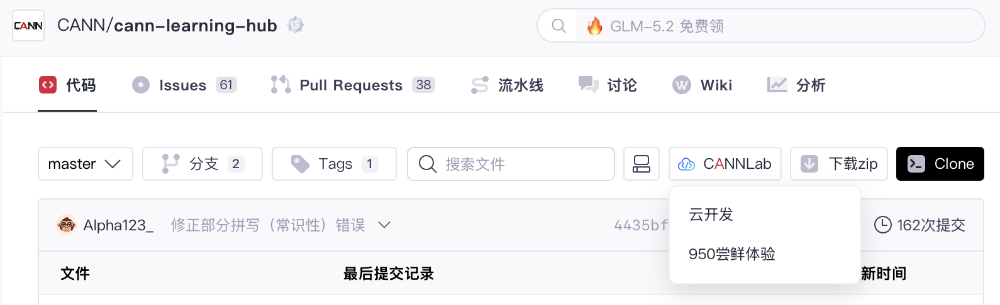

# Wordle 两阶段训练教程

本系列教程教授 Ascend NPU 开发者完成 Wordle 猜词任务的两阶段训练：**SFT（监督微调）→ RL（强化学习）**。

- **SFT 阶段**（`01-sft`）：使用 `torchtitan-npu` 框架，让 Qwen3-1.7B 模仿 Wordle 轨迹中的 `<think>...</think><guess>[word]</guess>` 输出协议，并评测其格式与规则遵守行为。
- **RL 阶段**（`02-rl`）：使用 `verl` 框架 + GRPO 算法，让模型学会策略性猜词，提高 6 轮内猜中率：见 [RL 教程](../rl_training_pipeline/README.md)。

## 前置条件

- 无须具备 SFT 或 TorchTitan 经验。
- 建议了解 Python，以及 PyTorch 的 forward → loss → backward → update 基本流程；不熟悉的读者可结合第 1、2 章中的补充说明学习。

> **课程依赖说明（请先阅读）**：本课程的中级系列建议从第 5 章开始运行，**不要求先完成“大模型训练系列（初级）”，也不要求读取初级课程生成的 checkpoint**。第 2.03 notebook 会下载/准备 Wordle 数据集、模型权重并创建 `torchtitan-npu` 环境；后续 notebook 默认复用这些目录中的资源。若从中间章节开始，请先运行本系列第 2.03 的环境检查和数据准备单元（以及目标章节明确标注的训练单元），不能把初级课程的输出目录当作隐含前置条件。

## 软硬件配套说明

| 项目 | 要求 |
| --- | --- |
| 支持硬件 | Atlas A3 训练/推理系列产品 |
| CANN 版本 | 9.0.0 及以上 |
| Python | 3.11 |

## 在线体验环境

本教程支持以下在线体验环境：

| 体验环境 | 镜像模板 / 版本 | Python 内核 | 说明 |
| --- | --- | --- | --- |
| CANNLab 云开发环境 | cann_9.0.0 py3.11-A3-arm | Python 3.11.4 |参考 [CANNLab 环境体验指南](https://gitcode.com/cann/cann-learning-hub/blob/master/docs/CANNLab_env_experience_guide.md)创建CANNLab环境运行notebook |

> **注意：** 如在本地环境离线体验，需自行安装配套的 CANN 软件，具体请参考 [CANN 安装指南](https://www.hiascend.com/document/detail/zh/CANNCommunityEdition/600alpha003/softwareinstall/instg/atlasdeploy_03_0001.html)。

## 课程内容

| 序号 | 主题 | 主要内容 | 课件 |
|---|---|---|---|
| 01 | SFT 监督微调（初阶） | Wordle 任务、SFT 原理、TorchTitan/FSDP、基线训练、推理评测 | [01_sft_training_pipeline.pptx](slides/01_sft_training_pipeline.pptx) |
| 05 | SFT 监督微调（中阶） | Attention/VarLen/通信优化与融合算子性能优化 | [01_sft_training_pipeline.pptx](slides/01_sft_training_pipeline.pptx) |

## 教程结构

### 01-sft：Wordle SFT 监督微调

#### 第 1 章：SFT 概念与 Wordle 任务 (`01_sft_and_wordle/`)

| Notebook | 内容 |
|---|---|
| [01.01 章节介绍](01_sft_and_wordle/01.01_chapter_intro.ipynb) | 两阶段训练方案（SFT → RL），本章目标 |
| [01.02 Wordle 任务介绍](01_sft_and_wordle/01.02_wordle_task_intro.ipynb) | 游戏规则、为什么选 Wordle、评测指标、数据格式 |
| [01.03 SFT 概念与原理](01_sft_and_wordle/01.03_sft_concepts.ipynb) | next-token CE、shifted labels、assistant mask、三阶段对比 |
| [01.04 章节练习](01_sft_and_wordle/01.04_chapter_practice.ipynb) | 选择题 + 判断题 |

#### 第 2 章：TorchTitan 框架与环境配置 (`02_torchtitan_framework/`)

| Notebook | 内容 |
|---|---|
| [02.01 章节介绍](02_torchtitan_framework/02.01_chapter_intro.ipynb) | 教程进度回顾、本章结构、前置条件、预期成果 |
| [02.02 FSDP 原理与 TorchTitan 框架](02_torchtitan_framework/02.02_torchtitan_and_fsdp.ipynb) | 从 DDP 到 FSDP、FSDP2、TorchTitan 启动流程、model_registry |
| [02.03 环境配置](02_torchtitan_framework/02.03_environment_setup.ipynb) | 验证当前仓库、安装依赖、环境检查与轻量训练 smoke |
| [02.04 章节练习](02_torchtitan_framework/02.04_chapter_practice.ipynb) | 选择题 + 判断题 |

#### 第 3 章：训练配置与基线训练 (`03_sft_training/`)

| Notebook | 内容 |
|---|---|
| [03.01 章节介绍](03_sft_training/03.01_chapter_intro.ipynb) | 三步流程（配置 → 训练 → 评测）与结果检查 |
| [03.02 训练配置构建](03_sft_training/03.02_training_preparation.ipynb) | 数据管线、训练配置、学习率调度、多卡并行、activation checkpoint |
| [03.03 运行基线 SFT](03_sft_training/03.03_run_baseline_sft.ipynb) | 两 rank 训练、日志验收、HF checkpoint reload |
| [03.04 推理验证](03_sft_training/03.04_inference_eval.ipynb) | 受管推理服务、固定 vf-eval、base/SFT 结果文件 |
| [03.05 章节练习](03_sft_training/03.05_chapter_practice.ipynb) | 数据、训练、checkpoint 与评测综合审阅 |

#### 第 4 章：融合算子优化与 Profiling (`04_fused_operators/`)

| Notebook | 内容 |
|---|---|
| [04.01 章节介绍](04_fused_operators/04.01_chapter_intro.ipynb) | 数值正确性、端到端性能与 trace 的检查顺序 |
| [04.02 融合算子原理与接入](04_fused_operators/04.02_adding_fused_operator.ipynb) | 动态匹配、Parameter identity、forward/backward correctness |
| [04.03 Profiling 实操](04_fused_operators/04.03_running_and_profiling.ipynb) | 稳定 recipes、显式 trace 配对、重复 step-time 测量 |
| [04.04 Profiling 结果分析](04_fused_operators/04.04_profiling_output_analysis.ipynb) | 当前结果文件的时间口径、单位与结论边界 |
| [04.05 章节练习](04_fused_operators/04.05_chapter_practice.ipynb) | correctness、manifest、trace 与结论综合审阅 |

### 第 5 章：注意力算子优化 (`05_attention_operators/`)

| Notebook | 内容 |
|---|---|
| [05.01 章节介绍](05_attention_operators/05.01_chapter_intro.ipynb) | 注意力算子优化的目标与章节安排 |
| [05.02 Attention 核心路径](05_attention_operators/05.02_attention_kernels.ipynb) | 从 SDPA 到 VarLen |
| [05.03 Attention 算子基准测试](05_attention_operators/05.03_attention_kernel_benchmarking.ipynb) | 从算子层验证 Attention 理论 |
| [05.04 TorchTitan 数据路径](05_attention_operators/05.04_torchtitan_dataloader.ipynb) | SFT 数据路径：模型怎么知道新样本从哪里开始 |
| [05.05 TorchTitan Attention 接入](05_attention_operators/05.05_torchtitan_attention_ops.ipynb) | TorchTitan 如何把 Metadata 喂给 Kernel |
| [05.06 章节练习](05_attention_operators/05.06_chapter_practice.ipynb) | 章节练习 |

### 第 6 章：变长注意力优化：从 Sequence Packing 到 TND Attention (`06_varlen_attention/`)

| Notebook | 内容 |
|---|---|
| [06.01 章节介绍](06_varlen_attention/06.01_chapter_intro.ipynb) | 变长注意力优化的整体目标 |
| [06.02 问题定义](06_varlen_attention/06.02_problem_statement.ipynb) | Packed SFT 的 Attention 问题 |
| [06.03 数据装箱](06_varlen_attention/06.03_dataloader_and_packing.ipynb) | SFT DataLoader：Non-greedy 与 Greedy Packing |
| [06.04 数据加载分析](06_varlen_attention/06.04_dataloader_profiling.ipynb) | **以 Wordle 数据集为例**的数据加载与短程训练对比 |
| [06.05 VarLen Attention](06_varlen_attention/06.05_from_sdpa_to_varlen.ipynb) | 从 Causal SDPA 到 Block-Causal Varlen Attention |
| [06.06 端到端 Profiling](06_varlen_attention/06.06_end_to_end_profiling.ipynb) | 端到端 Profiling |
| [06.07 章节练习](06_varlen_attention/06.07_chapter_practice.ipynb) | 章节练习 |

### 第 7 章：分布式通信演示 (`07_distributed_comms/`)

| Notebook | 内容 |
|---|---|
| [07.01 章节介绍](07_distributed_comms/07.01_chapter_intro.ipynb) | 分布式通信演示的学习目标 |
| [07.02 FSDP 通信](07_distributed_comms/07.02_fsdp_collectives.ipynb) | FSDP：参数 all-gather 与梯度 reduce-scatter |
| [07.03 TP 通信](07_distributed_comms/07.03_tp_collectives.ipynb) | 经典 TP 基线与 TorchTitan TP+SP |
| [07.04 CP 通信](07_distributed_comms/07.04_cp_collectives.ipynb) | CP：Ulysses all-to-all 与序列/head 布局交换 |
| [07.05 通信体积与重叠](07_distributed_comms/07.05_communication_volume_and_overlap.ipynb) | FSDP / TP / CP：从通信耗时到并行选择 |
| [07.06 章节练习](07_distributed_comms/07.06_chapter_practice.ipynb) | 章节练习 |

### 第 8 章：通信优化与 VarLen 协同 (`08_comm_optimizations/`)

| Notebook | 内容 |
|---|---|
| [08.01 章节介绍](08_comm_optimizations/08.01_chapter_intro.ipynb) | VarLen+FSDP、VarLen+CP 与 Profiling 的学习目标 |
| [08.02 VarLen+CP 长序列设计与正确性验证](08_comm_optimizations/08.02_varlen_cp_interaction.ipynb) | 长序列设计、全局隔离区间约束与 correctness gate |
| [08.03 CP 长序列容量 Profiling](08_comm_optimizations/08.03_cp_long_sequence_capacity_profiling.ipynb) | **S=16,384 的 no-CP/CP2：理论 activation、OOM、双 rank 峰值与 AllToAll 分析** |
| [08.04 TP2 与 FSDP2 的 TPS/显存对比实验](08_comm_optimizations/08.04_tp2_fsdp2_comparison.ipynb) | TP2 与 FSDP2 的 TPS、显存和通信证据对比 |
| [08.05 章节练习](08_comm_optimizations/08.05_chapter_practice.ipynb) | CP 容量、VarLen correctness、TP/FSDP2 与 profiler 判读练习 |

## 参考链接

- Prime-RL、verifiers 和 torchtitan-npu 的版本应与当前 CANNLab 镜像及教程配套说明保持兼容；本 README 不固定具体 commit。
- [Prime-RL Wordle 示例](https://github.com/PrimeIntellect-ai/prime-rl/tree/main/examples/wordle)
- [torchtitan-npu 仓库](https://gitcode.com/cann/torchtitan-npu)
- [torchtitan-npu 安装指南](https://gitcode.com/cann/torchtitan-npu/blob/master/docs/user-guides/installation.md)
- [SFT Recipe 附录](https://gitcode.com/cann/torchtitan-npu/blob/master/docs/recipe/sft.md)
- [verl 框架](https://github.com/volcengine/verl)
