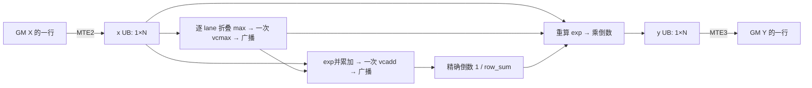

# 稳定行 Softmax 最终实现设计：C4

本文在 Flash 验收完成、创建独立交付副本后的 code review 阶段编写，描述当前副本的实际实现。它不是最初设计的追溯改写。

- 当前代码：[row_softmax.py](operators/row_softmax/row_softmax.py)，SHA256 `9a271fb879b0453aeb67362c4fde1cbe87f0013a3a242c183ab2497f0bc6a351`。
- 当前测试：[test_row_softmax.py](operators/row_softmax/test_row_softmax.py)，SHA256 `d44409ea05e24e3d6bef79968955ee05659b29eef45936035b938d6013507ef3`。
- 交付副本来自调优阶段选定的最终版本。代码格式检查没有改变 kernel 逻辑，随后重新执行完整 ST，最终源码摘要记录在交付结论中。
- 最初设计：[原始 design_v1.md](../../row_softmax/evidence/design/design_v1.md)，保留原文件；最终性能证据：[Flash 报告](../flash-report.md)。

## 1. 不变的数学与公开契约

对二维输入的每一行计算：

\[
m_i=\max_j X_{ij},\qquad e_{ij}=\exp(X_{ij}-m_i),\qquad
s_i=\sum_j e_{ij},\qquad Y_{ij}=e_{ij}/s_i.
\]

axis 固定为 1，无 epsilon、缩放、额外 mask 或输入裁剪。

| 项目 | 最终契约 |
|---|---|
| 输入 | Ascend NPU 上连续、strided、二维 float32；允许合法连续视图的非零 storage_offset |
| 行数 M | 4≤M≤256，M%4=0 |
| 列数 N | 128≤N≤2048，N%64=0 |
| 数值 | 全部有限，abs(X)≤80 |
| 输出 | 新分配、连续的 float32，shape/device 与输入一致，输入逐位不变 |
| 异常 | dtype 非法为 TypeError；非 tensor、rank、shape、布局、设备、数值域非法为 ValueError，消息标明原因；多重违规按实际检查顺序报告 |
| 范围 | 只要求前向计算，不交付梯度、原地更新或随机算法 |

`run(x)` 执行公开检查，在 `x.device` 的上下文中新建 Y，调用 `build(M,N)(X,Y)`。公开 `build` 先要求参数的 Python 类型严格为 int，再验证范围和整除条件，最后进入私有 `_compile` 的 `lru_cache(maxsize=128)`。这保留 ST 阶段对 float/int 缓存键相等绕过验证问题的修复；本次 review 没有引入该修复。

`build` 返回的底层 callable 以已经验证的连续 fp32 NPU X/Y 为前提，便于计量 kernel；公开数值检查中的 PyTorch 比较、归约和 host 同步不属于该 kernel 的计时或工作区预算。Softmax 结果由本地 TileLang kernel 计算。

独立参考仍为 CPU `torch.softmax(X.double(), dim=1).float()`。每个输出元素满足 `abs(Y-ref) <= 1e-6 + 1e-4*abs(ref)`；每行输出之和与 1 的绝对误差 ≤1e-5；输入 int32 位视图精确不变。没有放宽参考、阈值或合法输入域。

## 2. 实际任务映射与执行边界

编译显式使用 `target='ascend'`、`execution_backend='tvm_ffi'`；向量计算采用 SimdVF。当前验证设备为 Ascend950DT_9592 / DAV3510，物理设备 0，36 AIC / 72 AIV。

全部九项及合法 ST shape 复用同一个 `T.prim_func row_softmax_kernel`：

- `T.Kernel(M)` 创建 M 个逻辑 block；block `bx` 独占一整行 `X[bx:bx+1, :]` 和对应 Y。
- 单行 tile 为 `(1,N)`，无 shape 专用算法 body、跨行合并、原子操作或跨 block 通信。
- 每个 block 一次搬入、一段 SimdVF、一次搬出；x/y 均为单版本 UB buffer。
- 没有 persistent 行循环、`T.Pipelined`、自动或手动多 buffer 流水，也没有 AIC/GEMM 路径。

| M | 逻辑 block 数 | 相对 72 AIV 的容量分组 |
|---:|---:|---|
| 4 | 4 | 一组、未填满物理 AIV 数量 |
| 64 | 64 | 一组 |
| 68 | 68 | 一组 |
| 256 | 256 | 至少四组容量，前三组可各容纳72、余40；不是人为实现的72核调度循环 |

逻辑 block id 不等于物理核 id。上表说明任务数量与硬件容量的关系，不声称测得每个时刻的占用或具体派发顺序。

N 是 64 的倍数，令 K=N/64。每个 fp32 向量含 64 个 lane；`S.pset(32, 'PAT_ALL')` 中 32 表示元素位宽，全 mask 覆盖该 fp32 向量。N=192 正好使用三个向量块，不补齐到二次幂。行数按一行一 block 完整覆盖，无列尾或行尾越界。

## 3. 实际数据流和归约组织

max、sum、倒数和归一化都位于同一 SimdVF 中：

1. **最大值**：从 x 的首个64元素向量初始化 `lane_max`；遍历其余 K−1 个向量，对同一 lane 取 max，再做一次 `S.vcmax` 水平归约，并通过 `S.vdupv` 广播行最大值。它不是 v1 中对每个 chunk 分别水平归约后合并的描述。
2. **指数和**：`lane_sum` 每行初始化为零；第二遍读 x，计算 `exp(x-row_max)` 并逐 lane 累加；K 个向量处理完后仅做一次 `S.vcadd`，广播行和。
3. **倒数**：一次 `S.vdiv(ones, row_sum)` 调用使用默认精确除法。已生成 AscendC 中为 `simd_inst::vdiv_0ulp_ftz_true`，不等于只有一条硬件指令，也不是 C11/C12 使用的硬件近似选择器。
4. **归一化**：第三遍读 x，重算 `exp(x-row_max)`，乘行倒数，逐向量写 y。指数只在当前向量临时值中存在，没有 e UB 或完整行寄存器数组。

每行源码层面的工作量为：3K 次向量读 x、K 次向量写 y、K−1 次逐 lane max、一次水平 max、K 次向量加法及一次水平 sum、2K 次向量 exp/sub、一次精确向量除法调用、K 次向量乘法。具体机器指令数量还包括精确除法 helper 与编译器 lowering，不能把上述 API 次数当作 ISA 指令总数。

指数参数在 [-160,0]；至少一个最大元素贡献 exp(0)=1，因此行和在数学上介于1和N，倒数介于1/N和1。极小指数允许下溢，但输出仍受原始精度门槛约束。行和顺序以及“先倒数再乘法”改变浮点舍入路径，不宣称与 B0 逐位等价。

生成代码在 GM→UB 后插入 MTE2→V 的 notify/wait，在 VF 后插入 V→MTE3 的 notify/wait。同步来源是当前编译流水，不在 Python 源码中手写事件；单个 VF 内的 max/sum/倒数通过寄存器依赖连接。

格式检查后在交付副本重新运行完整 Level 1，并核对生成代码与最终 kernel 的对应关系。

## 4. Buffer、工作区和流量预算

### 4.1 显式存储

| 存储 | shape / dtype | 版本 / 生命周期 | 每 block 字节 |
|---|---|---|---:|
| x UB | `(1,N)` / fp32 | 单版本，搬入至第三遍读取结束 | 4N |
| y UB | `(1,N)` / fp32 | 单版本，VF归一化写入至搬出结束 | 4N |
| e、m、s UB | 未分配 | 指数仅为向量临时值；max/sum留在寄存器 | 0 |
| 显式额外 GM 工作区 | 未分配 | kernel 参数仅 X/Y | 0 |
| 输出 Y | `(M,N)` / fp32 | `run` 新分配的返回值，不算额外工作区 | 4MN |

生成 C++ 的 x 起点为 UB 字节偏移0，y 起点为4N；二者同时按 8N 计预算，不依赖生命周期复用。

| N | K=N/64 | x+y 显式 UB | 对应指定案例 |
|---:|---:|---:|---|
| 128 | 2 | 1024 B | m4_n128、m64_n128、m256_n128 |
| 192 | 3 | 1536 B | m68_n192 |
| 512 | 8 | 4096 B | m64_n512、m256_n512 |
| 2048 | 32 | 16384 B | m4_n2048、m64_n2048、m256_n2048 |

每 AIV 用户可用 UB 为253952 B（248 KiB），来自既有[平台探测](../../row_softmax/evidence/environment/platform.log)。该值已经排除6144 B VF栈和2048 B系统预留，不能再次扣除。最大N的显式 payload占16 KiB，约为用户UB的6.45%，剩余237568 B；它是显式buffer预算，不是测得的全部运行时UB峰值。

源码向量 live state 随 N 为 O(1)，没有 K 个向量的完整行数组。精确除法 helper 含额外临时向量；本轮没有取得可用的反汇编 spill 计数，不能把静态变量个数换算成确切寄存器分配或断言零spill。C4已在既有精度和性能阶段实际编译运行；本说明不再另减一份猜测的VF栈预算。纯 Vector 路径不显式分配 L1、L0A/B/C。

### 4.2 流量与存储容量分开计算

每行一次 GM 读入4N、一轮 GM写出4N，总GM有效载荷8N，全部M行8MN。

UB端有效载荷流量为：MTE2写x的4N + VF三遍读x的12N + VF写y的4N + MTE3读y的4N = **24N B/row**。v1/B0对应约32N B/row的行级payload流量，另有标量和同步开销。该模型不包含参数元数据、隐式编译临时量或spill流量，不是硬件带宽实测值。

与 B0 相比，C4重算N个exp/sub，换取移除 e UB 的物化与读取、四段VF合并成一段，以及每行 K 次精确向量除法调用减少为一次。实际收益由固定十二样本性能结果裁决，不直接由流量比例推出。

## 5. 与最初设计的变化和真实阶段顺序

| 项目 | 最初 design_v1 / 初始骨架 | 当前最终 C4 |
|---|---|---|
| 映射 | 一行一逻辑block | 保持 |
| VF组织 | max、exp、sum、归一化四段 | 单个VF，内部三个读x阶段 |
| UB | x/e/y三行buffer，m/s标量buffer | 仅x/y；max/sum/倒数为向量状态 |
| 归约 | `T.reduce_max/sum` 对UB归约 | 同lane跨chunk折叠，再各做一次水平归约 |
| 指数 | 计算一次并保存e | 计算行和时一次，输出时再算一次 |
| 归一化 | 每个向量 e/s | 每行一次默认精确倒数，再逐向量乘法 |
| 显式UB预算 | `12N+64`，最大24640 B（未计v1另留余量） | `8N`，最大16384 B |
| 额外GM工作区/GM载荷 | 0 / 8MN | 保持 |
| 支持域、oracle、容差、输入不变 | 任务原始约束 | 保持 |

真实顺序是：初始设计v1 → 生成与指定精度 → ST及缓存验证修复 → 冻结B0 → Flash独立候选与C4晋升 → 继续粒度/容量/自动和手动流水等验证 → 最终fixed12验收 → 当前独立副本与最终设计说明。原v1和各阶段失败、报告均保持原样，没有将C4方案写成一开始就采用。

流水候选的实测及门禁记录在原Flash目录；C4最终没有采用其多行或双buffer实现。C11/C12也未晋升，不能将其硬件倒数或完整行寄存器保留写进最终设计。

## 6. 验收证据与当前 review 状态

kernel、配置、案例文件与冻结归档逐字节一致；pytest仅格式变化，两文件AST不变。新的Level1与九份生成C++对应关系支持以下分阶段结论：

- [修复后实际 Level1](review_evidence/post_format_level1.json)：90/90通过，0失败/错误/跳过；新ST清单和报告见post_format_st_spec.json、post_format_st_report.md。
- [fixed12最终性能](../comparisons/fixed12_Bstar_vs_B0.json)：全部九项，以整次 kernel Task Duration 计，C4/B0几何均值0.9332184090513448，最差m64_n128为1.0079180251513737。
- [固定采样计划](../acceptance2_fixed12_plan.json)：每版每个 case 的十二个样本全部保留，并按统一口径裁决。
- [修复后格式检查](review_evidence/post_fix_result.json)：两个文件，Lint/格式均0，独立ruff check及ruff format --check退出码均0。原先问题、原始检查和路径汇总失败仍保留，原格式报告已追加实际修复结果。

当前副本格式与修复后完整ST均通过。fixed12为前一性能阶段的真实测量；本轮依据kernel不变、AST一致、九份C++一致和新ST通过建立来源对应，没有再次进行性能采集。

## 本轮收尾记录

2026-09-16T05:25:47.982250+08:00：只格式化pytest，计算组织、任务映射、UB预算和公开契约均未改变。首次ST实际90通过但缓存设置被setup覆盖，已归档为环境配置不符合预期的尝试；在source后重设全部缓存路径的正式运行再次90通过。正式JSON/XML、前后源码SHA、实际导入与生成C++均位于本副本review_evidence内。
